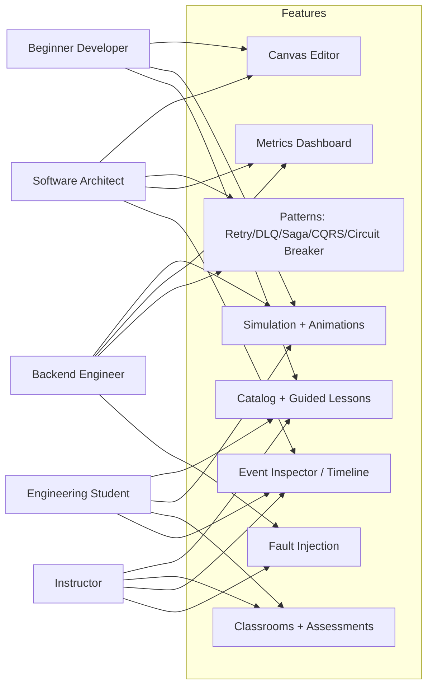

# Distributed Flow Lab — Personas

This document defines the canonical persona set that every DFL feature is designed for. Each
feature must answer *"What should the student learn?"* for at least one of these personas.
Personas keep design decisions honest: they anchor scope (see [PRD](./prd.md)), sequencing (see
[Roadmap](./roadmap.md)), and the learning `Catalog`. The five personas are, in order of
increasing depth: **Beginner Developer**, **Backend Engineer**, **Software Architect**,
**Instructor**, and **Engineering Student**.

## Persona-to-feature map

## Beginner Developer

A developer who writes application code but has never operated a broker or reasoned about
distributed behavior. They have seen the words "queue" and "consumer" but lack a mental model.

- **Goals**
  - Build a first working messaging flow (`Producer→Exchange→Queue→Consumer`) and *see* a
    message move.
  - Learn the vocabulary — `Producer`, `Consumer`, `Queue`, `Exchange`, `Routing Key` — through
    doing rather than reading.
  - Gain confidence to reason about asynchronous flows in their own code.
- **Pain Points**
  - Tutorials jump straight to broker configuration and CLI commands.
  - Abstract diagrams don't show what actually happens at runtime.
  - Fear of breaking real infrastructure discourages experimentation.
- **Technical Level:** Beginner. Comfortable coding; little to no distributed-systems or ops
  experience.
- **How the Platform Helps Them**
  - The **Canvas Editor** offers a palette of typed `Node`s with plain-language tooltips, so
    composing a topology is drag-and-drop, not YAML.
  - **Simulation + Animations** render `MessagePublished` → `AckReceived` as visible token
    movement, making the invisible concrete.
  - The **Catalog** provides ready-made starter `Scenario`s so the first success takes minutes.

## Backend Engineer

An engineer who builds services that already use queues and HTTP, but wants sharper intuition
about resilience, back-pressure, and delivery guarantees.

- **Goals**
  - Understand what happens under load: growing `Queue` depth, back-pressure, `inFlight` messages.
  - Master resilience patterns — Retry with backoff, DLQ, Circuit Breaker — and when each applies.
  - Validate design choices before writing production code.
- **Pain Points**
  - Reproducing failure modes (poison messages, timeouts, partitions) in real environments is
    slow and risky.
  - Metrics in production are lagging and hard to attribute to a specific cause.
  - Delivery-guarantee semantics (ack/nack/redelivery/dead-letter) are easy to misremember.
- **Technical Level:** Intermediate to advanced. Fluent in one or more backend stacks; some
  distributed-systems exposure.
- **How the Platform Helps Them**
  - Configurable `Consumer` processing time and `Queue` prefetch make **back-pressure** directly
    observable in the **Metrics Dashboard** (`throughput`, `avgLatencyMs`, `inFlight`).
  - **Patterns** scenarios emit `MessageNacked`, `RetryScheduled`, `MessageRetried`,
    `DeadLettered`, and the Circuit Breaker events, tying each to a visible consequence.
  - **Fault Injection** (latency, node failure) lets them provoke and study failure safely.

## Software Architect

A senior engineer responsible for designing topologies and communicating trade-offs to teams
and stakeholders.

- **Goals**
  - Compare architectural options (RabbitMQ routing vs. Kafka partitioning; Saga vs. distributed
    transaction) using observed behavior, not just prose.
  - Communicate designs and failure behavior vividly to non-experts.
  - Validate that a proposed topology behaves as intended before committing to it.
- **Pain Points**
  - Whiteboard diagrams cannot demonstrate dynamics or failure.
  - Trade-off arguments become theological without a shared, observable reference.
  - Onboarding teams to a new pattern (CQRS, Saga) is slow.
- **Technical Level:** Advanced. Deep systems knowledge; values precision and correctness.
- **How the Platform Helps Them**
  - The **Canvas Editor** composes realistic topologies with the full `NodeType` vocabulary.
  - **Patterns** scenarios (Saga, CQRS, Circuit Breaker) plus **Fault Injection** produce a
    live demonstration of compensation, read/write splits, and cascading failure.
  - The **Event Inspector / Timeline** exposes the authoritative `SimulationEvent` sequence,
    giving an unambiguous artifact to reason and communicate with.

## Instructor

An educator (bootcamp, university, or internal enablement) who teaches distributed systems and
needs a live, safe teaching instrument.

- **Goals**
  - Demonstrate concepts live and let students explore the same topology.
  - Curate a progression of `Scenario`s from simple to advanced.
  - Assess whether students actually understood a concept.
- **Pain Points**
  - Setting up broker infrastructure for a class is fragile and time-consuming.
  - Hard to pause a real system at the exact moment a concept becomes clear.
  - No easy way to standardize what every student starts from.
- **Technical Level:** Advanced domain knowledge; values reproducibility and clarity over raw ops.
- **How the Platform Helps Them**
  - Save curated `Scenario`s into the **Catalog** and attach **Guided Lessons**.
  - **Classrooms** (V3) let instructors assign scenarios and review each learner's `Timeline`.
  - The **Event Inspector / Timeline** supports scrubbing to pause on a `DeadLettered` or
    `SagaCompensationTriggered` event and explain precisely why it occurred.

## Engineering Student

A student learning distributed-systems fundamentals in a formal course, needing hands-on
reinforcement of theory.

- **Goals**
  - Connect textbook theory (consistency models, delivery guarantees) to observable behavior.
  - Build understanding incrementally, from one queue to full patterns.
  - Confirm mastery through practice and assessment.
- **Pain Points**
  - Lectures and readings are passive; concepts stay abstract.
  - Limited access to real infrastructure and limited time to configure it.
  - Uncertainty about whether they have truly understood a concept.
- **Technical Level:** Beginner to intermediate. Strong theory exposure; limited practical
  experience.
- **How the Platform Helps Them**
  - **Guided Lessons** in the **Catalog** sequence learning objectives step by step.
  - **Simulation + Animations** make consistency, ordering, and failure tangible.
  - **Assessments** (V3) check predictions (e.g. "what happens when a `Consumer` fails?"),
    closing the learning loop.

## Related documents

- [Vision](./vision.md)
- [Product Requirements Document](./prd.md)
- [Roadmap](./roadmap.md)
- [Backlog](./backlog.md)
- [Glossary](./glossary.md)
- [Architecture](../02-architecture/architecture.md)
