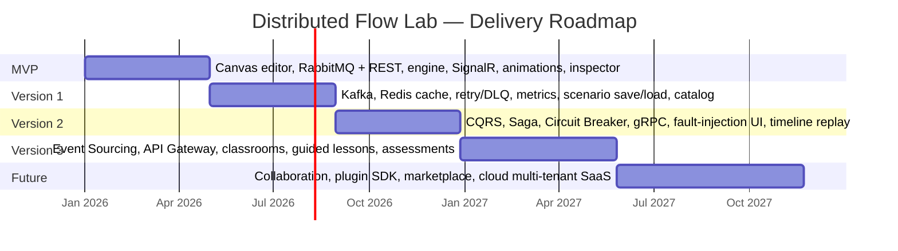
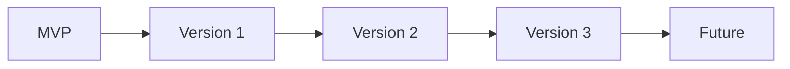

# Distributed Flow Lab — Roadmap

This roadmap sequences delivery across the canonical phases
**MVP → Version 1 → Version 2 → Version 3 → Future**. Scope for each phase is taken verbatim
from the documentation canon and must not be reinterpreted. Each phase lists its objective,
included features, dependencies, and exit criteria. Detailed work items live in
[Backlog](./backlog.md); requirements are defined in [PRD](./prd.md).

## Phase overview (timeline)

## MVP

- **Objective:** Prove the core thesis — *the backend is the single source of truth and every
  animation is driven by a real `SimulationEvent`* — by delivering a usable, correct messaging
  simulator for RabbitMQ and REST.
- **Included features (canonical):** canvas editor, RabbitMQ + REST simulations, backend event
  engine, SignalR streaming, basic animations, event inspector.
- **Dependencies:** None (foundational phase). Requires the base solution scaffolding
  (Clean Architecture layers, Docker Compose stack: `web`, `api`, `rabbitmq`, `postgres`) and
  the canonical event envelope, Event Catalog, `NodeType` enum, `SimulationHub`, and REST v1
  contracts to be in place.
- **Exit criteria:**
  1. A user can compose a `Producer→Exchange→Queue→Consumer` `Scenario` on the canvas and run a
     `Simulation`.
  2. The engine (running as a `BackgroundService`) emits, in monotonic `sequence` order, the
     RabbitMQ messaging events (`MessagePublished`, `MessageRouted`, `MessageEnqueued`,
     `MessageDequeued`, `MessageReceived`, `MessageProcessed`, `AckReceived`) plus lifecycle and
     `TickAdvanced` events.
  3. REST interactions emit `HttpRequestStarted`/`HttpResponseReceived`/`HttpRequestFailed`/
     `HttpRequestTimedOut`.
  4. The client subscribes via `/hubs/simulation`, animates tokens strictly from received events
     (verifiable via `AnimationStarted`↔`eventId` mapping), and shows the live `Timeline` in the
     event inspector.
  5. Event-to-animation P95 latency ≤ 250 ms (NFR-1); no observable `sequence` gaps under nominal
     load.

## Version 1

- **Objective:** Broaden messaging coverage and make simulations persistent and measurable —
  turning the MVP into a reusable learning tool with a growing `Catalog`.
- **Included features (canonical):** Kafka, Redis cache, retry/DLQ, metrics dashboard, scenario
  save/load, catalog.
- **Dependencies:** MVP event engine, canvas, and SignalR streaming. Adds Kafka
  (+`zookeeper`/KRaft) and Redis containers to the Compose stack and EF Core persistence for
  `Scenario`/`Simulation` metadata.
- **Exit criteria:**
  1. Kafka-style scenarios run over `Topic`/`Partition` nodes with `ConsumerRegistered` semantics
     reflecting offsets and consumer groups.
  2. Redis `Cache` nodes emit `CacheHit`/`CacheMiss`/`CacheEvicted`.
  3. Retry and dead-lettering emit `MessageNacked`, `RetryScheduled`, `MessageRetried`,
     `DeadLettered`, `MessageExpired`, `MessageDropped`, with a `DeadLetterQueue` node receiving
     dead-lettered messages.
  4. Users can save, tag (`conceptTag`), load, update, and delete `Scenario`s via
     `/api/v1/scenarios`, and browse the `Catalog` via `/api/v1/catalog`.
  5. The metrics dashboard renders `MetricSnapshot` values (throughput, avgLatencyMs, inFlight,
     dlqCount, retries) from `/api/v1/simulations/{id}/metrics`.

## Version 2

- **Objective:** Teach resilience and orchestration patterns and give learners direct control
  over failure and time.
- **Included features (canonical):** CQRS, Saga, Circuit Breaker, gRPC, fault injection UI,
  timeline scrubbing/replay.
- **Dependencies:** V1 persistence and metrics; MediatR-based Application layer (for CQRS);
  persisted `SimulationEvent` history (for replay); fault endpoints
  (`POST /api/v1/simulations/{id}/faults`).
- **Exit criteria:**
  1. Circuit Breaker scenarios emit `CircuitBreakerOpened`/`CircuitBreakerHalfOpened`/
     `CircuitBreakerClosed`.
  2. Saga scenarios emit `SagaStarted`/`SagaStepCompleted`/`SagaCompensationTriggered`/
     `SagaCompleted`, with visible reverse-order compensation.
  3. CQRS scenarios visualize separate command/query paths; gRPC interactions emit
     `GrpcCallStarted`/`GrpcCallCompleted`.
  4. The fault-injection UI targets a `Node`/`Edge` and produces `FaultInjected`,
     `LatencyInjected`, `PartitionCreated`, `PartitionHealed`, `NodeFailed`, `NodeRecovered`.
  5. Users can scrub and replay the `Timeline` deterministically via
     `/api/v1/simulations/{id}/events?fromSequence=`, with reproducible state reconstruction.

## Version 3

- **Objective:** Turn DFL from a single-player simulator into a structured, multi-user learning
  platform with formal pedagogy.
- **Included features (canonical):** Event Sourcing, API Gateway, multi-user classrooms, guided
  lessons/exercises, assessments.
- **Dependencies:** V2 replay/timeline and persisted event store (foundation for Event Sourcing);
  authentication/authorization and per-user ownership (NFR-3) for classrooms; `Catalog` and
  guided-content model.
- **Exit criteria:**
  1. Event Sourcing scenarios visualize an append-only event store and projections.
  2. API Gateway scenarios model routing/fan-out across downstream `Service`s.
  3. Instructors create classrooms, assign `Scenario`s, and review learners' `Timeline`s.
  4. Guided lessons/exercises sequence learning objectives and load corresponding `Scenario`
     states; assessments verify learner predictions and record outcomes.

## Future

- **Objective:** Scale DFL into a collaborative, extensible ecosystem and a commercial
  multi-tenant SaaS.
- **Included features (canonical):** collaboration, plugin SDK for custom nodes, marketplace,
  cloud multi-tenant SaaS.
- **Dependencies:** V3 classrooms and authz; a stable public contract for `NodeType`/engine
  extension (plugin SDK); tenancy and billing infrastructure.
- **Exit criteria:**
  1. Real-time collaborative editing of `Scenario`s with presence and conflict resolution.
  2. A plugin SDK allows third parties to define custom `Node` types and simulation behaviors
     without forking the platform.
  3. A marketplace enables sharing/distribution of community `Scenario`s and lessons.
  4. Organization-level multi-tenancy (SSO, seats, isolation) is generally available.

## Related documents

- [Vision](./vision.md)
- [Product Requirements Document](./prd.md)
- [Personas](./personas.md)
- [Backlog](./backlog.md)
- [Glossary](./glossary.md)
- [Architecture](../02-architecture/architecture.md)
- [Event Model](../02-architecture/event-model.md)
