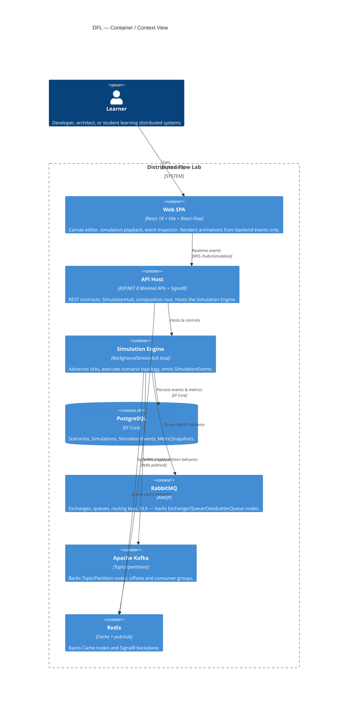
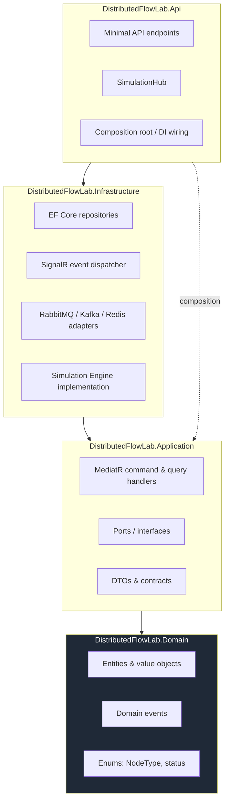
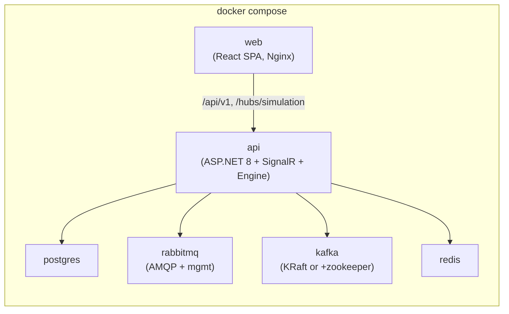
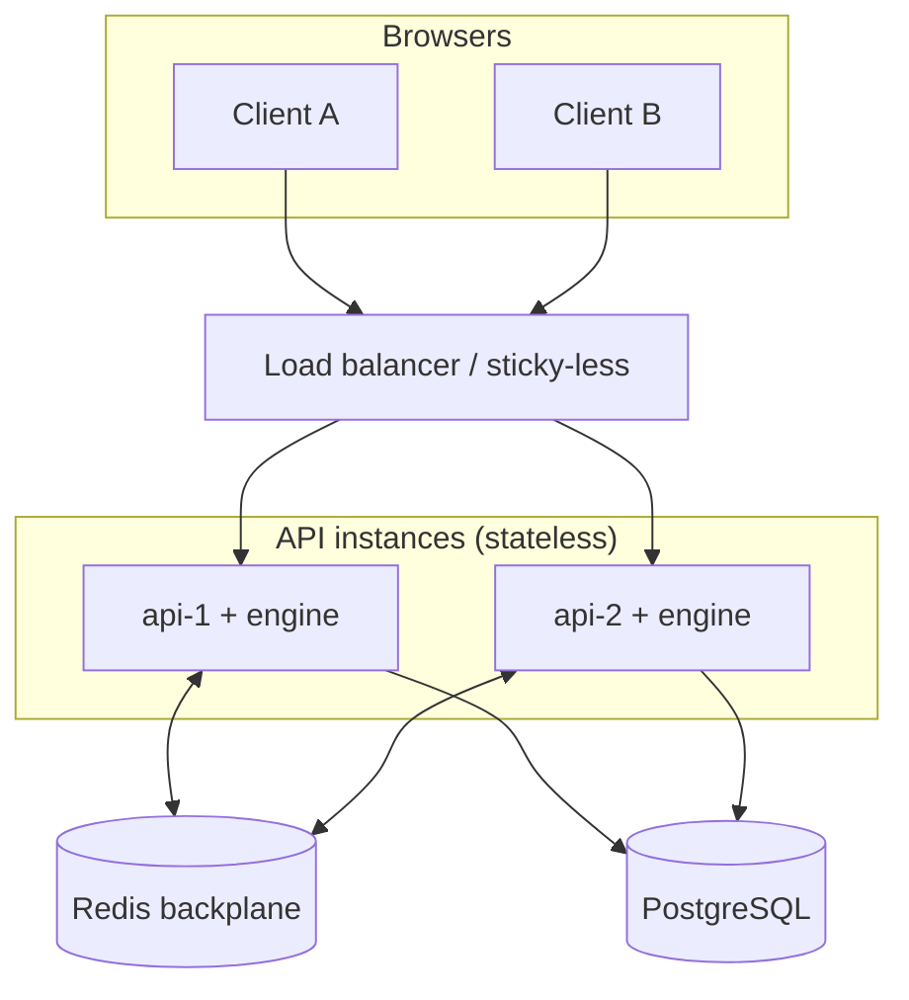

# High-Level Architecture

> **Status:** Canonical architecture reference for Distributed Flow Lab (DFL).
> This document is the entry point for the `02-architecture` set. All terminology,
> event names, entities, endpoints, and technology choices follow the
> [Documentation Canon](../../CLAUDE.md) and the shared canon single source of truth.

## 1. Purpose and context

Distributed Flow Lab (DFL) is an educational SaaS platform for learning distributed
systems through interactive visual simulations. Users compose an architecture — APIs,
queues, brokers, databases, caches, distributed services — on a canvas, then run a
**Simulation** in which **every animation is driven by a real backend event**. The
frontend never invents state; it renders exactly what the backend emits.

This constraint is the single most important architectural driver in the system. It
means the platform is fundamentally an **event-driven** system: a backend
**Simulation Engine** produces an ordered stream of `SimulationEvent`s, those events are
streamed to the browser over SignalR, and the browser turns each event into an animation.
Every downstream decision — the layering, the transport, the persistence model — exists
to make that event stream authoritative, ordered, replayable, and educational.

## 2. Architectural goals and constraints

| Goal | How the architecture satisfies it |
|------|-----------------------------------|
| Backend is the single source of truth | The engine emits every `SimulationEvent`; the client renders, never fabricates state. See [Event Model](./event-model.md). |
| Teach, not merely simulate | Events carry semantic meaning (`DeadLettered`, `CircuitBreakerOpened`, `SagaCompensationTriggered`) that maps directly to a learning concept. |
| Realistic broker behavior | Real infrastructure adapters (RabbitMQ, Kafka, Redis) back the abstract node types so behavior reflects production semantics. |
| Deterministic, replayable timelines | Every event carries a monotonic `sequence` and a logical `tick`; the full timeline is persisted and replayable. |
| Clean, testable, extensible | Clean Architecture with a strict dependency rule (Api → Infrastructure → Application → Domain). |
| Horizontal scale | Stateless API + SignalR backplane + partitioned engine workload. |

## 3. C4 container view

The system decomposes into a small number of deployable containers. The diagram below is
a C4-style container view: the person, the client container, the API host, the realtime
transport, the persistence store, and the real broker adapters.

For the runtime data flow (user action → backend event → animation) see
[System Overview](./system-overview.md).

## 4. Clean Architecture layers

The backend follows Clean Architecture with a strict inward dependency rule. Each layer
maps to a project in the solution (canon §3):

### 4.1 Domain (`DistributedFlowLab.Domain`)
- **Responsibility:** the pure model — `Scenario`, `Node`, `Edge`, `Simulation`,
  `SimulationEvent`, `MetricSnapshot`; value objects (`Message`, positions); domain event
  types; the `NodeType` enum and the `Simulation` status enum.
- **Dependencies:** none. This is the innermost, framework-free core.
- **Rationale:** keeping the model dependency-free makes it trivially unit-testable and
  prevents infrastructure concerns (EF, SignalR, brokers) from leaking into business rules.

### 4.2 Application (`DistributedFlowLab.Application`)
- **Responsibility:** use cases expressed as **MediatR** commands and queries (create
  scenario, start simulation, inject fault, query events/metrics); **ports** (interfaces)
  such as an event sink, a scenario repository, a broker adapter abstraction; DTOs mapping
  domain to wire contracts.
- **Dependencies:** Domain only.
- **Rationale:** CQRS via MediatR keeps controllers thin (business logic never lives in
  controllers, per the golden rules) and separates write paths from read/query paths.

### 4.3 Infrastructure (`DistributedFlowLab.Infrastructure`)
- **Responsibility:** concrete adapters that implement Application ports — EF Core
  persistence (PostgreSQL), the SignalR-based event dispatcher, the RabbitMQ/Kafka/Redis
  messaging adapters, and the **Simulation Engine** implementation (the `BackgroundService`
  tick loop).
- **Dependencies:** Application (and therefore Domain).
- **Rationale:** all volatile technology choices are isolated here behind interfaces,
  satisfying the Dependency Inversion Principle and keeping the core swappable.

### 4.4 Api (`DistributedFlowLab.Api`)
- **Responsibility:** the ASP.NET 8 host — Minimal API endpoints (canon §9), the
  `SimulationHub` at `/hubs/simulation` (canon §8), and the composition root that wires DI.
- **Dependencies:** Infrastructure and Application (composition only).
- **Rationale:** the host is the only place that knows about every concrete type; endpoints
  translate HTTP to MediatR requests and return DTOs.

## 5. Technology stack (canonical)

| Concern | Technology | Justification |
|---------|-----------|---------------|
| SPA | React 18 + TypeScript + Vite | Fast HMR dev loop, mature ecosystem, strong typing of contracts. |
| Canvas | React Flow | Purpose-built node/edge editor; matches the Node/Edge domain directly. |
| Client state | Zustand | Minimal boilerplate store for canvas/simulation/ui slices. |
| Realtime client | `@microsoft/signalr` | First-class SignalR transport with reconnection. |
| Styling | Tailwind CSS + design tokens | Consistent, token-driven design system. |
| Animation | Framer Motion | Smooth token/edge animation of message flow. |
| Frontend tests | Vitest + RTL + Playwright | Unit, component, and E2E coverage. |
| API | ASP.NET 8 Minimal APIs | Low-ceremony endpoints; thin transport layer. |
| Realtime server | SignalR | Server→client push of `SimulationEvent`s. |
| CQRS | MediatR | Command/query separation inside Application. |
| Persistence | EF Core + PostgreSQL | Relational store for scenarios, simulations, events, metrics. |
| Runtime loop | IHostedService / BackgroundService | Hosts the tick loop that emits events. |
| Validation | FluentValidation | Declarative request validation at the edge. |
| Backend tests | xUnit + FluentAssertions + Testcontainers | Unit and integration tests against real brokers/DB. |
| Brokers | RabbitMQ, Kafka, Redis | Real semantics (DLX, partitions/offsets, cache) so simulations are truthful. |
| Platform | Docker + Docker Compose | Reproducible local orchestration of all containers. |
| CI | GitHub Actions | Automated build/test pipeline. |
| Observability | OpenTelemetry + Serilog | Traces/metrics/logs; structured logging. |

See [ADR-004: Clean Architecture layering](../adr/ADR-004-clean-architecture.md)
and [ADR-003: Real broker adapters](../adr/ADR-003-rabbitmq.md).

## 6. Deployment (Docker Compose)

Local development and demo orchestration run entirely under Docker Compose. The canonical
container set (canon §2) is:

- `web` serves the built SPA and reverse-proxies `/api/v1` and `/hubs/simulation` to `api`.
- `api` hosts the REST endpoints, the `SimulationHub`, and the Simulation Engine
  `BackgroundService`.
- `postgres` holds all persisted metadata and the event timeline.
- `rabbitmq`, `kafka`, `redis` provide real broker semantics for the corresponding node
  types; `redis` doubles as the SignalR backplane in multi-instance deployments.

## 7. Scalability

The system is designed to scale horizontally along three independent axes.

- **SignalR backplane.** With more than one API instance, SignalR requires a backplane so a
  message published on one instance reaches clients connected to another. DFL uses **Redis
  pub/sub** as the backplane. Because clients join a group per `simulationId`, event fan-out
  is scoped to only the connections watching that simulation. See
  [WebSocket Events](./websocket-events.md).
- **Engine scaling.** Each simulation is an independent unit of work keyed by `simulationId`.
  Simulations can be sharded across API/engine instances (e.g. by consistent hashing of
  `simulationId`) so no single instance owns all running simulations. The monotonic
  `sequence` per simulation guarantees ordering regardless of which instance produced it.
- **Kafka partitions.** For scenarios modeling Kafka `Topic`/`Partition` nodes, the engine
  maps message keys to partitions exactly as Kafka does, so throughput demonstrations and
  consumer-group rebalancing behave realistically and scale with partition count.

## 8. Security

- **Authentication.** The API authenticates requests with bearer tokens (JWT). SignalR
  connections carry the same token via the access-token query parameter negotiated by the
  `@microsoft/signalr` client, so hub methods run under an authenticated principal.
- **Authorization.** Scenario and simulation resources are owner-scoped; a caller may only
  read/modify scenarios and simulations they own (or that are published catalog templates,
  which are read-only). Hub `Subscribe(simulationId)` is authorized against the caller's
  right to observe that simulation before the connection joins the group.
- **Input validation.** All command/query inputs are validated with **FluentValidation** at
  the Application boundary; malformed scenario topologies (dangling edges, unknown
  `NodeType`, cyclic constraints where illegal) are rejected before a simulation is created.
  Errors are returned as RFC 7807 problem+json (see [API Contracts](./api-contracts.md)).
- **Simulation isolation.** Each simulation runs against isolated broker resources —
  per-simulation RabbitMQ exchanges/queues, Kafka topics, and Redis key prefixes — so one
  learner's simulation cannot observe or corrupt another's. Resource names are derived from
  `simulationId`. Fault injection is likewise scoped to a single simulation.
- **Resource bounds.** Simulations have bounded tick budgets, node counts, and event rates
  to prevent a single simulation from exhausting host resources (a denial-of-service guard
  and a teaching aid — students see backpressure, not crashes).

## 9. Extensibility

The architecture is explicitly designed so that new distributed-systems concepts can be
added without touching the core.

- **Adding a new node type.** Extend the `NodeType` enum in Domain, add a corresponding
  behavior in the engine (how the node reacts to inbound messages and which events it
  emits), and register a React Flow node renderer in the frontend `canvas` feature. No
  changes to transport, persistence, or the event envelope are required. See
  [Components](./components.md).
- **Adding a new concept/feature.** Concepts (canon §13 — Retry, DLQ, CQRS, Saga, Circuit
  Breaker, Event Sourcing, API Gateway, …) are expressed as combinations of existing node
  types plus concept-specific events already in the Event Catalog. New events are added to
  the catalog in [Event Model](./event-model.md) first, then emitted by the engine.
- **Adding a new broker adapter.** Implement the messaging-adapter port in Infrastructure
  (e.g. NATS, SQS). Because the engine talks to the port, not the concrete broker, and the
  event envelope is broker-agnostic, no other layer changes.
- **Frontend rendering.** Because animations are pure functions of backend events, a new
  event type is rendered by adding one mapping from event `type` to a presentation
  (`AnimationStarted`/`AnimationFinished`) — the client still invents no state.

## 10. Key architectural decisions (ADR index)

The table below lists the decisions most relevant to this document. The complete
decision log (13 records) is maintained in the [ADR index](../adr/README.md).

| Decision | ADR |
|----------|-----|
| React Flow for the node/edge canvas | [ADR-001](../adr/ADR-001-react-flow.md) |
| SignalR as realtime transport | [ADR-002](../adr/ADR-002-signalr.md) |
| Real broker adapters (RabbitMQ/Kafka/Redis) | [ADR-003](../adr/ADR-003-rabbitmq.md) |
| Clean Architecture layering & dependency rule | [ADR-004](../adr/ADR-004-clean-architecture.md) |
| Docker Compose for local orchestration | [ADR-005](../adr/ADR-005-docker-compose.md) |
| Backend as single source of truth; events drive animation | [ADR-006](../adr/ADR-006-backend-source-of-truth.md) |
| BackgroundService tick loop for the engine | [ADR-007](../adr/ADR-007-background-service-engine.md) |
| CQRS with MediatR | [ADR-008](../adr/ADR-008-cqrs-mediatr.md) |
| Monotonic event envelope with sequence & tick | [ADR-009](../adr/ADR-009-event-envelope-sequencing.md) |
| Frontend stack (React/Vite/Zustand/Tailwind/Framer Motion) | [ADR-010](../adr/ADR-010-frontend-stack.md) |
| PostgreSQL + EF Core for persistence | [ADR-011](../adr/ADR-011-postgres-efcore.md) |
| OpenTelemetry + Serilog observability | [ADR-012](../adr/ADR-012-observability-opentelemetry.md) |
| Testing strategy & test pyramid | [ADR-013](../adr/ADR-013-testing-strategy.md) |

## Related documents

- [System Overview](./system-overview.md)
- [Bounded Contexts](./bounded-contexts.md)
- [Components](./components.md)
- [Event Model](./event-model.md)
- [API Contracts](./api-contracts.md)
- [WebSocket Events](./websocket-events.md)
- [Data Model](./data-model.md)
- [Sequence Diagrams](./sequence-diagrams.md)
