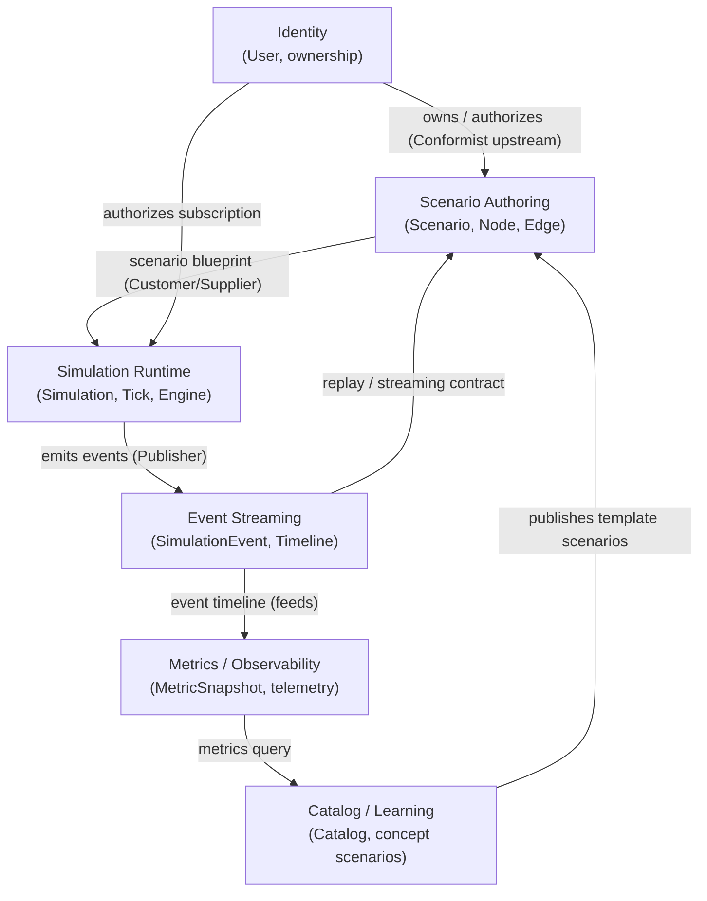

# Bounded Contexts

> A Domain-Driven Design view of Distributed Flow Lab. This document identifies the
> platform's bounded contexts, their core concepts, and the context map that describes how
> they relate. Terminology follows the [canon ubiquitous language](../../CLAUDE.md).

## 1. Why bounded contexts here

DFL spans several distinct problem domains — authoring architectures, running simulations,
streaming events, cataloging learning content, aggregating metrics, and identity. Each has
its own model and its own reasons to change. Forcing them into one model would couple the
authoring lifecycle to the realtime hot path and blur the meaning of shared terms (a "Node"
means a *design element* while authoring, but a *live actor emitting events* at runtime).
We therefore split the domain into six bounded contexts with explicit relationships.

## 2. Context map

Relationship legend (DDD patterns):
- **Scenario Authoring → Simulation Runtime**: Customer/Supplier. Runtime consumes a frozen
  scenario blueprint; authoring is upstream.
- **Catalog/Learning → Scenario Authoring**: the catalog supplies published, read-only
  concept scenarios that authoring can clone.
- **Simulation Runtime → Event Streaming**: Publisher/Subscriber. Runtime is the sole
  producer of `SimulationEvent`s.
- **Event Streaming → Metrics/Observability**: metrics are derived (downstream) from the
  event timeline.
- **Identity → everything**: upstream authority for ownership and authorization
  (Conformist for downstream contexts).

## 3. The contexts

### 3.1 Scenario Authoring
- **Purpose:** let users design and persist architecture blueprints on the canvas.
- **Core concepts:** `Scenario`, `Node` (with `NodeType`), `Edge`, node/edge `config`.
- **Boundary rationale:** authoring is about *editing intent*, has a slow, human-paced
  lifecycle, and is validated for structural correctness (no dangling edges, valid node
  types) before it can ever run. It knows nothing about ticks or events.
- **Relationships:** supplies blueprints to Simulation Runtime; clones templates from
  Catalog; owned via Identity.

### 3.2 Simulation Runtime
- **Purpose:** execute a scenario as a running `Simulation` and drive the tick loop.
- **Core concepts:** `Simulation`, `Tick`, the Simulation Engine, `Fault Injection`,
  broker adapters, `Message`.
- **Boundary rationale:** this is the real-time, stateful, performance-sensitive core. Its
  model (live actors, in-flight messages, logical clock) is fundamentally different from a
  static design. It changes for runtime/performance reasons, not authoring reasons.
- **Relationships:** consumes a scenario blueprint; publishes events to Event Streaming.

### 3.3 Event Streaming
- **Purpose:** carry the authoritative, ordered, replayable stream of `SimulationEvent`s to
  clients and to storage.
- **Core concepts:** `SimulationEvent`, the canonical envelope, `sequence`, `Timeline`,
  batching, replay (`GET .../events?fromSequence=`).
- **Boundary rationale:** ordering, delivery, batching, and replay are cross-cutting
  transport concerns with their own invariants (monotonic sequence, gap detection) distinct
  from how events are produced or consumed.
- **Relationships:** subscribes to Runtime; feeds Metrics; exposes the streaming/replay
  contract used by clients (see [WebSocket Events](./websocket-events.md)).

### 3.4 Catalog / Learning
- **Purpose:** curate concept-focused scenarios (RabbitMQ, Kafka, Saga, CQRS, …) that teach
  specific distributed-systems concepts.
- **Core concepts:** `Catalog`, concept scenarios, `conceptTag`, personas (canon §11).
- **Boundary rationale:** the educational framing (what a student should learn, how
  concepts are grouped) evolves independently from the technical authoring model.
- **Relationships:** publishes template scenarios into Authoring; reads aggregate metrics
  to inform learning content.

### 3.5 Metrics / Observability
- **Purpose:** derive aggregated measures and expose telemetry.
- **Core concepts:** `MetricSnapshot` (throughput, avgLatencyMs, inFlight, dlqCount,
  retries), OpenTelemetry traces/metrics, Serilog logs.
- **Boundary rationale:** metrics are *derived read models* over the event timeline; they
  have their own aggregation cadence and query surface.
- **Relationships:** downstream of Event Streaming; queried by Catalog/Learning and the UI.

### 3.6 Identity
- **Purpose:** authenticate users and authorize access to scenarios and simulations.
- **Core concepts:** User principal, ownership, authorization policies.
- **Boundary rationale:** cross-cutting security concern that all other contexts conform to.
- **Relationships:** upstream authority for Authoring (ownership) and Runtime (subscription
  authorization).

## 4. Mapping contexts to code and events

| Bounded context | Primary layer/home | Representative events |
|-----------------|--------------------|-----------------------|
| Scenario Authoring | Domain + Application (scenario use cases) | — (no runtime events; design-time only) |
| Simulation Runtime | Infrastructure engine + Application commands | `SimulationStarted`, `TickAdvanced`, `MessagePublished`, `FaultInjected` |
| Event Streaming | Infrastructure dispatcher + SimulationHub | all events (envelope), `ReceiveSimulationEvents` |
| Catalog / Learning | Application queries + Frontend `catalog` | — |
| Metrics / Observability | Application queries + Infrastructure aggregator | derived from `MessageProcessed`, `DeadLettered`, `RetryScheduled` |
| Identity | Api auth middleware + policies | — |

## Related documents

- [Architecture](./architecture.md)
- [System Overview](./system-overview.md)
- [Components](./components.md)
- [Event Model](./event-model.md)
- [Data Model](./data-model.md)
