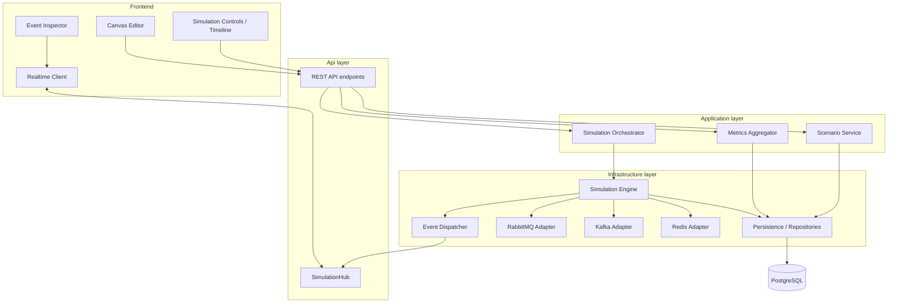

# Components

> Component-level reference for Distributed Flow Lab. Each major component is described by
> its **responsibility**, **dependencies**, and **key interfaces** (described, not coded).
> Component names, events, and endpoints follow the [canon](../../CLAUDE.md).

## 1. Component diagram

## 2. Frontend components

### 2.1 Canvas Editor
- **Responsibility:** the React Flow surface for composing a `Scenario` — placing `Node`s
  (by `NodeType`), drawing `Edge`s, and editing node/edge `config`. Serializes topology for
  save.
- **Dependencies:** Zustand canvas store; REST API (scenario CRUD).
- **Key interfaces:** consumes/produces `Scenario`, `Node`, `Edge` DTOs; calls
  `POST/PUT /api/v1/scenarios`.

### 2.2 Simulation Controls / Timeline
- **Responsibility:** lifecycle controls (start/pause/resume/stop), fault injection UI, and
  timeline playback of received events.
- **Dependencies:** REST API (lifecycle endpoints), Realtime Client (live events), Zustand
  simulation store.
- **Key interfaces:** calls `POST /api/v1/simulations/{id}/{start|pause|resume|stop}` and
  `/faults`; renders the ordered event timeline.

### 2.3 Event Inspector
- **Responsibility:** show the selected node/edge/event and the **raw envelope** behind each
  animation — the proof that the backend is authoritative.
- **Dependencies:** Realtime Client, simulation store.
- **Key interfaces:** reads `SimulationEvent` envelopes; derives no state.

### 2.4 Realtime Client
- **Responsibility:** manage the `@microsoft/signalr` connection, subscribe/unsubscribe to a
  simulation group, detect gaps via `sequence`, and reconnect with replay.
- **Dependencies:** `SimulationHub`; REST replay endpoint for gap recovery.
- **Key interfaces:** invokes `Subscribe`/`Unsubscribe`; handles `ReceiveSimulationEvent`,
  `ReceiveSimulationEvents`, `SimulationStateChanged`; on gap, calls
  `GET /api/v1/simulations/{id}/events?fromSequence=`. See [WebSocket Events](./websocket-events.md).

## 3. Api-layer components

### 3.1 REST API
- **Responsibility:** expose the canonical `/api/v1` endpoints as thin Minimal API adapters
  that translate HTTP to MediatR commands/queries and return DTOs; apply FluentValidation;
  emit RFC 7807 errors.
- **Dependencies:** Application handlers (Scenario Service, Simulation Orchestrator, Metrics
  Aggregator).
- **Key interfaces:** the endpoints in [API Contracts](./api-contracts.md).

### 3.2 SimulationHub
- **Responsibility:** the SignalR hub at `/hubs/simulation`; manages group-per-simulation
  membership and pushes events server→client.
- **Dependencies:** Event Dispatcher (source of events), Identity (subscription auth).
- **Key interfaces:** server→client `ReceiveSimulationEvent`, `ReceiveSimulationEvents`,
  `SimulationStateChanged`; client→server `Subscribe`, `Unsubscribe`.

## 4. Application-layer components

### 4.1 Scenario Service
- **Responsibility:** use cases for creating, reading, updating, deleting, and validating
  `Scenario`s and cloning catalog templates.
- **Dependencies:** Persistence port; Domain model.
- **Key interfaces:** MediatR commands/queries (`CreateScenario`, `UpdateScenario`,
  `GetScenario`, `ListScenarios`, `GetCatalog`); a scenario repository port.

### 4.2 Simulation Orchestrator
- **Responsibility:** manage the `Simulation` lifecycle — create from a scenario, and
  start/pause/resume/stop/inject-fault by commanding the engine. Enforces valid status
  transitions (`Draft→Running→Paused→…`).
- **Dependencies:** Simulation Engine port; Persistence port.
- **Key interfaces:** MediatR commands (`CreateSimulation`, `StartSimulation`,
  `PauseSimulation`, `ResumeSimulation`, `StopSimulation`, `InjectFault`); queries
  (`GetSimulation`, `GetEvents`).

### 4.3 Metrics Aggregator
- **Responsibility:** derive `MetricSnapshot`s (throughput, avgLatencyMs, inFlight,
  dlqCount, retries) from the event timeline on a tick cadence and answer metric queries.
- **Dependencies:** Event stream / persisted events; Persistence port.
- **Key interfaces:** query `GetMetrics`; consumes `MessageProcessed`, `DeadLettered`,
  `RetryScheduled`, etc.

## 5. Infrastructure-layer components

### 5.1 Simulation Engine
- **Responsibility:** the `BackgroundService` tick loop. Loads the scenario topology,
  advances `Tick`s, drives adapters, and emits every `SimulationEvent` with a monotonic
  `sequence`. Sole producer of domain events.
- **Dependencies:** messaging adapters, Event Dispatcher, Persistence.
- **Key interfaces:** implements the engine port used by the Orchestrator; emits via an
  event-sink port. See [ADR-007](../adr/ADR-007-background-service-engine.md).

### 5.2 Event Dispatcher
- **Responsibility:** implement the event-sink port; assign/verify `sequence`, persist each
  event, and fan out to the `SimulationHub` (batching for throughput).
- **Dependencies:** Persistence, SimulationHub, SignalR backplane (Redis) when scaled.
- **Key interfaces:** an event-sink method taking an envelope or batch; delivers via
  `ReceiveSimulationEvent(s)`.

### 5.3 Messaging Adapters (RabbitMQ / Kafka / Redis)
- **Responsibility:** translate engine intents into real broker operations and report
  outcomes; back `Exchange`/`Queue`/`DeadLetterQueue`, `Topic`/`Partition`, and `Cache`
  nodes respectively.
- **Dependencies:** the respective broker container.
- **Key interfaces:** a broker-agnostic messaging port (publish, route, enqueue, consume,
  ack/nack, cache get/set). See [ADR-003](../adr/ADR-003-rabbitmq.md).

### 5.4 Persistence / Repositories
- **Responsibility:** EF Core repositories over PostgreSQL for `Scenario`, `Simulation`,
  `SimulationEvent`, `MetricSnapshot`.
- **Dependencies:** PostgreSQL.
- **Key interfaces:** repository ports defined in Application; see [Data Model](./data-model.md).

## Related documents

- [Architecture](./architecture.md)
- [System Overview](./system-overview.md)
- [Event Model](./event-model.md)
- [API Contracts](./api-contracts.md)
- [WebSocket Events](./websocket-events.md)
- [Data Model](./data-model.md)
