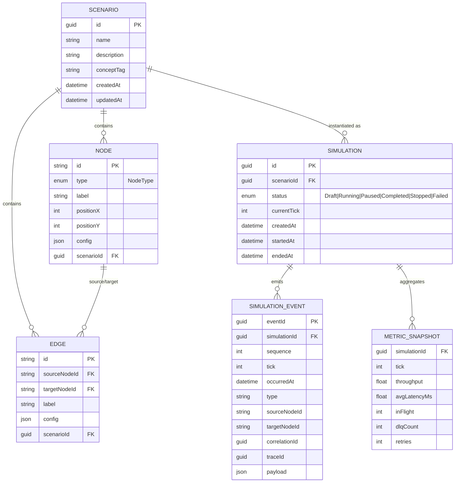
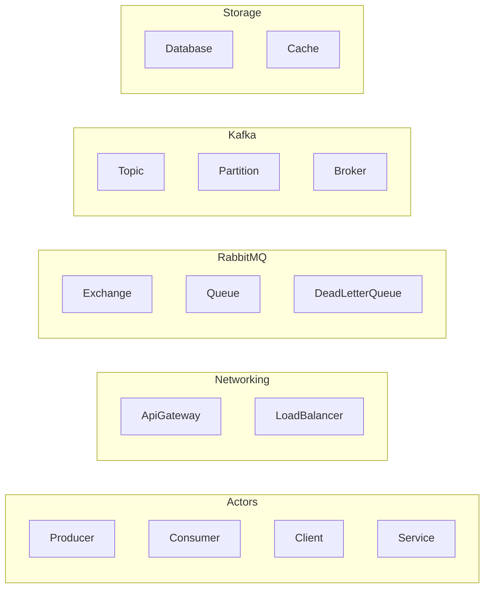
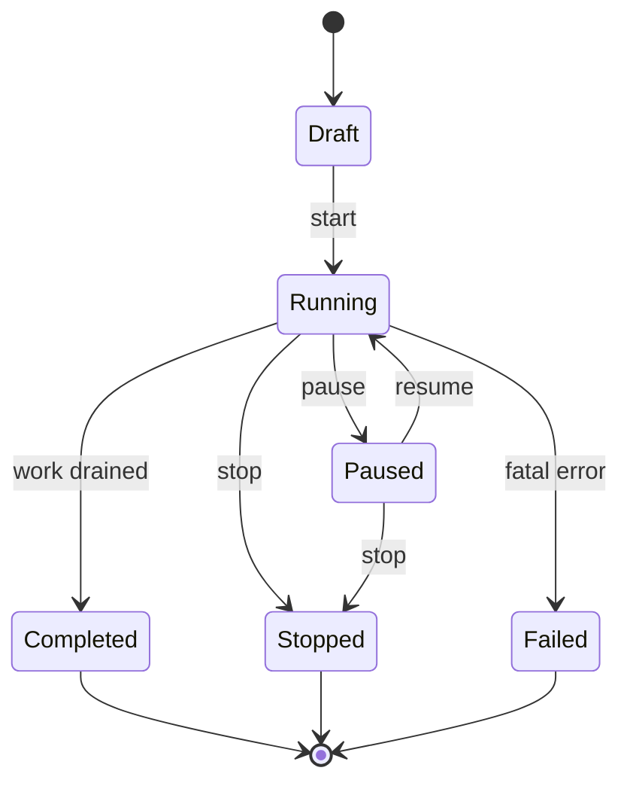

# Data Model

> The persistent and streamed data of Distributed Flow Lab. Every entity is defined per
> [canon §10](../../CLAUDE.md), with identifiers, relationships, the `NodeType` enum, and
> the `Simulation` status enum. Includes an ER diagram and a note on persisted vs streamed.

## 1. Entity-relationship diagram



## 2. Entities

### 2.1 Scenario
A saved architecture blueprint — a reusable topology of nodes and edges.
- **Identifier:** `id` (GUID).
- **Fields:** `name`, `description`, `conceptTag` (which concept it teaches, e.g. "RabbitMQ"),
  `nodes[]`, `edges[]`, `createdAt`, `updatedAt`.
- **Relationships:** owns many `Node`s and `Edge`s; is instantiated as many `Simulation`s.

### 2.2 Node
A participant in the architecture.
- **Identifier:** `id` (string, stable within a scenario, e.g. `node-producer-1`).
- **Fields:** `type` (`NodeType` enum), `label`, `position { x, y }`, `config`
  (type-specific JSON, e.g. exchange type, DLX reference, TTL, partition count).
- **Relationships:** belongs to one `Scenario`; referenced by `Edge.sourceNodeId` /
  `targetNodeId`; referenced by events' `sourceNodeId` / `targetNodeId`.

### 2.3 Edge
A directed connection between two nodes.
- **Identifier:** `id` (string).
- **Fields:** `sourceNodeId`, `targetNodeId`, `label`, `config` (e.g. `routingKey`,
  weight, latency).
- **Relationships:** belongs to one `Scenario`; connects two `Node`s.

### 2.4 Simulation
A running or completed execution instance of a scenario.
- **Identifier:** `id` (GUID).
- **Fields:** `scenarioId`, `status`, `currentTick`, `createdAt`, `startedAt`, `endedAt`.
- **Relationships:** references one `Scenario`; emits many `SimulationEvent`s; aggregates
  many `MetricSnapshot`s.

### 2.5 SimulationEvent
A persisted domain event — the unit of truth for animation (see [Event Model](./event-model.md)).
- **Identifier:** `eventId` (GUID); ordered within a simulation by `sequence`.
- **Fields:** the full canonical envelope — `simulationId`, `sequence`, `tick`,
  `occurredAt`, `type`, `sourceNodeId`, `targetNodeId`, `correlationId`, `traceId`,
  `payload`.
- **Relationships:** belongs to one `Simulation`. Uniqueness: `(simulationId, sequence)` is
  unique and monotonic, enabling ordering, gap detection, and `fromSequence` replay.

### 2.6 MetricSnapshot
A derived, aggregated measure sampled on a tick cadence.
- **Identifier:** composite `(simulationId, tick)`.
- **Fields:** `throughput`, `avgLatencyMs`, `inFlight`, `dlqCount`, `retries`.
- **Relationships:** belongs to one `Simulation`; computed by the Metrics Aggregator from
  the event timeline.

## 3. Enumerations

### 3.1 NodeType (canonical)
```
Producer, Consumer, Service, ApiGateway, LoadBalancer,
Exchange, Queue, Topic, Partition, Broker, Database,
Cache, DeadLetterQueue, Client
```



### 3.2 Simulation status

Values: `Draft`, `Running`, `Paused`, `Completed`, `Stopped`, `Failed`.

## 4. Persisted vs streamed

| Data | Persisted (PostgreSQL) | Streamed (SignalR) |
|------|------------------------|--------------------|
| `Scenario`, `Node`, `Edge` | Yes (EF Core, authoritative blueprint). | No. |
| `Simulation` (status, tick) | Yes. | Yes, via `SimulationStateChanged`. |
| `SimulationEvent` | Yes (full timeline; enables `fromSequence` replay). | Yes, via `ReceiveSimulationEvent(s)`. |
| `MetricSnapshot` | Yes (sampled per tick). | Delivered on `GET .../metrics`; may also stream. |
| `AnimationStarted` / `AnimationFinished` | **No** — frontend-only presentation events, never persisted or streamed. | No. |

Because every `SimulationEvent` is both persisted and streamed with a monotonic `sequence`,
the timeline is fully replayable: a late-joining or reconnecting client reconstructs exactly
what happened via `GET /api/v1/simulations/{id}/events?fromSequence=` (see
[WebSocket Events](./websocket-events.md)).

## Related documents

- [Event Model](./event-model.md)
- [API Contracts](./api-contracts.md)
- [Components](./components.md)
- [Bounded Contexts](./bounded-contexts.md)
- [Architecture](./architecture.md)
