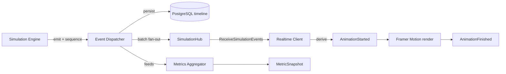
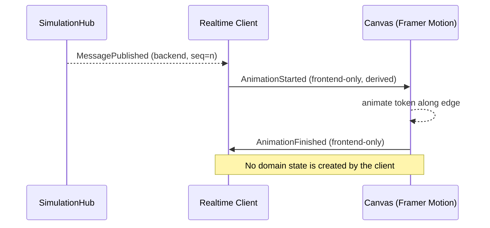

# Event Model

> **Authoritative domain-event reference for Distributed Flow Lab.** This document defines
> the canonical event envelope and the full Event Catalog. It is referenced by
> [WebSocket Events](./websocket-events.md), [Sequence Diagrams](./sequence-diagrams.md),
> [Data Model](./data-model.md), and the feature docs. Event names, envelope fields, and
> grouping follow the [canon §6–§7](../../CLAUDE.md) **exactly**.

## 1. First principle: backend events are the only truth

The backend Simulation Engine is the **sole producer** of `SimulationEvent`s. The frontend
renders animations *from* these events and never invents simulation state. The only events
the client creates are the two **frontend-only presentation events**
(`AnimationStarted` / `AnimationFinished`), which describe the *rendering* of a backend
event and are covered in §5.

## 2. Canonical event envelope

Every `SimulationEvent` is transported in this JSON envelope (camelCase on the wire):

```json
{
  "eventId": "d1f...-guid",
  "simulationId": "a90...-guid",
  "sequence": 42,
  "tick": 17,
  "occurredAt": "2026-07-07T15:30:00.123Z",
  "type": "MessagePublished",
  "sourceNodeId": "node-producer-1",
  "targetNodeId": "node-exchange-1",
  "correlationId": "msg-8f3...-guid",
  "traceId": "trace-2b1...-guid",
  "payload": { "routingKey": "order.created", "sizeBytes": 512 }
}
```

| Field | Type | Meaning |
|-------|------|---------|
| `eventId` | GUID | Unique id for this event instance. |
| `simulationId` | GUID | The owning `Simulation`. |
| `sequence` | int | **Monotonic per simulation.** Drives ordering and gap detection. |
| `tick` | int | Engine logical clock at emission time. |
| `occurredAt` | ISO-8601 UTC | Wall-clock timestamp. |
| `type` | string | One of the Event Catalog names (§3). |
| `sourceNodeId` | string | The node that originated the event. |
| `targetNodeId` | string \| null | Destination node; **null for node-local events**. |
| `correlationId` | GUID | The `messageId` a message-related event belongs to. |
| `traceId` | GUID | Cross-subsystem trace correlation (OpenTelemetry). |
| `payload` | object | Type-specific fields (see each event below). |

Design rationale is recorded in
[ADR-009: event envelope with sequence & tick](../adr/ADR-009-event-envelope-sequencing.md).

## 3. Event Catalog

Grouped exactly as in canon §7. For each event: **meaning**, **when emitted**,
**source/target semantics**, and **payload fields**.

### 3.1 Lifecycle

| Event | Meaning / when emitted | Source → Target | Payload fields |
|-------|------------------------|-----------------|----------------|
| `SimulationStarted` | Simulation transitions to Running (after start command). | engine → null | `scenarioId`, `startedAt` |
| `SimulationPaused` | Simulation paused; tick loop halts. | engine → null | `atTick` |
| `SimulationResumed` | Simulation resumes from pause. | engine → null | `atTick` |
| `SimulationStopped` | Simulation stopped by user before natural completion. | engine → null | `atTick`, `reason` |
| `SimulationCompleted` | All work drained; simulation ended naturally. | engine → null | `endedAt`, `totalTicks` |
| `TickAdvanced` | Logical clock advanced one unit. | engine → null | `tick` |

### 3.2 Node

| Event | Meaning / when emitted | Source → Target | Payload fields |
|-------|------------------------|-----------------|----------------|
| `NodeActivated` | A node becomes active/participating. | node → null | `nodeType` |
| `NodeStateChanged` | A node's internal state changed (e.g. queue depth). | node → null | `previousState`, `newState` |
| `NodeFailed` | A node fails (crash / unavailable). | node → null | `reason` |
| `NodeRecovered` | A previously failed node recovers. | node → null | `downForTicks` |
| `ConsumerRegistered` | A consumer subscribes to a queue/topic. | consumer → queue/topic | `subscription` |

### 3.3 Messaging

| Event | Meaning / when emitted | Source → Target | Payload fields |
|-------|------------------------|-----------------|----------------|
| `MessagePublished` | A producer publishes a message. | producer → exchange/topic | `routingKey`, `sizeBytes` |
| `MessageRouted` | Broker routes a message to a binding/partition. | exchange/topic → queue/partition | `routingKey`, `binding` |
| `MessageEnqueued` | Message placed on a queue. | queue → null | `queueDepth` |
| `MessageDequeued` | Message taken off a queue for delivery. | queue → consumer | `queueDepth` |
| `MessageReceived` | Consumer receives the message. | queue/topic → consumer | `deliveryTag` |
| `MessageProcessed` | Consumer finished processing successfully. | consumer → null | `latencyMs` |
| `AckReceived` | Broker receives a positive acknowledgement. | consumer → queue | `deliveryTag` |
| `MessageNacked` | Consumer negatively acknowledges (processing failed). | consumer → queue | `deliveryTag`, `requeue` |
| `RetryScheduled` | A retry is scheduled after a failure (with backoff). | consumer/queue → null | `attempt`, `backoffMs`, `nextTick` |
| `MessageRetried` | A scheduled retry is dispatched. | queue → consumer | `attempt` |
| `DeadLettered` | Message exhausted retries / rejected; routed to DLQ. | queue → deadLetterQueue | `reason`, `attempts` |
| `MessageExpired` | Message TTL elapsed before delivery. | queue → null | `ttlMs` |
| `MessageDropped` | Message discarded (overflow / no route / policy). | node → null | `reason` |

### 3.4 HTTP / RPC

| Event | Meaning / when emitted | Source → Target | Payload fields |
|-------|------------------------|-----------------|----------------|
| `HttpRequestStarted` | An HTTP request begins. | client/service → service | `method`, `path` |
| `HttpResponseReceived` | A response is received. | service → caller | `statusCode`, `latencyMs` |
| `HttpRequestFailed` | Request failed (non-timeout error). | service → caller | `statusCode`, `error` |
| `HttpRequestTimedOut` | Request exceeded its deadline. | service → caller | `timeoutMs` |
| `GrpcCallStarted` | A gRPC call begins. | client → service | `service`, `method` |
| `GrpcCallCompleted` | A gRPC call finishes. | service → caller | `statusCode`, `latencyMs` |

### 3.5 Resilience / patterns

| Event | Meaning / when emitted | Source → Target | Payload fields |
|-------|------------------------|-----------------|----------------|
| `CircuitBreakerOpened` | Failure threshold tripped; breaker opens. | service → null | `failureCount`, `openForMs` |
| `CircuitBreakerHalfOpened` | Breaker allows a trial request. | service → null | `probe` |
| `CircuitBreakerClosed` | Trial succeeded; breaker closes. | service → null | `successCount` |
| `SagaStarted` | A saga orchestration begins. | orchestrator → null | `sagaId`, `steps` |
| `SagaStepCompleted` | A saga step completed successfully. | service → orchestrator | `sagaId`, `step` |
| `SagaCompensationTriggered` | A step failed; compensation begins. | orchestrator → service | `sagaId`, `failedStep` |
| `SagaCompleted` | Saga finished (success or compensated). | orchestrator → null | `sagaId`, `outcome` |
| `CacheHit` | Lookup found a value in cache. | service → cache | `key` |
| `CacheMiss` | Lookup missed; falls through to source. | service → cache | `key` |
| `CacheEvicted` | A cache entry was evicted (TTL/policy). | cache → null | `key`, `reason` |

### 3.6 Fault injection

| Event | Meaning / when emitted | Source → Target | Payload fields |
|-------|------------------------|-----------------|----------------|
| `FaultInjected` | A fault is deliberately introduced. | injector → node | `faultType`, `targetNodeId` |
| `LatencyInjected` | Extra latency added to a node/edge. | injector → node/edge | `latencyMs` |
| `PartitionCreated` | A network partition is introduced. | injector → null | `groupA`, `groupB` |
| `PartitionHealed` | A partition is removed. | injector → null | `afterTicks` |

## 4. Event flow



## 5. Frontend-only presentation events

`AnimationStarted` and `AnimationFinished` are **not domain events** and never appear in the
backend Event Catalog, the timeline, or persistence. They are derived on the client purely
to describe the *rendering* of a backend event:

- When the Realtime Client receives, say, `MessagePublished`, it computes the token's path
  (producer → exchange) and emits a local `AnimationStarted`; when Framer Motion finishes the
  transition it emits `AnimationFinished`.
- These events carry no authoritative state. They cannot change queue depth, ack status, or
  any domain fact — those come only from backend events.
- If the client is ahead of or behind the backend (e.g. after reconnect), it re-derives
  animations from the authoritative timeline; it never fabricates a domain event to fill a
  gap. Gaps are recovered via `GET /api/v1/simulations/{id}/events?fromSequence=`.



## Related documents

- [Architecture](./architecture.md)
- [System Overview](./system-overview.md)
- [WebSocket Events](./websocket-events.md)
- [API Contracts](./api-contracts.md)
- [Data Model](./data-model.md)
- [Sequence Diagrams](./sequence-diagrams.md)
