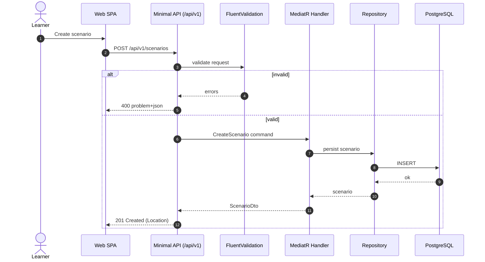
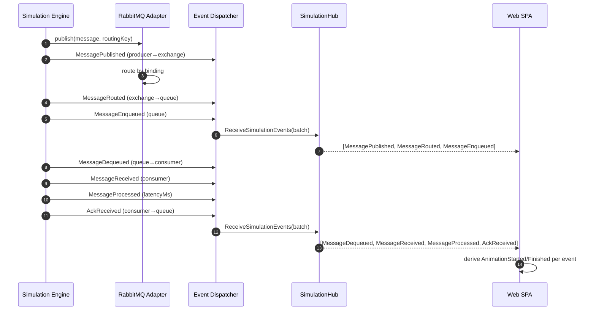
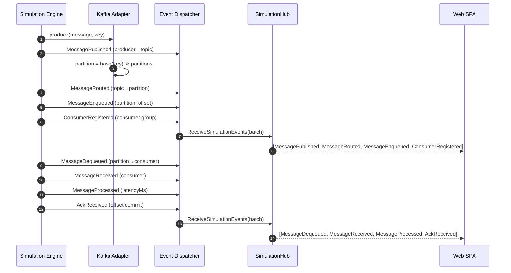
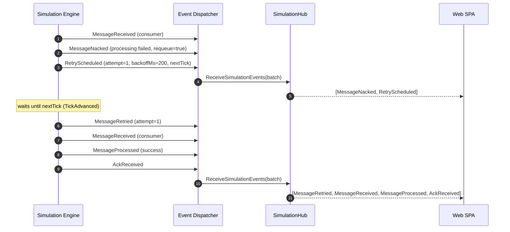
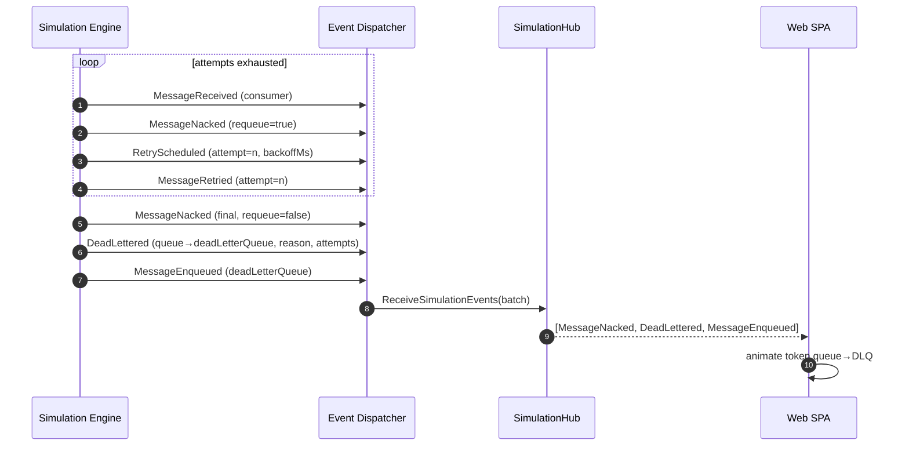
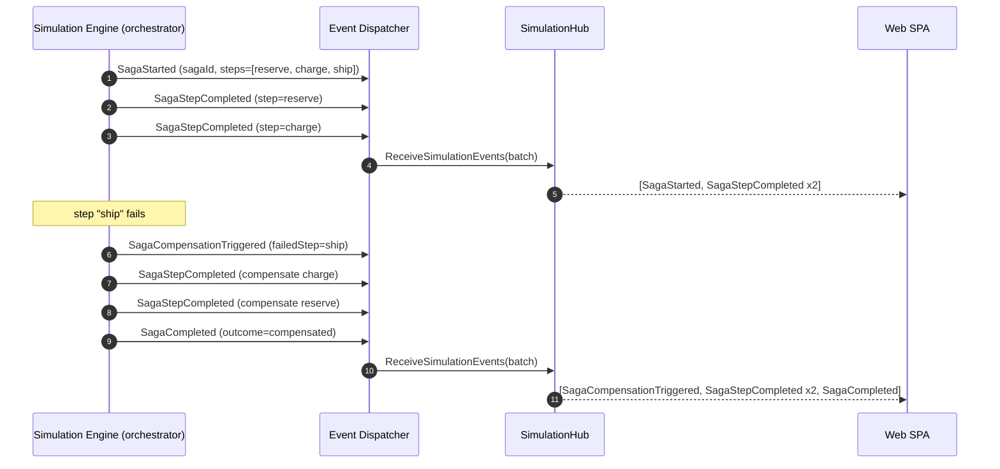
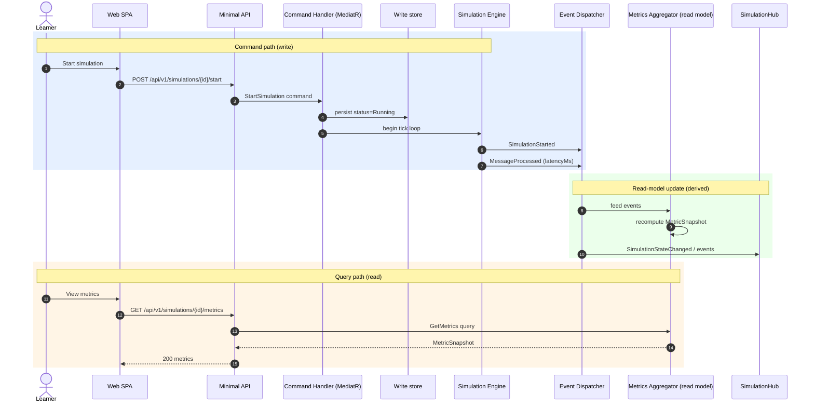

# Sequence Diagrams

> Canonical runtime flows for Distributed Flow Lab. Every diagram uses the exact event names
> from the [Event Model](./event-model.md), the endpoints from
> [API Contracts](./api-contracts.md), and the hub methods from
> [WebSocket Events](./websocket-events.md). All backend events flow through the Event
> Dispatcher and SimulationHub; the client derives `AnimationStarted`/`AnimationFinished`
> locally and never invents state.

## 1. REST request flow

A generic REST call: thin Minimal API endpoint → FluentValidation → MediatR handler →
repository, returning a DTO or an RFC 7807 problem.

## 2. RabbitMQ: publish → route → enqueue → consume → ack

## 3. Kafka: produce → partition → consumer group → offset commit

## 4. Retry with backoff

## 5. Dead-letter (DLQ) path

## 6. Saga: steps and compensation

## 7. CQRS: command vs query and read-model update

## Related documents

- [Event Model](./event-model.md)
- [API Contracts](./api-contracts.md)
- [WebSocket Events](./websocket-events.md)
- [Components](./components.md)
- [System Overview](./system-overview.md)
