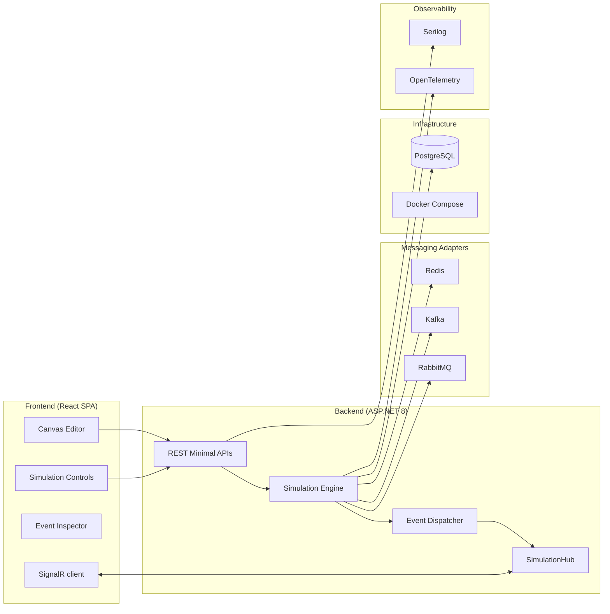
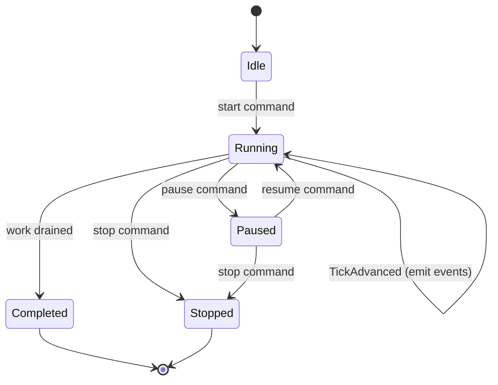
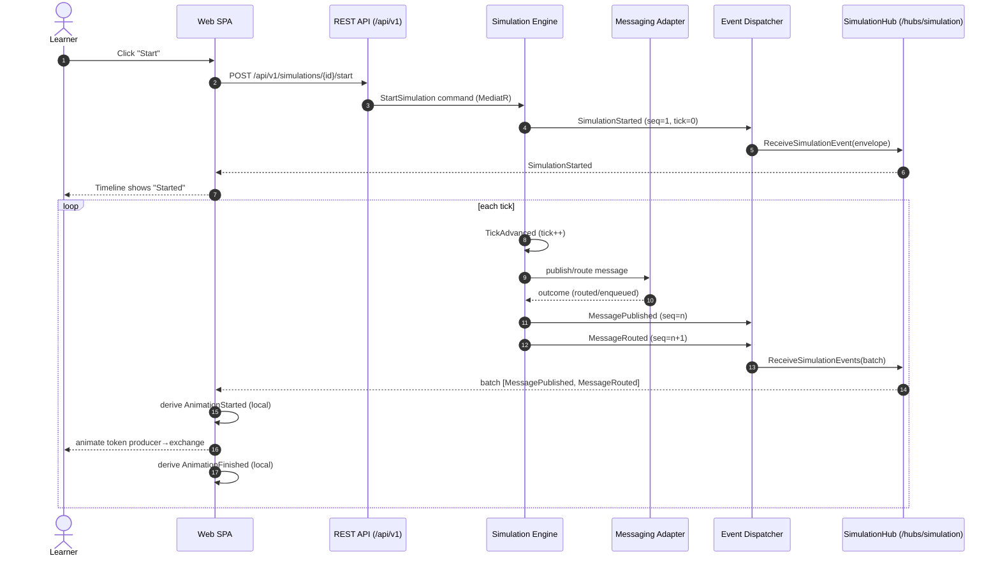

# System Overview

> Companion to [Architecture](./architecture.md). Where that document explains *structure*,
> this one explains each **subsystem** and traces how a single user action becomes a stream
> of backend events and, finally, an animation on the canvas.

## 1. Subsystems at a glance

Distributed Flow Lab is composed of six cooperating subsystems. Each has a clear
responsibility and a single reason to change.

## 2. Frontend

The frontend is a React 18 + TypeScript single-page application built with Vite. It is a
**pure rendering surface for backend events** — it holds no authoritative simulation state.

- **Canvas Editor** (`features/canvas`): a React Flow editor where users place `Node`s and
  draw `Edge`s. It produces a `Scenario` topology that is saved via REST.
- **Simulation Controls / Timeline** (`features/simulation`): start/pause/resume/stop
  controls and playback of the event timeline.
- **Event Inspector** (`features/inspector`): shows the currently selected node/edge and the
  raw `SimulationEvent` envelope behind each animation — the teaching surface that proves the
  backend is authoritative.
- **Realtime** (`realtime/`): the `@microsoft/signalr` connection, subscription to a
  simulation group, reconnection, and gap-detection using the envelope `sequence`.
- **State** (`state/`): Zustand stores (canvas, simulation, ui). The simulation store holds
  the received event timeline and the derived render state — never invented state.
- **Animation:** Framer Motion animates message tokens along edges. Each animation is a
  presentation of a backend event; the client emits only the frontend-only
  `AnimationStarted` / `AnimationFinished` presentation events locally (see
  [Event Model](./event-model.md)).

## 3. Backend

The backend is an ASP.NET 8 host exposing Minimal API REST endpoints and the
`SimulationHub`. It applies Clean Architecture: endpoints are thin adapters that translate
HTTP into **MediatR** commands/queries; business logic lives in the Application layer, and
adapters live in Infrastructure. See [Components](./components.md).

- **REST API** (`/api/v1`): scenario CRUD, simulation lifecycle, fault injection, event
  replay, metrics. Contracts in [API Contracts](./api-contracts.md).
- **SimulationHub** (`/hubs/simulation`): pushes `SimulationEvent`s to subscribed clients.
  Contract in [WebSocket Events](./websocket-events.md).
- **Composition root**: DI wiring of ports to concrete adapters.

## 4. Simulation Engine

The Simulation Engine is the heart of the system: an `IHostedService` /
`BackgroundService` that runs a **tick loop**. On each `Tick` it advances the logical clock,
evaluates the scenario topology, drives the messaging adapters, and **emits
`SimulationEvent`s** through the Event Dispatcher.

Key properties:
- **Deterministic ordering.** Every emitted event receives the next monotonic `sequence`
  for its simulation and the current `tick`. This makes the timeline ordered, replayable,
  and gap-detectable.
- **Backend authority.** The engine is the *only* producer of domain events. It emits the
  full Event Catalog (canon §7): lifecycle (`SimulationStarted`, `TickAdvanced`, …),
  messaging (`MessagePublished`, `MessageEnqueued`, `DeadLettered`, …), resilience
  (`CircuitBreakerOpened`, `SagaStepCompleted`, …), and fault injection (`FaultInjected`, …).
- **Isolation.** Each simulation's engine work is keyed by `simulationId` and uses isolated
  broker resources, so simulations never interfere. See [Architecture §8](./architecture.md).
- See [ADR-007: BackgroundService engine](../adr/ADR-007-background-service-engine.md).

## 5. Messaging Adapters

To make simulations *truthful* rather than faked, abstract node types are backed by real
brokers via Infrastructure adapters implementing an Application port.

| Adapter | Backs node types | Real semantics exercised |
|---------|------------------|--------------------------|
| **RabbitMQ** (AMQP) | `Exchange`, `Queue`, `DeadLetterQueue` | Exchanges, routing keys, bindings, DLX, ack/nack, requeue. |
| **Kafka** | `Topic`, `Partition` | Partitioning by key, offsets, consumer groups, commit. |
| **Redis** | `Cache` | GET/SET, TTL eviction, hit/miss, pub/sub. |

The engine talks to a broker-agnostic port; the adapter translates engine intents into
real broker operations and reports outcomes, which the engine turns into events
(`MessageRouted`, `MessageEnqueued`, `AckReceived`, `CacheHit`, …). See
[ADR-003](../adr/ADR-003-rabbitmq.md).

## 6. Infrastructure

- **PostgreSQL (EF Core):** persists `Scenario`, `Simulation`, the `SimulationEvent`
  timeline, and `MetricSnapshot`s. See [Data Model](./data-model.md).
- **Docker Compose:** orchestrates the canonical containers `web`, `api`, `rabbitmq`,
  `kafka`, `redis`, `postgres` for local development and demos. See
  [Architecture §6](./architecture.md).

## 7. Observability

- **OpenTelemetry:** distributed traces, metrics, and logs. The envelope `traceId`
  correlates a simulated message's events with real broker operations and host spans, so an
  instructor can show a message's journey across subsystems.
- **Serilog:** structured application logs at the host, enriched with `simulationId` and
  `correlationId` for filtering.

## 8. End-to-end flow: user action → backend events → animation

The following sequence shows the canonical path from a user pressing **Start** to a message
token animating along an edge. Note that the client's `AnimationStarted`/`AnimationFinished`
are local presentation events derived from the backend `MessagePublished` — the client
never fabricates simulation state.

For per-pattern flows (RabbitMQ, Kafka, Retry, DLQ, Saga, CQRS) see
[Sequence Diagrams](./sequence-diagrams.md).

## Related documents

- [Architecture](./architecture.md)
- [Bounded Contexts](./bounded-contexts.md)
- [Components](./components.md)
- [Event Model](./event-model.md)
- [WebSocket Events](./websocket-events.md)
- [Sequence Diagrams](./sequence-diagrams.md)
