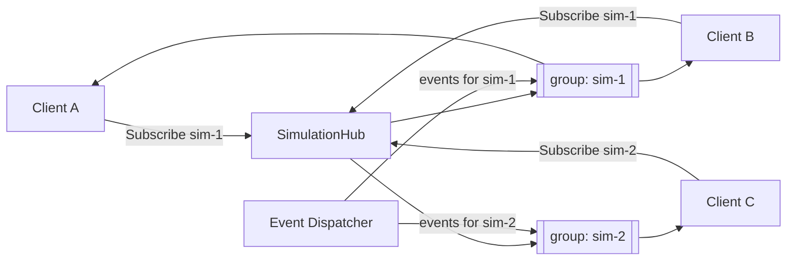
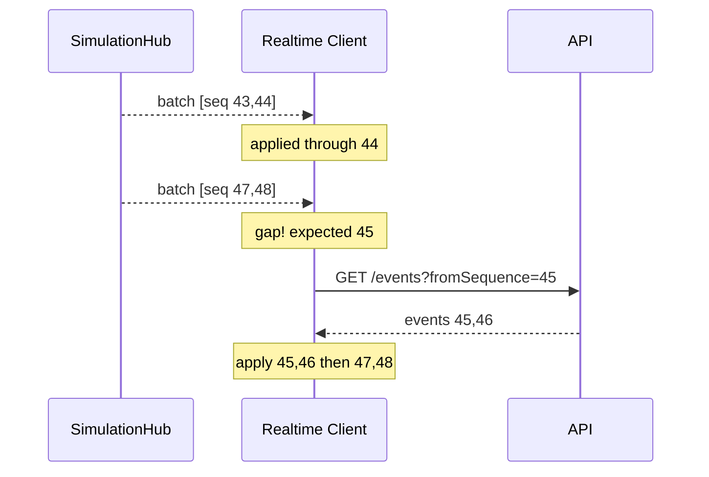

# WebSocket (SignalR) Events

> The realtime contract for Distributed Flow Lab. Hub, group model, methods, payloads,
> batching, ordering, and reconnection/replay. Follows the [canon §8](../../CLAUDE.md) and
> uses the canonical envelope from [Event Model](./event-model.md).

## 1. Hub and connection

- **Hub:** `SimulationHub`, mapped at **`/hubs/simulation`**.
- **Transport:** WebSockets (SignalR), via the `@microsoft/signalr` client.
- **Authentication:** the bearer token is supplied on connect (access-token query parameter
  negotiated by the SignalR client); hub methods run under the authenticated principal.
- **Group model:** exactly **one SignalR group per `simulationId`**. A client observing a
  simulation joins that group so it receives only that simulation's events — the fan-out
  unit that makes the [Redis backplane](./architecture.md) scale.



## 2. Methods

### Client → Server
| Method | Signature | Purpose |
|--------|-----------|---------|
| `Subscribe` | `Subscribe(string simulationId)` | Join the group for a simulation (after authorization). |
| `Unsubscribe` | `Unsubscribe(string simulationId)` | Leave the group. |

### Server → Client
| Method | Signature | Purpose |
|--------|-----------|---------|
| `ReceiveSimulationEvent` | `ReceiveSimulationEvent(SimulationEventEnvelope evt)` | Deliver a single event. |
| `ReceiveSimulationEvents` | `ReceiveSimulationEvents(SimulationEventEnvelope[] batch)` | Deliver a batch (high throughput). |
| `SimulationStateChanged` | `SimulationStateChanged(SimulationStateDto state)` | Notify a lifecycle/status change. |

## 3. Payload examples

`ReceiveSimulationEvent` — a single `MessagePublished` in the canonical envelope:
```json
{
  "eventId": "d1f-guid",
  "simulationId": "sim-90a-guid",
  "sequence": 42,
  "tick": 17,
  "occurredAt": "2026-07-07T15:30:00.123Z",
  "type": "MessagePublished",
  "sourceNodeId": "node-producer-1",
  "targetNodeId": "node-exchange-1",
  "correlationId": "msg-8f3-guid",
  "traceId": "trace-2b1-guid",
  "payload": { "routingKey": "order.created", "sizeBytes": 512 }
}
```

`ReceiveSimulationEvents` — a batch (note contiguous ascending `sequence`):
```json
[
  { "eventId": "e1", "simulationId": "sim-90a-guid", "sequence": 43, "tick": 18, "occurredAt": "2026-07-07T15:30:00.400Z", "type": "MessageRouted", "sourceNodeId": "node-exchange-1", "targetNodeId": "node-queue-1", "correlationId": "msg-8f3-guid", "traceId": "trace-2b1-guid", "payload": { "routingKey": "order.created", "binding": "order.created" } },
  { "eventId": "e2", "simulationId": "sim-90a-guid", "sequence": 44, "tick": 18, "occurredAt": "2026-07-07T15:30:00.420Z", "type": "MessageEnqueued", "sourceNodeId": "node-queue-1", "targetNodeId": null, "correlationId": "msg-8f3-guid", "traceId": "trace-2b1-guid", "payload": { "queueDepth": 1 } }
]
```

`SimulationStateChanged` — `SimulationStateDto`:
```json
{ "simulationId": "sim-90a-guid", "status": "Running", "currentTick": 18, "updatedAt": "2026-07-07T15:30:00.420Z" }
```

## 4. Batching

The Event Dispatcher may emit many events per tick. To avoid overwhelming the transport and
the browser, it coalesces events into batches delivered via `ReceiveSimulationEvents`:

- Batches are bounded by size and by a short time window (per tick boundary).
- Within a batch, events are ordered by ascending `sequence`.
- Single, latency-sensitive lifecycle events may still be sent via `ReceiveSimulationEvent`.
- The client treats a single event and a one-element batch identically after normalization.

## 5. Ordering and gap detection

Ordering is guaranteed by the monotonic `sequence` in the envelope, **not** by transport
delivery order:

- The client tracks the highest contiguous `sequence` applied per simulation.
- On receiving an event/batch, it applies events strictly in `sequence` order.
- If the next `sequence` is greater than expected, a **gap** is detected and the client
  triggers replay (§6) rather than inventing the missing state.



## 6. Reconnection and replay

SignalR reconnects automatically on transient drops. Because a client may miss events while
disconnected, recovery does **not** rely on the transport buffer:

1. On (re)connect, the client calls `Subscribe(simulationId)` to rejoin the group.
2. It then calls REST `GET /api/v1/simulations/{id}/events?fromSequence={lastApplied+1}` to
   fetch every event it missed (see [API Contracts](./api-contracts.md)).
3. It applies the replayed events in `sequence` order, then resumes live streaming.

This guarantees the client's rendered state is always a faithful projection of the
authoritative timeline — the frontend never fabricates a `SimulationEvent` to fill a gap.
See [ADR-002: SignalR realtime transport](../adr/ADR-002-signalr.md).

## Related documents

- [Event Model](./event-model.md)
- [API Contracts](./api-contracts.md)
- [Architecture](./architecture.md)
- [Components](./components.md)
- [Sequence Diagrams](./sequence-diagrams.md)
