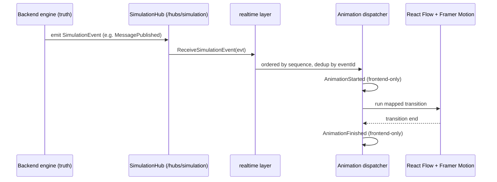
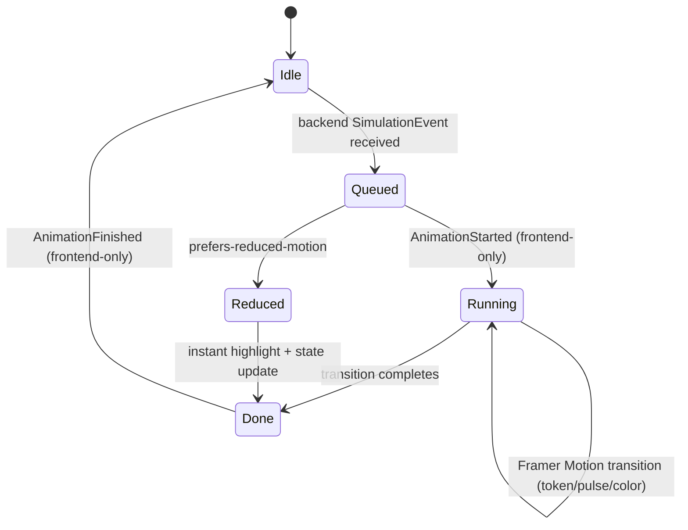
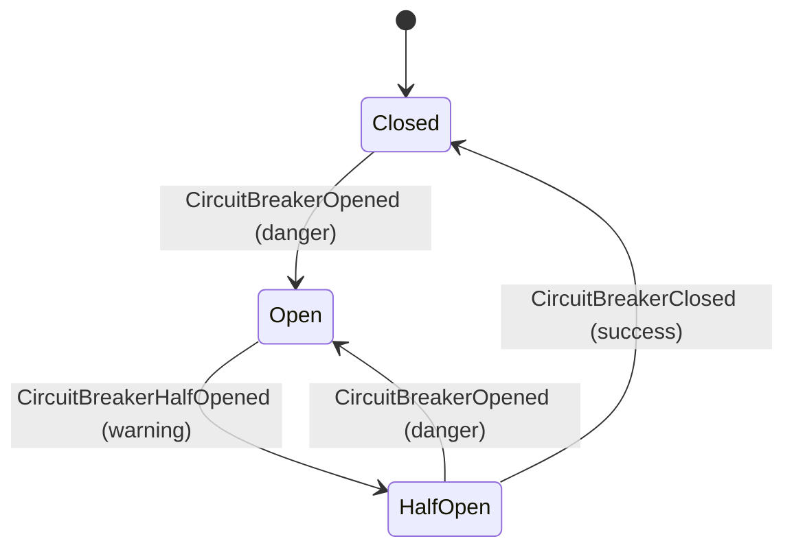

# Animations

> **Scope.** The complete catalog of DFL canvas animations and the rule that governs all of them.
> Implemented with **Framer Motion** on the **React Flow** canvas, driven by the SignalR event stream.
> Colors and motion tokens come from [design-system.md](./design-system.md); components that host the
> motion are in [components.md](./components.md). Terminology and event names follow the
> [Event Model](../02-architecture/event-model.md) **exactly**.

## 1. The critical rule (canon §1, §7)

**Animations are driven EXCLUSIVELY by backend SimulationEvents. The frontend never invents state.**

- The backend engine is the single source of truth. A click (Run, Pause, Inject Fault) issues a
  command over REST or SignalR; the UI animates **only** when the corresponding backend event arrives
  via `ReceiveSimulationEvent` / `ReceiveSimulationEvents` (canon §8).
- `AnimationStarted` and `AnimationFinished` are **frontend-only presentation events** (canon §7).
  They describe the *rendering* of a backend event — they bracket a Framer Motion transition for
  sequencing, cleanup, and throttling. They **never** create or mutate domain state and are never sent
  to the server.
- Because canvas visual state is a pure fold over the ordered event history (by `sequence`), **Replay**
  is deterministic and identical to live playback (see [user-flows §9](./user-flows.md#9-pausing--replaying-via-the-timeline)).

## 2. Animation lifecycle (every animation)

Every entry below specifies **Trigger** (the backend event), **States**, **Timing**
(duration token + easing from [design-system.md §6](./design-system.md#6-animation-principles)), and
the **`AnimationStarted`/`AnimationFinished`** bracket. Durations scale with the `uiStore` playback
speed multiplier.

## 3. Message token travel along an edge

- **Trigger.** `MessagePublished` (Producer→Exchange/Topic/Broker), `MessageRouted`
  (Exchange→Queue / Topic→Partition), `MessageReceived`/`MessageDequeued` (Queue/Partition→Consumer/Service).
- **Visual.** A circular **message token** (colored `--evt-msg`) animates along the `FlowEdge` path
  from `sourceNodeId` to `targetNodeId`. The token carries the `correlationId`; hovering shows the
  `messageId`.
- **States.** `spawn at source handle → travel along path → arrive at target handle → despawn`.
- **Timing.** `--motion-travel` (600ms) with `--ease-emphasis`; arrival triggers the target node's
  intake pulse.
- **Bracket.** `AnimationStarted` on spawn; `AnimationFinished` on despawn. On arrival the dispatcher
  may chain the next event's animation for the same `correlationId` (message-centric sequencing).

## 4. Message enqueue / dequeue (queue depth)

- **Trigger.** `MessageEnqueued` (depth +1), `MessageDequeued` (depth −1).
- **Visual.** The `QueueNode` badge (stacked-bars depth counter) increments/decrements; a brief fill
  animation on the queue body reflects the new depth.
- **States.** `count change → bar fill/drain → settle`.
- **Timing.** `--motion-base` (240ms), `--ease-standard` for enqueue; `--ease-exit` for dequeue.
- **Bracket.** `AnimationStarted` at count change; `AnimationFinished` when the badge settles.

## 5. Node intake / processing pulse

- **Trigger.** `NodeActivated`, `MessageReceived`, `MessageProcessed`, `ConsumerRegistered`.
- **Visual.** The `FlowNode` emits a single ring **pulse** in its node accent; on `MessageProcessed`
  the pulse is `--color-success`.
- **States.** `scale 1.0 → 1.06 ring → 1.0`.
- **Timing.** `--motion-base` (240ms), `--ease-emphasis`.
- **Bracket.** `AnimationStarted`/`AnimationFinished` wrap the single pulse; concurrent pulses on the
  same node coalesce to one per frame (performance).

## 6. Acknowledgement

- **Trigger.** `AckReceived`.
- **Visual.** A small check glyph in `--color-success` flashes on the acknowledging edge/node; the
  in-flight badge on the source decrements.
- **States.** `flash in → hold → fade`.
- **Timing.** `--motion-fast` (120ms) in, `--motion-base` fade out, `--ease-standard`.
- **Bracket.** Standard `AnimationStarted`/`AnimationFinished`.

## 7. Nack, retry loop, and retried delivery

- **Trigger.** `MessageNacked` → `RetryScheduled` → `MessageRetried`.
- **Visual.**
  - `MessageNacked`: the token flashes `--evt-msg-warn` and reverses toward the source.
  - `RetryScheduled`: a dashed **retry loop arc** appears on the node in `--color-warning` with a small
    countdown badge (the scheduled delay/backoff).
  - `MessageRetried`: a fresh token (same `correlationId`) travels the edge again (reuses §3).
- **States.** `nack flash → loop arc pulsing during wait → token re-spawn on retry`.
- **Timing.** loop arc `--motion-slow` (900ms) looping while pending; nack flash `--motion-fast`.
- **Bracket.** Each of the three events gets its own `AnimationStarted`/`AnimationFinished`; the loop
  arc's `AnimationFinished` fires when `MessageRetried` (or `DeadLettered`) supersedes it.

## 8. Dead-lettering (DLQ drop)

- **Trigger.** `DeadLettered` (also reached after `MessageExpired`/exhausted retries).
- **Visual.** The token detaches from its current path and **drops** downward into the
  `DeadLetterQueue` node, which flashes `--color-danger` (`--evt-dlq`) and increments its count badge.
- **States.** `detach → gravity drop along a curved path → absorb into DLQ → DLQ count +1`.
- **Timing.** `--motion-slow` (900ms), `--ease-exit`.
- **Bracket.** `AnimationStarted` on detach; `AnimationFinished` on absorb. This animation is
  intentionally distinct and slower — dead-lettering is a key teaching moment.

## 9. Message expired / dropped

- **Trigger.** `MessageExpired`, `MessageDropped`.
- **Visual.** The token fades and dissolves in place (dropped) or shows a clock burst then dissolves
  (expired), tinted `--evt-msg-warn`; no arrival pulse fires.
- **States.** `dissolve → gone`.
- **Timing.** `--motion-base` (240ms), `--ease-exit`.
- **Bracket.** Standard bracket; the message trace for that `correlationId` terminates here.

## 10. HTTP / gRPC request-response

- **Trigger.** `HttpRequestStarted` / `GrpcCallStarted` → `HttpResponseReceived` / `GrpcCallCompleted`;
  failure paths `HttpRequestFailed`, `HttpRequestTimedOut`.
- **Visual.** A directed **request token** (`--evt-http`) travels caller→callee; the return leg
  animates on response. On `HttpRequestFailed`/`HttpRequestTimedOut` the return token is `--evt-http-fail`
  and the callee node flashes `--color-danger`; timeout additionally shows a clock glyph.
- **States.** `request travel → callee pulse → response travel back (success/fail styling)`.
- **Timing.** each leg `--motion-travel` (600ms), `--ease-emphasis`; failure flash `--motion-fast`.
- **Bracket.** Request and response legs each bracket with `AnimationStarted`/`AnimationFinished`,
  correlated by `traceId`.

## 11. Circuit breaker state

- **Trigger.** `CircuitBreakerClosed`, `CircuitBreakerHalfOpened`, `CircuitBreakerOpened`.
- **Visual.** The protected node's **circuit-breaker ring** changes color:
  Closed = `--color-success`, Half-open = `--color-warning`, Open = `--color-danger`. When Open, new
  outgoing request tokens are rejected at the source with a short "bounce" instead of traveling.
- **States.** color transition between the three states + open-state token bounce.
- **Timing.** color flip `--motion-fast` (120ms), `--ease-standard`.
- **Bracket.** Each state-change event brackets its color transition. The Open→bounce reaction is
  itself triggered only by the (absence of) a subsequent `HttpRequestStarted` succeeding — the client
  reflects backend behavior, never predicts it.

## 12. Saga orchestration

- **Trigger.** `SagaStarted` → `SagaStepCompleted` (×N) → `SagaCompleted`, or
  `SagaCompensationTriggered` on failure.
- **Visual.** A saga overlay highlights participating nodes in sequence; each `SagaStepCompleted`
  advances a step indicator in `--evt-resilience`. `SagaCompensationTriggered` reverses direction with
  a `--color-warning` compensation trail along the already-traversed edges.
- **States.** `start highlight → step-by-step advance → complete (success) or compensate (reverse)`.
- **Timing.** step advance `--motion-base`; compensation trail `--motion-slow`.
- **Bracket.** Each saga event brackets its own segment; the overlay clears on `SagaCompleted`.

## 13. Cache hit / miss / evict

- **Trigger.** `CacheHit`, `CacheMiss`, `CacheEvicted`.
- **Visual.** The `CacheNode` bolt glyph flashes `--color-success` (hit) or `--color-warning` (miss);
  a miss additionally spawns a downstream token to the backing `Database`/`Service`. `CacheEvicted`
  briefly dims an entry indicator.
- **States.** `flash → (miss) downstream token → settle`.
- **Timing.** flash `--motion-fast`; downstream token reuses §3 travel.
- **Bracket.** Standard bracket per event.

## 14. Fault injection

- **Trigger.** `FaultInjected`, `LatencyInjected`, `PartitionCreated`, `PartitionHealed` (result of
  `POST /api/v1/simulations/{id}/faults`; see [user-flows §8](./user-flows.md#8-injecting-a-fault)).
- **Visual.**
  - `FaultInjected` / `NodeFailed`: target node desaturates and shows a fault badge in `--evt-fault`.
  - `LatencyInjected`: the affected edge shows a slow, pulsing "drag" and token travel visibly slows.
  - `PartitionCreated`: affected edges render broken/dashed in `--color-danger`; tokens attempting to
    cross bounce back.
  - `PartitionHealed` / `NodeRecovered`: styling clears with a brief recovery pulse in `--color-success`.
- **States.** `apply fault styling → sustained affected behavior → heal → clear`.
- **Timing.** apply/clear `--motion-base`; sustained latency drag scales with the injected latency.
- **Bracket.** Fault apply and heal each bracket their transition; downstream consequences
  (`HttpRequestTimedOut`, `RetryScheduled`, `DeadLettered`, `CircuitBreakerOpened`) animate via their
  own sections above — demonstrating the cascade in motion.

## 15. Lifecycle & timeline

- **Trigger.** `SimulationStarted`, `SimulationPaused`, `SimulationResumed`, `SimulationStopped`,
  `SimulationCompleted`, `TickAdvanced`.
- **Visual.** `SimulationStarted` fades the canvas from static to live and starts the TimelineScrubber
  playhead; `TickAdvanced` steps the tick readout and advances the live playhead; `SimulationPaused`
  freezes in place (in-flight tokens hold position); `SimulationResumed` continues from the held state;
  `SimulationStopped`/`SimulationCompleted` settle all tokens and mark the timeline end.
- **Timing.** playhead motion is continuous and quantized to `tick`; freeze/resume are instantaneous.
- **Bracket.** Lifecycle animations are UI-level (not per-token) but still emit
  `AnimationStarted`/`AnimationFinished` for the canvas mode transition so mode-dependent components
  (palette lock, transport enablement) sequence correctly.

## 16. Event → animation quick reference

| Backend event | Animation (section) | Motion token |
|---------------|---------------------|--------------|
| `MessagePublished`, `MessageRouted`, `MessageReceived` | Token travel (§3) | `--motion-travel` |
| `MessageEnqueued` / `MessageDequeued` | Queue depth (§4) | `--motion-base` |
| `NodeActivated`, `MessageProcessed`, `ConsumerRegistered` | Node pulse (§5) | `--motion-base` |
| `AckReceived` | Ack flash (§6) | `--motion-fast` |
| `MessageNacked`, `RetryScheduled`, `MessageRetried` | Retry loop (§7) | `--motion-slow` |
| `DeadLettered` | DLQ drop (§8) | `--motion-slow` |
| `MessageExpired`, `MessageDropped` | Dissolve (§9) | `--motion-base` |
| `HttpRequestStarted`/`Failed`/`TimedOut`, `HttpResponseReceived`, `GrpcCall*` | HTTP/RPC legs (§10) | `--motion-travel` |
| `CircuitBreaker*` | CB ring color (§11) | `--motion-fast` |
| `Saga*` | Saga overlay (§12) | `--motion-base`/`--motion-slow` |
| `CacheHit`/`CacheMiss`/`CacheEvicted` | Cache flash (§13) | `--motion-fast` |
| `FaultInjected`, `LatencyInjected`, `PartitionCreated`/`Healed`, `NodeFailed`/`Recovered` | Fault (§14) | `--motion-base` |
| `SimulationStarted`/`Paused`/`Resumed`/`Stopped`/`Completed`, `TickAdvanced`, `NodeStateChanged` | Lifecycle (§15) | continuous |
| `AnimationStarted`, `AnimationFinished` | **frontend-only brackets — not domain events** | — |

## Related documents

- [Design System](./design-system.md)
- [Components](./components.md)
- [User Flows](./user-flows.md)
- [Wireframes](./wireframes.md)
- [Screens & Routes](./screens.md)
- [Event Model](../02-architecture/event-model.md)
