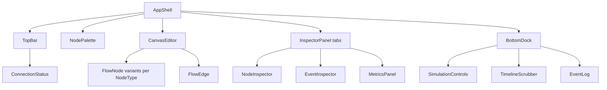

# Components

> **Scope.** The key React components of the DFL web client, mapped to the feature slices in
> canon §4 (`features/canvas`, `features/simulation`, `features/inspector`, `features/catalog`, and
> reusable `components/`). Each entry lists **responsibility**, **key props**, **composition/children**,
> and the **Zustand store(s)** it reads. The design bias is small, composed, reusable presentational
> components fed by a thin container that binds to a store (composition over inheritance — canon
> Frontend Principles). Terms follow the [project Glossary](../01-product/glossary.md).

## 0. Store map (canon §4 `state/`)

| Store | Owns |
|-------|------|
| `canvasStore` | nodes, edges, selection, viewport, dirty flag, connection-validation |
| `simulationStore` | simulationId, status, ordered event timeline, playhead, per-node runtime state, metrics |
| `uiStore` | theme, active inspector tab, palette/inspector collapse, playback speed, onboarding, toasts |
| `realtime` (connection) | SignalR connection, subscription set, reconnect/backfill status |

## 1. Component tree

---

## 2. Shell & feature: `features/canvas`

### CanvasEditor
- **Responsibility.** Owns the React Flow surface: renders nodes/edges from `canvasStore`, handles
  drag-drop from the palette, connection creation with legality validation, selection, pan/zoom,
  minimap. In Run mode it becomes read-only and delegates visual state to the animation layer.
- **Reads store.** `canvasStore` (topology, selection, viewport); `simulationStore` (runtime node
  state + events in Run mode); `uiStore` (mode, reduced-motion).
- **Composition.** Hosts `FlowNode` (via `nodeTypes` map) and `FlowEdge` (via `edgeTypes` map), plus
  React Flow `<MiniMap>`, `<Controls>`, `<Background>`.

| Prop | Type | Description |
|------|------|-------------|
| `mode` | `'design' \| 'run'` | Enables editing (design) or animation-only read-only surface (run) |
| `onSelectNode` | `(nodeId: string) => void` | Bubbles node selection to the inspector container |
| `onSelectEdge` | `(edgeId: string) => void` | Bubbles edge selection |
| `isConnectionValid` | `(conn: Connection) => boolean` | Legality predicate for `NodeType`→`NodeType` links |
| `reducedMotion` | `boolean` | Disables non-essential motion (accessibility) |

### NodePalette
- **Responsibility.** Presents draggable `NodeType`s grouped by concept family (Messaging, Compute,
  Data, Edge/Networking). Each entry is a drag source that creates a `FlowNode` with default `config`.
- **Reads store.** `uiStore` (collapse state, search); does not mutate topology directly — it emits a
  drag payload the canvas consumes.
- **Composition.** `PaletteGroup` → `PaletteItem` (icon + label). Small, list-driven.

| Prop | Type | Description |
|------|------|-------------|
| `groups` | `PaletteGroup[]` | Concept-grouped `NodeType` entries to render |
| `collapsed` | `boolean` | Icon-only rail when true |
| `onDragStart` | `(type: NodeType) => void` | Begins a node-creation drag |
| `filter` | `string` | Search term to narrow the palette |

### FlowNode (variants per NodeType)
- **Responsibility.** Renders one Node on the canvas. A single base `FlowNode` composes a
  variant sub-component chosen by `NodeType` (`ProducerNode`, `ConsumerNode`, `ServiceNode`,
  `ApiGatewayNode`, `LoadBalancerNode`, `ExchangeNode`, `QueueNode`, `TopicNode`, `PartitionNode`,
  `BrokerNode`, `DatabaseNode`, `CacheNode`, `DeadLetterQueueNode`, `ClientNode`). The variant
  supplies iconography, handles, and runtime badges (queue depth, in-flight count, circuit-breaker
  color state). Motion (pulse, color transitions) is driven by events — see
  [animations.md](./animations.md).
- **Reads store.** `simulationStore` (this node's runtime state); `uiStore` (reduced-motion, theme).
- **Composition.** `FlowNode` → `<NodeShell>` (border, selection ring, handles) → variant body →
  `NodeBadge`(s).

| Prop | Type | Description |
|------|------|-------------|
| `id` | `string` | Node id (matches `sourceNodeId`/`targetNodeId` in events) |
| `type` | `NodeType` | Canonical node type selecting the variant |
| `label` | `string` | Display label |
| `config` | `NodeConfig` | Type-specific configuration (design mode) |
| `runtimeState` | `NodeRuntimeState` | Derived counters + status (run mode) |
| `selected` | `boolean` | Selection ring |

### FlowEdge
- **Responsibility.** Renders a directed connection and hosts the traveling **message token** during
  animation. The edge path is the track along which a token animates on `MessagePublished` /
  `MessageRouted` / `MessageReceived`; the edge styles itself for partitions/faults.
- **Reads store.** `simulationStore` (active tokens on this edge, fault state); `uiStore` (reduced-motion).
- **Composition.** `FlowEdge` → React Flow `<BaseEdge>` path + `EdgeLabel` + `MessageToken` (Framer
  Motion) rendered along the path.

| Prop | Type | Description |
|------|------|-------------|
| `id` | `string` | Edge id |
| `sourceNodeId` | `string` | Source node |
| `targetNodeId` | `string` | Target node |
| `label` | `string` | e.g. routing key / binding |
| `activeTokens` | `TokenAnim[]` | Tokens currently traversing (from events) |
| `faultState` | `'none' \| 'latency' \| 'partitioned'` | Fault styling |

---

## 3. Feature: `features/simulation`

### SimulationControls
- **Responsibility.** The transport: Run/Start, Pause, Resume, Stop, and playback speed. Every button
  issues a backend command (`POST /api/v1/simulations/{id}/start|pause|resume|stop`) and reflects
  status only on `SimulationStateChanged` — never optimistically (canon §1).
- **Reads store.** `simulationStore` (status), `uiStore` (playback speed).
- **Composition.** `TransportButton` × N + `SpeedSelect` + `InjectFaultButton`.

| Prop | Type | Description |
|------|------|-------------|
| `status` | `SimulationStatus` | `Draft\|Running\|Paused\|Completed\|Stopped\|Failed` |
| `onStart` / `onPause` / `onResume` / `onStop` | `() => void` | Command dispatchers (REST) |
| `speed` | `number` | Playback speed multiplier |
| `onSpeedChange` | `(x: number) => void` | Adjust rendering pace |

### TimelineScrubber
- **Responsibility.** Visualizes the ordered Timeline by `sequence`/`tick` and supports **Live** and
  **Replay** modes. Scrubbing seeks the playhead; replay re-derives canvas state by folding the ordered
  event history (deterministic, no invented state). Backfills gaps via
  `GET /api/v1/simulations/{id}/events?fromSequence=`.
- **Reads store.** `simulationStore` (timeline, playhead, mode).
- **Composition.** `TimelineTrack` (event density) + `Playhead` + `EventMarker`s (colored by event type).

| Prop | Type | Description |
|------|------|-------------|
| `events` | `SimulationEvent[]` | Ordered timeline |
| `playheadSequence` | `number` | Current playhead position |
| `mode` | `'live' \| 'replay'` | Pin-to-latest vs detached seek |
| `onSeek` | `(sequence: number) => void` | Seek + re-derive snapshot |
| `onReturnToLive` | `() => void` | Re-pin to newest event |

### ConnectionStatus
- **Responsibility.** Surfaces SignalR health (`Live` / `Reconnecting` / `Offline`) and backfill
  progress; a small always-visible indicator in the top bar.
- **Reads store.** `realtime` connection state, `simulationStore` (lastSeenSequence).
- **Composition.** `StatusDot` + label + optional reconnect spinner.

| Prop | Type | Description |
|------|------|-------------|
| `state` | `'connected' \| 'reconnecting' \| 'disconnected'` | Connection state |
| `lastSequence` | `number` | Last event sequence applied |
| `onRetry` | `() => void` | Manual reconnect trigger |

---

## 4. Feature: `features/inspector`

### NodeInspector
- **Responsibility.** Two roles: (design) a validated `config` form driven by the selected Node's
  `type`; (run) a runtime read-out of derived counters (in-flight, processed, dead-lettered,
  circuit-breaker state). Client validation mirrors backend FluentValidation rules.
- **Reads store.** `canvasStore` (selected node + config) in design; `simulationStore` (runtime state)
  in run.
- **Composition.** `InspectorSection` → type-specific `ConfigForm` (`QueueConfigForm`,
  `ServiceConfigForm`, `ExchangeConfigForm`, `TopicConfigForm`, `CacheConfigForm`, ...) or
  `RuntimeCounters`.

| Prop | Type | Description |
|------|------|-------------|
| `node` | `Node` | Selected node |
| `mode` | `'design' \| 'run'` | Config editing vs runtime read-out |
| `onConfigChange` | `(patch: Partial<NodeConfig>) => void` | Persist config edits to `canvasStore` |
| `runtimeState` | `NodeRuntimeState \| null` | Live counters in run mode |

### EventInspector
- **Responsibility.** Renders the full canonical event envelope (canon §6) for the selected
  SimulationEvent and enables pivoting: click `correlationId` to highlight the whole message trace,
  click `sourceNodeId`/`targetNodeId` to focus the node on the canvas.
- **Reads store.** `simulationStore` (selected event).
- **Composition.** `EnvelopeField` rows + `PayloadViewer` (pretty JSON) + `TraceLinks`.

| Prop | Type | Description |
|------|------|-------------|
| `event` | `SimulationEvent` | Selected envelope to display |
| `onHighlightCorrelation` | `(correlationId: string) => void` | Highlight message trace across timeline |
| `onFocusNode` | `(nodeId: string) => void` | Focus/select a node on the canvas |

### MetricsPanel
- **Responsibility.** Displays `MetricSnapshot` data (throughput, avg latency, in-flight, DLQ count,
  retries) as sparklines + KPIs + a per-node breakdown. Sourced from streamed metric events or
  `GET /api/v1/simulations/{id}/metrics`.
- **Reads store.** `simulationStore` (metrics timeline).
- **Composition.** `KpiTile` × N + `Sparkline` + `MetricsTable`.

| Prop | Type | Description |
|------|------|-------------|
| `snapshots` | `MetricSnapshot[]` | Time-series metric snapshots |
| `currentTick` | `number` | Tick for the displayed values |
| `perNode` | `NodeMetricRow[]` | Per-node breakdown rows |

### EventLog
- **Responsibility.** A virtualized, filterable list of the Timeline. Each row shows `sequence`,
  `tick`, `type`, source→target; clicking selects the event (drives EventInspector). Virtualized for
  high-throughput streams (canon Performance).
- **Reads store.** `simulationStore` (timeline, selection).
- **Composition.** Virtualized list → `EventRow` (type color chip + summary).

| Prop | Type | Description |
|------|------|-------------|
| `events` | `SimulationEvent[]` | Ordered timeline |
| `selectedEventId` | `string \| null` | Highlighted row |
| `filter` | `EventTypeFilter` | Filter by event type/node |
| `onSelect` | `(eventId: string) => void` | Select an event |

---

## 5. Feature: `features/catalog`

### CatalogGrid, ConceptCard, CatalogFilters, ScenarioDetailDrawer
- **Responsibility.** `CatalogGrid` renders a virtualized grid of `ConceptCard`s from
  `GET /api/v1/catalog`; `CatalogFilters` provides faceted `conceptTag` filtering; `ConceptCard` shows
  thumbnail + learning objective + tag; `ScenarioDetailDrawer` previews topology and triggers the
  clone (`POST /api/v1/scenarios`).
- **Reads store.** `uiStore` (catalog filters/selection); writes `canvasStore` on clone.
- **Composition.** `CatalogGrid` → `ConceptCard`; `ScenarioDetailDrawer` → `TopologyPreview` + `UseScenarioButton`.

| Component | Key prop | Type | Description |
|-----------|----------|------|-------------|
| `CatalogGrid` | `items` | `CatalogEntry[]` | Concept scenarios to render |
| `ConceptCard` | `entry` | `CatalogEntry` | One card (tag, objective, thumbnail) |
| `CatalogFilters` | `activeTags` | `ConceptTag[]` | Selected facets |
| `ScenarioDetailDrawer` | `onUse` | `(entryId: string) => void` | Clone + navigate to editor |

---

## 6. Reusable primitives: `components/`

Design-system primitives shared across features (see [design-system.md](./design-system.md)):
`Button`, `IconButton`, `Tabs`, `Drawer`, `Toast`, `Tooltip`, `Badge`, `StatusDot`, `Sparkline`,
`KpiTile`, `FormField`, `Select`, `NumberInput`, `JsonViewer`. These are purely presentational, take
no store dependency, and are driven entirely by props so they remain reusable and unit-testable with
Vitest + React Testing Library.

## Related documents

- [Wireframes](./wireframes.md)
- [Screens & Routes](./screens.md)
- [User Flows](./user-flows.md)
- [Design System](./design-system.md)
- [Animations](./animations.md)
