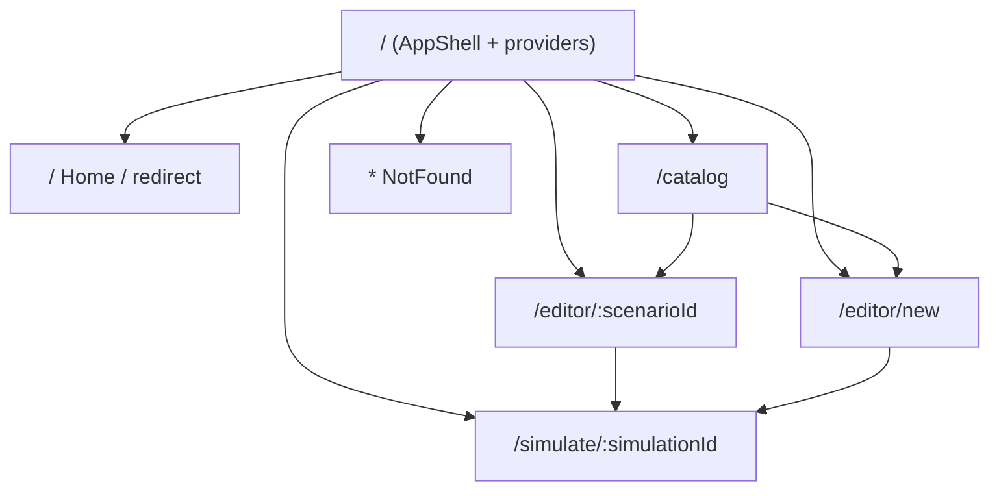

# Screens & Routes

> **Scope.** The complete route map of the DFL web client. Routing lives in `web/src/app/`
> (canon §4) and is implemented with React Router; feature screens are lazy-loaded (canon
> Performance). Terms follow the [project Glossary](../01-product/glossary.md); components are
> defined in [components.md](./components.md); layouts in [wireframes.md](./wireframes.md).

## 1. Route map

## 2. Route table

| Route | Screen | Purpose | Primary components | Entry from | Exit to | Primary persona |
|-------|--------|---------|--------------------|-----------|---------|-----------------|
| `/` | Home / Landing | Orientation + onboarding tour; redirects returning users to `/catalog` | `AppShell`, `OnboardingTour`, `TopBar` | Direct visit | `/catalog`, `/editor/new` | Beginner Developer, Student |
| `/catalog` | Catalog | Browse concept Scenarios grouped by `conceptTag`; clone into an editable Scenario | `CatalogGrid`, `ConceptCard`, `CatalogFilters`, `ScenarioDetailDrawer` | `/`, top bar | `/editor/:scenarioId` | Instructor, all |
| `/editor/new` | Scenario Editor (blank) | Compose a new architecture from an empty canvas | `AppShell`, `CanvasEditor`, `NodePalette`, `NodeInspector` | `/catalog`, top bar "New" | `/editor/:scenarioId` (after save), `/simulate/:simulationId` | Architect, Backend Engineer |
| `/editor/:scenarioId` | Scenario Editor (existing) | Edit topology + node `config` of a saved Scenario | `AppShell`, `CanvasEditor`, `NodePalette`, `NodeInspector` | `/catalog`, `/editor/new` save | `/simulate/:simulationId` | Architect, Backend Engineer |
| `/simulate/:simulationId` | Simulation View | Run/observe a Simulation: animated canvas, timeline, inspection, fault injection | `AppShell`, `CanvasEditor` (run mode), `SimulationControls`, `TimelineScrubber`, `EventInspector`, `EventLog`, `MetricsPanel`, `ConnectionStatus` | `/editor/*` Run action | back to `/editor/:scenarioId`, `/catalog` | All personas |
| `*` | NotFound | Graceful fallback for unknown routes | `NotFound`, `TopBar` | Any bad URL | `/catalog` | All |

## 3. Screen descriptions

### 3.1 Home / Landing — `/`
The entry surface. First-time visitors get the skippable **OnboardingTour** overlay
([user-flows §1](./user-flows.md#1-onboarding)); returning visitors (with the `hasOnboarded` flag in
`uiStore`) are redirected to `/catalog`. No simulation state is created here. It hosts the persistent
`AppShell` and `TopBar` so navigation is immediately available.

### 3.2 Catalog — `/catalog`
The library of concept-focused Scenarios. Loads via `GET /api/v1/catalog`. Faceted filtering by the
canon §13 concepts, virtualized card grid, and a detail drawer whose "Use this scenario" action clones
the template (`POST /api/v1/scenarios`) and routes to the editor. Primary discovery surface for
Instructors assembling lesson material.

### 3.3 Scenario Editor — `/editor/new` and `/editor/:scenarioId`
The **Design mode** of the App Shell ([wireframes §3](./wireframes.md)). `/editor/new` starts from a
blank canvas; `/editor/:scenarioId` hydrates from `GET /api/v1/scenarios/{id}`. Users drag `NodeType`s
from the **NodePalette**, connect Nodes with legal Edges, and edit each Node's type-specific `config`
in the **NodeInspector**. Save persists via `POST`/`PUT /api/v1/scenarios`. The **Run** action creates
a Simulation (`POST /api/v1/simulations`) and navigates to the Simulation View.

### 3.4 Simulation View — `/simulate/:simulationId`
The **Run mode** of the App Shell. Establishes the SignalR connection to `SimulationHub`
(`/hubs/simulation`), calls `Subscribe(simulationId)`, and starts the run. The canvas animates
exclusively from `ReceiveSimulationEvent`/`ReceiveSimulationEvents`. Hosts **SimulationControls**
(pause/resume/stop via the REST lifecycle endpoints), **TimelineScrubber** (live + replay),
**EventLog**, **EventInspector**, **MetricsPanel**, and **ConnectionStatus**. Fault injection
(`POST /api/v1/simulations/{id}/faults`) is launched from here. Editing is locked while `Running`.

### 3.5 NotFound — `*`
A minimal screen inside the shell offering a route back to `/catalog`. No data fetches.

## 4. Navigation & guards

| Guard | Rule |
|-------|------|
| Onboarding redirect | `/` redirects to `/catalog` when `uiStore.hasOnboarded` is true. |
| Editor hydration | `/editor/:scenarioId` blocks render on `GET /api/v1/scenarios/{id}`; a 404 routes to NotFound. |
| Simulation existence | `/simulate/:simulationId` verifies via `GET /api/v1/simulations/{id}`; unknown id routes to NotFound. |
| Dirty-canvas prompt | Leaving `/editor/*` with an unsaved `canvasStore` prompts to save (see [user-flows §10](./user-flows.md#10-saving-a-scenario)). |
| Run lock | While a Simulation is `Running`, editor navigation returns to the read-only topology; structural edits are disabled. |

## 5. Route ↔ store ↔ contract matrix

| Route | Zustand stores | REST | SignalR |
|-------|----------------|------|---------|
| `/catalog` | `uiStore` (filters), `canvasStore` (on clone) | `GET /catalog`, `POST /scenarios` | — |
| `/editor/*` | `canvasStore`, `uiStore` | `GET/POST/PUT/DELETE /scenarios` | — |
| `/simulate/:id` | `simulationStore`, `uiStore`, `canvasStore` (read-only topology) | `POST /simulations`, `.../start|pause|resume|stop`, `.../faults`, `.../events`, `.../metrics` | `Subscribe`, `Unsubscribe`, `ReceiveSimulationEvent(s)`, `SimulationStateChanged` |

## Related documents

- [Wireframes](./wireframes.md)
- [Components](./components.md)
- [User Flows](./user-flows.md)
- [Design System](./design-system.md)
- [Animations](./animations.md)
