# User Flows

> **Scope.** This document describes every end-to-end user flow in the **Distributed Flow Lab (DFL)**
> web client (React 18 + TypeScript + Vite + React Flow + Zustand + Tailwind + Framer Motion +
> `@microsoft/signalr`). Flows reference the canonical REST endpoints (`/api/v1/...`) and the
> `SimulationHub` (`/hubs/simulation`) methods by name. All terminology follows the
> [project Glossary](../01-product/glossary.md): *Scenario*, *Simulation*, *Node*, *Edge*,
> *SimulationEvent*, *Timeline*, *Fault Injection*, *Metric*.

## 0. How to read this document

Each flow lists:

- **Persona** — the primary [persona](../01-product/vision.md) the flow serves.
- **Precondition / Postcondition** — the state before and after.
- **Contracts touched** — REST endpoints and SignalR methods invoked.
- **Zustand stores** — client stores mutated (`canvasStore`, `simulationStore`, `uiStore`).
- A **Mermaid flowchart** for every major flow.

**Golden rule reminder (canon §1).** The backend is the single source of truth. No flow below ever
advances simulation state on the client from a click alone — the client issues a command over REST
or SignalR, and the UI only reflects state once the corresponding **SimulationEvent** or
`SimulationStateChanged` message arrives. Animations are bracketed by the frontend-only
`AnimationStarted` / `AnimationFinished` presentation events (canon §7), never by invented domain state.

---

## 1. Onboarding

**Persona:** Beginner Developer, Engineering Student.
**Precondition:** First visit; no Scenario open.
**Postcondition:** User understands the shell and has opened a Catalog Scenario in the editor.
**Contracts touched:** `GET /api/v1/catalog`.
**Stores:** `uiStore` (onboarding step, theme), `canvasStore` (loaded topology).

Onboarding is a lightweight, skippable overlay tour rendered over the App Shell. It never blocks the
UI and persists a `hasOnboarded` flag in `uiStore` (mirrored to `localStorage`). Its goal is purely
orientational: name the five shell regions (top bar, left palette, center canvas, right inspector,
bottom timeline) and route the user to the Catalog so their first experience is a *working* Scenario,
not an empty canvas.

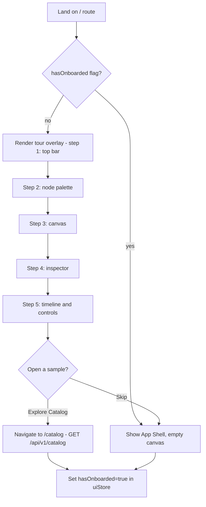

**Educational note.** The tour explains *what the student will learn*: that DFL turns invisible
distributed-systems behavior (queues filling, retries, dead-lettering, circuit breakers tripping)
into observable motion.

---

## 2. Browsing the Catalog

**Persona:** All personas; especially Instructor selecting teaching material.
**Precondition:** Authenticated session, shell loaded.
**Postcondition:** A Catalog Scenario is chosen and instantiated as an editable Scenario on the canvas.
**Contracts touched:** `GET /api/v1/catalog`, then `POST /api/v1/scenarios` (clone into a working Scenario)
or direct load of a template into `canvasStore`.
**Stores:** `catalog` slice of `uiStore` (filters, selection), `canvasStore` (loaded nodes/edges).

The Catalog lists concept-focused Scenarios grouped by the concepts in canon §13 (RabbitMQ, Kafka,
Redis, REST, gRPC, Cache, Retry, DLQ, CQRS, Saga, Event Sourcing, Circuit Breaker, Pub/Sub, API
Gateway). Each card exposes the `conceptTag`, a short learning objective, and a preview thumbnail of
the topology.

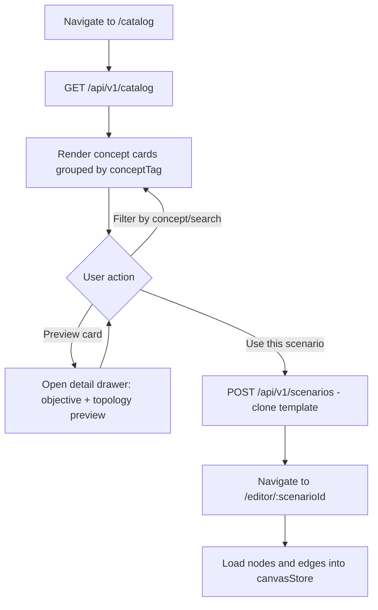

---

## 3. Creating / Editing a Scenario on the Canvas

**Persona:** Backend Engineer, Software Architect.
**Precondition:** An empty canvas (`/editor/new`) or an existing Scenario (`/editor/:scenarioId`).
**Postcondition:** A valid topology of Nodes and Edges exists in `canvasStore`, ready to configure and simulate.
**Contracts touched:** `GET /api/v1/scenarios/{id}` (edit existing); no write until the Save flow (§10).
**Stores:** `canvasStore` (nodes, edges, selection, viewport).

Editing is entirely client-side until saved — the canvas is a React Flow surface driven by
`canvasStore`. Users drag a `NodeType` from the **NodePalette** onto the canvas, then connect Nodes
by dragging from a source handle to a target handle to create an **Edge**. Edge creation is validated
against connection rules (e.g. a `Producer` may connect to an `Exchange` or `Topic`, a `Queue` may
connect to a `Consumer`, a `Queue` may connect to a `DeadLetterQueue`).

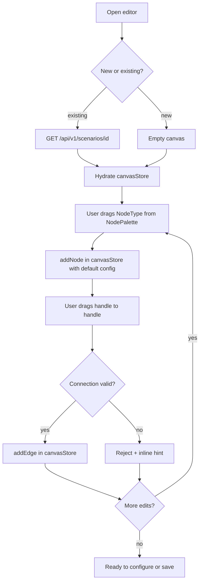

**Validation.** Connection legality mirrors backend `NodeType` semantics so a Scenario that renders
is a Scenario that can simulate. Invalid connections are rejected before entering `canvasStore` (no
dead edges — canon "no dead code" applied to data).

---

## 4. Configuring a Node

**Persona:** Backend Engineer, Software Architect, Instructor.
**Precondition:** A Node is selected on the canvas.
**Postcondition:** The Node's type-specific `config` is updated in `canvasStore`.
**Contracts touched:** none (local edit, persisted on Save §10).
**Stores:** `canvasStore` (selected node config), `uiStore` (inspector tab).

Selecting a Node opens the **NodeInspector** in the right panel. The inspector renders a form driven
by the Node's `type`. Examples of type-specific `config`:

- `Queue` — max length, DLX target, per-message TTL, prefetch.
- `Exchange` — exchange type (direct/topic/fanout), bindings/routing keys.
- `Topic` — partition count, retention.
- `Service` — processing latency distribution, failure rate, retry policy, circuit-breaker thresholds.
- `Cache` — eviction policy, TTL, capacity.

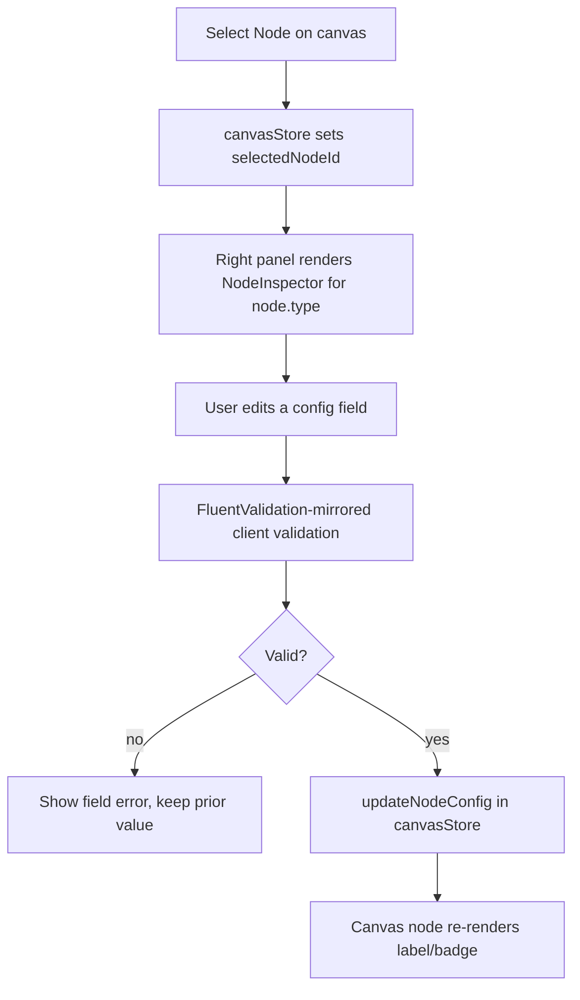

---

## 5. Starting a Simulation

**Persona:** All personas.
**Precondition:** A valid, saved (or auto-saved) Scenario is loaded.
**Postcondition:** A **Simulation** exists in `Running` status; the client is subscribed to its SignalR group.
**Contracts touched:** `POST /api/v1/simulations` (create from `scenarioId`) → `POST /api/v1/simulations/{id}/start`;
SignalR `Subscribe(simulationId)`, then `SimulationStateChanged`, then `ReceiveSimulationEvent` /
`ReceiveSimulationEvents`.
**Stores:** `simulationStore` (simulationId, status, events, tick), `realtime` connection state.

The client creates a Simulation, opens/reuses the `SimulationHub` connection, joins the per-`simulationId`
group via `Subscribe`, and only then issues `start`. This ordering guarantees no early events are
missed; any gap in `sequence` triggers a backfill via `GET /api/v1/simulations/{id}/events?fromSequence=`.

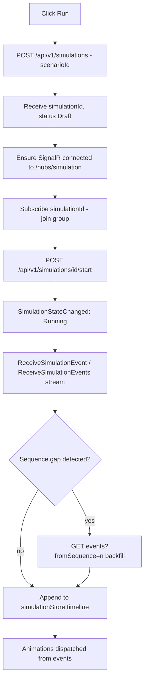

---

## 6. Watching Animated Events

**Persona:** All personas; core learning moment.
**Precondition:** Simulation is `Running`; SignalR stream is active.
**Postcondition:** The canvas animates continuously, faithfully reflecting the event stream.
**Contracts touched:** SignalR `ReceiveSimulationEvent`, `ReceiveSimulationEvents`.
**Stores:** `simulationStore` (event buffer, per-node visual state), `uiStore` (playback speed).

Incoming SimulationEvents are appended to the timeline and pushed into an animation dispatcher. The
dispatcher maps each backend event `type` to a visual (token travel along an Edge, node pulse, DLQ
drop, retry loop, circuit-breaker color state) and emits frontend-only `AnimationStarted` /
`AnimationFinished` markers so the UI can bracket and, if needed, throttle rendering. See
[animations.md](./animations.md) for the full event→animation mapping.

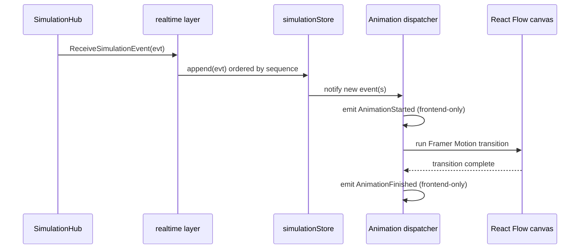

**Performance (canon §Performance).** Under high throughput the server uses
`ReceiveSimulationEvents` batches; the client coalesces animations per frame and virtualizes the
EventLog to avoid unnecessary renders.

---

## 7. Inspecting an Event / Node

**Persona:** Backend Engineer, Software Architect, Instructor, Student.
**Precondition:** Simulation is running, paused, or completed with a populated timeline.
**Postcondition:** The user has read the full envelope of a SimulationEvent or the live state of a Node.
**Contracts touched:** none live (data already in `simulationStore`); optional
`GET /api/v1/simulations/{id}/events?fromSequence=` for deep history.
**Stores:** `simulationStore` (selected event, node runtime state), `uiStore` (inspector tab).

Clicking a row in the **EventLog** selects that SimulationEvent and opens the **EventInspector**,
which shows the full canonical envelope (`eventId`, `sequence`, `tick`, `occurredAt`, `type`,
`sourceNodeId`, `targetNodeId`, `correlationId`, `traceId`, `payload`). Selecting the `correlationId`
highlights every event for that Message across the timeline (message-centric trace). Clicking a Node
opens the **NodeInspector** in runtime mode, showing live counters derived from events (in-flight,
processed, dead-lettered, circuit-breaker state).

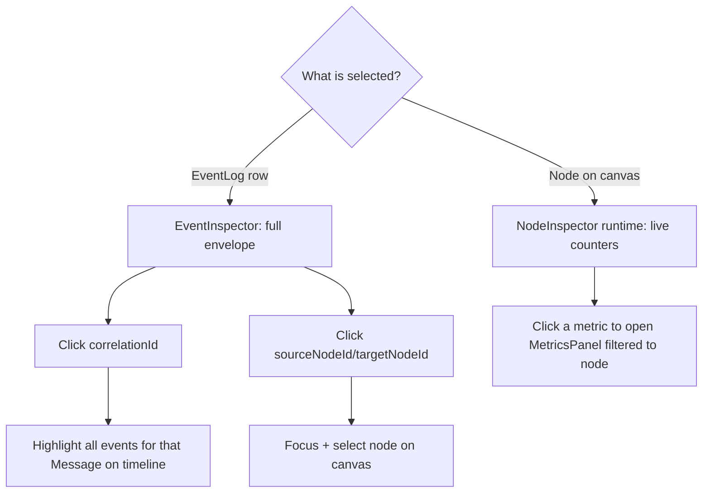

---

## 8. Injecting a Fault

**Persona:** Software Architect, Instructor (teaching failure behavior).
**Precondition:** Simulation is `Running` or `Paused`.
**Postcondition:** A fault is active; the backend emits the corresponding fault events which then animate.
**Contracts touched:** `POST /api/v1/simulations/{id}/faults`; resulting SignalR events
`FaultInjected`, `LatencyInjected`, `PartitionCreated`, `PartitionHealed`, plus downstream
consequences (`NodeFailed`, `HttpRequestTimedOut`, `CircuitBreakerOpened`, `DeadLettered`, ...).
**Stores:** `simulationStore` (active faults, node state), `uiStore` (fault dialog).

Fault Injection is a *command*, never a client-side state change. The user picks a target Node/Edge
and a fault kind (node crash, added latency, network partition, drop rate). The client POSTs the
fault; the UI reacts only when the backend echoes `FaultInjected` and the ensuing domain events.

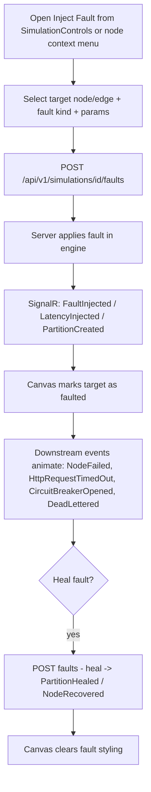

**Educational note.** This is the highest-value learning flow: the student sees, in motion, how a
single injected partition cascades into timeouts, retries, dead-lettering, and a tripped circuit breaker.

---

## 9. Pausing / Replaying via the Timeline

**Persona:** All personas; especially Instructor pacing a lesson.
**Precondition:** A Simulation with a populated Timeline (`Running`, `Paused`, or `Completed`).
**Postcondition:** Live playback is paused/resumed, or the user scrubs to any past `tick`/`sequence`.
**Contracts touched:** `POST /api/v1/simulations/{id}/pause`, `POST /api/v1/simulations/{id}/resume`,
`POST /api/v1/simulations/{id}/stop`; `GET /api/v1/simulations/{id}/events?fromSequence=` for replay
seeking; SignalR `SimulationStateChanged`.
**Stores:** `simulationStore` (playhead sequence, mode: live | replay), `uiStore` (playback speed).

Pause/Resume/Stop are backend commands; the UI transitions only on `SimulationStateChanged`. The
**TimelineScrubber** supports two modes: **Live** (playhead pinned to the newest event) and **Replay**
(playhead detached; the client re-derives canvas visual state deterministically from the ordered
event history up to the selected `sequence`). Because state is a pure function of the ordered events,
replay never invents state (canon §1).

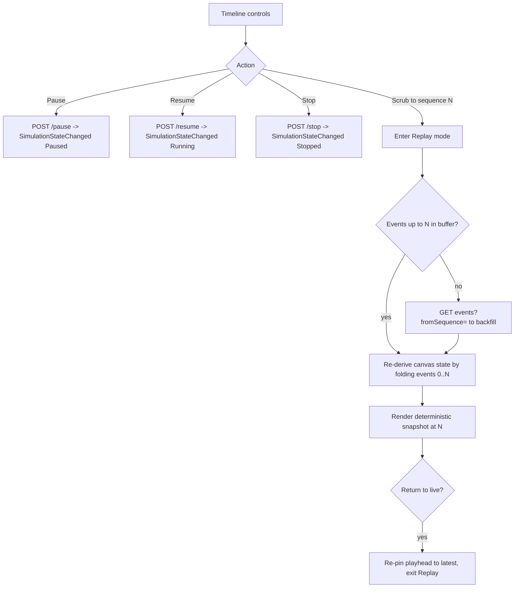

---

## 10. Saving a Scenario

**Persona:** Backend Engineer, Software Architect, Instructor.
**Precondition:** Edited topology/config in `canvasStore`.
**Postcondition:** The Scenario is persisted; a stable `scenarioId` exists.
**Contracts touched:** `POST /api/v1/scenarios` (first save) or `PUT /api/v1/scenarios/{id}` (update);
optionally `DELETE /api/v1/scenarios/{id}`.
**Stores:** `canvasStore` (dirty flag → clean), `uiStore` (save toast).

Save serializes the canvas graph into the canonical **Scenario** shape (`{ id, name, description,
conceptTag, nodes[], edges[], createdAt, updatedAt }`). New Scenarios POST and receive an `id`;
existing ones PUT. Client-side validation mirrors the backend FluentValidation rules to fail fast.

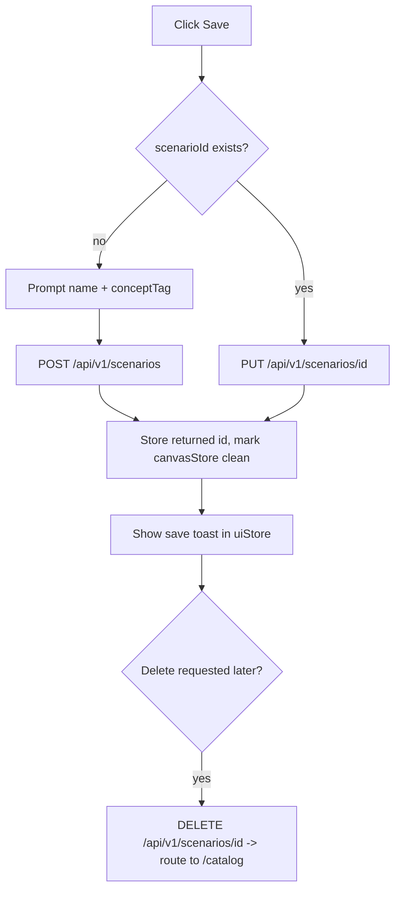

---

## 11. Cross-cutting: connection resilience

Every flow that streams events depends on the `realtime` layer. On disconnect, **ConnectionStatus**
surfaces the state; the client auto-reconnects, re-issues `Subscribe(simulationId)`, and backfills
missed events via `GET /api/v1/simulations/{id}/events?fromSequence=<lastSeenSequence>` so the timeline
has no gaps. No animation is replayed twice: dedup is by `eventId` / `sequence`.

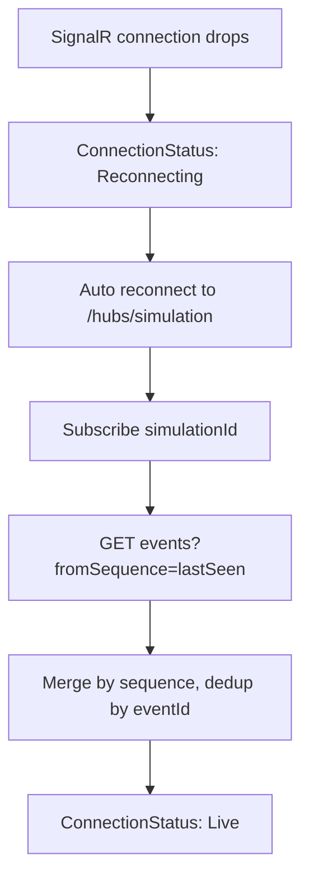

## Related documents

- [Wireframes](./wireframes.md)
- [Screens & Routes](./screens.md)
- [Components](./components.md)
- [Design System](./design-system.md)
- [Animations](./animations.md)
- [Product Vision](../01-product/vision.md)
- [Event Model](../02-architecture/event-model.md)
