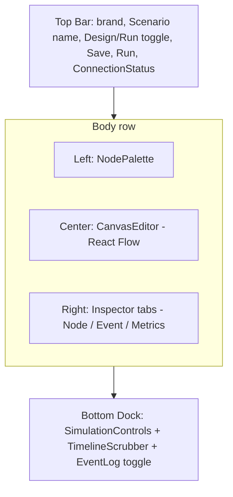
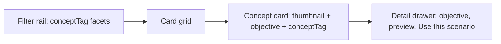
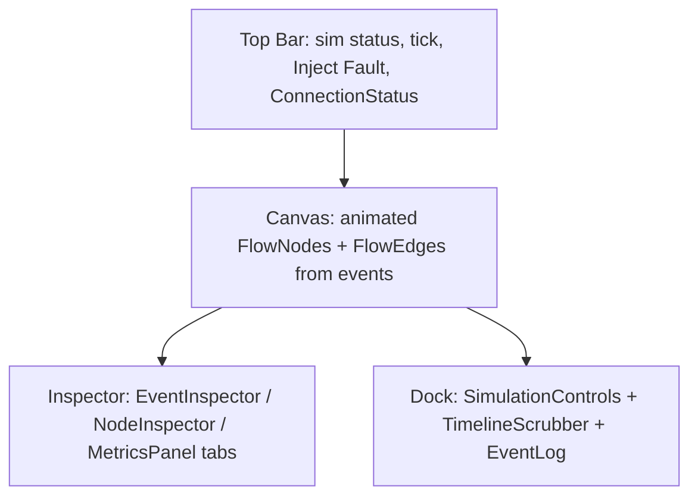

# Wireframes

> **Scope.** Low-fidelity layout sketches for every DFL screen. These are structural blueprints
> (regions and their purpose), not visual comps — colors, type, and spacing live in
> [design-system.md](./design-system.md); motion lives in [animations.md](./animations.md). All
> region names map to the React components in [components.md](./components.md) and the routes in
> [screens.md](./screens.md). Terminology follows the [project Glossary](../01-product/glossary.md).

## 1. The App Shell

The shell is a fixed five-region frame. The center **canvas** is the only region that scrolls/pans;
the surrounding rails are fixed-width and collapsible. This layout is stable across the Editor and
Simulation views so the user's mental model never shifts — only the *content* of the rails changes
between "design" and "run" modes.

```
+--------------------------------------------------------------------------------------+
|  TOP BAR  (logo | Scenario name | mode toggle: Design/Run | Save | Run | ConnStatus) |
+-----------+--------------------------------------------------+-----------------------+
|           |                                                  |                       |
|  LEFT     |                                                  |   RIGHT               |
|  PALETTE  |                CENTER CANVAS                     |   INSPECTOR           |
|           |                (React Flow surface)              |                       |
|  NodeType |                                                  |   NodeInspector /     |
|  groups   |     [Producer]---->[Exchange]---->[Queue]        |   EventInspector /    |
|  drag     |                         |            |           |   MetricsPanel        |
|  source   |                         v            v           |   (tabbed)            |
|           |                    [DLQ]        [Consumer]        |                       |
|  (collap- |                                                  |   (collapsible)       |
|   sible)  |                          [minimap]  [zoom ctrls] |                       |
+-----------+--------------------------------------------------+-----------------------+
|  BOTTOM DOCK: SimulationControls  |  TimelineScrubber  |  EventLog toggle            |
+--------------------------------------------------------------------------------------+
```



### Region purposes

| Region | Purpose | Primary components |
|--------|---------|--------------------|
| Top bar | Identity, mode switch (Design vs Run), global actions (Save, Run), live connection health | `TopBar`, `ConnectionStatus` |
| Left palette | Source of draggable `NodeType`s grouped by concept; collapsible to reclaim canvas | `NodePalette` |
| Center canvas | The React Flow editing/animation surface; the single source of spatial truth | `CanvasEditor`, `FlowNode`, `FlowEdge` |
| Right inspector | Context panel: node config (design), event/node runtime (run), metrics | `NodeInspector`, `EventInspector`, `MetricsPanel` |
| Bottom dock | Playback transport, timeline scrubbing, event log access | `SimulationControls`, `TimelineScrubber`, `EventLog` |

---

## 2. Catalog Screen (`/catalog`)

A responsive grid of concept cards. Left filter rail narrows by `conceptTag` (canon §13); each card
states a learning objective and a topology preview. Selecting a card opens a detail drawer with a
"Use this scenario" action that clones the template (see [user-flows §2](./user-flows.md#2-browsing-the-catalog)).

```
+--------------------------------------------------------------------------------------+
|  TOP BAR (brand | "Catalog" | search box .................. | New Scenario | theme) |
+-----------+--------------------------------------------------------------------------+
|  FILTERS  |   [ RabbitMQ ]   [ Kafka ]     [ Redis ]      [ REST ]                    |
|           |   +-----------+  +-----------+  +-----------+                             |
|  Concept  |   | thumbnail |  | thumbnail |  | thumbnail |                             |
|  tags:    |   | Fanout    |  | Consumer  |  | Cache-    |   ... grid continues ...    |
|  [x]Queue |   | Pub/Sub   |  | Groups    |  | Aside     |                             |
|  [ ]Kafka |   | objective |  | objective |  | objective |                             |
|  [ ]Saga  |   +-----------+  +-----------+  +-----------+                             |
|  [ ]...    |                                                                          |
|           |   [ Saga ]      [ Circuit Breaker ]  [ DLQ ]  [ API Gateway ] ...         |
+-----------+--------------------------------------------------------------------------+
```



**Region purposes:** the filter rail is faceted, multi-select, and reflects counts; the grid is
virtualized for large catalogs (canon Performance); the detail drawer previews the topology before
committing to a clone.

---

## 3. Scenario Editor (`/editor/:scenarioId`, `/editor/new`) — Design mode

Design mode of the shell. The palette is expanded, the inspector shows the **NodeInspector** in config
mode, and the bottom dock's transport is disabled until a Simulation is created (the **Run** button is
the enabled affordance).

```
+--------------------------------------------------------------------------------------+
|  TOP BAR   [Design | Run]   Scenario: "Order Pipeline"        [Save]   [ Run > ]      |
+-----------+--------------------------------------------------+-----------------------+
| PALETTE   |  canvas grid............................         | NODE INSPECTOR        |
| Messaging |     (Producer)                                   | Type: Queue           |
|  Producer |         \                                        | Label: orders.q       |
|  Exchange |          v                                       | Max length: [ 1000 ]  |
|  Queue    |     (Exchange:topic)                             | DLX -> [ orders.dlq ] |
|  DLQ      |        /        \                                | TTL ms: [ 30000 ]     |
| Compute   |       v          v                               | Prefetch: [ 10 ]      |
|  Service  |   (Queue)      (Queue)                           |                       |
|  Consumer |      |            |                              | (validation inline)   |
| Data      |      v            v                              |                       |
|  Database |  (Consumer)   (DLQ)                              |                       |
|  Cache    |                                                  |                       |
+-----------+------------------------------[minimap][+/-]------+-----------------------+
|  Transport (disabled until Run)   |   Timeline (empty)   |   Event Log (empty)       |
+--------------------------------------------------------------------------------------+
```

**Region purposes:** palette groups mirror the canon `NodeType` families (Messaging, Compute, Data,
Edge/Networking); dragging a type instantiates a `FlowNode` with default `config`; connecting handles
creates a `FlowEdge` only if the connection is legal; the inspector edits the selected node's
type-specific `config`.

---

## 4. Simulation View (`/simulate/:simulationId`) — Run mode

Same shell, run mode. The palette collapses (editing is locked while a Simulation is `Running`), the
canvas animates from the event stream, the inspector defaults to **EventInspector**/**MetricsPanel**,
and the bottom dock's transport and timeline are live.

```
+--------------------------------------------------------------------------------------+
|  TOP BAR  [Design | Run]  Sim #a90 - Running - tick 17     [Inject Fault] [* Live]   |
+---+----------------------------------------------------------+-----------------------+
| < |   (Producer)  ==token==>  (Exchange)                     | EVENT INSPECTOR       |
| p |                              ||                           | type: DeadLettered    |
| a |                              vv                           | seq: 42  tick: 17     |
| l |   (Queue: 8 in-flight) ==x==> (Consumer: circuit OPEN)    | source: queue-1       |
| e |            |                                              | target: dlq-1         |
| t |            v (drop)                                       | correlationId: msg-8f |
| e |         (DLQ: 3)                                          | payload: {...}        |
| . |                                                          | [Metrics tab]         |
+---+----------------------------------------------------------+-----------------------+
|  [<<][ Pause ][ Stop ]  speed[1x v]  | Timeline |====o========| tick 17/120 | Log ^  |
+--------------------------------------------------------------------------------------+
```



**Region purposes:** the canvas shows tokens traveling edges, node pulses, DLQ drops, and
circuit-breaker color states; the inspector reflects the currently selected event or node; the dock
drives pause/resume/stop and timeline scrubbing (see [user-flows §6–§9](./user-flows.md)).

---

## 5. Inspector (right rail, tabbed)

The inspector is a single tabbed rail with three tabs. Only the relevant tab is emphasized per mode,
but all remain reachable.

```
+-----------------------------+
| [ Node ] [ Event ] [Metrics]|   <- tabs
+-----------------------------+
|  NODE tab (design/runtime): |
|   - type + label            |
|   - config form (design)    |
|   - live counters (runtime) |
|       in-flight, processed, |
|       dead-lettered, CB state|
+-----------------------------+
|  EVENT tab:                 |
|   full envelope fields:     |
|   eventId, sequence, tick,  |
|   occurredAt, type,         |
|   sourceNodeId, targetNodeId|
|   correlationId, traceId,   |
|   payload (pretty JSON)     |
+-----------------------------+
|  METRICS tab: see section 6 |
+-----------------------------+
```

**Region purposes:** the Node tab is the config surface in Design mode and a runtime read-out in Run
mode; the Event tab renders the canonical envelope (canon §6) and lets the user pivot by
`correlationId`/`traceId`; the Metrics tab embeds the MetricsPanel.

---

## 6. Metrics Panel

Embedded in the inspector's Metrics tab and optionally poppable into the bottom dock. Sources come
from `MetricSnapshot` (canon §10): throughput, avg latency, in-flight, DLQ count, retries — either
streamed via events or fetched from `GET /api/v1/simulations/{id}/metrics`.

```
+-----------------------------------------+
|  METRICS  (tick 17)          [pop out ^]|
+-----------------------------------------+
|  Throughput   ▁▂▄▆█▆▄  128 msg/s        |
|  Avg latency  ▁▁▂▃▂▁    42 ms           |
|  In-flight    ███       8               |
|  DLQ count    ██        3               |
|  Retries      █         1               |
+-----------------------------------------+
|  [ per-node breakdown table ]           |
|   node        thru  lat  inflt  dlq     |
|   queue-1     128   42   8      3       |
|   consumer-1   90   55   2      -       |
+-----------------------------------------+
```

**Region purposes:** compact sparklines for time-series trends, big-number KPIs for current values,
and a per-node breakdown table; every value is derived from persisted/streamed metrics, never invented.

---

## 7. Responsive & collapse behavior

| Breakpoint | Behavior |
|------------|----------|
| Wide (≥1280px) | All five regions visible; rails at default width. |
| Medium (≥1024px) | Palette collapses to icon rail; inspector remains; dock full. |
| Narrow (<1024px) | Palette and inspector become slide-over drawers; canvas is primary; dock condenses to transport + timeline. |

The canvas always retains focus priority. Collapsing a rail never removes access — it becomes an
overlay toggled from the top bar.

## Related documents

- [Screens & Routes](./screens.md)
- [Components](./components.md)
- [User Flows](./user-flows.md)
- [Design System](./design-system.md)
- [Animations](./animations.md)
