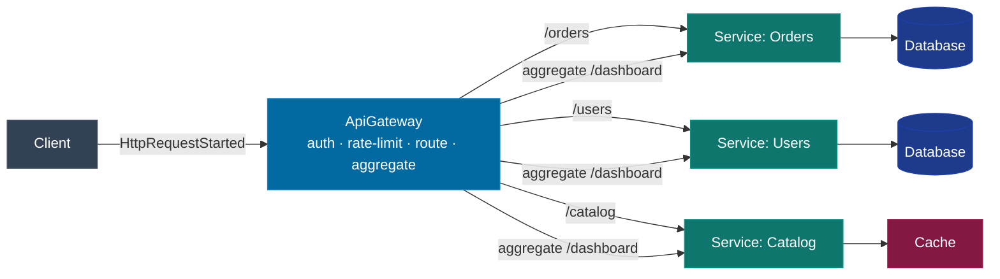
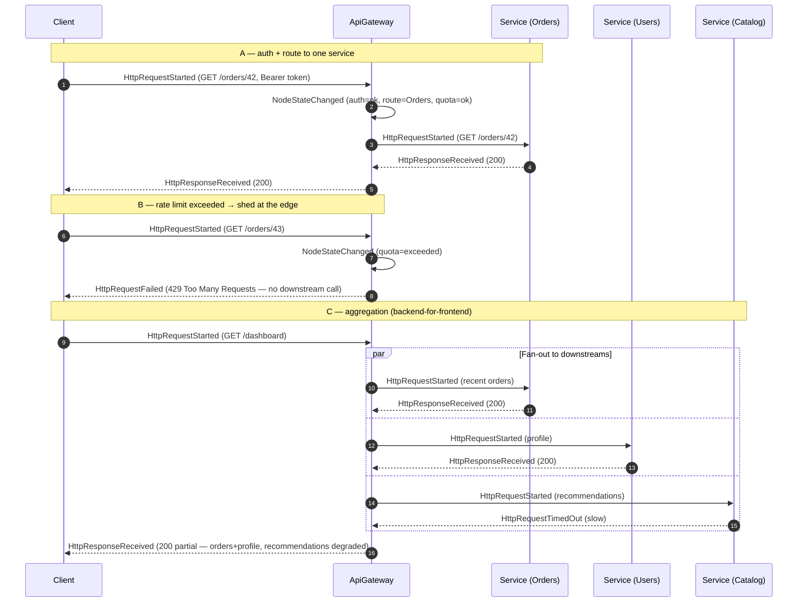

# API Gateway

## Educational Objective

*What should the student learn?*

After running this scenario a learner should be able to:

1. **State the purpose.** An **API Gateway** is a single entry point that sits in front of many
   backend `Service`s, giving clients one stable address while hiding the internal topology.
2. **Enumerate the cross-cutting responsibilities** the gateway centralizes so that individual
   services need not re-implement them:
   - **Routing** — map an inbound path/host to the correct downstream `Service`.
   - **Aggregation** — fan a single client request out to several services and compose one
     response (the backend-for-frontend pattern).
   - **Authentication / authorization** — validate credentials once at the edge; reject
     unauthenticated calls before they reach any service.
   - **Rate limiting** — protect downstreams by shedding load that exceeds a quota.
3. **Trace an edge request end-to-end.** Follow `HttpRequestStarted` at the client, through the
   gateway, to one or more downstream services and back via `HttpResponseReceived`.
4. **Reason about the trade-off.** Recognize that the gateway removes duplication and centralizes
   policy, but is also a **single point of failure** and a potential latency/bottleneck point —
   motivating resilience patterns like the [Circuit Breaker](./circuit-breaker.md) *inside* it.

This builds on [REST](./rest.md) and composes with [Circuit Breaker](./circuit-breaker.md).

## Architecture

A `Client` sends all traffic to an `ApiGateway` node, which applies auth, rate limiting, and
routing, then forwards to the appropriate downstream `Service`(s). An aggregation route fans out
to several services and composes the result. Per-route circuit breakers guard each downstream.

| Node | `NodeType` | Role |
|------|-----------|------|
| Client | `Client` | Sends all requests to the gateway's single entry point. |
| ApiGateway | `ApiGateway` | Authenticates, rate-limits, routes, and aggregates. Applies per-route policies. |
| Orders / Users / Catalog | `Service` | Downstream microservices behind the gateway. |
| Database | `Database` | Per-service persistence. |
| Cache | `Cache` | Optional read cache (e.g. for the Catalog service). |

The gateway is a first-class canonical `ApiGateway` node type (canon §5). It differs from a
`LoadBalancer` (which distributes identical requests across replicas of *one* service): the
gateway is **content-aware**, routing by path/host and composing responses across *different*
services.

## Flow

Canonical events only. The diagram shows (A) an authenticated, routed single request, (B) a
rate-limited rejection, and (C) an aggregation request fanning out to three services.

Two teaching points are visible on the timeline: a rate-limited request produces
`HttpRequestFailed (429)` with **no** downstream `HttpRequestStarted` (load is shed at the edge),
and an aggregation composes a **partial** response when one downstream times out — the gateway
degrades gracefully rather than failing the whole request.

## Visual Behavior

All animation is backend-event-driven; see [UI Animations](../03-ui/animations.md).

| Backend event | Animation |
|---------------|-----------|
| `HttpRequestStarted` (client→gateway) | A request token travels Client→ApiGateway and pauses at the gateway's policy "gate". |
| `NodeStateChanged` (auth/quota) | The gateway node shows a policy stamp: green shield (auth ok), amber meter (quota near limit), red (rejected). |
| `HttpRequestStarted` (gateway→service) | On a pass, the token forwards along the matched route edge, which is highlighted with its path label. |
| `HttpResponseReceived` | The token returns green through the gateway to the client. |
| `HttpRequestFailed (401/403)` | An auth-rejected token bounces back at the gateway; no downstream edge lights up. |
| `HttpRequestFailed (429)` | A rate-limited token bounces at the gateway with a "quota" glyph; the gateway's rate meter is full. |
| aggregation fan-out | A single inbound token **splits** into N parallel sub-request tokens at the gateway; they rejoin into one response token, which is tinted amber if any sub-request failed/timed out (partial response). |
| `HttpRequestTimedOut` (downstream) | The timed-out sub-request token greys out; the composed response shows a "degraded" marker. |
| `CircuitBreakerOpened` (per route) | A guarded downstream edge is severed and its route badge turns red (see [Circuit Breaker](./circuit-breaker.md)). |

The gateway's policy gate (auth shield + rate meter) and the split/rejoin of aggregation tokens
are the signature visuals, making "one entry point, many responsibilities" legible at a glance.

## Simulation

**What DFL simulates.** A content-aware gateway that authenticates, rate-limits, routes by path,
and aggregates responses across multiple downstream `Service`s, with optional per-route circuit
breakers.

**Configurable parameters:**

| Parameter | Type | Default | Meaning |
|-----------|------|---------|---------|
| `routes` | map path→service | `{ /orders:Orders, /users:Users, /catalog:Catalog }` | Routing table. |
| `aggregationRoutes` | map path→service list | `{ /dashboard:[Orders,Users,Catalog] }` | Fan-out/compose routes. |
| `authRequired` | bool | `true` | Whether requests must carry a valid token. |
| `invalidTokenRate` | float `0..1` | `0.0` | Share of requests with a bad/missing token (drives 401/403). |
| `rateLimitPerTick` | int | `5` | Requests admitted per tick before shedding (429). |
| `requestRatePerTick` | int | `4` | Requests the client sends per tick. |
| `downstreamLatencyMs` | map service→int | `{}` | Per-service latency; large values cause `HttpRequestTimedOut`. |
| `perRouteCircuitBreaker` | bool | `false` | Attach a [Circuit Breaker](./circuit-breaker.md) per downstream route. |

**Emitted `SimulationEvent`s** (canonical): `SimulationStarted`, `TickAdvanced`,
`HttpRequestStarted`, `HttpResponseReceived`, `HttpRequestFailed`, `HttpRequestTimedOut`,
`NodeStateChanged`, `NodeFailed`, `NodeRecovered`, `CircuitBreakerOpened`,
`CircuitBreakerHalfOpened`, `CircuitBreakerClosed`, `CacheHit`, `CacheMiss`, `SimulationCompleted`.

## Failure Scenarios

Injected via `POST /api/v1/simulations/{id}/faults`.

1. **Rate-limit shedding.** Set `requestRatePerTick > rateLimitPerTick`. Excess requests return
   `HttpRequestFailed (429)` at the edge with no downstream call. *Lesson:* the gateway protects
   downstreams by shedding load early.
2. **Auth rejection.** Raise `invalidTokenRate`. Bad-token requests fail with 401/403 at the
   gateway. *Lesson:* centralized auth stops unauthenticated traffic before it costs downstream
   resources.
3. **Downstream timeout in aggregation.** Inject `LatencyInjected` on one aggregated service so it
   emits `HttpRequestTimedOut`. The gateway returns a partial/degraded response. *Lesson:*
   aggregation must tolerate partial failure.
4. **Gateway outage (single point of failure).** Fail the `ApiGateway` (`NodeFailed`). All client
   traffic fails regardless of downstream health. *Lesson:* the gateway concentrates risk;
   it must be redundant.
5. **Failing downstream with per-route breaker.** Enable `perRouteCircuitBreaker` and fail one
   service; its breaker opens (`CircuitBreakerOpened`) while other routes stay healthy.
   *Lesson:* per-route isolation prevents one bad dependency from degrading the whole gateway.

## Metrics

From `GET /api/v1/simulations/{id}/metrics` as [`MetricSnapshot`](../02-architecture/event-model.md).

| `MetricSnapshot` field | Meaning in this scenario |
|------------------------|--------------------------|
| `tick` | Snapshot logical clock. |
| `throughput` | Client requests fully answered (`HttpResponseReceived` to client) per tick. |
| `avgLatencyMs` | End-to-end latency client→gateway→downstream→client; aggregation latency is the max of its fan-out legs. |
| `inFlight` | Requests in progress across the gateway and downstreams. |
| `dlqCount` | Not central; remains 0 unless combined with a messaging path. |
| `retries` | Retries within any per-route breaker/retry policy. |

Derived teaching measures: **rejection breakdown** (401/403 vs 429 vs downstream 5xx), **shed
ratio** (429 ÷ inbound), **partial-response ratio** (aggregations answered with a degraded leg),
and **per-route latency**.

## Acceptance Criteria

- **Given** `routes = { /orders:Orders }` and a valid token, **when** the client calls
  `GET /orders/42`, **then** the gateway emits `NodeStateChanged (auth=ok, route=Orders)`, a
  downstream `HttpRequestStarted` to Orders, and returns `HttpResponseReceived (200)` to the
  client.
- **Given** `rateLimitPerTick = 5` and 8 requests arrive in one tick, **when** the quota is
  exceeded, **then** exactly 3 requests return `HttpRequestFailed (429)` **without** any
  corresponding downstream `HttpRequestStarted`.
- **Given** `authRequired = true` and a request with an invalid token, **when** it reaches the
  gateway, **then** it returns `HttpRequestFailed (401/403)` and no downstream edge is traversed.
- **Given** an aggregation route `/dashboard` where one downstream emits `HttpRequestTimedOut`,
  **when** the request completes, **then** the gateway returns a single `HttpResponseReceived`
  marked partial/degraded, and the client renders the composed response from the successful legs.
- **Given** `perRouteCircuitBreaker = true` and one downstream fails repeatedly, **when** its
  breaker trips, **then** `CircuitBreakerOpened` is emitted for that route only, and requests to
  other routes continue to succeed.

## Future Improvements

- **Gateway redundancy + load balancer** — place a `LoadBalancer` in front of multiple
  `ApiGateway` replicas to remove the single point of failure.
- **Response caching at the edge** — cache idempotent GET responses in the gateway, emitting
  `CacheHit`/`CacheMiss`, tying into [Cache](./cache.md).
- **Request transformation & versioning** — model header/version rewriting and canary routing to
  a new service version.
- **Token-bucket vs sliding-window rate limits** — offer multiple rate-limit algorithms and
  visualize their differing burst behavior.

## Related documents

- [REST](./rest.md)
- [Circuit Breaker](./circuit-breaker.md)
- [Pub/Sub](./pubsub.md)
- [Cache](./cache.md)
- [Event Model](../02-architecture/event-model.md)
- [UI Animations](../03-ui/animations.md)
- [Learning: Resilience Patterns](../06-learning/architectural-patterns.md)
- [Glossary](../01-product/glossary.md)
