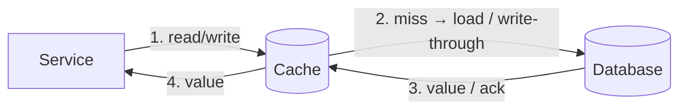
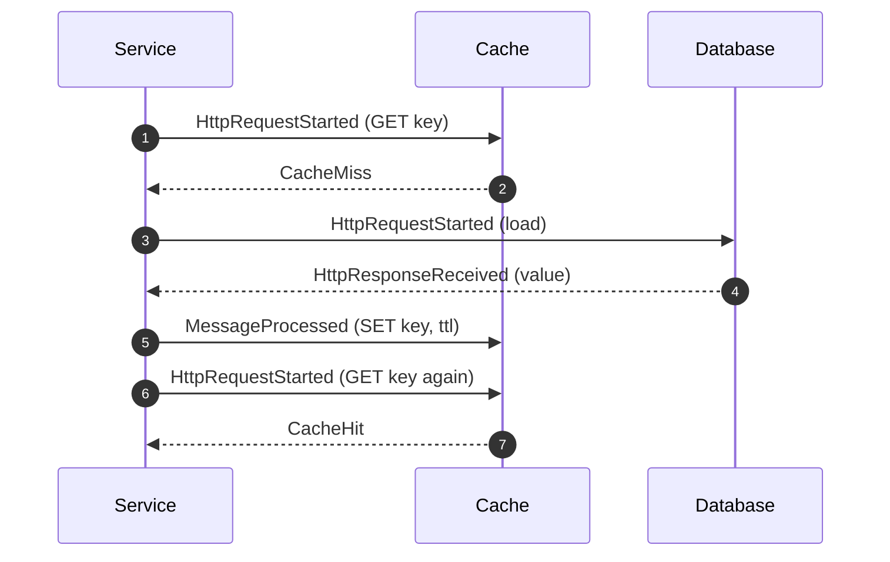
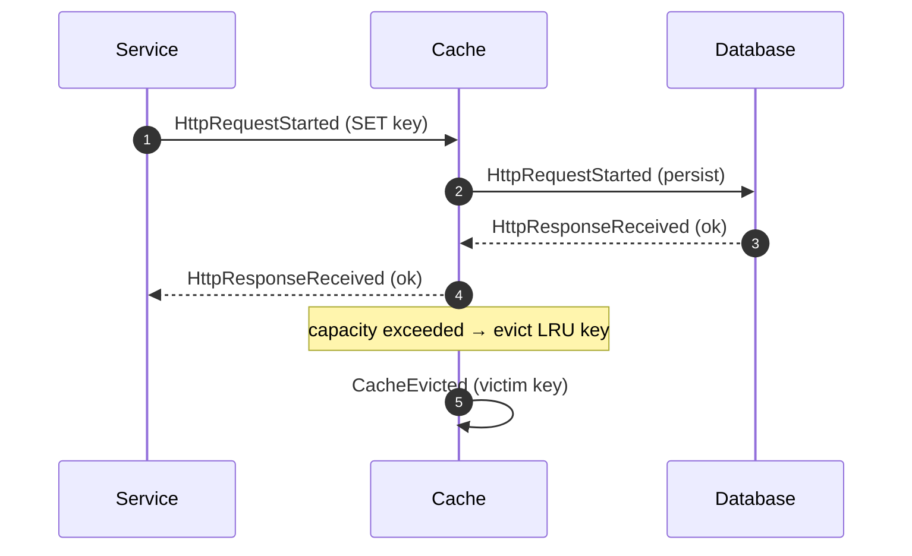

# Cache (Patterns, TTL & Eviction)

This document covers **caching as a pattern**, independent of any single technology. It teaches
the standard caching strategies — cache-aside, read-through, write-through (and write-behind) —
together with expiry (TTL) and eviction. The concrete Redis implementation is documented in
[Redis](./redis.md); this page is the pattern-level reference they share.

## Educational Objective

**What should the student learn?**

1. A cache is a **latency/cost optimisation**, not a system of record. Correctness must never
   depend on a value being cached.
2. The read strategies and who owns the read-through logic:
   - **Cache-aside (lazy loading):** the application checks the cache, and on a `CacheMiss`
     loads from the store and populates the cache itself.
   - **Read-through:** the cache sits inline and loads from the store on a miss transparently.
   - **Write-through:** every write goes to the cache **and** the store synchronously, keeping
     them consistent at write time.
   - **Write-behind (write-back):** writes hit the cache and are flushed to the store
     asynchronously (higher throughput, risk of loss) — noted as a future improvement.
3. **TTL** bounds staleness; **eviction** bounds size. Both cause future misses, so cache size
   and TTL are tunable trade-offs against hit ratio.
4. **Hit ratio** is the primary health metric, and why cold caches, thrashing, and stampedes
   destroy it.

## Architecture

| DFL Node | Caching concept |
|----------|-----------------|
| `Service` | Application performing reads/writes |
| `Cache` | The cache (e.g. Redis) |
| `Database` | System of record behind the cache |

Edge `config` on the `Service → Cache` link carries `pattern`; the `Cache → Database` link
carries the backing-store `readLatencyTicks`/`writeLatencyTicks`.

## Flow

Cache-aside read (miss populates, next read hits):

Write-through write, then eviction:

## Visual Behavior

Animations render backend events only; see [Animations](../03-ui/animations.md).

| Backend event | Canvas animation |
|---------------|------------------|
| `CacheHit` | `Cache` flashes green; the token returns on the **short** path (fast) with no `Database` hop — the visual reward of a hit. |
| `CacheMiss` | `Cache` flashes amber; the token proceeds to the `Database` on the **long** path; a populate token then flows back into the cache. |
| `CacheEvicted` | The victim key token is ejected from the cache's key-set visual; the eviction counter increments; the hit-ratio gauge dips. |
| Write-through | The write token visibly branches to **both** `Cache` and `Database` before the caller's ack returns. |

A live **hit-ratio gauge** on the `Cache` node updates from the running `CacheHit`/`CacheMiss`
counts, making the effect of TTL and size tuning immediately visible.

## Simulation

**Configurable parameters:**

- `Cache`: `pattern` (`cache-aside|read-through|write-through`), `maxEntries`,
  `evictionPolicy` (`lru|lfu|fifo|random`), `ttlTicks`.
- `Service`: `readRatePerTick`, `writeRatePerTick`, `keyCardinality`, `readSkew` (Zipfian hot-key
  distribution to produce a realistic, tunable hit ratio).
- `Database`: `readLatencyTicks`, `writeLatencyTicks`.

**Emitted `SimulationEvent`s:** `CacheHit`, `CacheMiss`, `CacheEvicted`, plus the
`HttpRequestStarted`/`HttpResponseReceived` pair for backing-store loads and (write-through)
persists, and lifecycle events.

## Failure Scenarios

| Injected condition | What happens | Events observed |
|--------------------|--------------|-----------------|
| Cold cache | Initial reads all miss until warm | burst of `CacheMiss`, low early hit ratio |
| Cache stampede | Many concurrent misses for the same hot key hammer the store | simultaneous `CacheMiss` + `HttpRequestStarted` spikes |
| Undersized cache (`maxEntries` too low) | Working set thrashes, entries evicted before reuse | high `CacheEvicted`, collapsed hit ratio |
| TTL too short | Fresh entries expire before reuse | `CacheEvicted` (expiry) → `CacheMiss` |
| Cache node failure (`NodeFailed`) | All reads fall through to the store | 100% `CacheMiss`, `avgLatencyMs` spike |
| Stale reads (long TTL after a write, cache-aside) | Reads return outdated data | high `CacheHit` but divergence from store — the consistency trade-off |

## Metrics

- **Hit ratio** = `CacheHit / (CacheHit + CacheMiss)` — the headline metric, shown as a live
  gauge and a time series.
- `avgLatencyMs` — effective read latency; falls as hit ratio rises because misses pay the
  `Database` cost.
- `throughput` — reads served per tick.
- `inFlight` — outstanding backing-store loads (spikes reveal stampedes).
- `CacheEvicted` rate — eviction pressure, indicating the cache is undersized or TTL is tuned
  too aggressively.
- `dlqCount` is not applicable to caching.

## Acceptance Criteria

- **Given** an empty cache-aside cache, **when** a key is read for the first time, **then**
  `CacheMiss` is emitted, the store is loaded, and the immediate next read of that key emits
  `CacheHit`.
- **Given** `maxEntries=N` with `evictionPolicy=lru`, **when** an (N+1)th distinct key is
  inserted, **then** exactly one `CacheEvicted` is emitted for the least-recently-used key.
- **Given** `ttlTicks=T`, **when** an entry's age exceeds T, **then** `CacheEvicted` (expiry) is
  emitted and the next read of that key is a `CacheMiss`.
- **Given** `pattern=write-through`, **when** a write occurs, **then** both a `Cache` update and
  a `Database` persist (`HttpRequestStarted`/`HttpResponseReceived`) occur before the caller's
  ack, and a subsequent read is a `CacheHit`.
- **Given** a workload with `readSkew` producing an 80% hot-key ratio, **when** the cache is warm
  and adequately sized, **then** the hit-ratio metric stabilises at approximately the hot-key
  proportion.
- **Given** the `Cache` node fails (`NodeFailed`), **when** reads continue, **then** the hit
  ratio drops to 0 and `avgLatencyMs` rises to the `Database` read latency until `NodeRecovered`.

## Future Improvements

- Write-behind (write-back) caching with a visible async flush queue and loss-on-crash lesson.
- Cache invalidation on write (explicit `evict`/`del`) and the two-generals staleness problem.
- Negative caching (caching misses) to blunt stampedes.
- Request coalescing / single-flight to demonstrate stampede mitigation.
- Multi-tier caching (L1 in-process + L2 distributed) topology.

## Related documents

- [Redis](./redis.md)
- [REST](./rest.md)
- [gRPC](./grpc.md)
- [Event Model](../02-architecture/event-model.md)
- [Animations](../03-ui/animations.md)
- [Caching Learning Path](../06-learning/architectural-patterns.md)
- [Glossary](../01-product/glossary.md)
