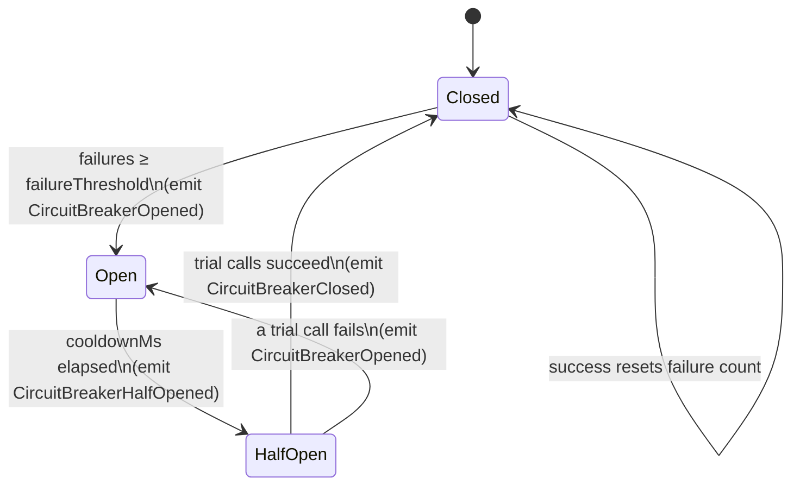
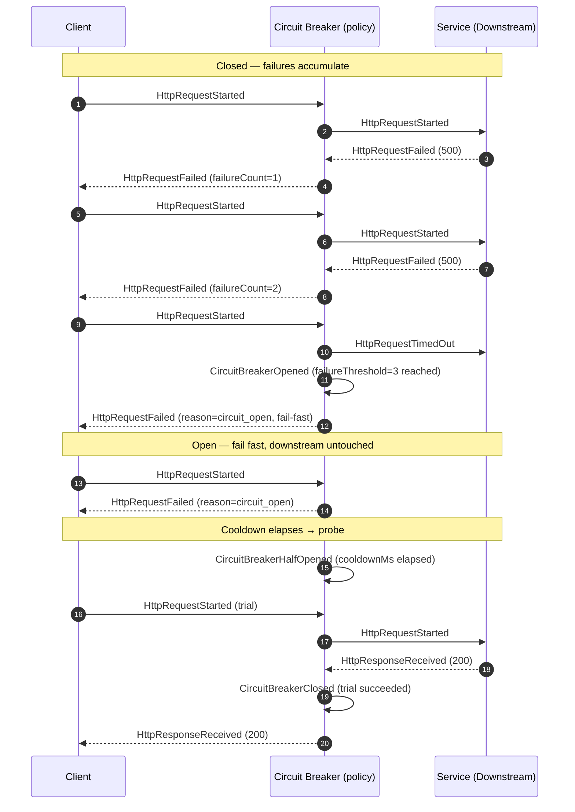

# Circuit Breaker

## Educational Objective

*What should the student learn?*

After running this scenario a learner should be able to:

1. **State the problem.** When a downstream `Service` is failing or slow, naively retrying every
   call wastes resources, exhausts connection pools, and turns a partial outage into a
   **cascading failure**. A circuit breaker *fails fast* to protect the caller and give the
   callee room to recover.
2. **Explain the three states.**
   - **Closed** — calls flow through normally; failures are counted.
   - **Open** — the failure threshold has been exceeded; calls are rejected immediately (fail
     fast) for a **cooldown** period, without touching the downstream.
   - **Half-Open** — after cooldown, a limited number of *trial* calls are allowed; success
     closes the breaker, failure re-opens it.
3. **Reason about the thresholds.** Relate `failureThreshold`, `cooldownMs`, and the half-open
   trial count to the trade-off between protecting the system and recovering quickly.
4. **Trace the state events.** Follow `CircuitBreakerOpened` → `CircuitBreakerHalfOpened` →
   `CircuitBreakerClosed` (recovery) versus `CircuitBreakerHalfOpened` → `CircuitBreakerOpened`
   (re-trip).
5. **Distinguish it from retry.** Understand that [Retry](./retry.md) handles *transient*
   failures of individual calls, while the circuit breaker handles *sustained* failure of a
   dependency — and that the two compose (retry inside the breaker's Closed state).

## Architecture

A `Client` calls a downstream `Service` through a **circuit breaker** guarding the call. In DFL
the breaker is a policy attached to the outbound edge/`Service`, with its state surfaced as node
state. The protected `Service` is the failure source.

| Node | `NodeType` | Role |
|------|-----------|------|
| Client | `Client` | Caller whose outbound calls are guarded by the breaker. |
| Circuit Breaker | policy on the `Service`/edge | State machine that permits, rejects, or trials calls. Its state is exposed via `NodeStateChanged`. |
| Downstream | `Service` | The protected dependency; the fault source. |
| Database | `Database` | Backing store the downstream depends on. |

The circuit breaker is not a distinct `NodeType`; it is a resilience policy on the protected
`Service` (canon §5 node types). Its lifecycle is fully observable through the dedicated
`CircuitBreaker*` events plus `NodeStateChanged`.

## State Machine

- **Closed → Open** when consecutive (or windowed) failures reach `failureThreshold`.
- **Open → Half-Open** automatically once `cooldownMs` has elapsed; no calls reach the downstream
  while Open.
- **Half-Open → Closed** when `halfOpenTrialCalls` succeed consecutively.
- **Half-Open → Open** immediately on any trial failure, restarting the cooldown.

## Flow

Canonical events only. The diagram shows the breaker tripping open under sustained failure,
failing fast during cooldown, probing in half-open, and closing on recovery.

Had the trial call failed, the breaker would emit `CircuitBreakerOpened` again and restart the
cooldown, illustrating the Half-Open → Open transition.

## Visual Behavior

All animation is backend-event-driven; see [UI Animations](../03-ui/animations.md).

| Backend event | Animation |
|---------------|-----------|
| `HttpRequestStarted` | A request token travels Client→breaker→downstream (Closed/Half-Open). |
| `HttpResponseReceived` | The token returns green; the breaker's failure counter badge resets toward 0. |
| `HttpRequestFailed` / `HttpRequestTimedOut` | The token returns red; the failure counter increments and fills toward the threshold. |
| `CircuitBreakerOpened` | The breaker node snaps to a **red "OPEN"** state; the downstream edge is severed (dashed/greyed); a cooldown countdown ring appears. |
| `HttpRequestFailed (reason=circuit_open)` | Fail-fast tokens bounce back at the breaker without reaching the downstream — visually never crossing the severed edge. |
| `CircuitBreakerHalfOpened` | The breaker turns **amber "HALF-OPEN"**; the edge becomes a thin probe line; only trial tokens are allowed through. |
| `CircuitBreakerClosed` | The breaker returns to **green "CLOSED"**; the edge is fully restored. |
| `NodeStateChanged` | Mirrors the breaker state onto the protected `Service` node badge for at-a-glance status. |

The severed edge during the Open state is the signature visual: learners *see* that fail-fast
requests never reach the struggling downstream, which is exactly how the breaker protects it.

## Simulation

**What DFL simulates.** A circuit-breaker policy wrapping calls to a downstream `Service` whose
health is controlled by fault injection, with full Closed/Open/Half-Open state transitions.

**Configurable parameters:**

| Parameter | Type | Default | Meaning |
|-----------|------|---------|---------|
| `failureThreshold` | int | `3` | Failures (windowed) that trip Closed → Open. |
| `cooldownMs` | int | `5000` | Time the breaker stays Open before Half-Open. |
| `halfOpenTrialCalls` | int | `1` | Consecutive successful trials required to close. |
| `rollingWindow` | enum `consecutive \| count \| time` | `consecutive` | How failures are counted toward the threshold. |
| `callRatePerTick` | int | `2` | Requests the client issues per tick. |
| `downstreamFailureRate` | float `0..1` | `0.0` | Baseline downstream failure probability (raise via faults). |
| `downstreamLatencyMs` | int | `50` | Downstream processing latency; large values cause `HttpRequestTimedOut`. |

**Emitted `SimulationEvent`s** (canonical): `SimulationStarted`, `TickAdvanced`,
`HttpRequestStarted`, `HttpResponseReceived`, `HttpRequestFailed`, `HttpRequestTimedOut`,
`CircuitBreakerOpened`, `CircuitBreakerHalfOpened`, `CircuitBreakerClosed`, `NodeStateChanged`,
`NodeFailed`, `NodeRecovered`, `SimulationCompleted`.

## Failure Scenarios

Injected via `POST /api/v1/simulations/{id}/faults`.

1. **Sustained downstream outage (trip open).** Inject `FaultInjected` raising
   `downstreamFailureRate = 1.0`. The breaker trips after `failureThreshold` failures and fails
   fast. *Lesson:* the breaker stops hammering a dead dependency.
2. **Latency-driven trip.** Inject `LatencyInjected` so calls exceed the timeout, producing
   `HttpRequestTimedOut`. *Lesson:* slow is the new down — timeouts count as failures.
3. **Flapping dependency (re-trip).** Alternate the downstream between healthy and failing so the
   breaker cycles Half-Open → Closed → Open. *Lesson:* half-open probing prevents premature full
   recovery of a still-unstable dependency.
4. **Recovery.** Heal the fault (`PartitionHealed` / clear `FaultInjected`) during cooldown; the
   half-open probe succeeds and the breaker closes. *Lesson:* the breaker recovers automatically
   without operator action.
5. **No breaker (control).** Disable the policy and repeat scenario 1; observe the caller's
   `inFlight` and latency balloon as it keeps calling a dead service — the cascading-failure
   counter-example.

## Metrics

From `GET /api/v1/simulations/{id}/metrics` as [`MetricSnapshot`](../02-architecture/event-model.md).

| `MetricSnapshot` field | Meaning in this scenario |
|------------------------|--------------------------|
| `tick` | Snapshot logical clock. |
| `throughput` | Successful `HttpResponseReceived` per tick. |
| `avgLatencyMs` | Average call latency; fail-fast rejections keep this low while Open (a feature, not a bug). |
| `inFlight` | Calls in progress; with the breaker Open this stays bounded — the protection lesson. |
| `dlqCount` | Not central here; remains 0 unless combined with a messaging path. |
| `retries` | Retry attempts within the Closed state when composed with the [Retry](./retry.md) policy. |

Derived teaching measures: **time-in-state** (ticks spent Closed/Open/Half-Open), **trip count**
(`CircuitBreakerOpened` events), **fail-fast ratio** (`reason=circuit_open` rejections ÷ total
calls), and **downstream calls avoided while Open**.

## Acceptance Criteria

- **Given** `failureThreshold = 3`, `rollingWindow = consecutive`, and a downstream that fails
  every call, **when** the client issues calls, **then** after exactly the 3rd failure the engine
  emits `CircuitBreakerOpened`, and subsequent calls return `HttpRequestFailed`
  (`reason=circuit_open`) **without** any `HttpRequestStarted` reaching the downstream.
- **Given** the breaker is Open and `cooldownMs` has elapsed, **when** the next call arrives,
  **then** the engine emits `CircuitBreakerHalfOpened` and allows exactly one trial call to the
  downstream.
- **Given** the breaker is Half-Open and the trial call succeeds, **when** it completes, **then**
  the engine emits `CircuitBreakerClosed` and normal pass-through resumes; **given** the trial
  fails, **then** it emits `CircuitBreakerOpened` and restarts the cooldown.
- **Given** any breaker state transition, **when** the client renders it, **then** the breaker
  node's state (Closed/Open/Half-Open) is derived solely from `CircuitBreaker*` /
  `NodeStateChanged` events, and the downstream edge is visibly severed while Open.
- **Given** the breaker policy is disabled (control), **when** the downstream fails, **then** no
  `CircuitBreaker*` events are emitted and `inFlight` grows unbounded relative to the guarded run.

## Future Improvements

- **Bulkhead composition** — combine the breaker with a bounded concurrency pool to teach
  isolation of failures across dependencies.
- **Fallback responses** — model a degraded fallback path emitted while the breaker is Open
  (e.g. cached/last-known-good), tying into [Cache](./cache.md).
- **Percentage-based windows** — support error-rate thresholds over a rolling time window in
  addition to consecutive-failure counting.
- **Per-dependency breakers on an API Gateway** — surface independent breakers per downstream
  route in the [API Gateway](./api-gateway.md) scenario.

## Related documents

- [Retry](./retry.md)
- [REST](./rest.md)
- [API Gateway](./api-gateway.md)
- [Event Model](../02-architecture/event-model.md)
- [UI Animations](../03-ui/animations.md)
- [Learning: Resilience Patterns](../06-learning/architectural-patterns.md)
- [Glossary](../01-product/glossary.md)
