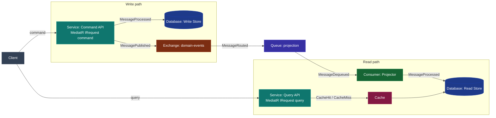
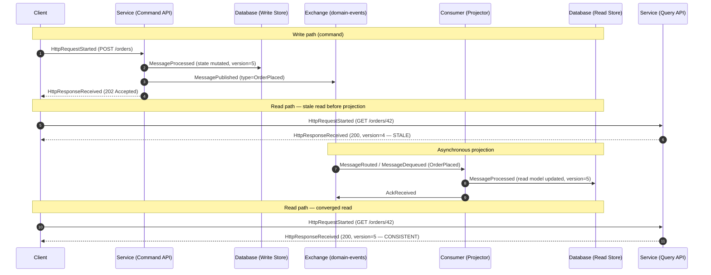

# CQRS — Command Query Responsibility Segregation

## Educational Objective

*What should the student learn?*

After running this scenario a learner should be able to:

1. **State the core idea.** CQRS splits the model that *changes* state (the **command** side)
   from the model that *reads* state (the **query** side), so each can be optimized, scaled, and
   reasoned about independently.
2. **Distinguish the two paths.** Follow a **write path** (command → domain state change →
   event) separately from a **read path** (query → read model), and articulate why they touch
   different stores.
3. **Understand eventual consistency of the read model.** Explain that the read model is updated
   *asynchronously* by projecting domain events, so a query issued immediately after a command
   may observe stale data until the projection catches up — and why that is an acceptable,
   deliberate trade-off.
4. **Connect CQRS to the codebase.** Relate the command/query split to **MediatR** in the
   `DistributedFlowLab.Application` layer (see the [technology stack](../02-architecture/event-model.md)),
   where commands and queries are distinct request types handled by distinct handlers.
5. **Know when *not* to use it.** Recognize that CQRS adds moving parts (two models, a
   projection, eventual consistency) and is justified only when read and write workloads diverge.

CQRS is frequently paired with [Event Sourcing](./event-sourcing.md); this document keeps them
separable and explains the relationship explicitly.

## Architecture

The scenario models the two sides as distinct paths sharing a common event backbone. A `Client`
sends commands and queries through an `ApiGateway`/`Service`. Commands mutate the **write store**
(`Database`) and publish domain events to an `Exchange`; a **projector** `Consumer` builds the
**read store** (a second `Database`, optionally fronted by a `Cache`). Queries read only from the
read store.

| Node | `NodeType` | Role |
|------|-----------|------|
| Client | `Client` | Issues commands and queries. |
| Command API | `Service` | Handles commands via a MediatR command handler; mutates the write store; publishes events. |
| Query API | `Service` | Handles queries via a MediatR query handler; reads the read store/cache only. |
| Write Store | `Database` | Authoritative state mutated by commands. |
| domain-events | `Exchange` | Fans domain events to interested projectors. |
| projection | `Queue` | Buffers events for the projector. |
| Projector | `Consumer` | Applies events to the read store (builds the read model). |
| Read Store | `Database` | Query-optimized denormalized view. |
| Cache | `Cache` | Optional read-through cache in front of the read store. |

The command/query separation maps one-to-one to MediatR request types in the Application layer:
a command is an `IRequest` handled by a command handler that emits a domain event; a query is a
separate `IRequest` handled by a query handler that never mutates state. Business logic lives in
handlers, never in the endpoint — consistent with the golden rules.

## Flow

Canonical events only. The diagram shows a command mutating state and publishing an event, the
projector updating the read model, and a query that first observes **stale** then **converged**
data — the eventual-consistency lesson.

The **consistency gap** — the interval between the write-side `MessagePublished` and the
read-side `MessageProcessed` on the projector — is the pedagogical centrepiece. DFL renders it as
a measurable lag on the timeline.

## Visual Behavior

All animation is driven by backend `SimulationEvent`s; see [UI Animations](../03-ui/animations.md).

| Backend event | Animation |
|---------------|-----------|
| `HttpRequestStarted` (command) | A blue command token travels Client→Command API. |
| `MessageProcessed` (write store) | The Write Store node pulses; a version badge increments. |
| `MessagePublished` | A green event token emits from the Command API to the domain-events `Exchange`. |
| `HttpResponseReceived` (202) | The command token returns to the Client (acknowledged before projection). |
| `MessageRouted` / `MessageDequeued` | The event token flows Exchange→Queue→Projector. |
| `MessageProcessed` (read store) | The Read Store node pulses; its version badge catches up to the write side. |
| `HttpRequestStarted` (query) | A violet query token travels Client→Query API→Read Store/Cache. |
| `CacheHit` / `CacheMiss` | The Cache node flashes green (hit) or amber (miss, falls through to Read Store). |
| `HttpResponseReceived` (query) | The response carries a `version` label; while the read version trails the write version, the edge is tinted amber to signal staleness, turning green on convergence. |

A dedicated **consistency lag** overlay animates the shrinking gap between write-store and
read-store version badges, making eventual consistency literally visible.

## Simulation

**What DFL simulates.** Two independent request paths over a shared event backbone: commands that
mutate a write store and publish events, an asynchronous projector that rebuilds a read store from
those events, and queries that read the (possibly stale) read store through an optional cache.

**Configurable parameters:**

| Parameter | Type | Default | Meaning |
|-----------|------|---------|---------|
| `projectionLagTicks` | int | `3` | Ticks between event publication and read-model update (the consistency gap). |
| `commandRatePerTick` | int | `1` | Commands the client issues per tick. |
| `queryRatePerTick` | int | `4` | Queries per tick (reads dominate — the CQRS motivation). |
| `readCacheEnabled` | bool | `true` | Whether the Query API reads through a `Cache`. |
| `cacheTtlTicks` | int | `10` | Read-cache entry lifetime; drives `CacheEvicted`. |
| `projectorFailureRate` | float `0..1` | `0.0` | Probability the projector fails an event, widening the gap. |

**Emitted `SimulationEvent`s** (canonical): `SimulationStarted`, `TickAdvanced`,
`HttpRequestStarted`, `HttpResponseReceived`, `HttpRequestFailed`, `MessagePublished`,
`MessageRouted`, `MessageEnqueued`, `MessageDequeued`, `MessageProcessed`, `AckReceived`,
`MessageNacked`, `RetryScheduled`, `MessageRetried`, `CacheHit`, `CacheMiss`, `CacheEvicted`,
`NodeStateChanged`, `SimulationCompleted`.

## Failure Scenarios

Injected via `POST /api/v1/simulations/{id}/faults`.

1. **Projector stall (unbounded lag).** Inject `LatencyInjected` on the projector `Consumer`.
   The read model falls arbitrarily behind; queries return increasingly stale versions.
   *Lesson:* eventual consistency is only "eventual" if the projector keeps up; a stalled
   projector is a silent correctness hazard.
2. **Projector failure + retry.** Set `projectorFailureRate > 0`; the projector nacks events
   (`MessageNacked` → `RetryScheduled` → `MessageRetried`). *Lesson:* projections must be
   idempotent, because events are redelivered.
3. **Cache staleness.** Disable projection convergence while `readCacheEnabled = true`; the cache
   serves old data past the underlying write. *Lesson:* a cache layered on a read model compounds
   staleness — invalidation must be event-driven.
4. **Command store partition.** Inject `PartitionCreated` between the Command API and Write Store.
   Commands fail (`HttpRequestFailed`) while queries continue to succeed against the read store.
   *Lesson:* CQRS lets the read path stay available during a write-path outage.

## Metrics

From `GET /api/v1/simulations/{id}/metrics` as [`MetricSnapshot`](../02-architecture/event-model.md) records.

| `MetricSnapshot` field | Meaning in this scenario |
|------------------------|--------------------------|
| `tick` | Snapshot logical clock. |
| `throughput` | Combined command + query completions per tick. |
| `avgLatencyMs` | Average request latency; broken out per path (command vs query) on the dashboard. |
| `inFlight` | Requests in progress plus events queued for projection. |
| `dlqCount` | Projection events dead-lettered after retry exhaustion (should stay 0 in the healthy case). |
| `retries` | Projector `MessageRetried` count. |

Derived teaching measures: **consistency lag** (ticks between write-side `MessagePublished` and
matching read-side `MessageProcessed`), **stale-read ratio** (queries answered with a read
version older than the latest committed write version), and **read/write ratio**.

## Acceptance Criteria

- **Given** a command that mutates entity `42` to version 5, **when** the command completes,
  **then** the Command API emits `MessageProcessed` (write store) and `MessagePublished`
  (`type=OrderPlaced`) before returning `HttpResponseReceived` with 202, and the write-store
  version badge reads 5.
- **Given** `projectionLagTicks = 3`, **when** a query for entity `42` is issued within 3 ticks
  of the command, **then** the query returns the pre-command version and the client marks the
  read as stale; **and** a query issued after the projector emits `MessageProcessed` returns
  version 5.
- **Given** the projector is stalled via `LatencyInjected`, **when** subsequent queries run,
  **then** the measured consistency lag is strictly increasing and no query ever returns a
  version newer than the read store currently holds.
- **Given** `readCacheEnabled = true` and a warm cache, **when** a repeated query runs, **then**
  a `CacheHit` is emitted and no read reaches the Read Store `Database`.
- **Given** a `PartitionCreated` fault on the command→write-store link, **when** commands and
  queries run concurrently, **then** commands emit `HttpRequestFailed` while queries continue to
  emit successful `HttpResponseReceived`.

## Future Improvements

- **Read-your-writes affinity** — model a client hint that routes a follow-up query to the write
  store until the projection catches up, teaching consistency-strengthening techniques.
- **Multiple projections** — several projectors building different read models (e.g. a summary
  view and a search index) from the same event stream.
- **Projection rebuild** — a control to rebuild a read model from scratch by replaying the event
  log, tying directly into [Event Sourcing](./event-sourcing.md).
- **Consistency SLO overlay** — a configurable lag budget that turns the consistency overlay red
  when exceeded and raises `NodeStateChanged` on the projector.

## Related documents

- [Event Sourcing](./event-sourcing.md)
- [Saga](./saga.md)
- [Cache](./cache.md)
- [Sequence Diagrams](../02-architecture/sequence-diagrams.md)
- [Event Model](../02-architecture/event-model.md)
- [UI Animations](../03-ui/animations.md)
- [Learning: Consistency Models](../06-learning/distributed-systems.md)
- [Glossary](../01-product/glossary.md)
