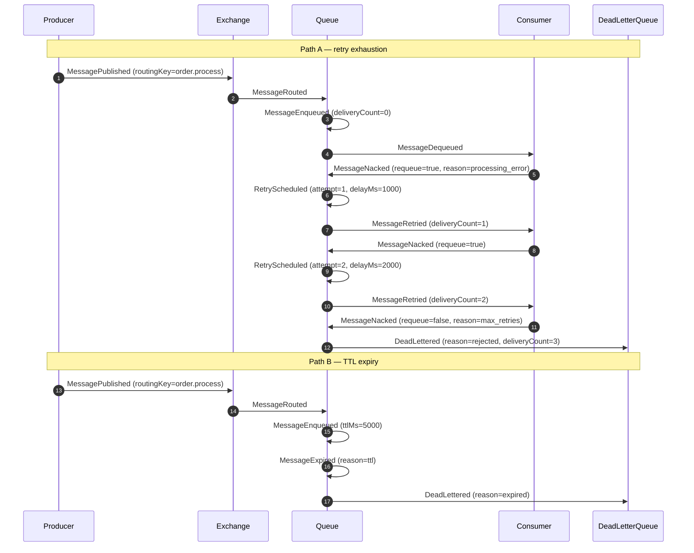

# Dead-Letter Queue (DLQ)

## Educational Objective

*What should the student learn?*

A learner completing this scenario should be able to:

1. **Define dead-lettering** — explain that a Dead-Letter Queue is a dedicated destination for
   `Message`s that cannot be delivered or processed successfully, so that a "poison" message
   never blocks a healthy `Queue`.
2. **Enumerate the causes.** Identify the three canonical reasons a `Message` is dead-lettered:
   - **Retry exhaustion** — the consumer keeps rejecting the message and the configured
     maximum redelivery count is reached.
   - **TTL expiry** — the message lives longer than its time-to-live without being consumed.
   - **Rejection / negative acknowledgement** — the consumer explicitly rejects the message
     without requeue (`MessageNacked` with `requeue=false`).
3. **Trace the retry-then-dead-letter lifecycle** — follow the exact event sequence
   `RetryScheduled` → `MessageRetried` → `DeadLettered`, and contrast it with the
   TTL-driven path `MessageExpired` → `DeadLettered`.
4. **Reason operationally** — describe why a DLQ is an *observability and safety* mechanism, not
   an error handler: dead-lettered messages must be inspected, alerted on, and re-driven, and a
   growing DLQ is a leading indicator of a downstream defect.

This maps to the resilience objectives in the product [Educational Objectives](../01-product/vision.md#educational-objectives)
and builds directly on the [Retry](./retry.md) pattern.

## Architecture

The DLQ scenario is modeled with canonical [`NodeType`](../02-architecture/event-model.md)
values. A `Producer` publishes to an `Exchange`, which routes to a primary `Queue`. The queue is
configured with a **dead-letter exchange (DLX)** binding to a `DeadLetterQueue`. A `Consumer`
reads from the primary queue and may fail processing; a separate DLQ consumer (a `Service`)
drains the `DeadLetterQueue` for inspection and re-drive.

```mermaid
flowchart LR
  P[Producer]:::producer -->|MessagePublished| X[Exchange]:::exchange
  X -->|MessageRouted| Q[Queue<br/>x-dead-letter-exchange=dlx<br/>x-message-ttl<br/>x-max-retries]:::queue
  Q -->|MessageDequeued| C[Consumer]:::consumer
  C -.->|MessageNacked / retries exhausted / TTL| DLX[Exchange: dlx]:::exchange
  DLX -->|MessageRouted| DLQ[(DeadLetterQueue)]:::dlq
  DLQ -->|MessageDequeued| I[Service: DLQ Inspector / Re-driver]:::service

  classDef producer fill:#1e3a8a,color:#fff,stroke:#1e40af;
  classDef consumer fill:#166534,color:#fff,stroke:#15803d;
  classDef exchange fill:#7c2d12,color:#fff,stroke:#9a3412;
  classDef queue fill:#3730a3,color:#fff,stroke:#4338ca;
  classDef dlq fill:#7f1d1d,color:#fff,stroke:#991b1b;
  classDef service fill:#0f766e,color:#fff,stroke:#0d9488;
```

| Node | `NodeType` | Role |
|------|-----------|------|
| Producer | `Producer` | Emits work messages. |
| Exchange | `Exchange` | Routes messages to the primary queue by routing key. |
| Queue | `Queue` | Primary work queue; configured with DLX, TTL, and max-retry policy. |
| Consumer | `Consumer` | Processes messages; may nack/fail, triggering redelivery. |
| dlx | `Exchange` | Dead-letter exchange that receives dead-lettered messages. |
| DeadLetterQueue | `DeadLetterQueue` | Terminal store for failed/expired messages. |
| DLQ Inspector | `Service` | Reads the DLQ to inspect, alert, and optionally re-drive. |

The DLQ mechanism here mirrors real RabbitMQ semantics (`x-dead-letter-exchange`,
`x-message-ttl`, per-message `expiration`, and delivery-count-based dead-lettering). See
[RabbitMQ](./rabbitmq.md) for the underlying broker model.

## Flow

The sequence below uses only canonical event names from the
[Event Catalog](../02-architecture/event-model.md). It shows a message that is retried twice,
exhausts its retry budget, and is dead-lettered; a second message expires via TTL.

Notes on ordering and semantics:

- `RetryScheduled` precedes each `MessageRetried`; the delay between them models backoff and is
  visible on the timeline as a gap in `tick`s.
- The transition to `DeadLettered` occurs when `deliveryCount` reaches the configured
  `maxRetries` (retry exhaustion) **or** when `MessageExpired` fires (TTL). Both converge on the
  same `DeadLetterQueue`, but the `payload.reason` differs (`rejected` vs `expired`).
- A message the consumer *drops* without acknowledgement or dead-lettering emits `MessageDropped`
  instead — used to teach the danger of silently losing messages when no DLQ is configured.

## Visual Behavior

Every animation is driven **exclusively** by backend `SimulationEvent`s; the client never
invents dead-lettering. See [UI Animations](../03-ui/animations.md) for the shared animation
contract and token/edge conventions.

| Backend event | Animation |
|---------------|-----------|
| `MessagePublished` | A message token spawns at the `Producer` and travels along the producer→exchange edge. |
| `MessageRouted` | The token follows the exchange→queue edge; the matched routing key is labeled on the edge. |
| `MessageEnqueued` | The token settles into the `Queue` node; the queue depth badge increments. |
| `MessageDequeued` | The token leaves the queue toward the `Consumer`; queue depth decrements. |
| `MessageNacked` | The token flashes amber and reverses along the consumer→queue edge (requeue). |
| `RetryScheduled` | A dashed "waiting" ring appears on the token with a countdown reflecting `delayMs`; an attempt counter increments. |
| `MessageRetried` | The token re-travels the queue→consumer edge; the `deliveryCount` badge updates. |
| `DeadLettered` | The token turns red and animates along the queue→dlx→`DeadLetterQueue` edges; the DLQ node's count badge increments and pulses. |
| `MessageExpired` | The token fades to grey with a clock icon before the `DeadLettered` transition. |
| `MessageDropped` | The token dissolves in place with a "lost" glyph — used only when no DLQ is present. |

The `DeadLetterQueue` node renders a persistent, non-zero count badge so that a filling DLQ is
immediately obvious even after the offending tokens have settled.

## Simulation

**What DFL simulates.** A primary queue with a configurable retry/backoff policy and a
dead-letter exchange bound to a `DeadLetterQueue`. The engine deterministically decides, per
message and per attempt, whether the consumer succeeds, nacks, or times out, then applies the
DLX/TTL rules exactly as a real broker would.

**Configurable parameters** (surfaced in the [Inspector](../03-ui/animations.md) for the `Queue`
node):

| Parameter | Type | Default | Meaning |
|-----------|------|---------|---------|
| `maxRetries` | int | `3` | Redelivery attempts before dead-lettering (delivery-count limit). |
| `backoffStrategy` | enum `fixed \| exponential` | `exponential` | Shape of the delay between retries. |
| `baseDelayMs` | int | `1000` | Initial retry delay; doubled each attempt when exponential. |
| `messageTtlMs` | int (nullable) | `null` | Per-message TTL; on expiry the message is dead-lettered. |
| `consumerFailureRate` | float `0..1` | `0.4` | Probability a delivery attempt fails (drives retries). |
| `deadLetterEnabled` | bool | `true` | When `false`, exhausted/expired messages emit `MessageDropped` instead. |
| `arrivalRatePerTick` | int | `2` | Messages the `Producer` publishes per `Tick`. |

**Emitted `SimulationEvent`s** (canonical): `SimulationStarted`, `TickAdvanced`,
`MessagePublished`, `MessageRouted`, `MessageEnqueued`, `MessageDequeued`, `MessageReceived`,
`MessageProcessed`, `AckReceived`, `MessageNacked`, `RetryScheduled`, `MessageRetried`,
`DeadLettered`, `MessageExpired`, `MessageDropped`, `NodeStateChanged`, `SimulationCompleted`.

## Failure Scenarios

Fault injection is delivered via `POST /api/v1/simulations/{id}/faults` and produces
`FaultInjected` / `LatencyInjected` events alongside the domain events they perturb.

1. **Poison message (guaranteed retry exhaustion).** Inject a `FaultInjected` fault pinning
   `consumerFailureRate = 1.0` for a specific `correlationId`. The message is retried
   `maxRetries` times and dead-lettered. *Lesson:* one bad message cannot be processed no matter
   how often it is retried — retries alone do not fix a defect.
2. **Slow consumer + short TTL.** Inject `LatencyInjected` on the consumer so processing exceeds
   `messageTtlMs`. Messages expire in the queue (`MessageExpired` → `DeadLettered`) before they
   are ever delivered. *Lesson:* TTL and processing latency interact; an over-aggressive TTL can
   dead-letter healthy work.
3. **DLQ disabled (silent loss).** Set `deadLetterEnabled = false` and drive failures. Exhausted
   messages emit `MessageDropped`. *Lesson:* without a DLQ, poison messages vanish and the defect
   is invisible until data is missing downstream.
4. **DLQ back-pressure.** Stop the DLQ inspector `Service` (`NodeFailed`) while failures
   continue. The `DeadLetterQueue` depth grows unbounded. *Lesson:* a DLQ is not a fix — it must
   itself be monitored and drained.

## Metrics

Metrics are exposed via `GET /api/v1/simulations/{id}/metrics` as a stream of
[`MetricSnapshot`](../02-architecture/event-model.md) records (one per `Tick`), plus DLQ-specific
derived measures rendered on the metrics dashboard.

| `MetricSnapshot` field | Meaning in this scenario |
|------------------------|--------------------------|
| `tick` | Logical clock at which the snapshot was taken. |
| `throughput` | Messages successfully processed (`MessageProcessed`) per tick. |
| `avgLatencyMs` | Average time from `MessagePublished` to `AckReceived` for successful messages. |
| `inFlight` | Messages currently enqueued or being retried (not yet acked or dead-lettered). |
| `dlqCount` | **Primary KPI** — cumulative count of `DeadLettered` messages. |
| `retries` | Cumulative `MessageRetried` count; the ratio `retries / throughput` reveals redelivery pressure. |

Derived teaching measures: **dead-letter rate** (`dlqCount / total published`), **mean attempts
before dead-letter**, and **TTL-expiry share** (`MessageExpired` as a fraction of `dlqCount`).

## Acceptance Criteria

- **Given** a queue with `maxRetries = 3` and a message whose every delivery is nacked with
  `requeue=true`, **when** the simulation runs, **then** the engine emits exactly three
  `RetryScheduled`/`MessageRetried` pairs followed by one `DeadLettered` event with
  `payload.reason = "rejected"` and `payload.deliveryCount = 3`, and `dlqCount` increments by 1.
- **Given** a message with `messageTtlMs = 5000` that is never dequeued within its TTL,
  **when** the TTL elapses, **then** exactly one `MessageExpired` event precedes exactly one
  `DeadLettered` event with `payload.reason = "expired"`, and no `MessageRetried` is emitted for
  that `correlationId`.
- **Given** `deadLetterEnabled = false`, **when** a message exhausts its retries, **then** the
  engine emits `MessageDropped` (not `DeadLettered`), and `dlqCount` remains unchanged.
- **Given** any dead-lettered message, **when** the client renders the timeline, **then** the
  token animation ends at the `DeadLetterQueue` node and the DLQ count badge equals `dlqCount`,
  with no client-side event fabricated beyond `AnimationStarted`/`AnimationFinished`.
- **Given** the DLQ inspector `Service` is failed via `NodeFailed`, **when** failures continue,
  **then** `DeadLetterQueue` depth is strictly non-decreasing and never auto-drains.

## Future Improvements

- **Automated re-drive policy** — model a "shovel" that replays messages from the
  `DeadLetterQueue` back to the primary `Exchange` after a delay, emitting `MessagePublished`
  with an incremented `redeliveryEpoch`.
- **Per-reason DLQ routing** — separate dead-letter queues keyed on `payload.reason`
  (`expired` vs `rejected`) to teach triage.
- **Parking-lot pattern** — a second-level DLQ for messages that fail re-drive, illustrating
  escalation tiers.
- **Alert threshold visualization** — configurable `dlqCount` threshold that raises a visual
  alert and a `NodeStateChanged` on the DLQ node when breached.

## Related documents

- [Retry](./retry.md)
- [RabbitMQ](./rabbitmq.md)
- [Pub/Sub](./pubsub.md)
- [Event Model](../02-architecture/event-model.md)
- [UI Animations](../03-ui/animations.md)
- [Learning: Resilience Patterns](../06-learning/architectural-patterns.md)
- [Glossary](../01-product/glossary.md)
