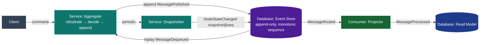
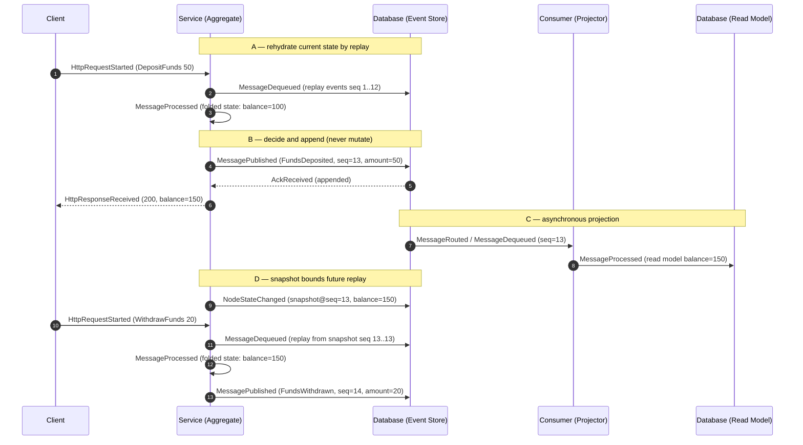

# Event Sourcing

## Educational Objective

*What should the student learn?*

After running this scenario a learner should be able to:

1. **State the core idea.** Instead of storing *current state* and overwriting it, an
   event-sourced system stores the **full, append-only sequence of state-changing events**. The
   current state is a *derived* value, computed by folding (replaying) the events.
2. **Rebuild state by replay.** Reconstruct an entity's state at any point by replaying its
   events from the beginning (or from a snapshot) up to a chosen position.
3. **Understand snapshots.** Explain that replaying from event zero is expensive for long-lived
   entities, so periodic **snapshots** capture derived state at a known sequence, and replay
   resumes from the latest snapshot.
4. **Appreciate the benefits and costs.** Benefits: a perfect audit log, temporal queries
   ("what did it look like last Tuesday?"), and the ability to build new read models
   retroactively. Costs: event schema evolution, larger storage, and the need for idempotent
   projections.
5. **See the pattern reflected in DFL itself.** DFL's own [Timeline](../01-product/glossary.md)
   *is* an event-sourced log: every `SimulationEvent` is appended with a monotonic `sequence`, and
   replaying it reconstructs the entire simulation — the platform teaches the pattern by *being*
   an instance of it (canon §5 ubiquitous language, §10 core entities).

Event Sourcing is the natural persistence model behind [CQRS](./cqrs.md) read models and records
the steps of a [Saga](./saga.md).

## Architecture

The scenario models an event-sourced aggregate. Commands arrive at a `Service`; the service
validates against the current (rehydrated) state and **appends** a new event to an append-only
**Event Store** (`Database`). A `Consumer` **projector** folds events into a read model
(`Database`), and a **snapshotter** periodically writes derived state back to the store to bound
replay cost.

| Node | `NodeType` | Role |
|------|-----------|------|
| Client | `Client` | Issues commands against an aggregate. |
| Aggregate | `Service` | Rehydrates state by replay, decides, and appends new events. |
| Event Store | `Database` | Append-only log of events with a monotonic per-aggregate sequence. |
| Projector | `Consumer` | Folds events into a query-optimized read model. |
| Read Model | `Database` | Derived, replaceable view built from events. |
| Snapshotter | `Service` | Persists derived state at intervals to bound replay. |

**Teaching mirror.** The Event Store's monotonic `sequence` is the same concept as the
[SimulationEvent](../02-architecture/event-model.md) envelope's `sequence` field. The
`GET /api/v1/simulations/{id}/events?fromSequence=` endpoint *is* an event-store read; the
timeline scrubber *is* a replay. Learners are pointed at this equivalence explicitly.

## Flow

Canonical events only. The diagram shows (A) rehydration by replay, (B) a command appending a new
event, (C) projection, and (D) snapshot-accelerated rehydration.

The key invariant, made visible on the timeline: **events are only ever appended, never updated
or deleted**, and every `sequence` is strictly increasing and gap-free per aggregate.

## Visual Behavior

All animation is backend-event-driven; see [UI Animations](../03-ui/animations.md).

| Backend event | Animation |
|---------------|-----------|
| `HttpRequestStarted` (command) | A command token travels Client→Aggregate. |
| `MessageDequeued` (replay) | A rapid burst of small tokens streams Event Store→Aggregate, visually "folding" into a running-state badge. |
| `MessagePublished` (append) | A new event token appends to the Event Store, which renders as a growing vertical stack of immutable event cards, each stamped with its `sequence`. |
| `AckReceived` | The newest event card locks (padlock glyph) to signal immutability. |
| `MessageProcessed` (aggregate) | The Aggregate's derived-state badge updates to the folded value. |
| `MessageRouted` / `MessageProcessed` (projector) | An event token flows to the Projector; the Read Model badge catches up. |
| `NodeStateChanged` (snapshot) | A snapshot marker is pinned onto the event stack at the snapshotted `sequence`; future replays visibly start from that marker. |

The Event Store node's stack of locked, sequence-stamped cards is the signature visual: it makes
"append-only, immutable, ordered" self-evident. The scrubber replays the stack, directly
paralleling simulation timeline replay.

## Simulation

**What DFL simulates.** An append-only event store for one or more aggregates, command handling
via rehydrate-decide-append, asynchronous projection to a read model, and periodic snapshotting —
plus the ability to replay to any `sequence`.

**Configurable parameters:**

| Parameter | Type | Default | Meaning |
|-----------|------|---------|---------|
| `snapshotEveryNEvents` | int | `50` | Events between snapshots; `0` disables snapshots (full replay each time). |
| `commandRatePerTick` | int | `1` | Commands appended per tick. |
| `replayFromSequence` | int (nullable) | `null` | If set, the aggregate rehydrates from this sequence (or nearest earlier snapshot). |
| `projectionLagTicks` | int | `2` | Ticks between append and read-model update. |
| `eventSchemaVersion` | int | `1` | Simulated schema version, used to demonstrate upcasting. |

**Emitted `SimulationEvent`s** (canonical): `SimulationStarted`, `TickAdvanced`,
`HttpRequestStarted`, `HttpResponseReceived`, `MessagePublished`, `MessageRouted`,
`MessageEnqueued`, `MessageDequeued`, `MessageProcessed`, `AckReceived`, `NodeStateChanged`
(snapshots and rehydrated-state changes), `SimulationCompleted`.

## Failure Scenarios

Injected via `POST /api/v1/simulations/{id}/faults`.

1. **Snapshot disabled — replay cost explosion.** Set `snapshotEveryNEvents = 0` and grow the log.
   Each command triggers a longer `MessageDequeued` replay burst; `avgLatencyMs` climbs with log
   length. *Lesson:* without snapshots, replay cost grows with history.
2. **Projector lag / rebuild.** Stall the projector via `LatencyInjected`, then trigger a
   rebuild by replaying from `sequence = 0`. *Lesson:* read models are disposable and rebuildable
   because the event log is the source of truth.
3. **Out-of-order append attempt.** Inject a `FaultInjected` that attempts to append at a stale
   expected sequence (optimistic-concurrency conflict). The append is rejected (no
   `MessagePublished` emitted; an `HttpRequestFailed` with 409 is returned). *Lesson:* the event
   store enforces ordering via expected-version checks.
4. **Schema evolution.** Bump `eventSchemaVersion`; older events must be *upcast* during replay.
   *Lesson:* immutable events force forward-compatible handling of old shapes.

## Metrics

From `GET /api/v1/simulations/{id}/metrics` as [`MetricSnapshot`](../02-architecture/event-model.md).

| `MetricSnapshot` field | Meaning in this scenario |
|------------------------|--------------------------|
| `tick` | Snapshot logical clock. |
| `throughput` | Events appended (`MessagePublished`) per tick. |
| `avgLatencyMs` | Command latency, dominated by rehydration/replay cost — the headline snapshot lesson. |
| `inFlight` | Commands mid-flight plus events awaiting projection. |
| `dlqCount` | Projection events dead-lettered (should be 0 in the healthy case). |
| `retries` | Projector `MessageRetried` count. |

Derived teaching measures: **event-store length** (total appended events), **events replayed per
command** (should drop sharply once snapshots are enabled), and **projection lag** (as in CQRS).

## Acceptance Criteria

- **Given** an aggregate with events at sequences 1..12, **when** a command is handled, **then**
  the aggregate emits `MessageDequeued` replay events for the required range, then a single
  `MessagePublished` with `sequence = 13`, and the Event Store never emits an update or delete of
  any prior event.
- **Given** `snapshotEveryNEvents = 50`, **when** the 50th event is appended, **then** the engine
  emits a `NodeStateChanged` snapshot marker at that sequence, and the next command's replay
  burst starts from the snapshot rather than sequence 1.
- **Given** `snapshotEveryNEvents = 0` and a growing log, **when** commands are handled, **then**
  the count of `MessageDequeued` replay events per command increases monotonically with log
  length, and `avgLatencyMs` rises correspondingly.
- **Given** a rebuild requested via `replayFromSequence = 0`, **when** the projector reprocesses
  the log, **then** the Read Model badge converges to the same derived value as before the
  rebuild (projection idempotency).
- **Given** an append at a stale expected version, **when** it is attempted, **then** no
  `MessagePublished` is emitted and an `HttpRequestFailed` (409) is returned.

## Future Improvements

- **Temporal query slider** — a dedicated control to view aggregate state *as of* any historical
  `sequence`, distinct from live simulation scrubbing.
- **Multiple aggregates & streams** — per-aggregate event streams to teach stream boundaries and
  per-stream ordering.
- **Upcaster pipeline visualization** — animate schema upcasting during replay when
  `eventSchemaVersion` changes.
- **Competing projections from history** — spin up a brand-new read model from the existing log
  live, demonstrating retroactive view creation.

## Related documents

- [CQRS](./cqrs.md)
- [Saga](./saga.md)
- [Kafka](./kafka.md)
- [Event Model](../02-architecture/event-model.md)
- [UI Animations](../03-ui/animations.md)
- [Learning: Consistency Models](../06-learning/distributed-systems.md)
- [Glossary](../01-product/glossary.md)
