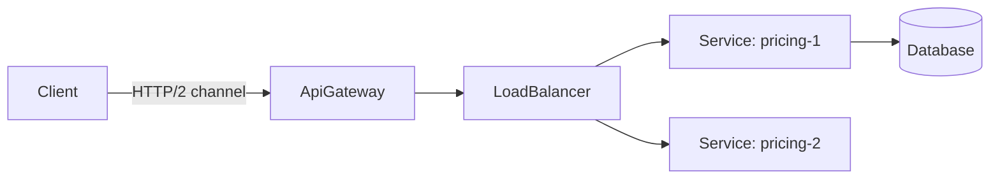
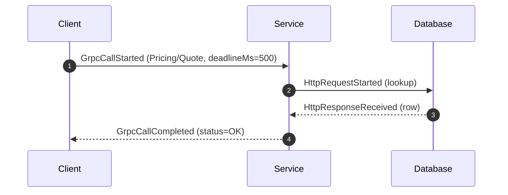
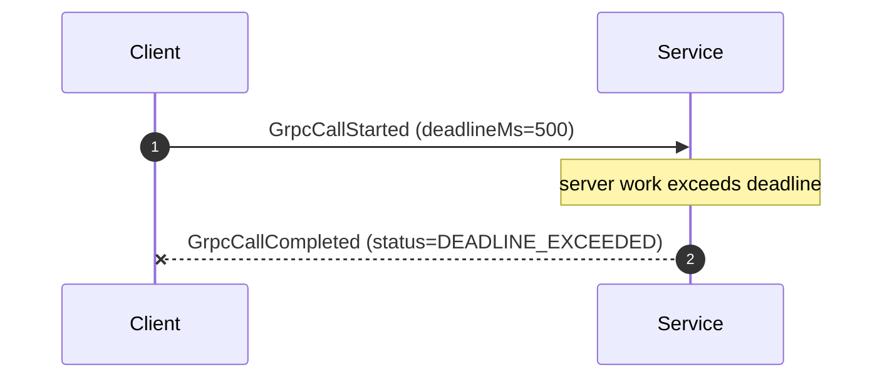

# gRPC (RPC over HTTP/2)

gRPC is DFL's canonical **contract-first, binary RPC** interaction. Like REST it is synchronous
request/response, but it runs over **HTTP/2** with Protocol Buffers, supports **multiplexed**
calls on a single connection, and adds **streaming**. gRPC teaches how a strongly-typed RPC
differs from REST while sharing the same fundamental coupling risks.

## Educational Objective

**What should the student learn?**

1. gRPC is a **remote procedure call**: the caller invokes a typed method (`GrpcCallStarted`)
   and awaits a typed result (`GrpcCallCompleted`) — it *looks* like a local function call but
   is a network hop with all the same failure modes.
2. The role of HTTP/2: a single long-lived connection **multiplexes** many concurrent calls
   (no head-of-line blocking at the request level), unlike the connection-per-request mental
   model of naive REST.
3. Protobuf **contracts** (`.proto`) give compile-time typing and compact binary framing —
   contrast with REST's text/JSON and looser coupling.
4. The four call kinds: **unary**, **server-streaming**, **client-streaming**, and
   **bidirectional streaming**, and when streaming beats repeated unary calls.
5. gRPC status codes (`OK`, `DEADLINE_EXCEEDED`, `UNAVAILABLE`, …) and how deadlines propagate.

## Architecture

| DFL Node | gRPC concept |
|----------|--------------|
| `Client` | gRPC client stub |
| `Service` | gRPC server implementing a service contract |
| `ApiGateway` | gRPC-aware gateway / transcoding front door |
| `LoadBalancer` | L7 (per-call) load balancing across server replicas |

Edges represent an HTTP/2 channel; edge `config` carries `service`, `method`, `callKind`
(`unary|serverStream|clientStream|bidi`), and `deadlineMs`.

## Flow

Unary call:

Deadline exceeded:

Server-streaming (one request, many response messages) is modelled as a single `GrpcCallStarted`
followed by multiple `MessageReceived` tokens on the return leg, then a terminal
`GrpcCallCompleted` carrying the final status.

## Visual Behavior

Animations render backend events only; see [Animations](../03-ui/animations.md).

| Backend event | Canvas animation |
|---------------|------------------|
| `GrpcCallStarted` | A call token travels forward along the HTTP/2 channel edge; the edge renders as a **thick multiplexed lane** (visually distinct from REST's single-request edge); the callee enters processing. |
| `GrpcCallCompleted` (`OK`) | A response token returns; the edge shows a green status chip with the gRPC code. |
| `GrpcCallCompleted` (error) | Return token renders red with the failing status (`UNAVAILABLE`, `DEADLINE_EXCEEDED`, …). |
| Streaming call | Multiple response tokens flow back along the same lane between `GrpcCallStarted` and the terminal `GrpcCallCompleted`, visualising the stream. |
| Multiplexing | Concurrent calls animate as parallel tokens **sharing one edge**, contrasting with REST where each request implies its own logical exchange. |

## Simulation

**Configurable parameters:**

- Channel edge: `service`, `method`, `callKind`, `deadlineMs`.
- `Client`: `callRatePerTick`, `concurrency`, `streamMessageCount` (for streaming kinds).
- `Service`: `processingTicks`, `errorStatusProbability`, `errorStatus`
  (`UNAVAILABLE|INTERNAL|RESOURCE_EXHAUSTED`), `downstreamCalls[]`.
- `LoadBalancer`: `strategy` (per-call L7).

**Emitted `SimulationEvent`s:** `GrpcCallStarted`, `GrpcCallCompleted` (carrying the gRPC status
in `payload`), `MessageReceived` (per streamed message), `NodeActivated`, and lifecycle events.
Downstream `Database`/`Service` hops emit the REST HTTP events, so a gRPC front and REST back can
be composed in one scenario.

## Failure Scenarios

| Injected condition | What happens | Events observed |
|--------------------|--------------|-----------------|
| Server slow past deadline (`LatencyInjected`) | Call fails with a deadline error | `GrpcCallCompleted` (status=`DEADLINE_EXCEEDED`) |
| Server unavailable (`NodeFailed`) | Calls fail fast | `GrpcCallCompleted` (status=`UNAVAILABLE`) |
| Error status (`errorStatusProbability`) | Typed error returned | `GrpcCallCompleted` (status=`INTERNAL`/`RESOURCE_EXHAUSTED`) |
| Stream interrupted mid-flight (`NodeFailed`) | Partial stream then terminal error | partial `MessageReceived` + failing `GrpcCallCompleted` |
| Partition (`PartitionCreated`) | Channel to the callee breaks | `GrpcCallCompleted` (status=`UNAVAILABLE`), healed by `PartitionHealed` |
| Deadline too tight for a healthy service | Premature deadline failures | `GrpcCallCompleted` (status=`DEADLINE_EXCEEDED`) despite server success |

## Metrics

- `throughput` — completed `OK` calls per tick.
- `avgLatencyMs` — `GrpcCallStarted` → `GrpcCallCompleted` span; for streams, time to terminal
  status.
- `inFlight` — concurrent open calls **per channel** (highlights HTTP/2 multiplexing).
- `retries` — retried calls when a Retry policy wraps the RPC.
- Status-code distribution (`OK` vs error codes) is shown in the inspector; error rate feeds the
  metrics dashboard.

## gRPC vs REST (contrast)

| Dimension | REST | gRPC |
|-----------|------|------|
| Transport | HTTP/1.1 (typically) | HTTP/2 (multiplexed) |
| Payload | JSON/text | Protobuf (binary) |
| Contract | OpenAPI (optional/loose) | `.proto` (compile-time, strict) |
| Streaming | Awkward (SSE/chunked) | First-class (server/client/bidi) |
| Coupling | Looser, human-readable | Tighter, typed |
| Deadlines | Client-side timeout | Propagated deadline, `DEADLINE_EXCEEDED` |
| DFL events | `HttpRequestStarted`/`HttpResponseReceived` | `GrpcCallStarted`/`GrpcCallCompleted` |

Both share the same synchronous coupling and cascading-failure risks — see [REST](./rest.md).

## Acceptance Criteria

- **Given** a healthy unary call within its deadline, **when** it runs, **then** the engine emits
  exactly one `GrpcCallStarted` and one `GrpcCallCompleted` with `status=OK`.
- **Given** a channel `deadlineMs=D` and a server whose processing exceeds D, **when** the call
  runs, **then** `GrpcCallCompleted` is emitted with `status=DEADLINE_EXCEEDED`.
- **Given** a server-streaming call with `streamMessageCount=N`, **when** it runs, **then** N
  `MessageReceived` events are emitted on the return leg followed by one terminal
  `GrpcCallCompleted`.
- **Given** a failed server (`NodeFailed`), **when** it is called, **then** `GrpcCallCompleted`
  is emitted with `status=UNAVAILABLE`.
- **Given** concurrent calls on one channel, **when** they run, **then** `inFlight` for that
  channel exceeds one, demonstrating HTTP/2 multiplexing.
- **Given** any gRPC call, **when** it completes, **then** exactly one terminal
  `GrpcCallCompleted` carries a gRPC status code in its `payload`.

## Future Improvements

- Client-streaming and bidirectional-streaming first-class visualisations.
- gRPC retry/hedging policies and `RESOURCE_EXHAUSTED` back-pressure.
- Interceptors (auth, logging) as visible pipeline stages.
- gRPC-Web transcoding at the `ApiGateway`.
- Flow-control / window-update visualisation to teach HTTP/2 back-pressure.

## Related documents

- [REST](./rest.md)
- [Retry](./retry.md)
- [Circuit Breaker](./circuit-breaker.md)
- [API Gateway](./api-gateway.md)
- [Sequence Diagrams](../02-architecture/sequence-diagrams.md)
- [Event Model](../02-architecture/event-model.md)
- [Animations](../03-ui/animations.md)
- [Synchronous Communication Learning Path](../06-learning/messaging-patterns.md)
- [Glossary](../01-product/glossary.md)
