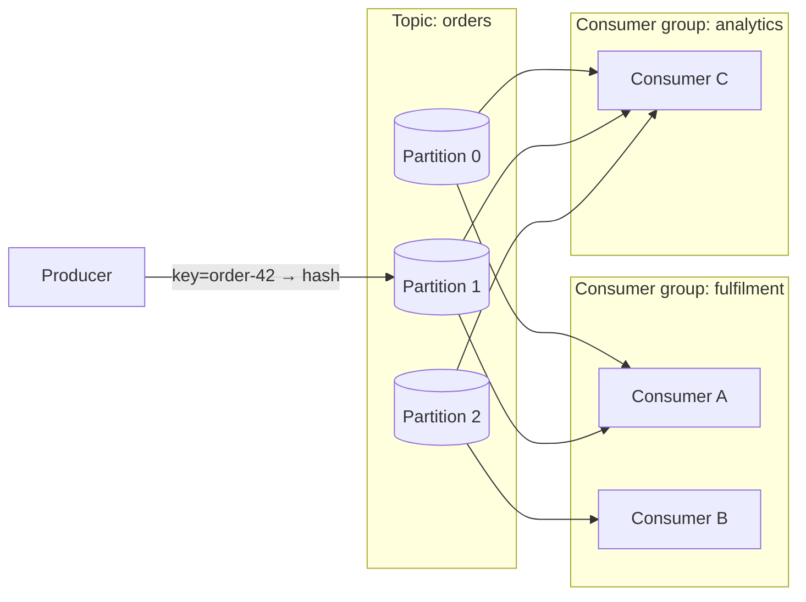

# Apache Kafka (Topics, Partitions, Offsets & Consumer Groups)

Kafka is DFL's canonical example of a **dumb-broker / smart-consumer**, log-based messaging
system. Where RabbitMQ *routes and deletes* messages, Kafka *appends and retains* them in an
ordered, replayable log. Kafka teaches partitioning, per-partition ordering, offset-based
consumption, consumer groups, and replay.

## Educational Objective

**What should the student learn?**

1. A `Topic` is an append-only log split into `Partition`s; ordering is guaranteed **only
   within a partition**, never across a topic.
2. The producer's **partition key** (not a routing key) decides which partition a message lands
   in — same key ⇒ same partition ⇒ preserved order for that key.
3. Consumers read by **offset**; the broker does not delete on consumption. A committed offset
   is a *bookmark*, which is why Kafka supports **replay** (rewind the offset).
4. A **consumer group** load-balances partitions across its members: each partition is owned by
   at most one consumer in the group, so parallelism is bounded by partition count. Multiple
   independent groups each get their own full copy of the stream (fan-out).
5. How this differs from RabbitMQ (see the contrast section) — retention vs deletion, offsets
   vs acks, partitions vs queues.

## Architecture

| DFL Node | Kafka concept |
|----------|---------------|
| `Producer` | Kafka producer (keyed publish) |
| `Topic` | Logical topic |
| `Partition` | Ordered partition log within a topic |
| `Consumer` | Consumer instance (member of a group) |
| `Broker` | Kafka broker hosting partitions (optional, for replication lessons) |

Edges:

- `Producer → Topic`: keyed publish; edge `config` carries the `partitionKey` strategy.
- `Topic → Partition`: containment; partition index derived from `hash(key) % partitionCount`.
- `Partition → Consumer`: an **assignment** within a consumer group. Edge `config` carries the
  `consumerGroup` id.



Partitions 0–2 are split across the two members of *fulfilment*, while *analytics* consumes all
three independently — the defining Kafka fan-out behaviour.

## Flow

```mermaid
sequenceDiagram
  autonumber
  participant P as Producer
  participant T as Topic
  participant Par as Partition
  participant C as Consumer (group=fulfilment)
  P->>T: MessagePublished (partitionKey=order-42)
  T->>Par: MessageRouted (hash(key) → Partition 1, offset=N)
  Par->>Par: MessageEnqueued (appended at offset N)
  Par->>C: MessageDequeued (fetch at offset N)
  C->>C: MessageReceived
  C->>C: MessageProcessed
  C->>Par: AckReceived (offset commit → N+1)
  Note over Par: log retained; offset is a bookmark, not a delete
```

`ConsumerRegistered` is emitted when a consumer joins a group (triggering partition assignment);
`NodeStateChanged` marks a rebalance.

## Visual Behavior

Animations render backend events only; see [Animations](../03-ui/animations.md).

| Backend event | Canvas animation |
|---------------|------------------|
| `MessagePublished` | Token spawns at `Producer`, tagged with its partition key. |
| `MessageRouted` | The target `Partition` highlights; the token carries a visible `offset` label. |
| `MessageEnqueued` | Token appends to the **tail** of the partition log lane; the log grows (append-only, nothing is removed). |
| `MessageDequeued` | A read cursor advances along the partition; the token copies toward the assigned `Consumer` (the log entry stays in place). |
| `MessageReceived` / `MessageProcessed` | Consumer processing glow. |
| `AckReceived` | Rendered as an **offset commit**: the committed-offset marker slides forward on the partition lane. |
| `ConsumerRegistered` / `NodeStateChanged` | Rebalance animation: partition-to-consumer assignment edges re-draw. |

The key visual distinction from RabbitMQ: the token is **not consumed out of the store** — the
log lane persists, and a separate committed-offset marker moves. This makes replay intuitive.

## Simulation

Producers publish keyed messages into a partitioned topic consumed by one or more consumer
groups. The engine models per-partition ordering, offset commits, and group rebalancing.

**Configurable parameters:**

- `Topic`: `partitionCount`, `retentionTicks`, `replicationFactor` (for broker lessons).
- `Producer`: `publishRatePerTick`, `keyStrategy` (`roundRobin|hashKey|fixed`), `keyCardinality`,
  `messageSizeBytes`.
- Consumer group: `groupId`, `memberCount`, `assignmentStrategy` (`range|roundRobin`),
  `autoCommit` (bool), `commitEveryN`.
- `Consumer`: `processingTicks`, `startOffset` (`earliest|latest|<n>` for replay).

**Emitted `SimulationEvent`s:** `MessagePublished`, `MessageRouted`, `MessageEnqueued`,
`MessageDequeued`, `MessageReceived`, `MessageProcessed`, `AckReceived` (offset commit),
`ConsumerRegistered`, `NodeStateChanged` (rebalance), lifecycle events, and — for replay —
a re-emitted sequence of `MessageDequeued` from a rewound `startOffset`.

## Failure Scenarios

| Injected condition | What happens | Events observed |
|--------------------|--------------|-----------------|
| Consumer lag (`LatencyInjected` on processing) | Committed offset trails the log tail; lag grows | growing gap between tail offset and committed offset |
| Consumer failure + rebalance (`NodeFailed`) | Its partitions reassign to surviving group members | `NodeFailed`, `NodeStateChanged`, `ConsumerRegistered` |
| Hot partition (skewed `keyStrategy=fixed`) | One partition overloads while others idle | uneven per-partition `MessageEnqueued` rates |
| Reset to `earliest` (replay) | Messages re-delivered from offset 0 | re-emitted `MessageDequeued` for retained offsets |
| Retention expiry | Log entries past `retentionTicks` age out | `MessageExpired` on aged offsets |
| Under-replicated partition (`NodeFailed` broker) | Partition leadership moves | `NodeFailed` / `NodeRecovered` on `Broker` |

## Metrics

- `throughput` — messages appended per tick and messages processed per tick per group.
- `avgLatencyMs` — `MessagePublished` → consumer `MessageProcessed`.
- `inFlight` — fetched-but-not-committed records per group.
- `retries` — reprocessed records after a rebalance or offset reset.
- Consumer-group **lag** (tail offset − committed offset), shown per partition in the inspector,
  is the headline Kafka metric derived from the event stream.

`dlqCount` is typically 0 for pure Kafka topologies (Kafka has no native DLX); dead-lettering is
modelled as an explicit error `Topic` when configured.

## Failure Scenarios vs RabbitMQ (contrast)

| Dimension | RabbitMQ | Kafka |
|-----------|----------|-------|
| Delivery model | Broker routes + deletes on ack | Broker appends + retains; consumer tracks offset |
| Ordering | Per-queue (weak once multiple consumers compete) | Strict per-partition |
| Fan-out | Bindings/exchanges | Multiple consumer groups |
| Backlog control | Queue depth / back-pressure | Consumer lag |
| Replay | Not native (must re-publish) | Native (rewind offset) |
| Parallelism unit | Competing consumers on a queue | Partitions per group |
| Dead-lettering | Native DLX (`DeadLettered`) | Modelled explicitly (error topic) |

See [RabbitMQ](./rabbitmq.md) for the routing/ack model this contrasts with.

## Acceptance Criteria

- **Given** a topic with `partitionCount=3` and `keyStrategy=hashKey`, **when** two messages
  share a partition key, **then** both `MessageRouted` events select the **same** partition and
  their offsets are strictly increasing.
- **Given** a single consumer group with 2 members over 3 partitions, **when** the group
  stabilises, **then** every partition is assigned to exactly one member and each emits
  `ConsumerRegistered`.
- **Given** two distinct consumer groups on one topic, **when** a message is published, **then**
  each group independently emits `MessageDequeued` for that offset (fan-out).
- **Given** a consumer with `startOffset=earliest` on a topic with retained records, **when**
  the simulation starts, **then** `MessageDequeued` is re-emitted for all retained offsets in
  order (replay).
- **Given** a group member fails (`NodeFailed`), **when** the group rebalances, **then**
  `NodeStateChanged` is emitted and its partitions are reassigned without gap in `sequence`.
- **Given** any Kafka simulation, **when** offsets are committed, **then** the committed offset
  is monotonically non-decreasing per (group, partition).

## Future Improvements

- Exactly-once semantics (transactions / idempotent producer) visualisation.
- Log compaction (key-based retention) demonstration.
- Static membership vs cooperative-sticky rebalancing comparison.
- Replication and ISR (in-sync replica) shrink/expand under `NodeFailed`.
- Kafka Streams / stateful processing lessons layered on top.

## Related documents

- [RabbitMQ](./rabbitmq.md)
- [Redis](./redis.md)
- [Pub/Sub](./pubsub.md)
- [Retry](./retry.md)
- [Event Model](../02-architecture/event-model.md)
- [Animations](../03-ui/animations.md)
- [Messaging Learning Path](../06-learning/messaging-patterns.md)
- [Glossary](../01-product/glossary.md)
