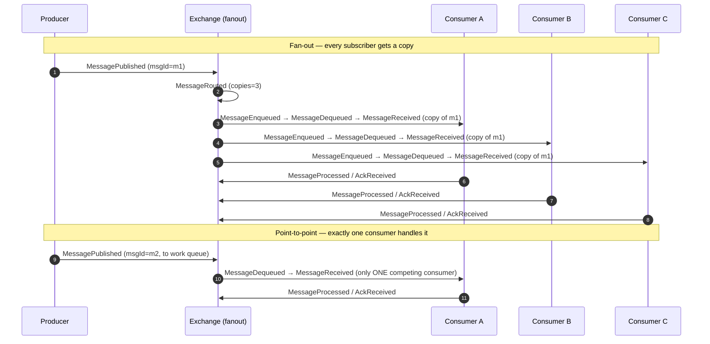

# Publish / Subscribe

## Educational Objective

*What should the student learn?*

After running this scenario a learner should be able to:

1. **Distinguish the two delivery topologies.**
   - **Point-to-point (work queue)** — a message is delivered to **exactly one** of the competing
     consumers; the work is *shared*.
   - **Publish/subscribe (fan-out)** — a message is delivered to **every** interested subscriber;
     each subscriber gets **its own copy**.
2. **Recognize the same pattern across three technologies**, and how each implements fan-out
   differently:
   - **RabbitMQ fanout exchange** — the exchange copies each message to *all* bound queues,
     ignoring routing keys; each consumer group has its own queue.
   - **Kafka topic** — the topic retains messages; each **consumer group** independently tracks
     its own offset, so every group reads every message.
   - **Redis pub/sub** — the channel pushes each message to all currently connected subscribers,
     with **no retention** (a subscriber that is offline misses the message — fire-and-forget).
3. **Reason about coupling and delivery guarantees.** Explain why fan-out decouples producers
   from an unknown, changing set of subscribers, and contrast the durability semantics
   (RabbitMQ/Kafka retain and can redeliver; Redis pub/sub does not).
4. **Predict subscriber behavior** when subscribers are added, removed, or slow, and see why one
   slow subscriber must not stall the others.

This builds on [RabbitMQ](./rabbitmq.md), [Kafka](./kafka.md), and [Redis](./redis.md).

## Architecture

The scenario models a single `Producer` publishing to a fan-out point (`Exchange`/`Topic`/
`Broker` channel) with **multiple independent subscribers**, each receiving its own copy. A
point-to-point comparison group (competing consumers on one queue) is included as a contrast.

```mermaid
flowchart LR
  P[Producer]:::producer -->|MessagePublished| FX[Exchange: fanout<br/>/ Topic / Redis channel]:::exchange

  subgraph Pub/Sub — fan-out (each gets a copy)
    FX -->|MessageRouted| QA[Queue: sub-A]:::queue
    FX -->|MessageRouted| QB[Queue: sub-B]:::queue
    FX -->|MessageRouted| QC[Queue: sub-C]:::queue
    QA --> CA[Consumer A]:::consumer
    QB --> CB[Consumer B]:::consumer
    QC --> CC[Consumer C]:::consumer
  end

  subgraph Point-to-point — competing consumers (shared)
    P -->|MessagePublished| WQ[Queue: work]:::queue
    WQ --> W1[Consumer W1]:::consumer
    WQ --> W2[Consumer W2]:::consumer
  end

  classDef producer fill:#1e3a8a,color:#fff,stroke:#1e40af;
  classDef exchange fill:#7c2d12,color:#fff,stroke:#9a3412;
  classDef queue fill:#3730a3,color:#fff,stroke:#4338ca;
  classDef consumer fill:#166534,color:#fff,stroke:#15803d;
```

| Node | `NodeType` | Role |
|------|-----------|------|
| Producer | `Producer` | Publishes messages to the fan-out point and/or work queue. |
| fanout / topic / channel | `Exchange` (RabbitMQ), `Topic` (Kafka), or `Broker` (Redis) | The fan-out point; copies each message to all subscribers. |
| sub-A/B/C | `Queue` | Per-subscriber buffer (RabbitMQ/Kafka). Redis pub/sub has no queue — messages push directly. |
| Consumer A/B/C | `Consumer` | Independent subscribers, each processing its own copy. |
| work | `Queue` | Point-to-point work queue shared by competing consumers. |
| Consumer W1/W2 | `Consumer` | Competing consumers that *share* the work. |

**Technology mapping** is selected by a scenario `transport` flag:

| Transport | Fan-out node | Retention | Missed-while-offline? |
|-----------|-------------|-----------|-----------------------|
| RabbitMQ fanout | `Exchange` (type=fanout) → one `Queue` per subscriber | Durable queues retain | No — queue buffers |
| Kafka topic | `Topic` → `Partition`s; one consumer group per subscriber | Log retention | No — offset-based catch-up |
| Redis pub/sub | `Broker` channel | None | **Yes** — fire-and-forget |

## Flow

Canonical events only. One publish fans out to three subscribers (each receives a copy), then the
point-to-point case shows a single delivery to one of two competing consumers.



The defining contrast, visible on the timeline: message `m1` produces **three**
`MessageReceived` events (one per subscriber) from a single `MessagePublished`, whereas the
point-to-point `m2` produces **one** `MessageReceived` total.

## Visual Behavior

All animation is backend-event-driven; see [UI Animations](../03-ui/animations.md).

| Backend event | Animation |
|---------------|-----------|
| `MessagePublished` | A message token spawns at the `Producer` and travels to the fan-out node. |
| `MessageRouted` (fan-out) | The token **splits** into N colored copies at the exchange, one per bound subscriber, fanning out along N edges simultaneously. |
| `MessageEnqueued` | Each copy settles into its subscriber's queue; per-subscriber depth badges increment. |
| `MessageDequeued` / `MessageReceived` | Copies flow to their consumers independently; a slow subscriber's copy visibly lags without blocking the others. |
| `MessageProcessed` / `AckReceived` | Each consumer marks its copy done independently. |
| `ConsumerRegistered` | A new subscriber node fades in and its edge to the fan-out point is drawn; (Redis) it only receives messages published *after* it appears. |
| `MessageDropped` | (Redis transport) a token published while a subscriber is offline dissolves at that subscriber's edge — the fire-and-forget lesson. |

For the point-to-point group, `MessageRouted` does **not** split the token; a single token is
delivered to exactly one competing consumer, chosen round-robin, making "shared vs copied"
immediately legible side by side.

## Simulation

**What DFL simulates.** A single producer fanning out to N independent subscribers under a
selectable transport (RabbitMQ fanout / Kafka topic / Redis pub/sub), alongside a competing-
consumers work queue for contrast, with dynamic subscriber join/leave.

**Configurable parameters:**

| Parameter | Type | Default | Meaning |
|-----------|------|---------|---------|
| `transport` | enum `rabbitmq-fanout \| kafka-topic \| redis-pubsub` | `rabbitmq-fanout` | Fan-out implementation and its retention semantics. |
| `subscriberCount` | int | `3` | Number of independent fan-out subscribers. |
| `competingConsumers` | int | `2` | Consumers sharing the point-to-point work queue. |
| `publishRatePerTick` | int | `1` | Messages published per tick. |
| `subscriberProcessMs` | map sub→int | `{}` | Per-subscriber processing time (create a slow subscriber). |
| `lateSubscriberJoinTick` | int (nullable) | `null` | Tick at which an extra subscriber joins (`ConsumerRegistered`). |
| `retention` | derived from `transport` | — | Whether offline subscribers can catch up. |

**Emitted `SimulationEvent`s** (canonical): `SimulationStarted`, `TickAdvanced`,
`ConsumerRegistered`, `MessagePublished`, `MessageRouted`, `MessageEnqueued`, `MessageDequeued`,
`MessageReceived`, `MessageProcessed`, `AckReceived`, `MessageDropped`, `NodeStateChanged`,
`NodeFailed`, `NodeRecovered`, `SimulationCompleted`.

## Failure Scenarios

Injected via `POST /api/v1/simulations/{id}/faults`.

1. **Slow subscriber (no head-of-line blocking across subscribers).** Set a large
   `subscriberProcessMs` for one subscriber. Its queue backs up while the others keep pace.
   *Lesson:* fan-out isolates subscribers — one slow consumer does not stall the rest.
2. **Late subscriber, Redis vs durable.** With `lateSubscriberJoinTick` set: under
   `redis-pubsub` the late subscriber misses all earlier messages (`MessageDropped` for it);
   under `rabbitmq-fanout`/`kafka-topic` behavior depends on binding/offset — teaching retention
   vs fire-and-forget.
3. **Subscriber crash and recovery.** Fail a subscriber (`NodeFailed`) mid-stream, then recover
   it (`NodeRecovered`). Durable transports let it resume from its queue/offset; Redis pub/sub
   shows a permanent gap. *Lesson:* durability determines recoverability.
4. **Fan-out amplification.** Increase `subscriberCount`; observe total delivered copies scale
   linearly with subscribers for the same publish rate. *Lesson:* fan-out multiplies downstream
   load — a capacity-planning insight.

## Metrics

From `GET /api/v1/simulations/{id}/metrics` as [`MetricSnapshot`](../02-architecture/event-model.md).

| `MetricSnapshot` field | Meaning in this scenario |
|------------------------|--------------------------|
| `tick` | Snapshot logical clock. |
| `throughput` | Total `MessageReceived` per tick across all subscribers (fan-out multiplies this). |
| `avgLatencyMs` | Average publish→receive latency; broken out per subscriber to expose the slow one. |
| `inFlight` | Messages enqueued but not yet processed, summed across subscriber queues. |
| `dlqCount` | Copies dead-lettered (durable transports, if a subscriber persistently fails). |
| `retries` | `MessageRetried` count across subscribers. |

Derived teaching measures: **fan-out factor** (`MessageReceived` ÷ `MessagePublished`), **per-
subscriber lag**, and **missed-message count** (Redis transport, copies a subscriber never
received).

## Acceptance Criteria

- **Given** `transport = rabbitmq-fanout` and `subscriberCount = 3`, **when** the producer emits
  one `MessagePublished`, **then** the engine emits one `MessageRouted` with `copies=3` and
  exactly three `MessageReceived` events (one per subscriber) for that `correlationId`.
- **Given** the point-to-point work queue with `competingConsumers = 2`, **when** one message is
  published to it, **then** exactly one `MessageReceived` is emitted total, and the token
  animation is not split.
- **Given** `transport = redis-pubsub` and `lateSubscriberJoinTick` set, **when** the subscriber
  joins after earlier publishes, **then** it emits `ConsumerRegistered` and receives only
  messages published at or after its join tick; earlier messages produce `MessageDropped` for it.
- **Given** one subscriber has a large `subscriberProcessMs`, **when** the stream runs, **then**
  that subscriber's queue depth and per-subscriber latency rise while the other subscribers'
  latencies remain unaffected.
- **Given** any fan-out, **when** the client renders it, **then** the number of copy tokens
  animated at `MessageRouted` equals the number of bound subscribers, derived solely from backend
  events.

## Future Improvements

- **Topic-based routing** — contrast fanout with RabbitMQ `topic`/`direct` exchanges and Kafka
  key-based partitioning, teaching selective subscription.
- **Consumer group scaling in Kafka** — animate partition rebalancing as subscribers within a
  group scale in and out.
- **Backpressure & flow control** — model publisher throttling when subscriber queues exceed a
  high-water mark.
- **Exactly-once vs at-least-once overlays** — visualize duplicate delivery and idempotent
  handling per transport.

## Related documents

- [RabbitMQ](./rabbitmq.md)
- [Kafka](./kafka.md)
- [Redis](./redis.md)
- [DLQ](./dlq.md)
- [Event Model](../02-architecture/event-model.md)
- [UI Animations](../03-ui/animations.md)
- [Learning: Messaging Fundamentals](../06-learning/messaging-patterns.md)
- [Glossary](../01-product/glossary.md)
