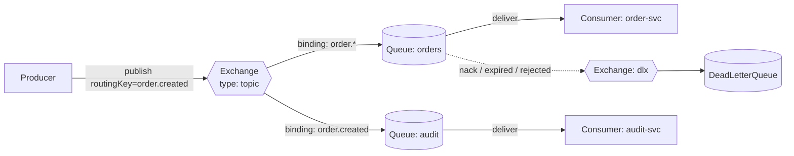
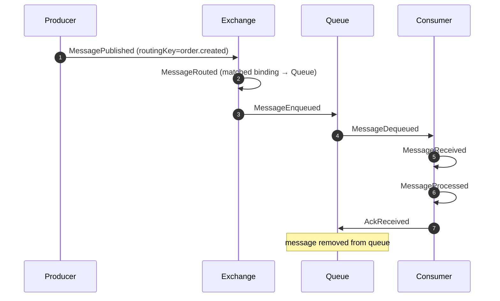
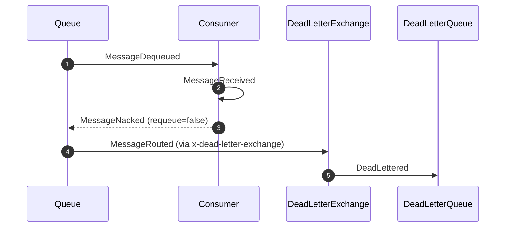

# RabbitMQ (AMQP Exchanges, Queues, Routing & DLX)

RabbitMQ is DFL's canonical example of a **smart-broker / dumb-consumer** messaging system.
It teaches how a message is *routed* — not just moved — from a `Producer` to one or more
`Queue`s through an `Exchange`, and how acknowledgement, negative acknowledgement, and
dead-lettering govern reliable delivery.

## Educational Objective

**What should the student learn?**

After running the RabbitMQ scenarios, a learner should be able to:

1. Explain the AMQP routing model: a `Producer` never publishes to a `Queue` directly; it
   publishes to an `Exchange`, and **bindings + routing keys** decide which `Queue`s receive
   a copy of the `Message`.
2. Distinguish the exchange types — `direct`, `topic`, `fanout`, `headers` — and predict the
   fan-out of a given routing key against a given set of bindings.
3. Describe the delivery contract: a `Consumer` must **ack** a message (`AckReceived`) to have
   it removed from the queue; a **nack** (`MessageNacked`) with `requeue=false` (or a rejected,
   expired, or over-length message) routes the message to a **Dead Letter Exchange (DLX)** and
   ultimately a `DeadLetterQueue` (`DeadLettered`).
4. Reason about *at-least-once* delivery, redelivery, and why consumers must be idempotent.
5. Contrast RabbitMQ's per-queue competing-consumer model with Kafka's partition/offset model
   (see [Kafka](./kafka.md)).

## Architecture

RabbitMQ topologies are composed from canonical `NodeType`s:

| DFL Node | RabbitMQ concept |
|----------|------------------|
| `Producer` | Publishing application |
| `Exchange` | AMQP exchange (direct/topic/fanout/headers) |
| `Queue` | AMQP queue |
| `Consumer` | Subscribing application (competing consumer) |
| `DeadLetterQueue` | Queue bound to the configured DLX |

Edges model AMQP relationships:

- `Producer → Exchange`: a publish channel. Edge `config` carries the published `routingKey`.
- `Exchange → Queue`: a **binding**. Edge `config` carries the `bindingKey` (and `arguments`
  for `headers` exchanges).
- `Queue → Consumer`: a subscription / delivery channel.
- `Queue → DeadLetterQueue` (via a DLX `Exchange`): the dead-letter path, materialised as the
  queue's `x-dead-letter-exchange` argument.

## Flow

The happy path takes a message from publication to acknowledgement. The engine emits the
canonical messaging events in strict order, correlated by `correlationId` (the `messageId`).

Unhappy path (dead-lettering after a rejected delivery):

## Visual Behavior

Every animation is a rendering of a backend `SimulationEvent`; the canvas never invents state.
See [Animations](../03-ui/animations.md) for the shared token/edge animation system.

| Backend event | Canvas animation |
|---------------|------------------|
| `MessagePublished` | A message token spawns at the `Producer` and travels along the `Producer → Exchange` edge. |
| `MessageRouted` | The `Exchange` node pulses; the matched binding edge(s) highlight to show which queues were selected. Unmatched bindings stay dim. |
| `MessageEnqueued` | The token settles into the target `Queue`; the queue's depth badge increments. |
| `MessageDequeued` | The token leaves the head of the queue toward the `Consumer`; depth badge decrements. |
| `MessageReceived` | The `Consumer` node enters a "processing" state (spinner/glow). |
| `MessageProcessed` | The processing glow resolves to success. |
| `AckReceived` | A short confirmation pulse travels back `Consumer → Queue`; the in-flight counter drops. |
| `MessageNacked` | The token flashes a warning color; a nack pulse returns to the `Queue`. |
| `DeadLettered` | The token routes along the dashed DLX path and drops into the `DeadLetterQueue`, whose count badge increments in an alert color. |

Presentation-only `AnimationStarted` / `AnimationFinished` bracket each token's motion; they
carry no new state and are derived on the client.

## Simulation

The RabbitMQ simulation drives one or more producers publishing messages through an exchange
into bound queues, consumed by competing consumers, with optional DLX.

**Configurable parameters** (node/edge `config`):

- `Exchange`: `exchangeType` (`direct|topic|fanout|headers`).
- Binding edge: `bindingKey`, header `arguments` (headers exchange).
- `Producer`: `publishRatePerTick`, `routingKeys[]` (with weights), `messageSizeBytes`.
- `Queue`: `maxLength` (for overflow → dead-letter), `messageTtlTicks`, `deadLetterExchange`,
  `prefetch` (competing-consumer fairness).
- `Consumer`: `concurrency`, `processingTicks` (or distribution), `ackMode` (`auto|manual`),
  `nackProbability`, `requeueOnNack`.

**Emitted `SimulationEvent`s:** `MessagePublished`, `MessageRouted`, `MessageEnqueued`,
`MessageDequeued`, `MessageReceived`, `MessageProcessed`, `AckReceived`, `MessageNacked`,
`MessageExpired`, `MessageDropped`, `DeadLettered`, plus lifecycle (`SimulationStarted` …
`SimulationCompleted`), `NodeActivated`, and `ConsumerRegistered`.

## Failure Scenarios

DFL teaches failure via `Fault Injection` (`POST /api/v1/simulations/{id}/faults`). Each
scenario has an observable, event-backed outcome:

| Injected condition | What happens | Events observed |
|--------------------|--------------|-----------------|
| Consumer rejects work (`nackProbability > 0`, `requeue=false`) | Messages dead-letter | `MessageNacked` → `DeadLettered` |
| Slow consumer (`LatencyInjected` on processing) | Queue depth grows, back-pressure builds | rising `MessageEnqueued` vs `MessageDequeued` gap |
| Queue overflow (`maxLength` exceeded) | Oldest/overflow messages dead-lettered or dropped | `MessageDropped` / `DeadLettered` |
| Message TTL expiry | Unconsumed messages expire and dead-letter | `MessageExpired` → `DeadLettered` |
| Consumer node failure (`NodeFailed`) | Unacked messages are requeued and redelivered to survivors | `NodeFailed`, redelivered `MessageDequeued` |
| Poison message | Repeated nack/redelivery until DLX threshold | repeated `MessageNacked` → `DeadLettered` |

Dead-lettering mechanics are covered in depth in [Dead Letter Queue](./dlq.md).

## Metrics

Derived from the event stream and surfaced via `MetricSnapshot` (see canon §10):

- `throughput` — acknowledged messages per tick (`AckReceived` rate).
- `avgLatencyMs` — mean `MessagePublished` → `AckReceived` span per message.
- `inFlight` — enqueued but not yet acked (`MessageEnqueued` − `AckReceived`), i.e. live queue depth.
- `dlqCount` — cumulative `DeadLettered` count.
- `retries` — redeliveries triggered by nack/requeue.

Per-queue depth and per-consumer utilisation are shown in the inspector, derived from the same
events.

## Acceptance Criteria

- **Given** a `topic` exchange with binding `order.*` to queue *orders*, **when** a `Producer`
  publishes with routing key `order.created`, **then** the engine emits `MessageRouted`
  selecting *orders* and `MessageEnqueued` on *orders* only.
- **Given** a message published with a routing key matching **no** binding, **when** it is
  routed, **then** it is either dropped (`MessageDropped`) or dead-lettered per exchange
  config, and never `MessageEnqueued` on an unbound queue.
- **Given** a consumer with `ackMode=manual`, **when** it emits `MessageProcessed`, **then**
  exactly one `AckReceived` follows and `inFlight` decrements by one.
- **Given** a consumer configured to nack with `requeue=false`, **when** it rejects a message,
  **then** the engine emits `MessageNacked` followed by `DeadLettered`, and `dlqCount`
  increments by one.
- **Given** a queue with `messageTtlTicks=N`, **when** a message sits unconsumed for more than
  N ticks, **then** `MessageExpired` and (if a DLX is configured) `DeadLettered` are emitted.
- **Given** any RabbitMQ simulation, **when** the client subscribes to `SimulationHub`, **then**
  every messaging event arrives with a monotonic `sequence` and no gaps.

## Future Improvements

- Publisher confirms and mandatory/return flows (unroutable message returns).
- Quorum vs classic queues and replication/failover visualisation.
- Priority queues and consumer priorities.
- Lazy queues and disk-vs-memory back-pressure demonstration.
- Shovel/federation across two broker nodes for multi-cluster topology lessons.

## Related documents

- [Kafka](./kafka.md)
- [Redis](./redis.md)
- [Dead Letter Queue](./dlq.md)
- [Pub/Sub](./pubsub.md)
- [Retry](./retry.md)
- [Event Model](../02-architecture/event-model.md)
- [Animations](../03-ui/animations.md)
- [Messaging Learning Path](../06-learning/messaging-patterns.md)
- [Glossary](../01-product/glossary.md)
