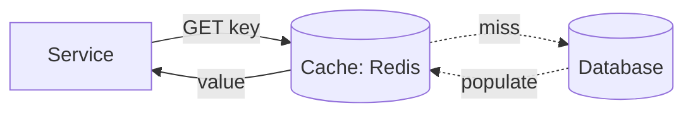
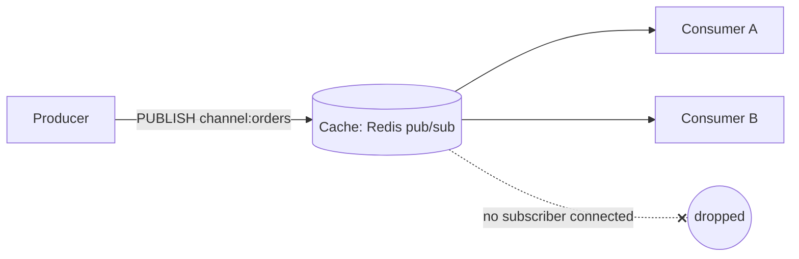
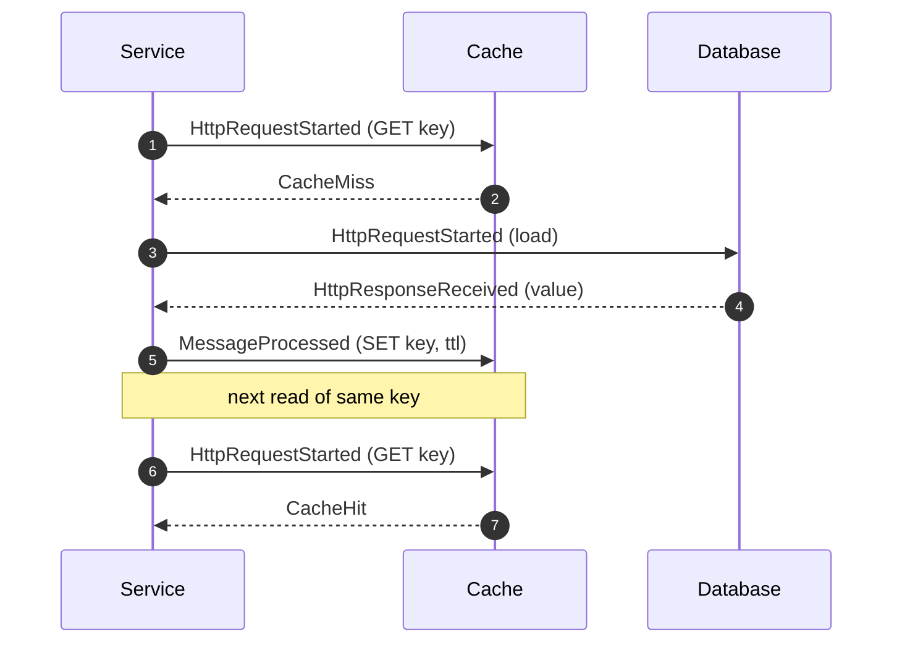
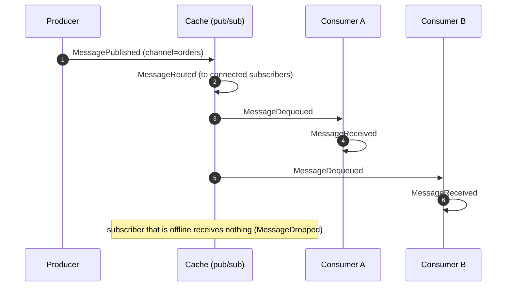

# Redis (Cache & Pub/Sub)

Redis appears in DFL in two distinct educational roles that share one `NodeType` (`Cache`):

1. **As a cache** — an in-memory key/value store fronting a slower `Database`, teaching hit/miss
   behaviour, TTL, and eviction.
2. **As a Pub/Sub broker** — a fire-and-forget, at-most-once channel fan-out, teaching how
   ephemeral messaging differs from durable brokers like RabbitMQ and Kafka.

## Educational Objective

**What should the student learn?**

1. Why a cache exists: it trades memory for latency, absorbing read load that would otherwise
   hit the `Database`. A **hit** (`CacheHit`) is fast and cheap; a **miss** (`CacheMiss`) pays
   the full backend cost and (usually) populates the cache.
2. How TTL and eviction bound cache size, and why eviction (`CacheEvicted`) causes future misses
   — the cache is a *probabilistic* accelerator, not a source of truth.
3. Redis Pub/Sub semantics: **at-most-once, fire-and-forget** — messages are delivered only to
   subscribers connected *at publish time*; there is no persistence, no offset, no ack, no
   replay. This is the deliberate opposite of Kafka retention and RabbitMQ acking.
4. When to reach for cache vs a broker, and why Redis Pub/Sub is unsuitable for work that must
   not be lost.

## Architecture

| DFL Node | Redis concept |
|----------|---------------|
| `Cache` | Redis instance (cache role **or** pub/sub role) |
| `Service` | Application reading/writing the cache |
| `Database` | Backing store behind the cache |
| `Producer` | Publisher to a Redis channel |
| `Consumer` | Subscriber to a Redis channel |

### Cache role

### Pub/Sub role

## Flow

### Cache-aside read (miss then hit)

### Pub/Sub delivery (at-most-once fan-out)

There is intentionally **no `AckReceived`** in the pub/sub flow — Redis Pub/Sub does not
acknowledge.

## Visual Behavior

Animations render backend events only; see [Animations](../03-ui/animations.md).

| Backend event | Canvas animation |
|---------------|------------------|
| `CacheHit` | `Cache` node flashes green; the token returns to the `Service` on a **short** edge (fast latency) — no `Database` traversal. |
| `CacheMiss` | `Cache` flashes amber; the token continues to the `Database` on the long path, then a populate token returns to the `Cache`. |
| `CacheEvicted` | An entry token drops out of the cache's key-set visual; the eviction badge increments. |
| `MessagePublished` (pub/sub) | Token spawns at `Producer` toward the `Cache`. |
| `MessageRouted` | `Cache` fans the token into one copy per **currently connected** subscriber edge. |
| `MessageDequeued` / `MessageReceived` | Tokens arrive at each subscriber and trigger a processing glow. |
| `MessageDropped` | For an offline subscriber, the token dissolves at the broker — the visual teaching moment for at-most-once. |

## Simulation

**Cache role parameters** (see [Cache](./cache.md) for pattern detail):

- `Cache`: `pattern` (`cache-aside|read-through|write-through`), `maxEntries`,
  `evictionPolicy` (`lru|lfu|random`), `ttlTicks`.
- `Service`: `readRatePerTick`, `keyCardinality`, `readSkew` (hot-key distribution).
- `Database`: `readLatencyTicks`.

**Pub/Sub role parameters:**

- `Cache` (pub/sub): `channels[]`.
- `Producer`: `publishRatePerTick`, `channel`.
- `Consumer`: `subscribeChannels[]`, `onlineProbability` (to demonstrate missed messages).

**Emitted `SimulationEvent`s:** cache role — `CacheHit`, `CacheMiss`, `CacheEvicted`, plus the
`HttpRequestStarted`/`HttpResponseReceived` pair for the backing `Database` load; pub/sub role —
`MessagePublished`, `MessageRouted`, `MessageDequeued`, `MessageReceived`, `MessageDropped`.
Both roles emit the lifecycle events.

## Failure Scenarios

| Injected condition | What happens | Events observed |
|--------------------|--------------|-----------------|
| Cache node failure (`NodeFailed`) | All reads fall through to the `Database`; latency spikes | 100% `CacheMiss`, rising `avgLatencyMs` |
| Cache stampede (cold cache + hot key) | Many concurrent misses hammer the `Database` | burst of `CacheMiss` + `HttpRequestStarted` |
| Aggressive eviction (`maxEntries` too small) | Working set thrashes, hit ratio collapses | high `CacheEvicted`, falling `CacheHit` ratio |
| TTL too short | Entries expire before reuse | `CacheEvicted` (expiry) then `CacheMiss` |
| Subscriber offline at publish (pub/sub) | Message lost, never delivered | `MessageDropped` (no redelivery, no `DeadLettered`) |
| Broker restart (pub/sub `NodeFailed`) | In-flight publishes to that instant are lost | `MessageDropped` |

## Metrics

- **Cache hit ratio** = `CacheHit / (CacheHit + CacheMiss)` — the headline cache metric, shown
  in the inspector and metrics dashboard.
- `avgLatencyMs` — effective read latency, which falls as hit ratio rises (misses pay the
  `Database` latency).
- `throughput` — reads served per tick (cache) / messages delivered per tick (pub/sub).
- `inFlight` — outstanding backing-store loads.
- `dlqCount` — 0 for Redis (no dead-lettering); dropped pub/sub messages are counted separately
  as `MessageDropped`, **not** as DLQ.

## Acceptance Criteria

- **Given** an empty cache and a read for key K, **when** the `Service` reads K, **then** the
  engine emits `CacheMiss`, loads from the `Database`, and a subsequent read of K emits
  `CacheHit`.
- **Given** `maxEntries=N` with an LRU policy, **when** the (N+1)th distinct key is cached,
  **then** the least-recently-used entry emits `CacheEvicted`.
- **Given** `ttlTicks=T`, **when** an entry ages beyond T ticks, **then** it emits `CacheEvicted`
  (expiry) and the next read of that key emits `CacheMiss`.
- **Given** a Redis pub/sub channel with one online and one offline subscriber, **when** a
  message is published, **then** the online subscriber emits `MessageReceived` and the offline
  subscriber's copy emits `MessageDropped` with no redelivery.
- **Given** any Redis pub/sub flow, **when** a message is delivered, **then** **no**
  `AckReceived` or `DeadLettered` event is emitted (at-most-once, no durability).
- **Given** the cache node fails (`NodeFailed`), **when** reads continue, **then** every read
  emits `CacheMiss` until `NodeRecovered`.

## Future Improvements

- Redis Streams (durable, offset-based) as a bridge between pub/sub and Kafka lessons.
- Keyspace notifications and cache-invalidation-on-write scenarios.
- Cluster mode with hash slots and resharding.
- Distributed lock (`SETNX`) pattern demonstration.
- Write-behind caching with batched flush to the `Database`.

## Related documents

- [Cache](./cache.md)
- [Pub/Sub](./pubsub.md)
- [RabbitMQ](./rabbitmq.md)
- [Kafka](./kafka.md)
- [Event Model](../02-architecture/event-model.md)
- [Animations](../03-ui/animations.md)
- [Caching Learning Path](../06-learning/architectural-patterns.md)
- [Glossary](../01-product/glossary.md)
