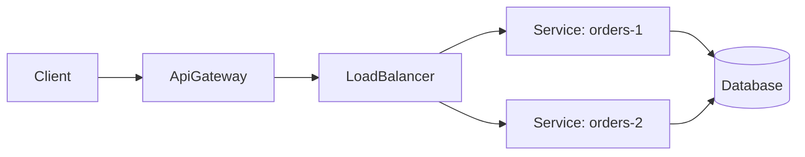
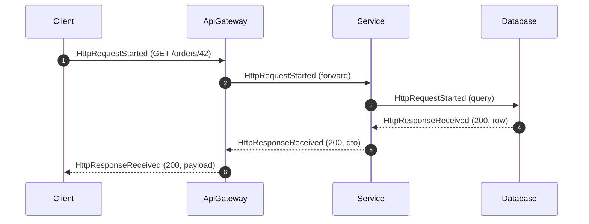
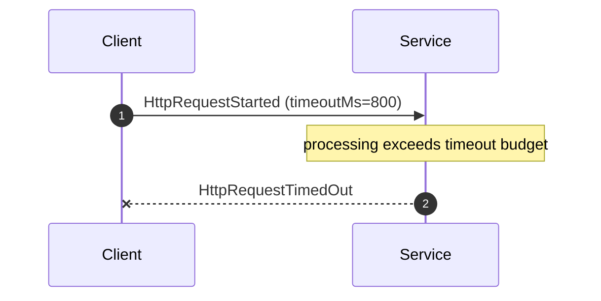

# REST (Synchronous HTTP Request/Response)

REST is DFL's canonical **synchronous, request/response** interaction. Unlike messaging, where a
`Producer` fires and forgets, a REST caller **blocks** waiting for a response and is directly
exposed to the callee's latency and failures. REST teaches the coupling, timeout, and cascading-
failure characteristics that motivate the resilience patterns elsewhere in the catalog.

## Educational Objective

**What should the student learn?**

1. The request/response contract: a caller issues `HttpRequestStarted` and cannot proceed until
   it receives `HttpResponseReceived`, `HttpRequestFailed`, or `HttpRequestTimedOut`.
2. **Synchronous coupling**: the caller's latency is the *sum* of every downstream hop it waits
   on; one slow dependency slows the whole chain.
3. How an `ApiGateway` and `LoadBalancer` sit in front of `Service`s (routing, fan-in/out, spreading load).
4. Failure modes unique to sync calls: timeouts, error responses (`4xx`/`5xx`), and **cascading
   failure** when a slow dependency exhausts the caller's threads/connections.
5. Why Retry, Circuit Breaker, and Cache exist — they all mitigate the risks this document makes
   visible.

## Architecture

| DFL Node | REST concept |
|----------|--------------|
| `Client` | External caller (browser, mobile, external system) |
| `ApiGateway` | Single entry point; routing, auth, aggregation |
| `LoadBalancer` | Distributes requests across service replicas |
| `Service` | HTTP microservice / API |
| `Database` | Backing store a service calls synchronously |

Edges are **directed request channels**; the response travels back along the same edge. Edge
`config` carries `timeoutMs`, `path`, and `method`.

## Flow

Timeout / failure variant:

The complete multi-hop sequence library lives in
[Sequence Diagrams](../02-architecture/sequence-diagrams.md).

## Visual Behavior

Animations render backend events only; see [Animations](../03-ui/animations.md).

| Backend event | Canvas animation |
|---------------|------------------|
| `HttpRequestStarted` | A request token travels **forward** along the edge; the edge shows a directional "in-flight" pulse; the target node enters a processing state. |
| `HttpResponseReceived` | A response token travels **back** along the same edge to the caller; a `2xx` renders green, `4xx`/`5xx` amber/red. The caller's waiting glow resolves. |
| `HttpRequestFailed` | The edge flashes red; an error badge appears on the caller; no response token returns. |
| `HttpRequestTimedOut` | The request token fades mid-edge when the `timeoutMs` budget elapses; a timeout badge appears on the caller. |
| `NodeFailed` on a `Service` | The node greys out; inbound requests immediately produce `HttpRequestFailed`. |

Because responses animate on the **return** leg, learners literally see the caller *waiting* —
the visual signature of synchronous coupling.

## Simulation

The REST simulation drives clients issuing requests through gateways/load balancers to services,
each of which may call further services or a database, all synchronously.

**Configurable parameters:**

- `Client`: `requestRatePerTick`, `concurrency`, `targetPath`.
- `ApiGateway`: `routes[]` (path → service), `aggregation` (fan-out/fan-in).
- `LoadBalancer`: `strategy` (`roundRobin|leastConnections|random`), `replicaCount`.
- `Service`: `processingTicks` (or distribution), `errorProbability`, `downstreamCalls[]`.
- Request edge: `timeoutMs`, `method`, `path`.

**Emitted `SimulationEvent`s:** `HttpRequestStarted`, `HttpResponseReceived`,
`HttpRequestFailed`, `HttpRequestTimedOut`, `NodeActivated`, plus lifecycle events. When Retry or
Circuit Breaker nodes wrap a call, the corresponding events from [Retry](./retry.md) and
[Circuit Breaker](./circuit-breaker.md) interleave.

## Failure Scenarios

| Injected condition | What happens | Events observed |
|--------------------|--------------|-----------------|
| Slow dependency (`LatencyInjected`) | Callers wait; requests breach `timeoutMs` | `HttpRequestTimedOut` |
| Service returns errors (`errorProbability`) | Callers receive `5xx` | `HttpResponseReceived` (5xx) / `HttpRequestFailed` |
| Service down (`NodeFailed`) | All inbound calls fail fast | `HttpRequestFailed` |
| Cascading failure | A slow leaf service saturates callers up the chain, which then time out | timeouts propagating **upstream** hop by hop |
| Network partition (`PartitionCreated`) | Requests across the partition boundary fail | `HttpRequestFailed`, healed by `PartitionHealed` |
| Thundering herd | A spike of `Client` requests overwhelms a service | rising `inFlight`, then `HttpRequestTimedOut` |

Cascading failure is the flagship REST lesson and the direct motivation for the Circuit Breaker.

## Metrics

- `throughput` — successful responses (`2xx`) per tick.
- `avgLatencyMs` — mean `HttpRequestStarted` → `HttpResponseReceived` span; broken down per hop
  in the inspector.
- `inFlight` — concurrent outstanding requests (the coupling/back-pressure signal).
- `retries` — retried calls when a Retry policy wraps the edge.
- Error rate = (`HttpRequestFailed` + `HttpRequestTimedOut` + `5xx`) / total — surfaced in the
  metrics dashboard.
- `dlqCount` is not applicable to pure REST topologies.

## Acceptance Criteria

- **Given** a `Client → Service` call that completes within budget, **when** it runs, **then**
  the engine emits exactly one `HttpRequestStarted` followed by one `HttpResponseReceived`, and
  `avgLatencyMs` reflects their span.
- **Given** an edge `timeoutMs=T` and a service whose processing exceeds T, **when** the call
  runs, **then** the engine emits `HttpRequestTimedOut` and **no** `HttpResponseReceived` for
  that request.
- **Given** a `Service` with `errorProbability=1.0`, **when** it is called, **then** every call
  yields a `5xx` `HttpResponseReceived` (or `HttpRequestFailed`) and the error-rate metric is 100%.
- **Given** a `LoadBalancer` with `strategy=roundRobin` and 2 replicas, **when** 4 requests
  arrive, **then** each replica receives exactly 2 `HttpRequestStarted` events.
- **Given** a chain A→B→C where C is slow (`LatencyInjected`), **when** requests flow, **then**
  timeouts appear first at C's caller and propagate upstream, demonstrating cascading failure.
- **Given** a failed `Service` (`NodeFailed`), **when** it is called, **then** the caller
  receives `HttpRequestFailed` without a full timeout wait.

## Future Improvements

- Connection-pool / thread-pool exhaustion modelling for realistic cascading failure.
- Bulkhead isolation pattern to contain failures.
- HTTP caching headers integrated with the [Cache](./cache.md) node.
- Rate limiting / throttling (`429`) at the `ApiGateway`.
- Distributed tracing waterfall view built from `traceId` across hops.

## Related documents

- [gRPC](./grpc.md)
- [Cache](./cache.md)
- [Retry](./retry.md)
- [Circuit Breaker](./circuit-breaker.md)
- [API Gateway](./api-gateway.md)
- [Sequence Diagrams](../02-architecture/sequence-diagrams.md)
- [Event Model](../02-architecture/event-model.md)
- [Animations](../03-ui/animations.md)
- [Synchronous Communication Learning Path](../06-learning/messaging-patterns.md)
- [Glossary](../01-product/glossary.md)
