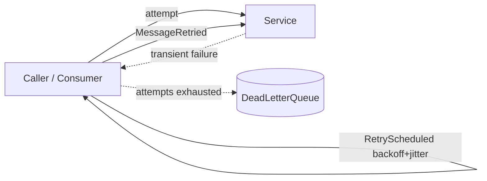
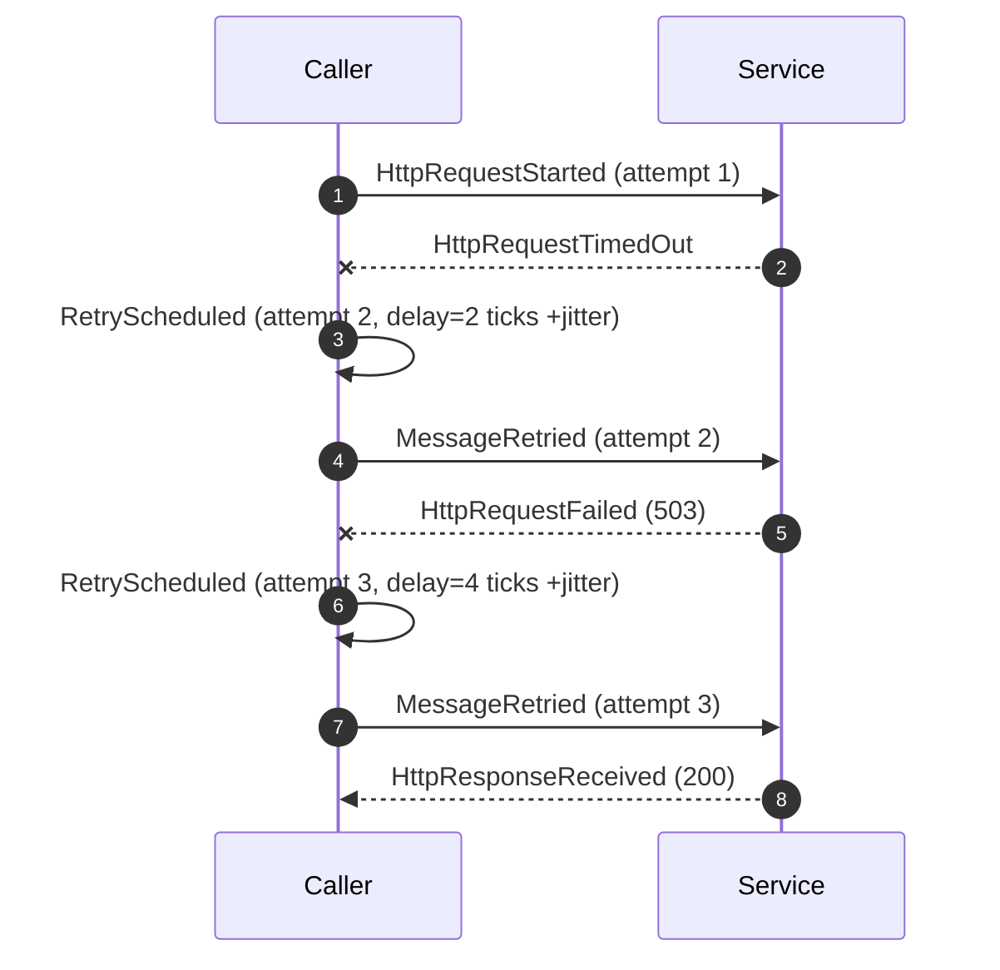
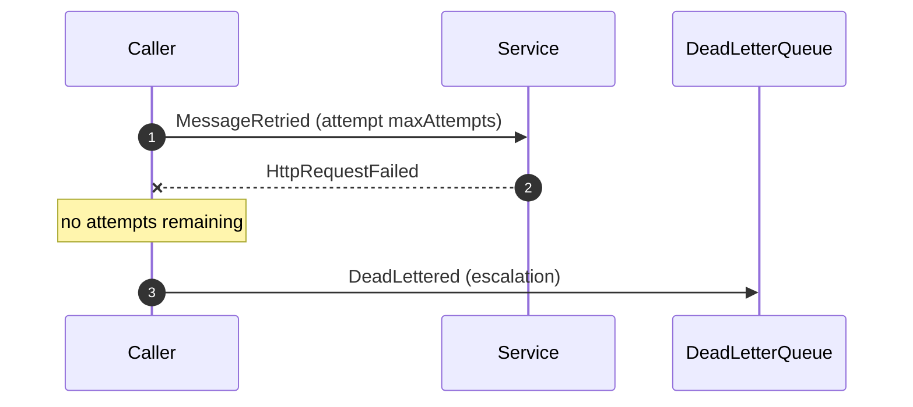

# Retry (Backoff, Jitter, Idempotency & Escalation)

Retry is DFL's canonical **resilience-on-failure** pattern. When an operation fails transiently,
retrying can recover automatically — but naive retries amplify load, retrying non-idempotent
operations corrupts state, and unbounded retries never give up. Retry teaches how to retry
*correctly*: bounded attempts, backoff with jitter, idempotency, and escalation to a dead-letter
path when retries are exhausted.

## Educational Objective

**What should the student learn?**

1. Retry targets **transient** faults (timeouts, `503`, `UNAVAILABLE`, connection resets), not
   permanent ones (`400`, validation errors) — retrying a permanent failure just wastes work.
2. **Backoff** spaces attempts out to let a struggling dependency recover; **exponential
   backoff** grows the delay each attempt (`base * 2^attempt`).
3. **Jitter** randomises delays so that many clients do not retry in lockstep and create a
   synchronised **retry storm** / thundering herd.
4. **Idempotency** is a precondition: because a retry may duplicate an effect, operations must be
   safe to apply more than once (idempotency keys, dedup).
5. **Bounded attempts + escalation:** after `maxAttempts`, stop retrying and escalate — to a
   `DeadLetterQueue` (see [DLQ](./dlq.md)) or by tripping a Circuit Breaker (see
   [Circuit Breaker](./circuit-breaker.md)).

## Architecture

Retry is a **policy on an edge or a consumer**, not a node type of its own. It wraps a call
(`Service → Service`, `Consumer` processing, or a broker delivery) and governs re-attempts.

| DFL element | Retry concept |
|-------------|---------------|
| Edge/`Consumer` `config.retryPolicy` | The retry policy (attempts, backoff, jitter) |
| `Service` / `Consumer` | The operation being retried |
| `DeadLetterQueue` | Escalation target when attempts are exhausted |



Retry policy `config`:

```json
{
  "retryPolicy": {
    "maxAttempts": 4,
    "backoff": "exponential",
    "baseDelayTicks": 2,
    "maxDelayTicks": 30,
    "jitter": "full",
    "retryOn": ["HttpRequestTimedOut", "HttpRequestFailed", "MessageNacked"],
    "escalation": "deadLetter"
  }
}
```

## Flow

Two transient failures, then success on the third attempt:



Escalation after exhausting attempts:



## Visual Behavior

Animations render backend events only; see [Animations](../03-ui/animations.md).

| Backend event | Canvas animation |
|---------------|------------------|
| `RetryScheduled` | The token parks at the caller with a **countdown ring** showing the backoff delay; an attempt badge (e.g. "2/4") appears. The visible growth of the ring across attempts teaches exponential backoff, and per-token jitter is visible as slightly different countdowns. |
| `MessageRetried` | The token re-launches along the same edge toward the target; the attempt counter increments. |
| `HttpResponseReceived` / `AckReceived` | On eventual success, the countdown/attempt badge clears with a success pulse. |
| `DeadLettered` | On exhaustion, the token routes to the `DeadLetterQueue` in an alert colour; the DLQ badge increments. |
| `CircuitBreakerOpened` | If escalation trips a breaker, the wrapped edge greys out and fails fast (cross-links Circuit Breaker). |

## Simulation

Retry wraps a failing operation and drives re-attempts under the configured policy until success
or escalation.

**Configurable parameters** (the `retryPolicy` above), plus the target's failure profile:

- `maxAttempts`, `backoff` (`fixed|exponential|linear`), `baseDelayTicks`, `maxDelayTicks`.
- `jitter` (`none|full|equal`) — full jitter randomises delay in `[0, computed]`.
- `retryOn` — which failure events are retryable (vs treated as permanent).
- `escalation` — `deadLetter` or `openCircuit`.
- `idempotencyKey` (bool) — when off, retries may create duplicate side effects, visualised as
  duplicate downstream work.
- Target `Service`/`Consumer`: `transientFailureProbability`, `permanentFailureProbability`.

**Emitted `SimulationEvent`s:** `RetryScheduled`, `MessageRetried`, and the underlying
`HttpRequestTimedOut`/`HttpRequestFailed`/`MessageNacked` that trigger them; `DeadLettered` on
escalation; `CircuitBreakerOpened` when escalation trips a breaker; plus lifecycle events.

## Failure Scenarios

| Injected condition | What happens | Events observed |
|--------------------|--------------|-----------------|
| Persistent transient failure | Attempts exhaust, message escalates | repeated `RetryScheduled`/`MessageRetried` → `DeadLettered` |
| No jitter + many callers (`jitter=none`) | Synchronised retry storm hammers the dependency | clustered `MessageRetried` spikes overloading the target |
| Retrying a permanent failure (misconfigured `retryOn`) | Wasted attempts that can never succeed | `MessageRetried` loops ending in `DeadLettered` |
| Non-idempotent op without key (`idempotencyKey=false`) | Retries duplicate side effects | duplicate downstream `MessageProcessed` for one logical message |
| `maxAttempts` too high | Slow escalation, resources tied up | prolonged `inFlight`, delayed `DeadLettered` |
| Escalation to breaker (`escalation=openCircuit`) | Repeated failures trip the breaker | `CircuitBreakerOpened` after the failure threshold |

## Metrics

- `retries` — total re-attempts (`MessageRetried` count); the headline retry metric.
- `dlqCount` — messages escalated to the `DeadLetterQueue` after exhaustion.
- `avgLatencyMs` — end-to-end latency **including** backoff delays (retries inflate perceived
  latency even when they eventually succeed).
- `throughput` — successful completions per tick.
- `inFlight` — messages currently in a retry/backoff state.
- Attempt-distribution (how many messages succeeded on attempt 1, 2, 3, …) is shown in the
  inspector.

## Acceptance Criteria

- **Given** a policy `maxAttempts=4`, `backoff=exponential`, `baseDelayTicks=2`, **when** the
  first two attempts fail transiently, **then** `RetryScheduled` delays are approximately 2 then
  4 ticks (before jitter) and `MessageRetried` fires after each delay.
- **Given** `jitter=full`, **when** many callers retry, **then** their `RetryScheduled` delays
  differ per token and re-attempts are spread across ticks rather than synchronised.
- **Given** a target that fails on attempts 1–2 and succeeds on 3, **when** the flow runs, **then**
  exactly two `RetryScheduled`/`MessageRetried` pairs are emitted followed by a successful
  response, and `retries` increments by 2.
- **Given** `maxAttempts=N` and a permanently failing target, **when** all attempts fail, **then**
  exactly N-1 retries occur and the message is `DeadLettered` (or `CircuitBreakerOpened` if
  `escalation=openCircuit`).
- **Given** `escalation=deadLetter`, **when** attempts are exhausted, **then** `dlqCount`
  increments by one and no further `MessageRetried` is emitted for that message.
- **Given** `retryOn` that excludes permanent failures, **when** a permanent failure occurs,
  **then** no `RetryScheduled` is emitted and the message escalates immediately.

## Future Improvements

- Retry budgets (cap retries as a fraction of total traffic) to prevent retry-amplification collapse.
- Hedged requests (speculative parallel retry) with first-response-wins.
- Decorrelated jitter and other advanced backoff algorithms, compared side by side.
- Dead-letter **replay** with a corrected downstream to close the resilience loop.
- Combined Retry + Circuit Breaker + Bulkhead composite resilience scenario.

## Related documents

- [Dead Letter Queue](./dlq.md)
- [Circuit Breaker](./circuit-breaker.md)
- [RabbitMQ](./rabbitmq.md)
- [REST](./rest.md)
- [gRPC](./grpc.md)
- [Event Model](../02-architecture/event-model.md)
- [Animations](../03-ui/animations.md)
- [Resilience Patterns Learning Path](../06-learning/architectural-patterns.md)
- [Glossary](../01-product/glossary.md)
