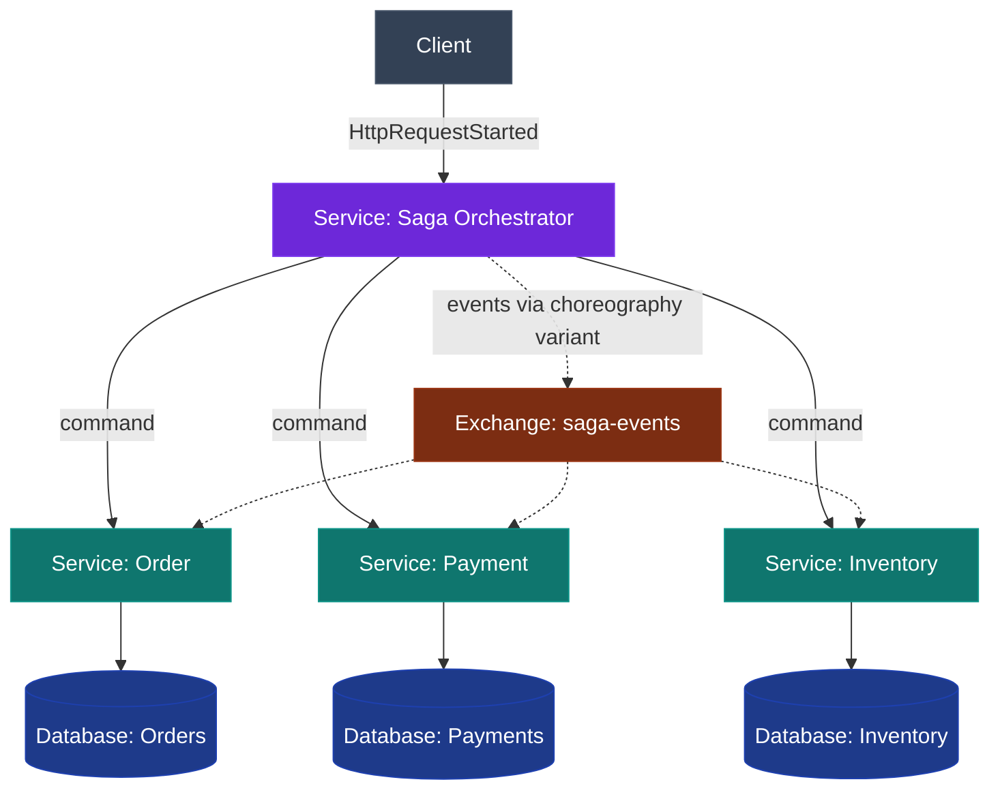
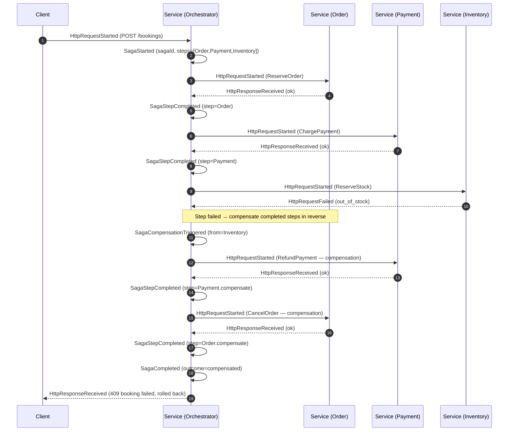

# Saga — Distributed Transactions & Compensation

## Educational Objective

*What should the student learn?*

After running this scenario a learner should be able to:

1. **Explain why sagas exist.** A single ACID transaction cannot span multiple services, each
   with its own database. A **saga** achieves a business-level "all-or-nothing" outcome as a
   sequence of *local* transactions, one per service.
2. **Contrast the two coordination styles.**
   - **Choreography** — services react to each other's events; there is no central coordinator.
     Loose coupling, but the workflow is implicit and harder to observe.
   - **Orchestration** — a central **orchestrator** issues commands and awaits replies. Explicit,
     observable control flow, at the cost of a coordinator dependency.
3. **Understand compensation.** Because there is no global rollback, a saga *undoes* completed
   steps with **compensating transactions** (semantic inverses) when a later step fails.
4. **Trace the lifecycle events.** Follow `SagaStarted` → `SagaStepCompleted` (repeated) →
   `SagaCompleted` on the happy path, and the failure path `SagaStepCompleted` →
   `SagaCompensationTriggered` → `SagaCompleted` (with a failed/compensated outcome).
5. **Reason about consistency.** Recognize that a saga provides **eventual, business-level
   consistency**, not isolation: intermediate states are visible, so steps must be designed to
   tolerate them.

Sagas often consume the event backbone introduced in [CQRS](./cqrs.md) and are naturally recorded
by [Event Sourcing](./event-sourcing.md).

## Architecture

The scenario models a classic **order / booking saga** spanning three services: Order, Payment,
and Inventory. DFL supports both coordination styles; the diagram shows orchestration with the
choreography edges noted.

| Node | `NodeType` | Role |
|------|-----------|------|
| Client | `Client` | Starts the business transaction (place order). |
| Saga Orchestrator | `Service` | Orchestration variant: issues step commands, tracks state, triggers compensation. |
| Order / Payment / Inventory | `Service` | Participants; each owns a local transaction and its compensation. |
| Orders / Payments / Inventory DB | `Database` | Per-service state stores. |
| saga-events | `Exchange` | Choreography variant: carries step events between participants. |

**Choreography vs orchestration in DFL.** A scenario config flag `coordination` selects the
style. In orchestration the orchestrator node is present and drives commands via
`HttpRequestStarted`/`HttpResponseReceived`. In choreography the orchestrator is absent; each
participant reacts to `MessagePublished` step events on `saga-events`. The saga lifecycle events
are identical in both styles — only the transport differs.

## Flow

Canonical events only. The happy path completes all three steps; the failure path fails at
Inventory and compensates Payment and Order in reverse order.

On the happy path the final Inventory step succeeds and the orchestrator emits
`SagaStepCompleted (step=Inventory)` followed by `SagaCompleted (outcome=success)` and a `200`
response — no `SagaCompensationTriggered` is emitted.

## Visual Behavior

All animation is backend-event-driven; see [UI Animations](../03-ui/animations.md).

| Backend event | Animation |
|---------------|-----------|
| `SagaStarted` | A saga "ribbon" overlay appears linking the participant nodes; a step tracker renders the ordered step list, all pending. |
| `HttpRequestStarted` (step command) | A command token travels Orchestrator→participant; the target step highlights as *in progress*. |
| `HttpResponseReceived` (ok) | The step marker turns green; the tracker advances to the next step. |
| `SagaStepCompleted` | The completed step is stamped with a check and its edge is drawn solid green. |
| `HttpRequestFailed` (step) | The failing participant flashes red; the step marker turns red. |
| `SagaCompensationTriggered` | The saga ribbon reverses direction and tints amber; a "rolling back" banner appears. |
| `HttpRequestStarted` (compensation) | Compensation tokens travel to already-completed participants in reverse order; their green markers flip to amber "compensated". |
| `SagaCompleted` | The tracker resolves to a terminal badge — green (`success`) or amber (`compensated`) — and the ribbon fades. |

In the **choreography** variant, step commands are `MessagePublished`/`MessageDequeued` tokens on
`saga-events` rather than HTTP tokens, and the saga ribbon is reconstructed on the client purely
from the ordered `SagaStarted`/`SagaStepCompleted` events — never invented.

## Simulation

**What DFL simulates.** A multi-step business transaction across independent services, with
per-step success/failure and automatic reverse-order compensation, in either orchestration or
choreography mode.

**Configurable parameters:**

| Parameter | Type | Default | Meaning |
|-----------|------|---------|---------|
| `coordination` | enum `orchestration \| choreography` | `orchestration` | Coordination style. |
| `steps` | ordered list | `[Order, Payment, Inventory]` | Saga steps and their execution order. |
| `stepFailure` | map step→float `0..1` | `{ Inventory: 0.5 }` | Per-step failure probability. |
| `compensationFailureRate` | float `0..1` | `0.0` | Probability a compensation itself fails (the hard case). |
| `stepLatencyMs` | map step→int | `{ }` | Per-step processing latency. |
| `retryCompensation` | bool | `true` | Whether failed compensations are retried before giving up. |

**Emitted `SimulationEvent`s** (canonical): `SimulationStarted`, `TickAdvanced`, `SagaStarted`,
`SagaStepCompleted`, `SagaCompensationTriggered`, `SagaCompleted`, `HttpRequestStarted`,
`HttpResponseReceived`, `HttpRequestFailed`, `HttpRequestTimedOut`, `MessagePublished`,
`MessageRouted`, `MessageDequeued`, `MessageProcessed`, `AckReceived`, `RetryScheduled`,
`MessageRetried`, `NodeStateChanged`, `SimulationCompleted`.

## Failure Scenarios

Injected via `POST /api/v1/simulations/{id}/faults`.

1. **Mid-saga step failure (compensation happy path).** Force `stepFailure[Inventory] = 1.0`.
   Order and Payment complete, Inventory fails, and both prior steps are compensated in reverse.
   *Lesson:* the canonical compensation flow.
2. **Failed compensation.** Set `compensationFailureRate = 1.0`. A compensation cannot complete;
   with `retryCompensation = true` it retries (`RetryScheduled`/`MessageRetried`), otherwise the
   saga ends `SagaCompleted (outcome=failed)` requiring human intervention. *Lesson:* compensations
   must be robust and idempotent, and some inconsistencies need manual resolution.
3. **Participant timeout.** Inject `LatencyInjected` on Payment exceeding its timeout to produce
   `HttpRequestTimedOut`. *Lesson:* the orchestrator must treat unknown outcomes safely (a charge
   may or may not have applied), motivating idempotency keys.
4. **Coordinator loss (orchestration).** Fail the orchestrator (`NodeFailed`) mid-saga. In-flight
   sagas stall. *Lesson:* orchestration centralizes control *and* risk — the coordinator needs
   durable saga state to resume.

## Metrics

From `GET /api/v1/simulations/{id}/metrics` as [`MetricSnapshot`](../02-architecture/event-model.md).

| `MetricSnapshot` field | Meaning in this scenario |
|------------------------|--------------------------|
| `tick` | Snapshot logical clock. |
| `throughput` | Sagas reaching `SagaCompleted` per tick (any outcome). |
| `avgLatencyMs` | Average saga duration from `SagaStarted` to `SagaCompleted`. |
| `inFlight` | Sagas started but not yet completed. |
| `dlqCount` | Choreography step events dead-lettered after retry exhaustion. |
| `retries` | `MessageRetried` count across step and compensation retries. |

Derived teaching measures: **compensation rate** (sagas with `SagaCompensationTriggered` ÷ started),
**success outcome ratio** (`outcome=success` ÷ completed), and **mean steps completed before
failure**.

## Acceptance Criteria

- **Given** `steps = [Order, Payment, Inventory]` and all steps succeed, **when** the saga runs,
  **then** the engine emits `SagaStarted`, exactly three `SagaStepCompleted` events in order, and
  one `SagaCompleted (outcome=success)`, with no `SagaCompensationTriggered`.
- **Given** `stepFailure[Inventory] = 1.0`, **when** the saga runs, **then** after
  `SagaStepCompleted(Order)` and `SagaStepCompleted(Payment)` the engine emits `HttpRequestFailed`
  for Inventory, then `SagaCompensationTriggered`, then compensation `SagaStepCompleted` events for
  Payment and Order **in reverse order**, then `SagaCompleted (outcome=compensated)`.
- **Given** `coordination = choreography`, **when** the same failure occurs, **then** the emitted
  saga lifecycle events (`SagaStarted`/`SagaStepCompleted`/`SagaCompensationTriggered`/`SagaCompleted`)
  are identical to orchestration, and step transport uses `MessagePublished`/`MessageDequeued`
  rather than `HttpRequestStarted`.
- **Given** `compensationFailureRate = 1.0` and `retryCompensation = false`, **when** compensation
  fails, **then** the saga ends `SagaCompleted (outcome=failed)` and the affected participant node
  shows a `NodeStateChanged` to an inconsistent state.
- **Given** the client renders any saga, **when** it draws the saga ribbon and step tracker,
  **then** the tracker order and states are derived solely from the ordered saga events.

## Future Improvements

- **Saga log persistence & resume** — model durable orchestrator state so a `NodeRecovered`
  orchestrator resumes in-flight sagas from the last `SagaStepCompleted`.
- **Timeout-based compensation** — automatically compensate steps whose replies never arrive.
- **Parallel steps** — support fan-out steps that must all succeed, with partial-failure
  compensation semantics.
- **Pivot transactions** — mark a step after which the saga can only roll *forward*, teaching the
  distinction between compensatable, pivot, and retriable steps.

## Related documents

- [CQRS](./cqrs.md)
- [Event Sourcing](./event-sourcing.md)
- [REST](./rest.md)
- [Circuit Breaker](./circuit-breaker.md)
- [Sequence Diagrams](../02-architecture/sequence-diagrams.md)
- [Event Model](../02-architecture/event-model.md)
- [UI Animations](../03-ui/animations.md)
- [Learning: Distributed Transactions](../06-learning/architectural-patterns.md)
- [Glossary](../01-product/glossary.md)
