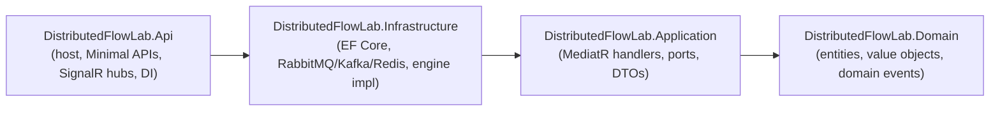

# Coding Standards

These standards apply to the entire **Distributed Flow Lab (DFL)** codebase: the
**ASP.NET 8** backend solution (`src/` + `tests/`) and the **React 18 + TypeScript**
frontend (`web/`). They exist to keep the platform production-grade, readable, and
extensible, and to enforce the golden rules of the canon — the **backend is the single
source of truth**, and **frontend animations are driven exclusively by backend
`SimulationEvent`s**.

Standards are non-negotiable unless superseded by a documented ADR. When in doubt, prefer
**simplicity, readability, and testability** over cleverness.

---

## 1. Guiding principles

| Principle | What it means for DFL |
|-----------|-----------------------|
| **Clean Architecture** | Dependencies point inward only: `Api → Infrastructure → Application → Domain`. `Domain` depends on nothing. |
| **SOLID** | Small, single-responsibility types; program to interfaces (ports); extend without modifying. |
| **DDD where appropriate** | The ubiquitous language from the canon (`Scenario`, `Simulation`, `Node`, `SimulationEvent`, `Tick`, `Timeline`) is used verbatim in code. |
| **Event-Driven** | Every simulation behavior is expressed as a domain event from the canonical Event Catalog. No behavior is "implied" only on the client. |
| **No quick hacks** | Every change is production quality. No dead code, no unexplained `TODO`s. |
| **Testability first** | Business logic is isolated from framework and I/O so it can be unit-tested deterministically. |

---

## 2. Cross-cutting conventions

- **Language:** all identifiers, comments, and commit messages in **English**.
- **Encoding & line endings:** UTF-8, LF line endings, final newline, no trailing whitespace
  (enforced by `.editorconfig`).
- **Files:** one primary public type per file; file name matches the type name.
- **Comments explain *why*, not *what*.** Well-named code needs no narration; comments justify
  non-obvious decisions and reference the concept being taught.
- **No secrets in source.** Configuration and secrets come from environment variables /
  secret stores (see [Deployment](./deployment.md)).

---

## 3. Backend standards (C# / .NET 8)

### 3.1 Naming

| Element | Convention | Example |
|---------|-----------|---------|
| Namespaces / assemblies | `DistributedFlowLab.<Layer>` | `DistributedFlowLab.Application` |
| Classes, records, structs | `PascalCase` | `SimulationEngine`, `Scenario` |
| Interfaces (ports) | `I` + `PascalCase` | `IEventPublisher`, `IScenarioRepository` |
| Methods, properties | `PascalCase` | `AdvanceTick()`, `CurrentTick` |
| Local variables, parameters | `camelCase` | `simulationId`, `fromSequence` |
| Private fields | `_camelCase` | `_eventStore` |
| Constants | `PascalCase` | `MaxBatchSize` |
| Async methods | suffix `Async` | `StartSimulationAsync` |
| Type parameters | `T` + `PascalCase` | `TCommand`, `TEvent` |

- Domain type names **must** match the canon's ubiquitous language and `NodeType` enum
  (`Producer`, `Consumer`, `Service`, `ApiGateway`, `LoadBalancer`, `Exchange`, `Queue`,
  `Topic`, `Partition`, `Broker`, `Database`, `Cache`, `DeadLetterQueue`, `Client`).
- Event type names **must** match the canonical Event Catalog exactly
  (`MessagePublished`, `AckReceived`, `RetryScheduled`, `DeadLettered`, `CircuitBreakerOpened`,
  `SagaCompensationTriggered`, `TickAdvanced`, …). Never abbreviate or alias them.

### 3.2 Formatting & linting

- **`.editorconfig`** at the repository root is authoritative for C# style (indentation of
  4 spaces, `var` usage, brace placement, `using` ordering with `System.*` first, file-scoped
  namespaces).
- **`dotnet format`** must pass with zero diffs before commit; it runs in CI as a gate.
- Enable **`<Nullable>enable</Nullable>`** and **`<TreatWarningsAsErrors>true</TreatWarningsAsErrors>`**
  in `Directory.Build.props` for all projects.
- Analyzers (`Microsoft.CodeAnalysis.NetAnalyzers`) run at `AnalysisLevel=latest-Recommended`.

### 3.3 Clean Architecture layering rules (canon §3)



- **Dependency direction is strictly inward.** A reference from an inner layer to an outer
  layer is a build-breaking violation.
- **`Domain`** has **no** project references and no framework dependencies (no EF Core,
  no ASP.NET, no MediatR attributes leaking in). It holds entities, value objects, domain
  events, and enums (`NodeType`, `Simulation.Status`).
- **`Application`** depends only on `Domain`. It defines **ports** (interfaces such as
  `IEventStore`, `IEventPublisher`, `ISimulationClock`, `IScenarioRepository`), use cases as
  **MediatR** commands/queries + handlers, DTOs, and **FluentValidation** validators. It never
  references a concrete adapter.
- **`Infrastructure`** implements the ports: EF Core repositories, the RabbitMQ/Kafka/Redis
  adapters, the SignalR event publisher, and the `BackgroundService` simulation runtime loop.
- **`Api`** is the composition root: Minimal API endpoint definitions, the `SimulationHub`
  mapped at `/hubs/simulation`, DI wiring, middleware, and configuration. **No business logic.**

### 3.4 SOLID in practice

- **SRP:** one reason to change per type. A MediatR handler orchestrates *one* use case.
- **OCP:** new `NodeType` behavior or a new broker adapter is added by implementing an existing
  port, not by editing a `switch` in the engine core.
- **LSP:** any `IEventPublisher` (SignalR, in-memory test double) is fully substitutable.
- **ISP:** ports are narrow (`IEventStore` reads/appends events; it does not also manage
  scenarios).
- **DIP:** the engine depends on abstractions (`IEventPublisher`, `ISimulationClock`); concrete
  adapters are injected at the composition root.

### 3.5 Error handling

- **Domain invariants** are enforced in the `Domain` layer and throw domain exceptions
  (e.g. `InvalidSimulationStateException`) — never silent failures.
- **Application** translates failures into results; validation failures surface as
  **FluentValidation** results.
- **Api** maps failures to **RFC 7807 `application/problem+json`** responses (canon §9). No raw
  stack traces leak to clients. A single exception-handling middleware performs the mapping.
- Never swallow exceptions. Catch only to add context, translate, or handle deliberately — then
  log with **Serilog** structured properties (`simulationId`, `sequence`, `traceId`).

### 3.6 Async / await

- All I/O (EF Core, brokers, SignalR, HTTP) is **async all the way**. No `.Result` / `.Wait()` /
  `.GetAwaiter().GetResult()`.
- Pass and honor **`CancellationToken`** through every async method, especially the
  `BackgroundService` engine loop and broker consumers.
- Use `ConfigureAwait(false)` in `Application`/`Infrastructure` library code where no sync
  context is needed.
- Prefer `IAsyncEnumerable<T>` for streaming event replay from the event store.

### 3.7 Immutability & nullability

- Model **domain events and DTOs as immutable `record` types**. A `SimulationEvent` is a fact —
  once emitted it never mutates.
- Prefer `readonly` fields and `init`-only properties; expose collections as `IReadOnlyList<T>`.
- **Nullable reference types are enabled globally.** Public APIs make nullability explicit; do
  not use the null-forgiving operator (`!`) to silence warnings — fix the model instead.

### 3.8 No business logic in controllers/endpoints

Minimal API endpoints are thin: bind and validate the request, send a **MediatR** command/query,
map the result to an HTTP response. All decisions (state transitions, event emission, routing)
live in `Application` handlers and the `Domain`/engine. A `SimulationHub` method likewise only
delegates (`Subscribe`/`Unsubscribe` group management) — it contains no simulation logic.

---

## 4. Frontend standards (React 18 + TypeScript)

### 4.1 Naming

| Element | Convention | Example |
|---------|-----------|---------|
| Components | `PascalCase` file + export | `CanvasNode.tsx`, `EventInspector.tsx` |
| Hooks | `useCamelCase` | `useSimulationStream`, `useCanvasStore` |
| Zustand stores | `use<Name>Store` | `useCanvasStore`, `useSimulationStore`, `useUiStore` |
| Types / interfaces | `PascalCase` | `SimulationEvent`, `NodeType`, `EdgeConfig` |
| Variables / functions | `camelCase` | `simulationId`, `subscribeToSimulation` |
| Constants / enums | `PascalCase` values, `SCREAMING_SNAKE` for literals | `NodeType.Producer` |
| Non-component files | `kebab-case` | `event-envelope.ts`, `signalr-client.ts` |

- **TypeScript domain types in `web/src/domain/` mirror the backend contracts exactly** — the
  event envelope fields (`eventId`, `simulationId`, `sequence`, `tick`, `occurredAt`, `type`,
  `sourceNodeId`, `targetNodeId`, `correlationId`, `traceId`, `payload`) and the canonical
  event `type` union are the wire contract (camelCase). These types are the single client-side
  definition of truth; do not redefine them per feature.

### 4.2 Formatting & linting

- **Prettier** formats all code (2-space indentation, single quotes, trailing commas, 100-col
  print width). It is the sole formatter — no manual style debates.
- **ESLint** (with `@typescript-eslint`, `eslint-plugin-react`, `react-hooks`,
  `jsx-a11y`) enforces correctness and hook rules. CI fails on any error.
- **`tsc --noEmit`** in `strict` mode is a required gate. `strict`, `noUncheckedIndexedAccess`,
  and `noImplicitOverride` are enabled in `tsconfig.json`.
- No `any`. Use `unknown` + narrowing, generics, or a precise type.

### 4.3 Component architecture

- **Functional components + hooks only.** No class components. **Composition over inheritance.**
- **Keep components small and focused**; extract presentational primitives into
  `web/src/components/` and keep feature-specific composition inside the relevant
  `web/src/features/*` folder (`catalog`, `canvas`, `simulation`, `inspector`).
- Separate **presentational** components (props in, JSX out) from **container/logic** hooks.
- **State ownership:** ephemeral UI state via `useState`; shared client state in **Zustand**
  stores under `web/src/state/`. Never duplicate server truth in local state.
- Styling via **Tailwind CSS** utility classes and shared design tokens; avoid ad-hoc inline
  styles except for dynamic geometry (e.g. React Flow node positions).

### 4.4 Realtime & the source-of-truth rule

- All realtime code lives in `web/src/realtime/`: the **`@microsoft/signalr`** connection to
  `/hubs/simulation`, `Subscribe(simulationId)`/`Unsubscribe(simulationId)`, and reconnection
  with backoff.
- Incoming `ReceiveSimulationEvent` / `ReceiveSimulationEvents` payloads update the simulation
  store; components **render from that store**.
- **Animations never invent state.** **Framer Motion** transitions are triggered by received
  `SimulationEvent`s. The only client-originated events are the presentation-only
  `AnimationStarted` / `AnimationFinished`, which describe *rendering* of a backend event and
  never introduce new domain state.
- Handle **`sequence` gaps** explicitly (detect, and reconcile via
  `GET /api/v1/simulations/{id}/events?fromSequence=`) rather than guessing missing state.

### 4.5 Error handling & async (frontend)

- Wrap feature roots in **error boundaries**; surface user-facing errors through the UI store,
  not `alert`/`console`.
- Model async/server state explicitly (`idle | loading | success | error`); never render
  optimistic domain state that the backend has not confirmed.
- Type all fetch/SignalR payloads against `web/src/domain/` types; validate at the boundary.

### 4.6 Immutability (frontend)

- Treat props and store state as immutable; update stores via new objects/arrays.
- Prefer pure functions in `web/src/lib/`; memoize expensive derived values (`useMemo`,
  selectors) to avoid unnecessary renders (a canvas may hold hundreds of nodes).

---

## 5. Commit conventions

DFL uses **[Conventional Commits](https://www.conventionalcommits.org/)** (per `CLAUDE.md`).
The full policy — message format, types/scopes, authorship rules (**no AI co-authorship
trailers**), commit hygiene, and history-rewriting rules — lives in a dedicated document:

**→ [Commit Standards](./commit-standards.md)**

Quick reference:

```
feat(simulation): add RabbitMQ message animation
fix(engine): emit DeadLettered when retry budget is exhausted
docs(dev): add commit standards
```

---

## 6. Pull request expectations

Every PR must include (per `CLAUDE.md`):

- **Summary** — what and why, tied to a backlog item / roadmap phase.
- **Technical details** — layers touched, ports/adapters added, event types emitted.
- **Testing performed** — which suites ran and their result (see [Testing](./testing.md)).
- **Screenshots / recordings** — for any UI change.
- **Documentation updates** — architecture/backlog/roadmap edits, and an ADR link if an
  architectural decision was made.

PRs are small and single-purpose (one feature at a time). CI must be green: `dotnet format`,
build, analyzers, `tsc`, ESLint, and the test gates from [Testing](./testing.md).

---

## 7. Code review checklist

Reviewers verify:

- [ ] **Architecture** — dependency direction respected (`Api → Infrastructure → Application → Domain`); no business logic in endpoints/hubs/controllers.
- [ ] **Canon fidelity** — event type names, `NodeType` values, and ubiquitous-language terms match the canon exactly.
- [ ] **Source-of-truth rule** — no client-invented state; animations are driven by backend `SimulationEvent`s.
- [ ] **SOLID & simplicity** — single responsibility, no overengineering, no dead code, no unexplained `TODO`s.
- [ ] **Nullability & immutability** — nullable enabled and honored; events/DTOs immutable.
- [ ] **Async correctness** — no sync-over-async; `CancellationToken` propagated.
- [ ] **Error handling** — RFC 7807 on the API; structured Serilog logging with correlation IDs.
- [ ] **Tests** — new logic covered; deterministic engine tests are seeded/tick-based; suites pass.
- [ ] **Formatting/lint** — `dotnet format`, ESLint, Prettier, `tsc` all clean.
- [ ] **Docs** — relevant `.docs` updated; ADR added if a decision was made.
- [ ] **Security/config** — no secrets committed; configuration via environment.

---

## Related documents

- [Folder Structure](./folder-structure.md)
- [Technologies](./technologies.md)
- [Local Development](./local-development.md)
- [Testing](./testing.md)
- [Deployment](./deployment.md)
- [Architecture](../02-architecture/architecture.md)
- [Event Model](../02-architecture/event-model.md)
