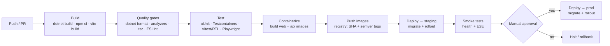

# Build, Release & Deployment

This document defines how **Distributed Flow Lab (DFL)** is built, released, and operated:
the **GitHub Actions** CI/CD pipeline, environments (dev / staging / prod), configuration and
secrets management, EF Core database migrations, rollout and rollback strategy, health checks,
and observability hooks (**OpenTelemetry** + **Serilog**).

Delivery mechanics build on [Docker](./docker.md) (container strategy) and enforce the CI gates
defined in [Testing](./testing.md).

---

## 1. Pipeline overview

Two workflows in `.github/workflows/` implement this:

- **`ci.yml`** — runs on every PR and push: build, quality gates, and the full test suite. It is
  the merge gate.
- **`release.yml`** — runs on merge to the default branch / tagged release: everything in `ci.yml`
  plus containerize, push, and deploy through the environments.

---

## 2. CI/CD stages

| Stage | What runs | Gate |
|-------|-----------|------|
| **Build** | `dotnet restore/build` (Release); `npm ci` + `vite build` | Must compile |
| **Quality** | `dotnet format --verify-no-changes`, .NET analyzers, `tsc --noEmit`, ESLint, Prettier check | Zero diffs/warnings |
| **Test** | Backend unit + Testcontainers integration/contract; Vitest/RTL; Playwright smoke | All green + coverage floors ([Testing](./testing.md)) |
| **Containerize** | Multi-stage builds of `dfl-web` and `dfl-api` ([Docker](./docker.md)) | Images build |
| **Push** | Tag images by **Git SHA** (+ **semver** on release) and push to the container registry | — |
| **Deploy** | Apply EF Core migrations, then roll out new images per environment | Health checks pass |
| **Verify** | Post-deploy health + E2E smoke | Green or auto-rollback |

Testcontainers-based integration tests require Docker on the runner; the CI runner image provides
it.

---

## 3. Environments

| Environment | Purpose | Deploy trigger | Data |
|-------------|---------|----------------|------|
| **dev** | Fast integration of merged work | Auto on merge to default branch | Ephemeral / resettable |
| **staging** | Production-like validation, migration dry-run, E2E/smoke | Auto after dev succeeds | Realistic, non-production |
| **prod** | Live SaaS for learners | **Manual approval** after staging smoke passes | Production (backed up) |

Each environment runs the same container images (promoted by tag) with environment-specific
configuration — parity between staging and prod is a hard requirement so migrations and rollouts
behave identically.

---

## 4. Configuration & secrets management

- **Configuration** follows ASP.NET precedence: `appsettings.json` <
  `appsettings.{Environment}.json` < environment variables. Images are environment-agnostic;
  behavior is set at deploy time via environment variables (see [Docker](./docker.md) and
  [Local Development](./local-development.md)).
- **Secrets** (Postgres credentials, broker credentials, registry tokens) are **never committed
  and never baked into images**. They are stored as **GitHub Actions encrypted secrets /
  environment secrets** for the pipeline and injected into runtime containers by the platform's
  secret store at deploy time.
- **Frontend** build-time config (`VITE_*`) is injected during the `vite build` step per target
  environment; no secrets are shipped to the browser.
- Environment protection rules gate access to `prod` secrets behind the manual approval.

---

## 5. Database migrations (EF Core)

Schema changes ship as **EF Core migrations** in `DistributedFlowLab.Infrastructure/Persistence`.

- **Authoring:** developers add migrations locally
  (`dotnet ef migrations add <Name> --project src/DistributedFlowLab.Infrastructure
  --startup-project src/DistributedFlowLab.Api`) and commit them; migrations are code-reviewed.
- **Application in CI/CD:** the pipeline generates an **idempotent SQL script**
  (`dotnet ef migrations script --idempotent`) and applies it as a **discrete deploy step that
  runs before the new app image is rolled out**. Migrations do not run implicitly on app startup
  in staging/prod — this keeps schema changes auditable and ordered.
- **Backward compatibility:** migrations are written to be compatible with the currently running
  version (expand/contract pattern) so a rollout (and rollback) never breaks the running app.
- **Verification:** staging applies the migration first as a dry-run; only after staging smoke
  passes is prod migrated.

---

## 6. Rollout strategy

- **Immutable, tagged images** are promoted (not rebuilt) from staging to prod, guaranteeing the
  artifact tested is the artifact deployed.
- **Rolling deployment** replaces instances gradually behind health checks so there is no downtime
  window; new instances must pass readiness before receiving traffic.
- **Migrate-then-deploy** ordering with the expand/contract pattern keeps old and new app versions
  compatible with the schema during the transition.

---

## 7. Health checks

The `api` exposes health endpoints used by both compose and the orchestrator:

| Endpoint | Meaning | Used by |
|----------|---------|---------|
| `/health/live` | Process is up | Liveness probe / restart decisions |
| `/health/ready` | Dependencies reachable (Postgres, Redis, RabbitMQ, Kafka) | Readiness gate before receiving traffic |

Readiness aggregates dependency checks so an instance only serves REST/SignalR traffic once its
brokers and database are reachable — critical because the SignalR `/hubs/simulation` stream must
never accept subscribers it cannot feed with events.

---

## 8. Rollback

- **Application rollback:** redeploy the **previous known-good image tag** — a fast, deterministic
  operation because images are immutable and versioned.
- **Schema rollback:** because migrations follow expand/contract and stay backward-compatible,
  rolling the app back does not require an immediate destructive schema down-migration; any
  contracting change is deferred to a later release once the new version is stable.
- **Trigger:** failed post-deploy health checks or smoke/E2E failures halt the promotion and, in
  prod, initiate automatic rollback to the previous tag.

---

## 9. Observability hooks

DFL deploys with observability wired in (canon §2), consistent with the event-driven philosophy:

- **OpenTelemetry** exports **traces, metrics, and logs** via OTLP to the environment's collector.
  The event envelope's `traceId` / `correlationId` propagate so a `Message`'s path across `Node`s
  is traceable, and product KPIs (e.g. event-to-animation latency) are measurable in prod.
- **Serilog** emits **structured logs** enriched with `simulationId`, `sequence`, and `traceId`,
  shipped through the same pipeline.
- **Release health signals:** deploy annotations plus the `/health/ready` aggregate and key
  metrics (event delivery rate, `sequence`-gap count, error rate) are watched immediately after a
  rollout to confirm success or trigger rollback (§8).

---

## Related documents

- [Docker](./docker.md)
- [Testing](./testing.md)
- [Local Development](./local-development.md)
- [Coding Standards](./coding-standards.md)
- [Technologies](./technologies.md)
- [Folder Structure](./folder-structure.md)
- [Architecture](../02-architecture/architecture.md)
