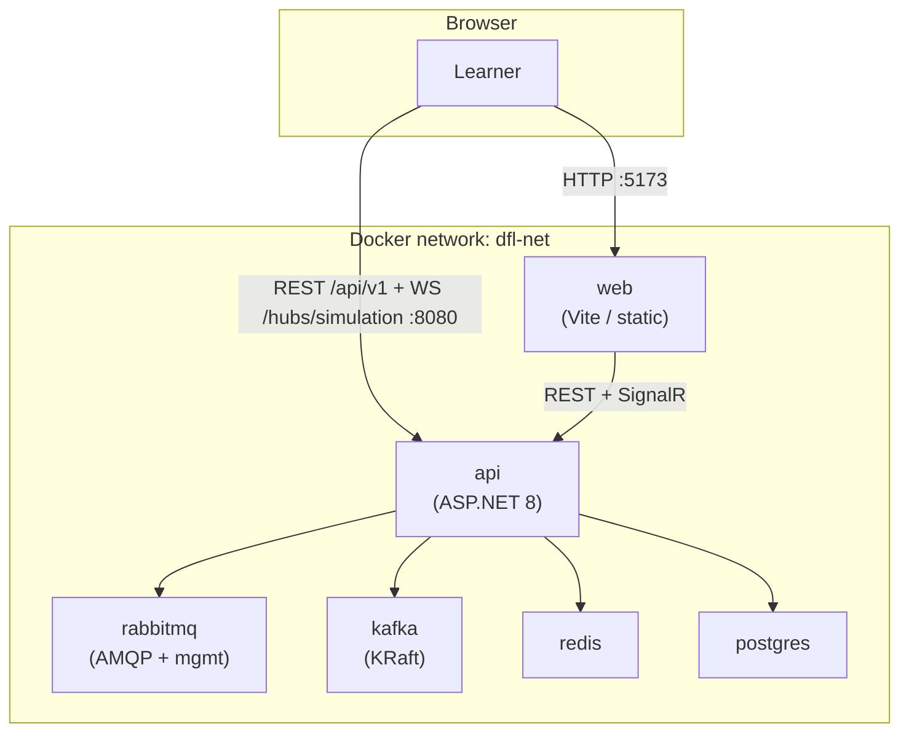

# Docker & Containerization

This document defines the **containerization strategy** for **Distributed Flow Lab (DFL)**:
per-service Dockerfiles, the Docker Compose topology (`web`, `api`, `rabbitmq`, `kafka`,
`redis`, `postgres`), dev vs prod overrides, and the image build strategy. It ratifies the
canonical DevOps choice (canon §2): **Docker + Docker Compose** for local development and
container orchestration.

See [ADR-005](../adr/ADR-005-docker-compose.md) for the decision rationale and
[Architecture](../02-architecture/architecture.md) for how these services realize the system.

---

## 1. Principles

- **One concern per image.** `web` and `api` each have a dedicated, multi-stage Dockerfile.
  Backing services use official upstream images (`rabbitmq`, `apache/kafka` or `confluentinc`,
  `redis`, `postgres`).
- **Reproducibility.** A single `docker compose up` yields an identical environment for every
  developer and for CI.
- **Small, secure runtime images.** Multi-stage builds discard SDK/build tooling; runtime images
  run as a non-root user.
- **Health-gated startup.** Dependent services declare `depends_on` with `condition:
  service_healthy` so the `api` never starts before its dependencies are ready.
- **Config via environment.** No secrets baked into images; configuration comes from environment
  variables / `.env` (see [Local Development](./local-development.md)).

---

## 2. Compose topology



All services share a user-defined bridge network (`dfl-net`) so they resolve each other by
service name (e.g. the API reaches Postgres at `postgres:5432`).

---

## 3. Per-service Dockerfiles

### 3.1 `api` — `docker/Dockerfile.api`

Multi-stage build for the ASP.NET 8 host. The **build stage** uses the .NET SDK image to restore
and publish; the **runtime stage** uses the smaller ASP.NET runtime image and runs as non-root.

```dockerfile
# --- build stage ---
FROM mcr.microsoft.com/dotnet/sdk:8.0 AS build
WORKDIR /src
COPY *.sln Directory.Build.props ./
COPY src/ ./src/
RUN dotnet restore src/DistributedFlowLab.Api/DistributedFlowLab.Api.csproj
RUN dotnet publish src/DistributedFlowLab.Api/DistributedFlowLab.Api.csproj \
    -c Release -o /app/publish /p:UseAppHost=false

# --- runtime stage ---
FROM mcr.microsoft.com/dotnet/aspnet:8.0 AS runtime
WORKDIR /app
COPY --from=build /app/publish ./
USER app
EXPOSE 8080
ENV ASPNETCORE_URLS=http://+:8080
ENTRYPOINT ["dotnet", "DistributedFlowLab.Api.dll"]
```

### 3.2 `web` — `docker/Dockerfile.web`

Multi-stage build: a **build stage** compiles the Vite bundle; the **runtime stage** serves the
static assets (e.g. via a minimal static server / reverse proxy). Development uses the override in
§5 to run the Vite dev server with hot reload instead.

```dockerfile
# --- build stage ---
FROM node:20-alpine AS build
WORKDIR /app
COPY web/package*.json ./
RUN npm ci
COPY web/ ./
RUN npm run build            # emits /app/dist

# --- runtime stage ---
FROM nginx:1.27-alpine AS runtime
COPY --from=build /app/dist /usr/share/nginx/html
COPY docker/web-nginx.conf /etc/nginx/conf.d/default.conf
EXPOSE 80
```

---

## 4. `docker-compose.yml` (base stack)

The base compose file defines all six services with ports, volumes, healthchecks, and the shared
network. Example (abbreviated for clarity; secrets come from `.env`):

```yaml
name: distributed-flow-lab

services:
  web:
    build:
      context: ..
      dockerfile: docker/Dockerfile.web
    ports:
      - "5173:80"
    depends_on:
      api:
        condition: service_healthy
    networks: [dfl-net]

  api:
    build:
      context: ..
      dockerfile: docker/Dockerfile.api
    ports:
      - "8080:8080"
    environment:
      ConnectionStrings__Postgres: "Host=postgres;Port=5432;Database=dfl;Username=dfl;Password=${POSTGRES_PASSWORD}"
      ConnectionStrings__Redis: "redis:6379"
      RabbitMq__Host: "rabbitmq"
      Kafka__BootstrapServers: "kafka:9092"
    depends_on:
      postgres:  { condition: service_healthy }
      rabbitmq:  { condition: service_healthy }
      kafka:     { condition: service_healthy }
      redis:     { condition: service_healthy }
    healthcheck:
      test: ["CMD", "curl", "-f", "http://localhost:8080/health"]
      interval: 10s
      timeout: 5s
      retries: 5
    networks: [dfl-net]

  postgres:
    image: postgres:16-alpine
    environment:
      POSTGRES_DB: dfl
      POSTGRES_USER: dfl
      POSTGRES_PASSWORD: ${POSTGRES_PASSWORD}
    ports:
      - "5432:5432"
    volumes:
      - postgres-data:/var/lib/postgresql/data
    healthcheck:
      test: ["CMD-SHELL", "pg_isready -U dfl"]
      interval: 10s
      timeout: 5s
      retries: 5
    networks: [dfl-net]

  redis:
    image: redis:7-alpine
    ports:
      - "6379:6379"
    volumes:
      - redis-data:/data
    healthcheck:
      test: ["CMD", "redis-cli", "ping"]
      interval: 10s
      timeout: 3s
      retries: 5
    networks: [dfl-net]

  rabbitmq:
    image: rabbitmq:3-management-alpine
    ports:
      - "5672:5672"     # AMQP
      - "15672:15672"   # management UI
    volumes:
      - rabbitmq-data:/var/lib/rabbitmq
    healthcheck:
      test: ["CMD", "rabbitmq-diagnostics", "-q", "ping"]
      interval: 15s
      timeout: 10s
      retries: 5
    networks: [dfl-net]

  kafka:
    image: apache/kafka:latest      # KRaft mode (no ZooKeeper)
    ports:
      - "9092:9092"
    volumes:
      - kafka-data:/var/lib/kafka/data
    healthcheck:
      test: ["CMD-SHELL", "/opt/kafka/bin/kafka-broker-api-versions.sh --bootstrap-server localhost:9092 || exit 1"]
      interval: 15s
      timeout: 10s
      retries: 10
    networks: [dfl-net]

volumes:
  postgres-data:
  redis-data:
  rabbitmq-data:
  kafka-data:

networks:
  dfl-net:
    driver: bridge
```

### Ports, volumes & healthchecks summary

| Service | Ports (host:container) | Volume | Healthcheck |
|---------|------------------------|--------|-------------|
| `web` | `5173:80` | — | (served static; gated on `api`) |
| `api` | `8080:8080` | — | `GET /health` |
| `postgres` | `5432:5432` | `postgres-data` | `pg_isready` |
| `redis` | `6379:6379` | `redis-data` | `redis-cli ping` |
| `rabbitmq` | `5672:5672`, `15672:15672` | `rabbitmq-data` | `rabbitmq-diagnostics ping` |
| `kafka` | `9092:9092` | `kafka-data` | broker API versions probe |

Named volumes persist broker/DB state across restarts; `docker compose down -v` clears them.

---

## 5. Dev vs prod overrides

Compose merges `docker-compose.yml` with an override file. Docker automatically applies
`docker-compose.override.yml` for local dev; production explicitly selects
`docker-compose.prod.yml`.

**`docker-compose.override.yml` (local dev)** — hot reload, source mounts, verbose logging:

```yaml
services:
  web:
    command: npm run dev -- --host
    volumes:
      - ../web:/app
      - /app/node_modules
    ports:
      - "5173:5173"
  api:
    build:
      target: build         # use SDK image so dotnet watch is available
    command: dotnet watch --project src/DistributedFlowLab.Api run
    environment:
      ASPNETCORE_ENVIRONMENT: Development
    volumes:
      - ../src:/src/src
```

**`docker-compose.prod.yml` (production-oriented)** — pinned image tags, no source mounts,
restart policies, resource limits, secrets from the environment:

```yaml
services:
  web:
    image: ${REGISTRY}/dfl-web:${TAG}
    restart: unless-stopped
  api:
    image: ${REGISTRY}/dfl-api:${TAG}
    restart: unless-stopped
    environment:
      ASPNETCORE_ENVIRONMENT: Production
```

Run production compose explicitly:

```bash
docker compose -f docker-compose.yml -f docker-compose.prod.yml up -d
```

---

## 6. Image build strategy

- **Multi-stage builds** keep runtime images minimal (no SDK/`node_modules` build tooling
  shipped).
- **Layer caching:** dependency manifests (`*.csproj` / `package*.json`) are copied and restored
  **before** source, so source edits don't invalidate the dependency layer.
- **Deterministic dependencies:** `dotnet restore` against locked references and `npm ci` against
  `package-lock.json`.
- **Immutable tags:** CI tags images by Git SHA (and a semver on release) and pushes to the
  registry; environments deploy a specific tag — never a floating `latest` in staging/prod. See
  [Deployment](./deployment.md).
- **Non-root runtime** and least-privilege by default.

---

## Related documents

- [ADR-005 — Docker & Docker Compose](../adr/ADR-005-docker-compose.md)
- [Architecture](../02-architecture/architecture.md)
- [Local Development](./local-development.md)
- [Deployment](./deployment.md)
- [Technologies](./technologies.md)
- [Folder Structure](./folder-structure.md)
