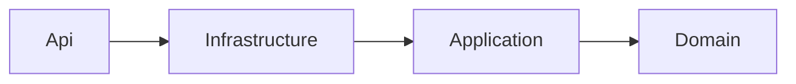

# Repository Folder Structure

This document describes the **full repository layout** of **Distributed Flow Lab (DFL)** and the
purpose of every folder. It is authoritative: new folders are only created if they fit this
structure. The layout enforces **Clean Architecture** on the backend (canon §3), a feature-first
frontend (canon §4), and clean separation of documentation, containerization, and CI.

The rule "**Respect the existing folder organization; never create random folders; never
duplicate responsibilities**" (from `CLAUDE.md`) is enforced here.

---

## 1. Top-level layout

```
distributed-flow-lab/
  CLAUDE.md                 # Engineering charter / lead-engineer instructions (root law)
  README.md                 # Repo entry point: what DFL is + how to get started
  .editorconfig             # Shared C#/TS formatting rules (dotnet format authority)
  .gitignore
  Directory.Build.props     # Solution-wide MSBuild: nullable, warnings-as-errors, analyzers
  DistributedFlowLab.sln    # .NET solution referencing src/ and tests/ projects
  src/                      # Backend production code (Clean Architecture layers)
  tests/                    # Backend test projects
  web/                      # Frontend application (React 18 + TypeScript + Vite)
  docker/                   # Dockerfiles + compose files for local dev & orchestration
  .github/                  # GitHub Actions workflows, PR/issue templates
  .docs/                    # The documentation set (source of truth)
```

---

## 2. Backend — `src/` (canon §3)

```
src/
  DistributedFlowLab.Domain/          # Enterprise core. Depends on NOTHING.
    Entities/                         #   Scenario, Simulation, Node, Edge aggregates
    ValueObjects/                     #   Position, MessagePayload, correlation identifiers
    Events/                           #   Domain event definitions (canonical Event Catalog)
    Enums/                            #   NodeType, SimulationStatus
    Exceptions/                       #   Domain invariants (e.g. InvalidSimulationStateException)
  DistributedFlowLab.Application/     # Use cases. Depends on Domain only.
    Abstractions/                     #   Ports: IEventStore, IEventPublisher, ISimulationClock, repositories
    Scenarios/                        #   MediatR commands/queries + handlers for Scenario CRUD
    Simulations/                      #   Create/Start/Pause/Resume/Stop/InjectFault use cases
    Catalog/                          #   Catalog listing use cases
    Events/                           #   Event replay/history queries
    Dtos/                             #   Request/response contracts (SimulationStateDto, envelope DTO)
    Validation/                       #   FluentValidation validators
  DistributedFlowLab.Infrastructure/ # Adapters. Depends on Application.
    Persistence/                      #   EF Core DbContext, entity configs, repositories, migrations
    Engine/                           #   Simulation engine + BackgroundService runtime loop (tick clock)
    Messaging/
      RabbitMq/                       #   AMQP adapter: exchanges, queues, routing keys, DLX
      Kafka/                          #   Kafka adapter: topics, partitions, offsets, consumer groups
      Redis/                          #   Redis adapter: cache + pub/sub
    Realtime/                         #   SignalR IEventPublisher implementation
    Observability/                    #   OpenTelemetry + Serilog wiring
  DistributedFlowLab.Api/             # Composition root / host. Depends on Infrastructure.
    Endpoints/                        #   Minimal API endpoint definitions (/api/v1/...)
    Hubs/                             #   SimulationHub mapped at /hubs/simulation
    Configuration/                    #   DI registration, options binding
    Middleware/                       #   RFC 7807 problem+json exception handling
    Program.cs                        #   Host bootstrap, pipeline, endpoint & hub mapping
    appsettings.json                  #   Base configuration (overridden per environment)
```

### Why this layering

The dependency rule is **`Api → Infrastructure → Application → Domain`**, with `Domain`
depending on nothing:



- **`Domain`** is pure business truth (entities, the canonical events, `NodeType`,
  `SimulationStatus`). Keeping it dependency-free makes the rules the platform teaches
  independently testable and framework-agnostic.
- **`Application`** expresses *what the system does* as use cases, exposing **ports** so the
  concrete world (databases, brokers, SignalR) is pluggable. It never references an adapter.
- **`Infrastructure`** is *how* — the replaceable adapters. Because the engine emits events
  through the `IEventPublisher` port, the RabbitMQ/Kafka/Redis adapters and the SignalR
  transport can evolve without touching business logic.
- **`Api`** wires everything at a single composition root and stays thin (endpoints + hubs
  delegate to MediatR), honoring "business logic never lives in controllers."

This ordering is what makes DFL **testable and extensible**: inner layers can be unit-tested
without infrastructure, and new brokers/node types are added at the edges.

---

## 3. Backend — `tests/` (canon §3)

```
tests/
  DistributedFlowLab.Domain.Tests/         # Fast unit tests of entities/value objects/invariants
  DistributedFlowLab.Application.Tests/    # Use-case tests with mocked ports (xUnit + FluentAssertions)
  DistributedFlowLab.Integration.Tests/    # Testcontainers: RabbitMQ/Kafka/Redis/Postgres + API/SignalR
```

Test projects mirror the layer they exercise, so coverage and responsibility stay unambiguous.
Details of the strategy live in [Testing](./testing.md).

---

## 4. Frontend — `web/` (canon §4)

```
web/
  index.html                # Vite entry HTML
  package.json              # Scripts + dependencies
  vite.config.ts            # Vite + Vitest configuration
  tsconfig.json             # strict TypeScript config
  tailwind.config.ts        # Tailwind design tokens
  .eslintrc.cjs             # ESLint config
  .prettierrc               # Prettier config
  playwright.config.ts      # E2E configuration
  src/
    app/                    # App shell, routing, top-level providers (SignalR, stores, theme)
    features/
      catalog/              # Scenario templates / concept catalog browsing
      canvas/               # React Flow editor: nodes, edges, palette, node/edge configuration
      simulation/           # Simulation controls, timeline, playback (start/pause/resume/stop)
      inspector/            # Selected node/edge/event inspector panels
    components/             # Reusable presentational components + design-system primitives
    realtime/               # SignalR connection, event subscription, reconnection/backoff
    state/                  # Zustand stores: canvasStore, simulationStore, uiStore
    domain/                 # TS types mirroring backend contracts (Node, Edge, SimulationEvent, envelope)
    lib/                    # Framework-agnostic utilities (formatting, geometry, sequence-gap helpers)
  tests/                    # Vitest + RTL unit/component tests and Playwright E2E specs
```

### Why feature-first + shared layers

- **`features/*`** groups everything a capability needs (components, hooks, local state) so the
  four MVP surfaces — `catalog`, `canvas`, `simulation`, `inspector` — evolve independently and
  map directly to the product's UI areas.
- **`domain/`** is the client mirror of the backend contract. Centralizing the canonical event
  envelope and `NodeType` union here prevents each feature from re-inventing the wire shape and
  guarantees the frontend renders backend truth.
- **`realtime/`** and **`state/`** isolate the source-of-truth pipeline (SignalR → store →
  render) from presentation, which is what keeps "animations never invent state" enforceable.
- **`components/`** and **`lib/`** hold reusable, side-effect-free building blocks, encouraging
  composition and preventing duplication across features.

---

## 5. `docker/`

```
docker/
  Dockerfile.api            # Multi-stage build for the ASP.NET 8 API host
  Dockerfile.web            # Multi-stage build for the Vite frontend (build → static serve)
  docker-compose.yml        # Base stack: web, api, rabbitmq, kafka, redis, postgres
  docker-compose.override.yml   # Local dev overrides (hot reload, source mounts, exposed ports)
  docker-compose.prod.yml       # Production-oriented overrides (pinned images, no source mounts)
  .env.example              # Documented sample of required environment variables
```

Containerization strategy, service definitions, ports, healthchecks, and the compose topology
are documented in [Docker](./docker.md).

---

## 6. `.github/`

```
.github/
  workflows/
    ci.yml                  # PR gate: build, dotnet format, analyzers, tsc/ESLint, tests
    release.yml             # Build → test → containerize → push images → deploy
  pull_request_template.md  # Enforces the PR expectations (summary/details/testing/screenshots)
  ISSUE_TEMPLATE/           # Bug / feature templates aligned with the backlog
```

The pipelines these workflows implement are described in [Deployment](./deployment.md).

---

## 7. `.docs/` — the documentation set

```
.docs/
  README.md                 # Master index of the documentation set (canon §12)
  01-product/               # vision, prd, personas, roadmap, backlog, glossary
  02-architecture/          # architecture.md, event-model.md, C4 diagrams, data model
  03-ui/                    # UI/UX specs, canvas & inspector design
  04-features/              # Per-concept feature docs (RabbitMQ, Kafka, Saga, CQRS, ...)
  05-dev/                   # THIS folder: engineering guides (coding, structure, docker, testing, ...)
  06-learning/              # Learning objectives, lessons, exercises
  adr/                      # Architecture Decision Records (ADR-004, ADR-007, ...)
  diagrams/                 # Shared diagram sources/assets referenced by docs
```

`.docs` is the **source of truth**. Documents cross-reference each other with relative Markdown
links and end with a **Related documents** section (canon §12). Architectural decisions are
captured as ADRs in `.docs/adr/` and linked from the relevant guide.

---

## Related documents

- [Coding Standards](./coding-standards.md)
- [Technologies](./technologies.md)
- [Docker](./docker.md)
- [Local Development](./local-development.md)
- [Testing](./testing.md)
- [Deployment](./deployment.md)
- [Architecture](../02-architecture/architecture.md)
