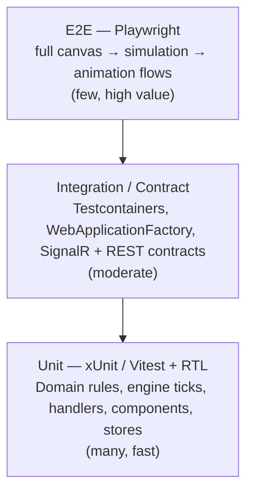
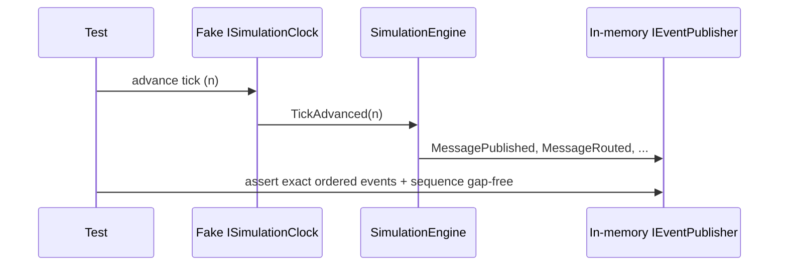

# Testing Strategy

This document defines the **QA strategy** for **Distributed Flow Lab (DFL)**: the test pyramid,
backend and frontend tooling, contract tests for the REST and SignalR surfaces, how the
event-driven simulation engine is tested **deterministically**, coverage targets, CI gates, and
the **Definition of Done**.

The overriding testing goal follows the canon's golden rule: because the **backend is the single
source of truth** and **animations are driven exclusively by backend `SimulationEvent`s**, tests
must guarantee that the engine emits the **correct canonical events, in the correct order, with a
gap-free `sequence`** — and that the frontend faithfully renders them without inventing state.

Canonical tooling (canon §2): backend **xUnit + FluentAssertions + Testcontainers**; frontend
**Vitest + React Testing Library + Playwright**. See
[ADR-013](../adr/ADR-013-testing-strategy.md).

---

## 1. Test pyramid



- **Unit (broad base):** fast, isolated, no I/O. Domain invariants, engine tick logic (seeded),
  MediatR handlers with mocked ports, React components/hooks/stores.
- **Integration / contract (middle):** real dependencies via Testcontainers and the ASP.NET test
  host; verify adapters and the REST/SignalR contracts.
- **E2E (thin top):** Playwright drives the real UI against a running stack for a handful of
  critical journeys.

---

## 2. Backend testing

Projects mirror the layers (see [Folder Structure](./folder-structure.md)):
`DistributedFlowLab.Domain.Tests`, `DistributedFlowLab.Application.Tests`,
`DistributedFlowLab.Integration.Tests`.

### 2.1 Unit tests — Domain & Application

- **Tooling:** **xUnit** + **FluentAssertions**.
- **Domain.Tests:** entity/value-object behavior and invariants — e.g. a `Simulation` may only
  transition `Draft → Running → Paused → Resumed → Completed|Stopped|Failed`; illegal transitions
  throw. Assert that domain operations produce the correct canonical events.
- **Application.Tests:** MediatR command/query handlers with **mocked ports** (`IEventStore`,
  `IEventPublisher`, `ISimulationClock`, repositories). Verify orchestration and that
  FluentValidation rejects invalid input. No real I/O — these run in milliseconds.

```csharp
// illustrative assertion style (test code, not application code)
result.EmittedEvents.Should().ContainInOrder("MessagePublished", "MessageRouted", "MessageEnqueued");
result.EmittedEvents.Select(e => e.Sequence).Should().OnlyHaveUniqueItems();
```

### 2.2 Integration tests — Infrastructure

- **Tooling:** **Testcontainers** spins up real **RabbitMQ, Kafka, Redis, and PostgreSQL**;
  the API is hosted via `WebApplicationFactory`.
- **Coverage:**
  - EF Core repositories and migrations against a real Postgres container.
  - RabbitMQ adapter: publish/route/enqueue/ack/nack, DLX → `DeadLettered`.
  - Kafka adapter: produce/consume across partitions, offsets, consumer groups.
  - Redis adapter: cache hit/miss/evict, pub/sub.
- Containers are disposed per fixture; tests are isolated and can run in parallel across
  collections.

---

## 3. Frontend testing

Specs live under `web/tests/` (see [Folder Structure](./folder-structure.md)).

### 3.1 Unit / component — Vitest + React Testing Library

- **Vitest** (Vite-native) runs unit and component tests fast.
- **React Testing Library** tests components by behavior: given a set of `SimulationEvent`s pushed
  into the `simulationStore`, the canvas/inspector render the expected state.
- **Zustand stores** and **`web/src/lib/`** utilities are unit-tested directly, including the
  **`sequence`-gap detection** helper.
- **Source-of-truth assertion:** tests confirm the UI renders only from received events and does
  not fabricate state; `AnimationStarted`/`AnimationFinished` are asserted to be
  presentation-only (they never add domain state).

### 3.2 E2E — Playwright

- Drives the real browser against a running stack (compose or host) across critical journeys:
  1. Browse the **Catalog**, drop a scenario on the **canvas**.
  2. Create and **start** a `Simulation`; assert message tokens animate along edges in response to
     `MessagePublished → MessageRouted → MessageEnqueued → MessageDequeued → MessageProcessed →
     AckReceived`.
  3. **Inject a fault**; assert `FaultInjected` / `DeadLettered` are reflected visually.
  4. Open the **inspector**; assert the `Timeline` shows a gap-free `sequence`.

---

## 4. Contract tests (REST & SignalR)

Contracts are canonical (canon §6, §8, §9); tests pin them so client and server never drift.

- **REST (`/api/v1`):** verify request/response shapes, `camelCase` JSON, and **RFC 7807
  `problem+json`** error bodies for the canonical endpoints (`/catalog`, `/scenarios`,
  `/simulations`, `.../start|pause|resume|stop`, `.../faults`, `.../events?fromSequence=`,
  `.../metrics`). The frontend `domain/` TypeScript types are asserted against the same fixtures
  so the wire contract is single-sourced.
- **SignalR (`/hubs/simulation`):** an integration test connects a real SignalR client, calls
  `Subscribe(simulationId)`, and asserts it receives `ReceiveSimulationEvent` /
  `ReceiveSimulationEvents` and `SimulationStateChanged` with the exact
  **event envelope** shape (`eventId`, `simulationId`, `sequence`, `tick`, `occurredAt`, `type`,
  `sourceNodeId`, `targetNodeId`, `correlationId`, `traceId`, `payload`). `Unsubscribe` stops
  delivery.

---

## 5. Testing the event-driven engine deterministically

The simulation engine is a `BackgroundService` advancing a logical **`Tick`** clock. To make it
testable, engine tests are **tick-based and seeded**:

- **Virtual clock:** the engine depends on an `ISimulationClock` port. Tests inject a **fake clock
  that advances ticks explicitly** (`TickAdvanced`) instead of using wall-clock time — no
  `Thread.Sleep`, no flakiness.
- **Seeded randomness:** any stochastic behavior (jitter, fault probability, latency) is driven by
  an injected **seeded RNG**, so the same seed yields the same event stream every run.
- **Deterministic assertions:** given a scenario + seed, tests assert the **exact ordered
  sequence of canonical events** and monotonic, gap-free `sequence` values across ticks.
- **Golden timelines:** representative scenarios have a recorded expected `Timeline`; a diff
  against the produced `Timeline` catches regressions in engine behavior.



This determinism is what lets us test the source-of-truth guarantee at the unit level, cheaply and
repeatably.

---

## 6. Coverage targets

| Layer / area | Line coverage target | Rationale |
|--------------|----------------------|-----------|
| `Domain` | **≥ 90%** | Pure business rules; cheap and critical to cover. |
| `Application` (handlers/validators) | **≥ 85%** | Orchestration correctness. |
| Simulation engine | **≥ 90%** | The heart of the source-of-truth guarantee. |
| `Infrastructure` adapters | **≥ 70%** (via integration) | Verified against real brokers; some glue is exercised indirectly. |
| Frontend stores / `lib` | **≥ 85%** | Deterministic logic, easy to cover. |
| Frontend components | **≥ 70%** | Behavior-focused, not pixel-exhaustive. |

Coverage is a floor, not a ceiling; **critical event-emission and state-transition paths must be
covered regardless of the aggregate percentage.**

---

## 7. CI gates

The PR pipeline (see [Deployment](./deployment.md)) blocks merge unless **all** pass:

- [ ] `dotnet format` and analyzers — no diffs / no warnings (warnings-as-errors).
- [ ] `dotnet build` — solution compiles.
- [ ] Backend unit tests (`Domain.Tests`, `Application.Tests`) green.
- [ ] Integration/contract tests (Testcontainers) green.
- [ ] `tsc --noEmit`, ESLint, Prettier check — clean.
- [ ] Frontend unit/component tests (Vitest + RTL) green.
- [ ] Playwright E2E smoke suite green.
- [ ] Coverage thresholds (§6) met.

Flaky tests are treated as failures — they are fixed or quarantined with a tracked issue, never
ignored (per "fix failing tests before continuing").

---

## 8. Definition of Done

A feature is **Done** only when:

1. Code meets [Coding Standards](./coding-standards.md) (layering, SOLID, nullability,
   immutability, no business logic in controllers).
2. Behavior is expressed via **canonical events** with the correct names and gap-free `sequence`.
3. Unit tests cover new domain/handler/engine logic; **engine tests are seeded and tick-based**.
4. Integration/contract tests cover new adapters and any REST/SignalR contract changes.
5. Frontend changes have Vitest/RTL coverage; critical journeys covered by Playwright.
6. All **CI gates** (§7) and **coverage targets** (§6) pass.
7. Documentation updated (architecture/backlog/roadmap; ADR if a decision was made).
8. PR includes summary, technical details, testing performed, and screenshots for UI changes.

---

## Related documents

- [ADR-013 — Testing Strategy](../adr/ADR-013-testing-strategy.md)
- [Coding Standards](./coding-standards.md)
- [Deployment](./deployment.md)
- [Local Development](./local-development.md)
- [Technologies](./technologies.md)
- [Architecture](../02-architecture/architecture.md)
- [Event Model](../02-architecture/event-model.md)
