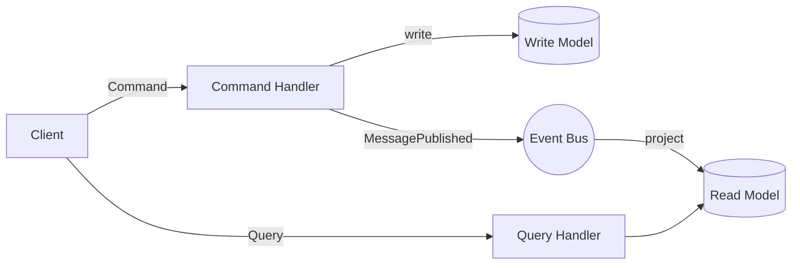
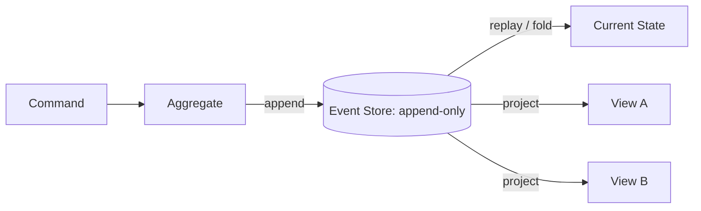
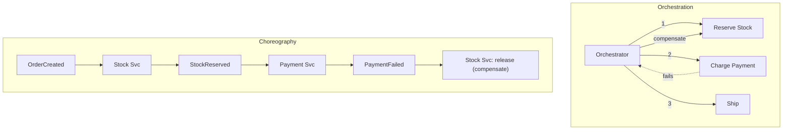
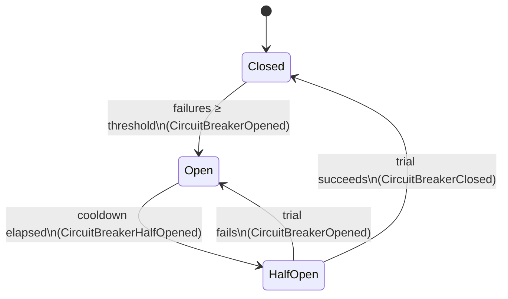
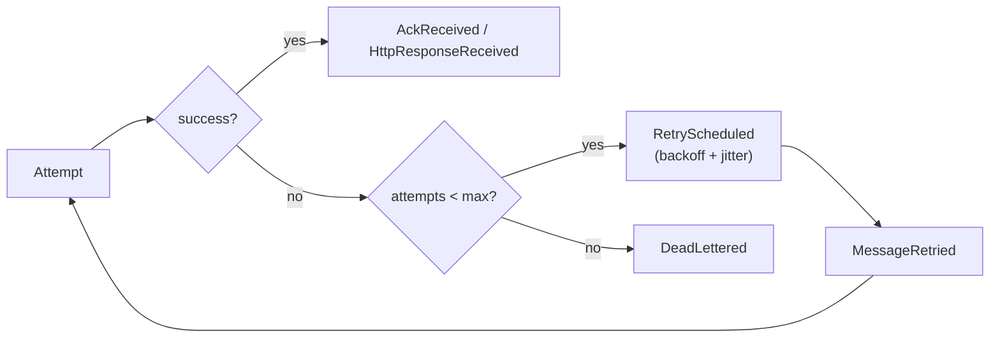
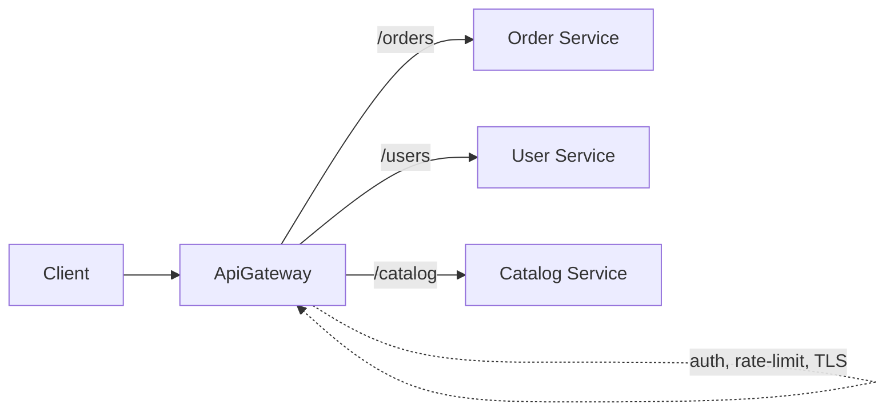
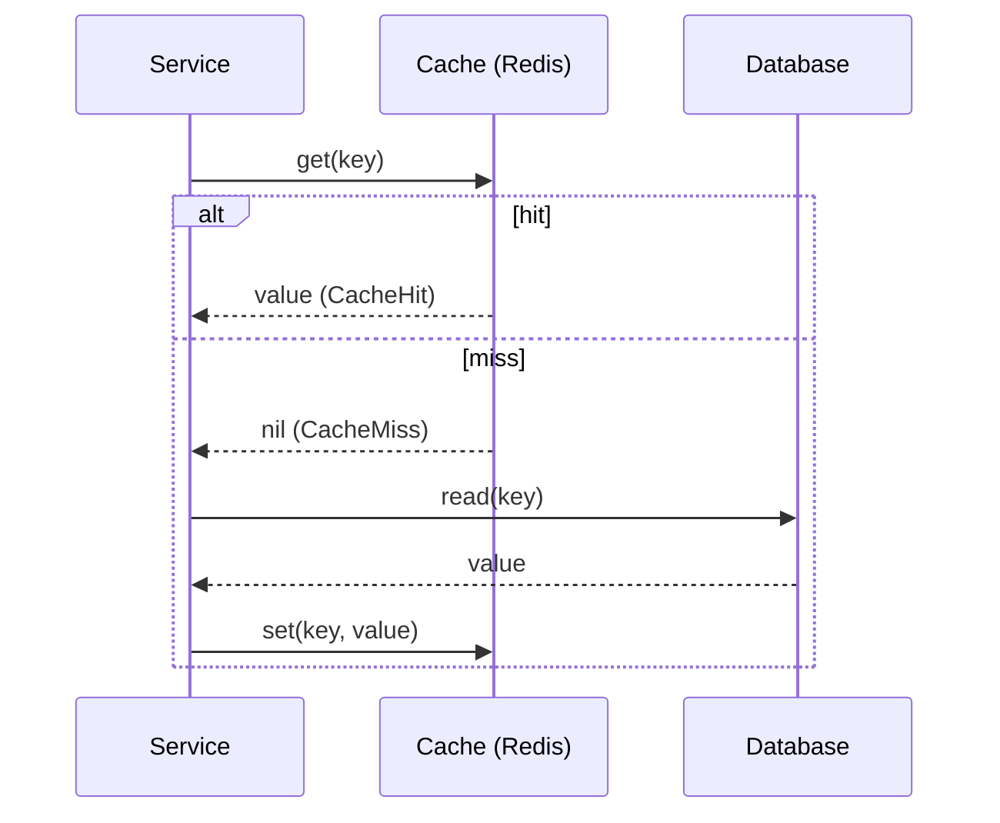

# Architectural Patterns

> These are the recurring, named solutions to distributed-systems problems. For each pattern
> this document states the **problem it solves**, the **trade-offs**, **when to use / avoid**
> it, and how it appears in DFL. Every pattern maps to a concept `Scenario` in the `Catalog`
> and to canonical `SimulationEvent`s so you can watch the pattern *behave*.

## CQRS — Command Query Responsibility Segregation

**Problem.** A single data model optimized for writes (normalized, transactional) is often a
poor fit for reads (denormalized, fast, many shapes). Serving both from one model forces
compromises and contention.

**Solution.** Split the system into a **command side** (handles writes / state changes) and a
**query side** (handles reads from a separate, read-optimized model). The read model is updated
from the write model, often asynchronously via events.

**Trade-offs.** Two models to maintain; the read model is **eventually consistent** with the
write model (a read right after a write may be stale). Adds moving parts.

**When to use.** Read/write workloads differ sharply in shape or scale; complex domains with
many read projections; pairs naturally with Event Sourcing.
**When to avoid.** Simple CRUD; when the team cannot tolerate eventual consistency in the read
path; small apps where the overhead outweighs the benefit.

**In DFL.** The write path emits `MessagePublished` events consumed by a projector `Service`
that updates a read `Database`; queries hit the read side. Watch the lag between the write and
the read model resolve on the `Timeline`. Note DFL's own backend uses **MediatR** for
command/query separation inside the Application layer (canon §2). See
[CQRS](../04-features/cqrs.md).

## Event Sourcing

**Problem.** Storing only the *current* state destroys history — you cannot ask "how did we get
here?", audit changes, or rebuild alternative views.

**Solution.** Persist state as an **append-only log of events** (the facts that happened). The
current state is a *fold* (replay) of those events. New read models are built by replaying the
log.

**Trade-offs.** Events are immutable — schema evolution and correcting mistakes require care
(compensating events, versioning, snapshots for performance). Querying "current state" requires
replay or a projection. Higher conceptual complexity.

**When to use.** Auditability is a hard requirement; temporal queries; domains where the *why*
matters; natural fit with CQRS and Kafka's retained log.
**When to avoid.** Simple domains; teams unfamiliar with the model; when strong read-after-write
on the same model is required.

**In DFL.** Event Sourcing is philosophically native: the `Timeline` **is** an append-only
event log, and replay by `sequence` reconstructs any prior state. This is the clearest place to
teach the pattern — the whole platform is an event store you can scrub. See
[Event Sourcing](../04-features/event-sourcing.md).

## Saga — distributed transactions without 2PC

**Problem.** A business operation spans multiple services/databases (place order → reserve
stock → charge payment → arrange shipping). A single ACID transaction is impossible across
service boundaries, and two-phase commit is fragile and blocking.

**Solution.** Model the operation as a **saga**: a sequence of local transactions, each with a
**compensating action** that semantically undoes it. If a step fails, run the compensations for
the already-completed steps in reverse.

### Orchestration vs choreography

- **Orchestration** — a central **orchestrator** `Service` tells each participant what to do
  and drives compensation. Explicit, easy to follow, but the orchestrator is a coupling point.
- **Choreography** — no central coordinator; each service reacts to events and emits its own.
  Loosely coupled, but the end-to-end flow is emergent and harder to trace.

**Trade-offs.** No global atomicity — the system passes through inconsistent intermediate states
(eventual consistency). Compensations must be designed for every step and are not always clean
(you cannot un-send an email). Choreography can become hard to reason about at scale.

**When to use.** Long-running business processes spanning services; when you need availability
over strict global consistency.
**When to avoid.** Operations that truly need ACID and live in one database; when compensations
are impossible or unacceptable.

**In DFL.** Sagas emit `SagaStarted`, `SagaStepCompleted`, `SagaCompensationTriggered`, and
`SagaCompleted`. Inject a `FaultInjected` at the payment `Service` to force a failure and watch
compensations run in reverse on the `Timeline`. See [Saga](../04-features/saga.md).

## Circuit Breaker

**Problem.** When a downstream dependency is failing or slow, continuing to call it wastes
resources, ties up threads, and propagates failure upstream — a **cascading failure**.

**Solution.** Wrap calls in a **circuit breaker** with three states. It trips **open** after a
failure threshold, fails fast for a cooldown, then goes **half-open** to test recovery.

**Trade-offs.** While open, requests fail fast — you trade some availability of *possibly*
working calls for protection of the whole system. Requires tuning thresholds and cooldowns;
poor tuning either trips too eagerly or too late.

**When to use.** Any remote call to a dependency that can fail or slow down; pairs with retries
and timeouts.
**When to avoid.** In-process, cheap, or non-critical calls where fail-fast adds no value.

**In DFL.** Inject `LatencyInjected` or `NodeFailed` on a downstream `Service`; watch
`HttpRequestFailed`/`HttpRequestTimedOut` accumulate until `CircuitBreakerOpened`, then fast
failures, then `CircuitBreakerHalfOpened` after `NodeRecovered`, then `CircuitBreakerClosed`.
See [Circuit Breaker](../04-features/circuit-breaker.md).

## Retry with backoff

**Problem.** Transient failures (a brief network blip, a momentarily overloaded service) are
common. Giving up immediately turns a recoverable hiccup into a user-visible error.

**Solution.** **Retry** the operation — but with **exponential backoff** (wait 1s, 2s, 4s, …)
and **jitter** (randomized delay) so many clients don't retry in lockstep. Cap the number of
attempts and the total delay.

**Trade-offs.** Naive retries **amplify load** on an already-struggling dependency — the
infamous **retry storm**. Without idempotency, retries cause duplicate side effects. Must be
bounded and must pair with a DLQ and a circuit breaker.

**When to use.** Transient, retryable failures (timeouts, 503s, connection resets).
**When to avoid.** Deterministic failures (a 400/validation error will fail identically forever
— retrying is pure waste); non-idempotent operations without dedup.

**In DFL.** `RetryScheduled` → `MessageRetried` events with configurable backoff; remove the cap
to *deliberately* create a retry storm and watch `MetricSnapshot.retries` and `inFlight`
explode. See [Retry](../04-features/retry.md) and [DLQ](../04-features/dlq.md).

## API Gateway

**Problem.** Clients talking directly to many microservices must know every address, handle
cross-cutting concerns (auth, rate limiting, TLS) repeatedly, and are tightly coupled to
internal topology.

**Solution.** Put an **`ApiGateway`** at the edge as a single entry point. It routes requests to
the right service, and centralizes cross-cutting concerns: authentication, rate limiting,
request aggregation, and protocol translation.

**Trade-offs.** A potential single point of failure and a performance bottleneck if not scaled;
can become a "god object" if business logic leaks into it (keep it thin — routing and
cross-cutting only). Adds an extra hop of latency.

**When to use.** Multiple services with external clients; need centralized auth/rate-limiting;
BFF (backend-for-frontend) shaping.
**When to avoid.** A single service / monolith; internal-only service-to-service calls that a
service mesh handles better.

**In DFL.** Model an `ApiGateway` node fronting several `Service`s; requests flow
`HttpRequestStarted` → gateway → downstream, and you can inject faults at the gateway (rate
limiting → `HttpRequestFailed`) to teach edge resilience. See
[API Gateway](../04-features/api-gateway.md).

## Cache-aside (lazy loading)

**Problem.** A datastore is slow or expensive to hit for every read, and much data is read far
more often than it changes.

**Solution.** Put a **`Cache`** (Redis) beside the database. On read: check the cache; on a
**hit**, return it; on a **miss**, load from the database, populate the cache, and return. On
write: update the database and **invalidate** (or update) the cache entry.

**Trade-offs.** The cache can serve **stale** data until it is invalidated or expires (eventual
consistency); a "thundering herd" of misses can hammer the database; cache invalidation is
famously hard. TTL and eviction policy (`CacheEvicted`) must be tuned.

**When to use.** Read-heavy workloads with tolerable staleness; expensive queries; hot keys.
**When to avoid.** Strong read-after-write requirements; write-heavy or rarely-read data where
the cache mostly misses.

**In DFL.** `CacheHit`, `CacheMiss`, and `CacheEvicted` events make the hit ratio visible;
compare `MetricSnapshot.avgLatencyMs` with the cache warm vs cold, and write to the database to
watch a subsequent read serve stale until `CacheEvicted`. See [Cache](../04-features/cache.md).

## Choosing patterns — a quick map

| If your problem is… | Reach for… |
|---------------------|------------|
| Reads and writes have very different shapes/scale | **CQRS** |
| You need full history / audit / replay | **Event Sourcing** |
| A transaction spans multiple services | **Saga** |
| A dependency can fail and drag you down | **Circuit Breaker** |
| Failures are transient and retryable | **Retry with backoff** (+ DLQ) |
| Many services, external clients, cross-cutting concerns | **API Gateway** |
| Read-heavy load on a slow store | **Cache-aside** |

Patterns compose: a resilient call typically uses **timeout + retry with backoff + circuit
breaker + DLQ** together. The [exercises](./exercises.md) build these combinations step by step.

## Related documents

- [Distributed Systems Primer](./distributed-systems.md)
- [Messaging Patterns](./messaging-patterns.md)
- [Common Mistakes](./common-mistakes.md)
- [Hands-on Exercises](./exercises.md)
- [CQRS](../04-features/cqrs.md)
- [Event Sourcing](../04-features/event-sourcing.md)
- [Saga](../04-features/saga.md)
- [Circuit Breaker](../04-features/circuit-breaker.md)
- [Retry](../04-features/retry.md)
- [API Gateway](../04-features/api-gateway.md)
- [Cache](../04-features/cache.md)
- [Glossary](../01-product/glossary.md)
- [Architecture](../02-architecture/architecture.md)
