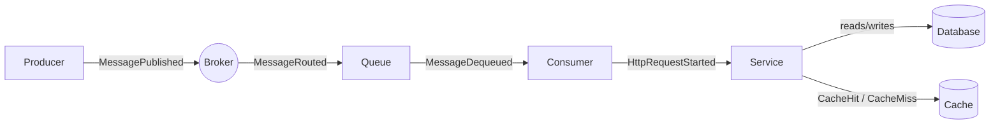
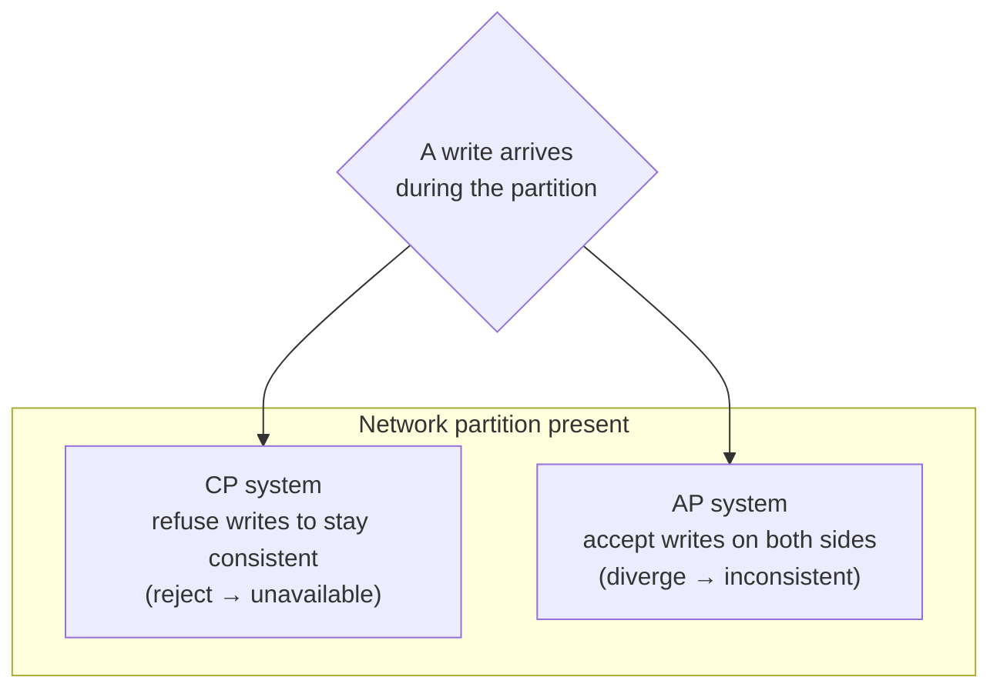
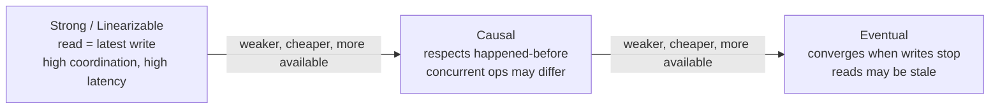
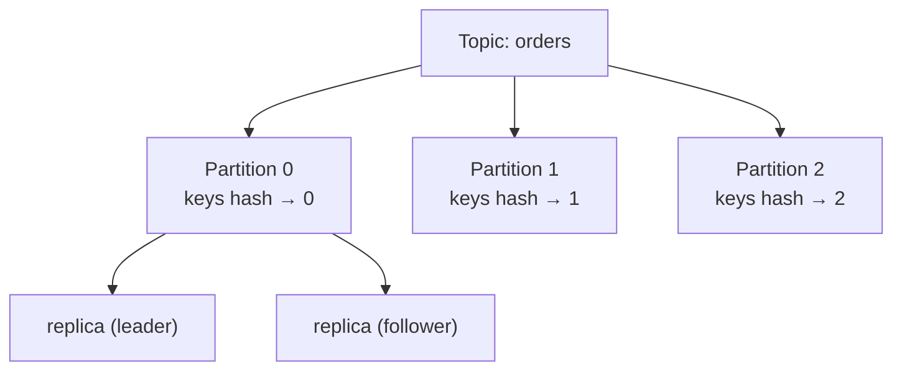
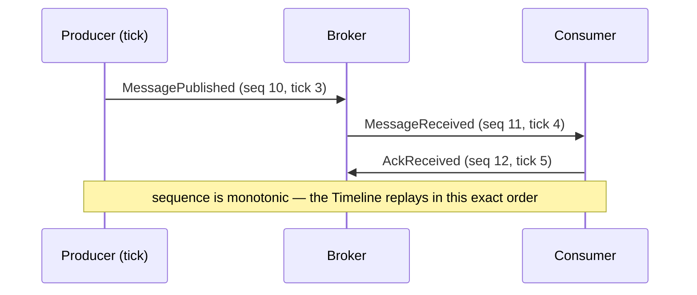

# Distributed Systems — Foundational Primer

> This is the conceptual entry point for the Distributed Flow Lab (DFL) learning track.
> It explains *why* distributed systems are hard, gives you the vocabulary (fallacies, CAP,
> PACELC, consistency models, replication, logical time, failure modes), and — crucially —
> maps every concept to something you can **see** inside a DFL `Simulation`.

## What is a distributed system?

A **distributed system** is a set of independent computers (nodes) that cooperate over a
network to appear, to their users, as a single coherent system. The defining property is not
"many machines" — it is that **the parts fail independently and communicate only by passing
messages** over an unreliable network. There is no shared clock and no shared memory; the only
way one node learns anything about another is by receiving a `Message`, which may be delayed,
duplicated, reordered, or lost.

In DFL terms, a distributed system is exactly what you compose on the canvas: a graph of
`Node`s (`Producer`, `Consumer`, `Service`, `Broker`, `Database`, `Cache`, …) connected by
directed `Edge`s, exchanging `Message`s, with every interaction recorded as a
`SimulationEvent`.

## Why are they hard?

A single-process program enjoys guarantees a distributed system does not:

- **No partial failure.** In one process, either the whole thing runs or it crashes. In a
  distributed system, *one* participant can fail while others keep running — the hardest case
  to reason about, because the survivors cannot easily tell "failed" from "slow".
- **No global clock.** You cannot totally order events by wall-clock time, because clocks drift
  and messages take time to travel.
- **No shared memory.** State must be *replicated* and *reconciled*, which introduces
  consistency problems.
- **Unbounded latency.** A message that has not arrived might arrive in one more millisecond,
  or never. You cannot distinguish these by waiting.

DFL exists precisely because these behaviors are invisible in code and only emerge at runtime,
under load, and under failure. Every concept below has a corresponding `Fault Injection` or
event stream you can trigger to watch it happen.

## The 8 fallacies of distributed computing

Peter Deutsch and colleagues catalogued the false assumptions that break naive distributed
systems. Each fallacy maps to a DFL `Fault Injection` that proves it false.

| # | Fallacy | Reality | See it in DFL |
|---|---------|---------|---------------|
| 1 | The network is reliable | Messages are lost and connections drop | `PartitionCreated`, `MessageDropped` |
| 2 | Latency is zero | Every hop costs time | `LatencyInjected`, `MetricSnapshot.avgLatencyMs` |
| 3 | Bandwidth is infinite | Queues fill; back-pressure builds | `MessageEnqueued` growth, `MetricSnapshot.inFlight` |
| 4 | The network is secure | Trust boundaries exist | modeled via `ApiGateway` node responsibilities |
| 5 | Topology doesn't change | Nodes join, leave, and fail | `NodeFailed`, `NodeRecovered`, `ConsumerRegistered` |
| 6 | There is one administrator | Ownership is fragmented | multi-`Service` scenarios |
| 7 | Transport cost is zero | Serialization/network has real cost | `payload.sizeBytes` on events |
| 8 | The network is homogeneous | Protocols and semantics differ | RabbitMQ vs Kafka vs REST scenarios |

The most consequential ones for learners are **#1 (reliability)**, **#2 (latency)**, and
**#3 (bandwidth)** — the entire resilience curriculum (Retry, DLQ, Circuit Breaker,
back-pressure) is a response to these three.

## CAP theorem

The **CAP theorem** states that in the presence of a network **P**artition, a distributed data
store must choose between **C**onsistency (every read sees the latest write) and
**A**vailability (every request gets a non-error response). You cannot have both *during* a
partition.

A common misreading is "pick 2 of 3". More precisely: **when there is no partition**, a system
can be both consistent and available; the trade-off is *forced* only while partitioned. This is
what PACELC refines.

In DFL, inject a `PartitionCreated` fault between a `Service` and its `Database` replica and
watch whether the scenario is configured to reject requests (CP behavior: `HttpRequestFailed`)
or serve possibly-stale data (AP behavior: `CacheHit` on stale state). Then `PartitionHealed`
shows reconciliation.

## PACELC

**PACELC** extends CAP to normal operation:

> **If** there is a **P**artition, choose between **A**vailability and **C**onsistency;
> **E**lse (normal operation), choose between **L**atency and **C**onsistency.

The key insight PACELC adds: even with **no** failures, consistency has a cost — keeping
replicas in sync **increases latency**. A system tuned for low latency (serve from the nearest
replica immediately) accepts weaker consistency; a system tuned for strong consistency waits
for replicas to agree.

| System style | On Partition | Else | Example intuition |
|--------------|--------------|------|-------------------|
| PA/EL | Availability | Latency | Dynamo-style, AP caches |
| PC/EC | Consistency | Consistency | Traditional RDBMS, strict quorum |
| PA/EC | Availability | Consistency | tunable stores |

DFL surfaces the **EL vs EC** trade directly: a strongly-consistent write path shows higher
`MetricSnapshot.avgLatencyMs`; a `Cache`-fronted read path shows lower latency with `CacheHit`
but risks serving stale data.

## Consistency models

Consistency models define *what a reader is allowed to observe*. From strongest to weakest:

- **Strong (linearizable) consistency** — every read observes the most recent write; the system
  behaves as if there were a single copy of the data. Expensive: requires coordination
  (quorums, consensus) and adds latency.
- **Causal consistency** — operations that are causally related (one *happened-before* another)
  are seen in that order by all nodes; concurrent operations may be seen in different orders.
  A good middle ground that preserves "reply never appears before the message it answers".
- **Eventual consistency** — if writes stop, all replicas *eventually* converge to the same
  value; in the meantime reads may be stale. Cheapest and most available.

DFL teaches this with the **Cache-aside** and replication scenarios: after a write to the
`Database`, a read routed to the `Cache` may return the old value (`CacheHit` on stale data)
until eviction (`CacheEvicted`) — eventual consistency you can watch resolve on the `Timeline`.

## Partitioning and replication

Two orthogonal techniques scale and protect state:

- **Partitioning (sharding)** splits data across nodes so no single node holds everything.
  Kafka makes this first-class: a `Topic` is divided into `Partition`s, and a message's key
  decides its partition. Partitioning gives **parallelism** and **ordering within a partition**
  but not across partitions.
- **Replication** copies the same data to multiple nodes for **fault tolerance** and **read
  scaling**. Replication is what forces the CAP/PACELC trade-offs, because copies must be kept
  in agreement.

In DFL, drop a Kafka `Topic` with multiple `Partition` nodes and multiple `Consumer`s in one
group: you will see each partition assigned to exactly one consumer, and message key →
partition routing preserved via `MessageRouted` events. See
[Kafka](../04-features/kafka.md).

## Time and ordering — logical clocks

Because there is no reliable global clock, distributed systems order events using **logical
clocks** rather than wall-clock time:

- **Lamport clocks** — each node keeps a counter; it increments on every event and stamps
  outgoing messages; on receive it sets its counter to `max(local, received) + 1`. This yields
  a total order consistent with *happened-before*, but cannot tell caus­ally-related from
  concurrent events.
- **Vector clocks** — each node tracks a vector of counters (one per node), which *can*
  distinguish causality from concurrency and detect conflicting concurrent writes.

DFL models logical time directly with the **`Tick`** — the engine's discrete logical clock —
and the **`sequence`** field on every `SimulationEvent`, a monotonic counter per simulation.
`sequence` is exactly a Lamport-style total order: it lets the `Timeline` replay events in a
deterministic order and lets the client detect gaps (a missing `sequence` = a lost event). The
`TickAdvanced` event is the visible heartbeat of logical time.

## Failure modes

Not all failures are equal. Learners must distinguish:

| Failure mode | What happens | Why it's dangerous |
|--------------|--------------|--------------------|
| **Crash-stop** | A node halts and stays down | Survivors must detect absence |
| **Crash-recovery** | A node fails, then returns (maybe with lost state) | Duplicate/replayed work; idempotency needed |
| **Omission** | Messages are silently dropped | Looks like slowness, not failure |
| **Network partition** | The network splits into groups that can't talk | Forces CAP choice |
| **Byzantine** | A node behaves arbitrarily/maliciously | Hardest; usually out of scope for DFL |
| **Gray / partial failure** | A node is *degraded* (slow), not dead | Timeouts and retries misfire; retry storms |

The single most important idea: **you cannot distinguish a slow node from a failed node** by
waiting. This is why timeouts, retries, and circuit breakers exist — and why they can make
things *worse* if misused.

DFL exposes these through `NodeFailed`, `NodeRecovered`, `FaultInjected`, `LatencyInjected`,
`PartitionCreated`, and `PartitionHealed`. The gray-failure case (inject latency, not a crash)
is the most instructive: watch a healthy-looking topology collapse under back-pressure.

## How DFL lets you *see* all of this

Everything above is abstract until it moves. DFL makes it concrete:

1. **Compose** a topology of `Node`s and `Edge`s on the canvas.
2. **Run** a `Simulation`; the backend engine emits authoritative `SimulationEvent`s over
   SignalR (`ReceiveSimulationEvent` / `ReceiveSimulationEvents`).
3. **Watch** the `Timeline` animate message flow — the frontend renders `AnimationStarted` /
   `AnimationFinished` derived *only* from real backend events, never invented state.
4. **Break** it with `Fault Injection` and observe consequences (`MessageDropped`,
   `RetryScheduled`, `DeadLettered`, `CircuitBreakerOpened`).
5. **Measure** with `MetricSnapshot` (throughput, `avgLatencyMs`, `inFlight`, `dlqCount`,
   `retries`) to quantify the trade-offs you just made.
6. **Replay** any `Simulation` by `sequence` to dissect exactly what happened.

| Distributed-systems concept | Where you see it in DFL |
|-----------------------------|-------------------------|
| Fallacy: network unreliable | `PartitionCreated`, `MessageDropped` |
| Fallacy: latency non-zero | `LatencyInjected`, `avgLatencyMs` |
| CAP / PACELC trade-off | partition a replicated `Database`, compare `HttpRequestFailed` vs stale `CacheHit` |
| Eventual consistency | Cache-aside scenario, stale `CacheHit` → `CacheEvicted` |
| Partitioning & ordering | Kafka `Topic`/`Partition` scenario, `MessageRouted` |
| Logical clocks | `Tick`, `TickAdvanced`, monotonic `sequence` |
| Partial / gray failure | inject `LatencyInjected` and watch back-pressure |
| Resilience patterns | `RetryScheduled`, `DeadLettered`, `CircuitBreakerOpened` |

Start with the [hands-on exercises](./exercises.md), which walk you from a single REST call to
Saga and CQRS topologies while pointing at the exact events to watch.

## Related documents

- [Messaging Patterns](./messaging-patterns.md)
- [Architectural Patterns](./architectural-patterns.md)
- [Observability](./observability.md)
- [Common Mistakes](./common-mistakes.md)
- [Hands-on Exercises](./exercises.md)
- [RabbitMQ](../04-features/rabbitmq.md)
- [Kafka](../04-features/kafka.md)
- [Cache](../04-features/cache.md)
- [Glossary](../01-product/glossary.md)
- [Architecture](../02-architecture/architecture.md)
- [Event Model](../02-architecture/event-model.md)
