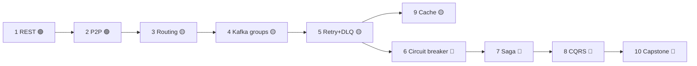

# Hands-on Exercises

> A graded set of lessons you perform **inside DFL**, from beginner to advanced. Each exercise
> has a **Learning Objective**, a **Scenario to build** (`Node` types + `Edge`s), **Steps**,
> **What to Observe** (the exact `SimulationEvent`s and animations), an **Expected Outcome**, and
> a **Challenge Extension**. Every animation is driven by real backend events — you are always
> watching truth, never a mock.

**How to run any exercise.** Compose the topology on the canvas → save it as a `Scenario` →
create a `Simulation` (`POST /api/v1/simulations`) → `start` it → watch the `Timeline` and
`MetricSnapshot` panel → use `Fault Injection` where indicated → `stop`, then optionally replay
by `sequence`.

Difficulty legend: 🟢 Beginner · 🟡 Intermediate · 🔴 Advanced.

---

## Exercise 1 — Your first REST request 🟢

**Learning Objective.** Understand a single synchronous request/response and how one logical
request is traced across nodes with a `traceId`.

**Scenario to build.** `Client → ApiGateway → Service → Database`, connected with directed
`Edge`s.

**Steps.**
1. Place a `Client`, an `ApiGateway`, a `Service`, and a `Database`; connect them in a line.
2. Save as a `Scenario`, create a `Simulation`, and `start` it.
3. Open the `Timeline` and the event inspector.

**What to Observe.** `HttpRequestStarted` at the client → gateway → service, the `Database`
read, then `HttpResponseReceived` propagating back. Select any event and confirm all events
share one `traceId`. Note `MetricSnapshot.avgLatencyMs` as the round-trip time.

**Expected Outcome.** A single request animates as a token traveling the full path and back; the
`Timeline` shows a clean, ordered trace (monotonic `sequence`) for one `traceId`.

**Challenge Extension.** Inject `LatencyInjected` on the `Database` and observe `avgLatencyMs`
rise; add a `HttpRequestTimedOut` by pushing latency past the client timeout.

*Related:* [Observability](./observability.md), [API Gateway](../04-features/api-gateway.md).

---

## Exercise 2 — Point-to-point with RabbitMQ 🟢

**Learning Objective.** Understand asynchronous decoupling: a `Producer` and `Consumer` that
need not be online at the same time, mediated by a `Queue`, with acknowledgements.

**Scenario to build.** `Producer → Exchange → Queue → Consumer` (a direct exchange with a single
binding).

**Steps.**
1. Add a `Producer`, an `Exchange` (direct), a `Queue`, and a `Consumer`.
2. Configure the producer to publish with routing key `order.created` and the queue's binding to
   match it.
3. Run the simulation.

**What to Observe.** `MessagePublished` → `MessageRouted` (key matched the binding) →
`MessageEnqueued` → `MessageDequeued` → `MessageReceived` → `MessageProcessed` → `AckReceived`.
Watch the message removed from the queue only after the ack.

**Expected Outcome.** Each message flows once, end to end, and the queue empties as the consumer
acks. `MetricSnapshot.throughput` reflects the consume rate.

**Challenge Extension.** Pause the consumer (do not start it) and publish several messages first;
watch them buffer as `MessageEnqueued` and drain once the consumer registers
(`ConsumerRegistered`) — proving temporal decoupling.

*Related:* [Messaging Patterns](./messaging-patterns.md), [RabbitMQ](../04-features/rabbitmq.md).

---

## Exercise 3 — RabbitMQ topic routing and fan-out 🟡

**Learning Objective.** Master exchange-based routing: routing keys, topic wildcards, and one
publish fanning out to multiple queues (pub/sub).

**Scenario to build.** `Producer → Exchange (topic)` bound to three queues:
`orders` (binding `order.*`), `audit` (binding `#`), `payments` (binding `payment.*`), each with
its own `Consumer`.

**Steps.**
1. Build the topic exchange and three bound queues + consumers.
2. Publish messages with keys `order.created`, `payment.captured`, and `order.cancelled`.
3. Run and watch routing decisions.

**What to Observe.** For `order.created`: `MessageRouted` to both `orders` (`order.*`) and
`audit` (`#`), but **not** `payments`. For `payment.captured`: routed to `payments` and `audit`.
Each `MessageRouted` fans out to the matching queues only.

**Expected Outcome.** You can predict, before running, which queues receive each key — and the
`Timeline` confirms it. `audit` receives everything; the others receive their slice.

**Challenge Extension.** Add a `fanout` exchange in parallel and show it ignores keys entirely
(copies to all bound queues). Compare the `MessageRouted` fan-out counts.

*Related:* [Pub/Sub](../04-features/pubsub.md), [RabbitMQ](../04-features/rabbitmq.md).

---

## Exercise 4 — Kafka consumer groups and partitions 🟡

**Learning Objective.** Understand Kafka's model: partitions provide ordering and parallelism,
and consumer-group parallelism is **bounded by partition count**.

**Scenario to build.** `Producer → Topic` with **3** `Partition`s → a consumer group of
`Consumer`s (start with 2, then 3, then 4).

**Steps.**
1. Create a `Topic` with 3 partitions and a producer that keys messages (e.g., by customer id).
2. Add 2 consumers in one group; run and observe partition assignment.
3. Add a 3rd consumer, then a 4th; re-run each time.

**What to Observe.** With 2 consumers, one gets 2 partitions, one gets 1 (`ConsumerRegistered`
then `MessageDequeued` per partition). With 3, each consumer owns exactly one partition —
maximum parallelism. With 4, the extra consumer is **idle** (registered but never receives
`MessageDequeued`). Messages with the same key always land in the same partition (`MessageRouted`
by key) and are consumed **in order** within it.

**Expected Outcome.** You see partition count cap parallelism, and per-partition ordering hold
while cross-partition ordering does not.

**Challenge Extension.** Remove a consumer mid-run to trigger a rebalance; watch its partitions
reassign to survivors. Contrast with Exercise 2's RabbitMQ competing consumers (unbounded per
queue).

*Related:* [Kafka](../04-features/kafka.md), [Messaging Patterns](./messaging-patterns.md).

---

## Exercise 5 — Retry with backoff and the DLQ 🟡

**Learning Objective.** Handle failure gracefully: bounded retries with backoff, and
dead-lettering poison messages so good traffic keeps flowing.

**Scenario to build.** `Producer → Queue → Consumer` plus a `DeadLetterQueue`. Configure the
consumer with a retry policy (max 3 attempts, exponential backoff) and dead-letter on exhaustion.

**Steps.**
1. Build the topology; wire the DLQ as the dead-letter target.
2. Publish a mix of good messages and one poison message (always fails processing).
3. Run and watch the poison message's lifecycle.

**What to Observe.** Good messages: normal `AckReceived`. Poison message: `MessageNacked` →
`RetryScheduled` (increasing backoff) → `MessageRetried` ×3 → `DeadLettered` into the
`DeadLetterQueue`. `MetricSnapshot.retries` rises then plateaus; `dlqCount` increments by one.
Good messages keep flowing throughout.

**Expected Outcome.** The poison message is isolated in the DLQ after bounded retries; the main
queue never stalls.

**Challenge Extension.** Set retries to **unlimited** and re-run: watch a **retry storm** —
`retries` and `inFlight` climb without bound and the queue head is blocked. This is the failure
in [Common Mistakes](./common-mistakes.md) #3 and #4.

*Related:* [Retry](../04-features/retry.md), [DLQ](../04-features/dlq.md).

---

## Exercise 6 — Circuit breaker under a failing dependency 🔴

**Learning Objective.** Prevent cascading failure with a circuit breaker; understand the
closed → open → half-open → closed lifecycle.

**Scenario to build.** `Client → Service A → Service B`, with a circuit breaker configured on the
A→B call (failure threshold + cooldown).

**Steps.**
1. Build the two-service chain with the breaker on the downstream call.
2. Inject `NodeFailed` (or heavy `LatencyInjected`) on `Service B`.
3. Keep the client sending requests; then `NodeRecovered` on B after a while.

**What to Observe.** `HttpRequestFailed`/`HttpRequestTimedOut` accumulate until the threshold →
`CircuitBreakerOpened`. While open, calls **fail fast** (no requests reach B — protecting it and
freeing threads). After the cooldown → `CircuitBreakerHalfOpened`; a trial request after
`NodeRecovered` succeeds → `CircuitBreakerClosed` and normal flow resumes.

**Expected Outcome.** The breaker trips, shields the system during the outage, probes for
recovery, and closes automatically — visible as a clean state machine on the `Timeline`.

**Challenge Extension.** Combine with Exercise 5: put retry+backoff *inside* the breaker and show
how the two patterns cooperate (retries handle transient blips; the breaker handles sustained
failure). Compare `avgLatencyMs` with and without the breaker during the outage.

*Related:* [Circuit Breaker](../04-features/circuit-breaker.md), [Common Mistakes](./common-mistakes.md).

---

## Exercise 7 — Saga with compensation 🔴

**Learning Objective.** Coordinate a multi-service transaction without global ACID, using local
steps and compensating actions; contrast orchestration and choreography.

**Scenario to build.** An orchestrated order saga: `Orchestrator Service` driving
`Stock Service → Payment Service → Shipping Service`, each with its own `Database`.

**Steps.**
1. Build the orchestrator and three participant services.
2. Run the happy path first (all succeed).
3. Inject `FaultInjected` on `Payment Service` and re-run.

**What to Observe.** Happy path: `SagaStarted` → `SagaStepCompleted` (stock) →
`SagaStepCompleted` (payment) → `SagaStepCompleted` (shipping) → `SagaCompleted`. Failure path:
`SagaStarted` → `SagaStepCompleted` (stock) → payment fails → `SagaCompensationTriggered`
(release stock) → saga ends without completion. Compensation runs in **reverse** order.

**Expected Outcome.** You see the system reach a consistent end state through compensation rather
than a rollback, and you can articulate why intermediate states were temporarily inconsistent.

**Challenge Extension.** Rebuild as **choreography** — no orchestrator; each service reacts to
the previous service's event (`MessagePublished`) and emits its own. Observe the same business
outcome emerge from decentralized events, and discuss why it is harder to trace (filter the
`Timeline` by `traceId` to follow it).

*Related:* [Saga](../04-features/saga.md), [Architectural Patterns](./architectural-patterns.md).

---

## Exercise 8 — CQRS with an eventually-consistent read model 🔴

**Learning Objective.** Separate the write and read paths and directly observe eventual
consistency between them.

**Scenario to build.** Command side: `Client → Service (command) → Write Database`, which emits
events to a `Broker`; a projector `Consumer` updates a `Read Database`. Query side:
`Client → Service (query) → Read Database`.

**Steps.**
1. Build both paths sharing the `Broker` between the write side and the projector.
2. Send a command (a write), then **immediately** issue a query.
3. Wait a moment, then query again.

**What to Observe.** The write emits `MessagePublished`; the projector processes it
(`MessageReceived` → `MessageProcessed`) and updates the read model *after a delay*. A query
issued immediately returns **stale** data; a query after the projection catches up returns the
new value. The lag is visible as the gap on the `Timeline` between the write event and the
projection.

**Expected Outcome.** You experience read-after-write staleness first-hand and can explain when
CQRS's eventual consistency is acceptable and when it is not.

**Challenge Extension.** Inject `LatencyInjected` on the projector to widen the consistency
window dramatically, then relate this to PACELC's EL-vs-EC trade-off from
[Distributed Systems](./distributed-systems.md).

*Related:* [CQRS](../04-features/cqrs.md), [Event Sourcing](../04-features/event-sourcing.md).

---

## Exercise 9 — Cache-aside and staleness 🟡

**Learning Objective.** Understand the cache-aside pattern, hit/miss behavior, latency impact,
and cache-induced staleness.

**Scenario to build.** `Client → Service → Cache (Redis)` and `Service → Database`, with the
service implementing read-through-on-miss and write-invalidation.

**Steps.**
1. Build the topology; configure a TTL/eviction policy on the `Cache`.
2. Read the same key twice (cold then warm).
3. Write the key via the database path, then read it again.

**What to Observe.** First read: `CacheMiss` → database read → cache populated. Second read:
`CacheHit` with much lower `avgLatencyMs`. After a write **without** invalidation: a read returns
**stale** data (`CacheHit` on old value) until `CacheEvicted` (TTL) — after which the next read
misses and reloads fresh.

**Expected Outcome.** You can quantify the latency win of caching and demonstrate the staleness
risk, articulating the read-heavy/tolerable-staleness conditions where cache-aside fits.

**Challenge Extension.** Add write-time invalidation and show the stale window disappears. Then
simulate a "thundering herd": expire a hot key and send many concurrent reads to watch the miss
storm hit the `Database`.

*Related:* [Cache](../04-features/cache.md), [Architectural Patterns](./architectural-patterns.md).

---

## Exercise 10 — Backpressure and partial failure (capstone) 🔴

**Learning Objective.** Tie it all together: observe back-pressure build under a gray failure,
then apply the fixes (competing consumers, timeouts, breaker, DLQ).

**Scenario to build.** `Producer → Queue → Consumer → Service → Database`, with a single
consumer and no resilience configured initially.

**Steps.**
1. Set the producer rate above the consumer's processing rate.
2. Inject `LatencyInjected` (a gray/partial failure — the node is slow, not dead) on the
   downstream `Service`.
3. Watch the system degrade; then iteratively apply fixes: add competing `Consumer`s, add
   timeouts + a circuit breaker, and add a `DeadLetterQueue`.

**What to Observe.** Degradation: `MessageEnqueued` outruns `MessageDequeued`,
`MetricSnapshot.inFlight` (saturation) climbs, `avgLatencyMs` rises, and at the limit
`MessageDropped`/`DeadLettered` appear — the "looks fine until it collapses" curve. After fixes:
`inFlight` stabilizes, the breaker trips (`CircuitBreakerOpened`) to shed load, and overflow
lands safely in the DLQ (`DeadLettered`) instead of being lost.

**Expected Outcome.** You can diagnose a saturating system using the USE method
([Observability](./observability.md)) and prescribe the correct combination of patterns — the
core competency this platform teaches.

**Challenge Extension.** Replace `LatencyInjected` with an intermittent `PartitionCreated`/
`PartitionHealed` cycle and show how retry + idempotency + breaker together keep the system
correct and available across repeated partitions.

*Related:* [Observability](./observability.md), [Common Mistakes](./common-mistakes.md),
[Messaging Patterns](./messaging-patterns.md).

---

## Suggested learning path

Work left to right; each exercise assumes the concepts of the ones before it. Revisit
[Common Mistakes](./common-mistakes.md) after each to connect the pattern to the failure it
prevents.

## Related documents

- [Distributed Systems Primer](./distributed-systems.md)
- [Messaging Patterns](./messaging-patterns.md)
- [Architectural Patterns](./architectural-patterns.md)
- [Observability](./observability.md)
- [Common Mistakes](./common-mistakes.md)
- [REST](../04-features/rest.md)
- [RabbitMQ](../04-features/rabbitmq.md)
- [Kafka](../04-features/kafka.md)
- [Pub/Sub](../04-features/pubsub.md)
- [Retry](../04-features/retry.md)
- [DLQ](../04-features/dlq.md)
- [Circuit Breaker](../04-features/circuit-breaker.md)
- [Saga](../04-features/saga.md)
- [CQRS](../04-features/cqrs.md)
- [Cache](../04-features/cache.md)
- [Glossary](../01-product/glossary.md)
- [Event Model](../02-architecture/event-model.md)
