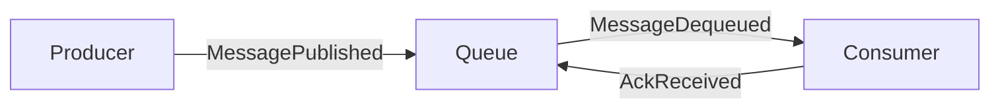
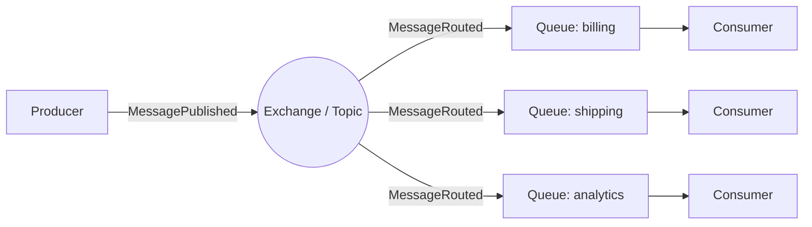
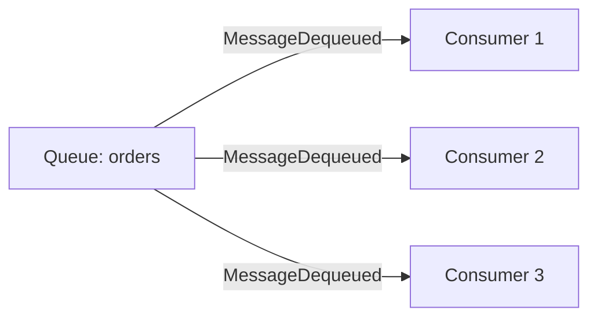
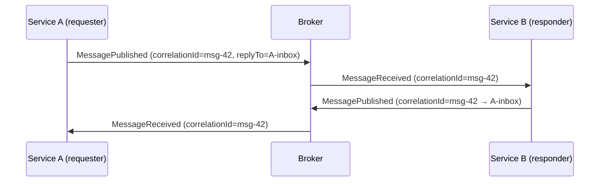
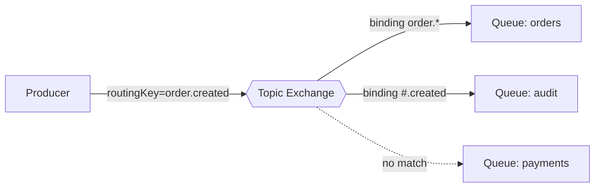
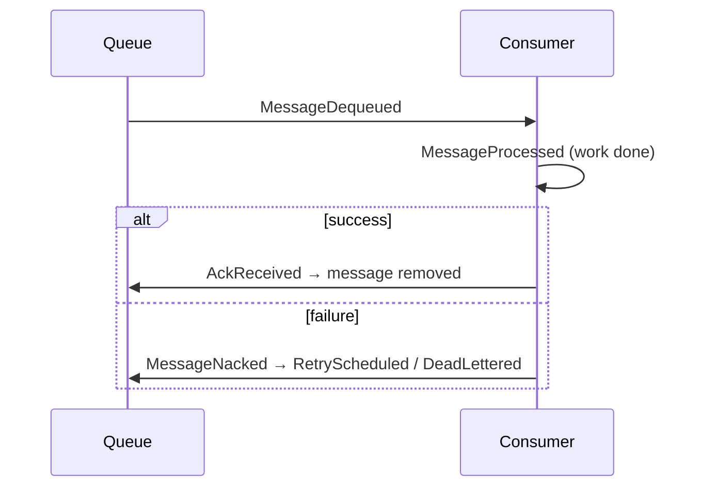
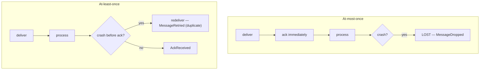
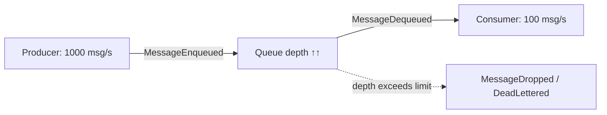
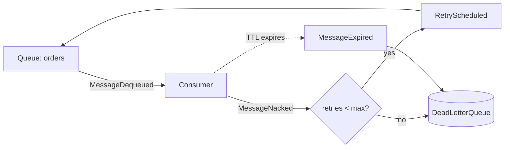
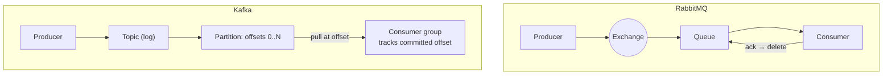

# Messaging Patterns

> Messaging is how independent `Node`s cooperate without sharing memory. This document teaches
> the core messaging patterns DFL simulates, the delivery guarantees that make them reliable
> (or not), and the concrete differences between **RabbitMQ** and **Kafka**. Every pattern is
> tied to canonical `SimulationEvent`s so you can watch it on the `Timeline`.

## The two foundational patterns

### Point-to-point (queue)

A `Message` is delivered to **exactly one** consumer. Producers put work on a `Queue`;
consumers take it off. This decouples producer and consumer in **time** (the consumer need not
be online when the message is sent) and in **rate** (the queue absorbs bursts).

Events you'll see: `MessagePublished` → `MessageEnqueued` → `MessageDequeued` →
`MessageReceived` → `MessageProcessed` → `AckReceived`.

### Publish/subscribe (topic / fan-out)

A `Message` is delivered to **every** interested subscriber. The producer does not know or care
who is listening; subscribers register interest. This is one-to-many broadcast.

The distinguishing event is `MessageRouted` — one publish fans out to multiple targets. See
[Pub/Sub](../04-features/pubsub.md).

## Competing consumers

To scale throughput, attach **multiple consumers to one queue**. The broker load-balances
messages across them so each message is processed once, but the *pool* processes many in
parallel. This is the standard way to scale a point-to-point workload horizontally.

- **RabbitMQ**: many consumers subscribe to the same queue; a prefetch/QoS limit controls how
  many unacked messages each holds. Each `ConsumerRegistered` adds capacity.
- **Kafka**: parallelism is bounded by **partition count** — within a consumer group, each
  `Partition` is consumed by exactly one consumer, so you cannot have more active consumers
  than partitions.

DFL teaches the crucial contrast: adding consumers past the partition count in Kafka yields
**idle consumers** (visible: registered but never receiving `MessageDequeued`), whereas
RabbitMQ keeps sharing the single queue.

## Request/reply

Messaging is usually one-way, but a **request/reply** pattern layers synchronous-style
semantics on top: the requester includes a *reply-to* address and a correlation identifier; the
responder sends the result back on that address, tagged with the same identifier so the
requester can match reply to request.

The canonical `correlationId` field (§6 of the canon) is exactly this matching key: it carries
the originating `messageId` so a reply — or any downstream event — can be tied back to the
request. This is also the seed of distributed tracing (see [Observability](./observability.md)).

## Message routing

Routing decides *which* consumers receive a message. DFL models both broker philosophies.

### RabbitMQ: exchanges + routing keys + bindings

Producers publish to an **`Exchange`**, not directly to a queue. The exchange applies its type
and the message's **routing key** against **bindings** to decide which `Queue`s receive it:

- **direct** — routing key must match the binding key exactly (`order.created` → orders queue).
- **topic** — wildcard patterns (`order.*`, `#.error`) match hierarchical routing keys.
- **fanout** — ignore the key; copy to every bound queue (pub/sub broadcast).
- **headers** — match on message header attributes instead of the key.

The `payload.routingKey` field on `MessagePublished` (see canon §6 example) drives the
`MessageRouted` decision. See [RabbitMQ](../04-features/rabbitmq.md).

### Kafka: topics + partitions + keys

Kafka has no exchange. Producers publish to a **`Topic`**; the message **key** is hashed to
choose a **`Partition`**. Consumers subscribe to topics and are assigned partitions. Routing is
therefore about *partition assignment*, and the key's real job is to guarantee **ordering**:
all messages with the same key land in the same partition and are consumed in order.

## Guaranteed delivery and acknowledgements

Reliable messaging depends on **acknowledgements**. The broker does not consider a message done
until the consumer confirms it:

- **`AckReceived`** — the consumer successfully processed the message; the broker may delete it
  (RabbitMQ) or the consumer commits its offset (Kafka).
- **`MessageNacked`** — the consumer rejected the message (processing failed); the broker
  redelivers, routes to a dead-letter target, or drops per policy.

If a consumer crashes **after** processing but **before** acking, the broker redelivers —
producing a **duplicate**. This is unavoidable and is exactly why idempotency matters (see
[Common Mistakes](./common-mistakes.md)).

## Delivery semantics: at-most-once / at-least-once / exactly-once

This is the single most misunderstood topic in messaging. The three guarantees describe how a
system behaves around the ack boundary and failures:

| Semantic | Ack strategy | Failure result | Trade-off |
|----------|--------------|----------------|-----------|
| **At-most-once** | ack *before* processing (or fire-and-forget) | on crash, message is **lost** | never duplicated, may lose data |
| **At-least-once** | ack *after* processing | on crash before ack, message is **redelivered** (duplicate) | never lost, may duplicate |
| **Exactly-once** | at-least-once delivery **+ idempotent processing / dedup** | effectively-once *processing* | complex; needs cooperation |

The essential teaching point, reinforced throughout DFL: **"exactly-once delivery" over an
unreliable network is impossible.** What real systems achieve is **exactly-once *processing***,
built by combining at-least-once delivery with **idempotent** consumers or a **deduplication**
store. Kafka's "exactly-once" is transactional producer + idempotent write scoped to Kafka;
it is not magic across arbitrary external side effects. DFL demonstrates this by delivering a
duplicate (`MessageRetried` after a crash) and showing that only an idempotent `Service`
produces a single effect.

## Ordering

Order is a guarantee, not a given:

- **RabbitMQ**: a single queue with a single consumer preserves order; add competing consumers
  and order across messages is **no longer guaranteed** (they finish at different rates).
- **Kafka**: order is guaranteed **within a partition**, never across partitions. Use a
  consistent key to keep related messages ordered.

Retries reorder too: a `RetryScheduled` message rejoins the flow later than its neighbors. DFL
makes this visible on the `Timeline` — watch `sequence` numbers to see how retries and
competing consumers interleave.

## Backpressure

**Backpressure** is what a system does when it receives work faster than it can process it. If
producers outrun consumers, the `Queue` grows without bound — memory fills, latency climbs, and
eventually messages are dropped or the broker fails. Healthy systems *push back*: they slow or
block producers, apply flow control, or shed load.

DFL surfaces backpressure through `MessageEnqueued` outpacing `MessageDequeued`, a rising
`MetricSnapshot.inFlight`, and — when limits are hit — `MessageDropped`. Inject
`LatencyInjected` on the consumer to slow it and watch the queue grow: this is the classic
"the system looks fine until it doesn't" lesson.

## Poison messages and the dead-letter queue

A **poison message** is one that can never be processed successfully — malformed payload, a bug
it triggers, or a permanently-failing downstream. Without protection, the broker redelivers it
forever, blocking the queue and burning resources (a **retry storm**).

The fix is a **Dead-Letter Queue (DLQ)** (`DeadLetterQueue` node): after N failed attempts (or
on expiry), the message is *dead-lettered* out of the main flow into the DLQ for human or
automated inspection — the good messages keep flowing.

Events: `MessageNacked` → `RetryScheduled` → `MessageRetried` → (exhausted) → `DeadLettered`;
or `MessageExpired` → `DeadLettered`. In RabbitMQ this is implemented with a **Dead-Letter
Exchange (DLX)**; in Kafka, typically a dedicated dead-letter topic written by the consumer.
See [DLQ](../04-features/dlq.md) and [Retry](../04-features/retry.md).

## RabbitMQ vs Kafka — the essential contrast

Both are "message brokers", but they embody different philosophies. Understanding this contrast
is a primary DFL learning objective.

| Dimension | RabbitMQ (smart broker) | Kafka (smart consumer / dumb log) |
|-----------|-------------------------|-----------------------------------|
| Core model | Exchanges + queues, push to consumers | Append-only partitioned log, consumers pull |
| Routing | Rich: direct/topic/fanout/headers, bindings | Key → partition hash only |
| Message lifetime | Deleted after `AckReceived` | Retained by time/size; **not** deleted on read |
| Replay | Not natively — once acked, it's gone | First-class: seek to any **offset** |
| Ordering | Per-queue, lost with competing consumers | Guaranteed **per partition** |
| Consumer scaling | Many consumers per queue (prefetch) | Bounded by partition count per group |
| Delivery | at-most / at-least-once | at-least-once; transactional exactly-once (Kafka-scoped) |
| Back-pressure | Broker-side queue + flow control | Consumer lag against a durable log |
| Best for | Complex routing, task queues, RPC | High-throughput streaming, event sourcing, replayable logs |

Rule of thumb DFL reinforces: **choose RabbitMQ when routing logic is complex and messages are
transient tasks; choose Kafka when you need durable, replayable, high-throughput ordered
streams.** Build one scenario of each in the [exercises](./exercises.md) to feel the
difference.

## Related documents

- [Distributed Systems Primer](./distributed-systems.md)
- [Architectural Patterns](./architectural-patterns.md)
- [Common Mistakes](./common-mistakes.md)
- [Hands-on Exercises](./exercises.md)
- [RabbitMQ](../04-features/rabbitmq.md)
- [Kafka](../04-features/kafka.md)
- [Pub/Sub](../04-features/pubsub.md)
- [DLQ](../04-features/dlq.md)
- [Retry](../04-features/retry.md)
- [Glossary](../01-product/glossary.md)
- [Event Model](../02-architecture/event-model.md)
