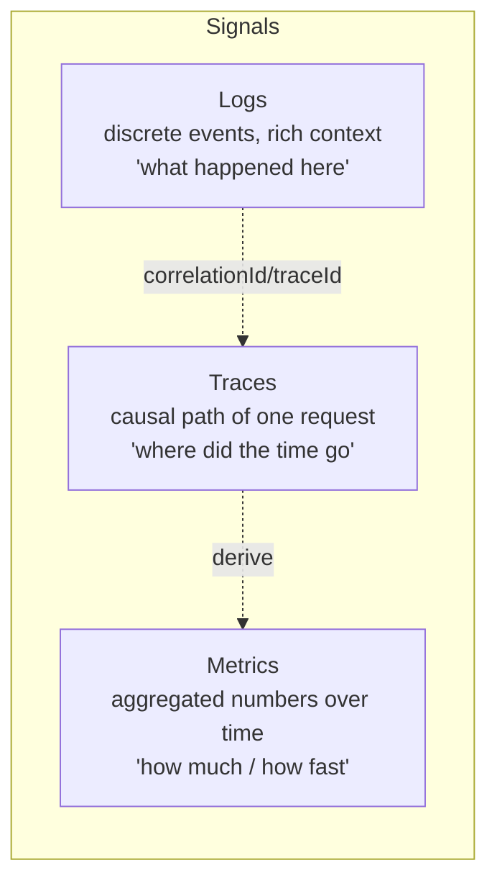
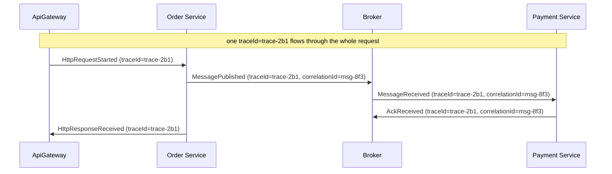
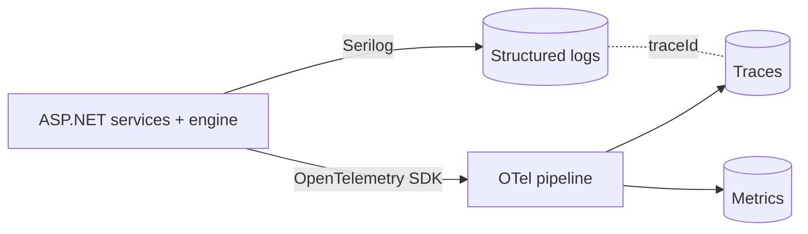
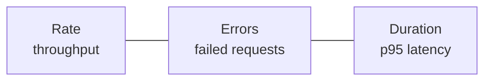
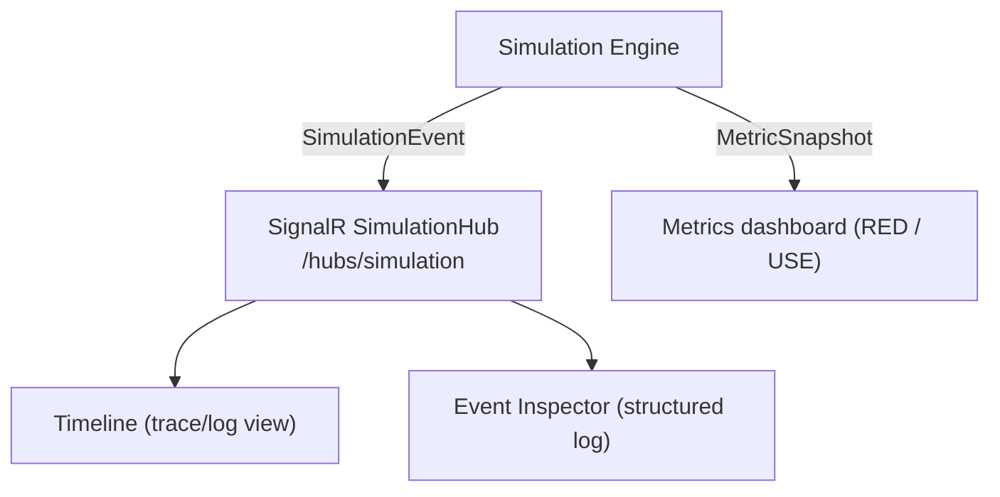

# Observability

> You cannot fix what you cannot see. In a distributed system, the *only* way to understand
> behavior is through the signals the system emits. This document teaches the **three pillars**
> (logs, metrics, traces), how **correlation IDs and trace IDs** stitch a request across nodes,
> the tooling DFL uses (**OpenTelemetry** and **Serilog**), the **RED** and **USE** methods,
> and how DFL itself *is* an observability instrument via the `Timeline`, event inspector, and
> `MetricSnapshot`.

## Monitoring vs observability

**Monitoring** answers questions you defined in advance ("is CPU > 90%?"). **Observability** is
the property that lets you answer questions you *didn't* anticipate, by exploring the signals
the system emits. Distributed systems fail in unforeseen ways — partial failures, emergent
back-pressure, cascading timeouts — so observability, not just monitoring, is the goal.

## The three pillars

### Logs

Discrete, timestamped records of individual events, ideally **structured** (key/value, not free
text) so they can be queried and correlated. A log line answers "what happened at this node at
this moment", with context. DFL emits structured logs via **Serilog** (canon §2).

Each `SimulationEvent` in DFL is effectively a structured log record: it carries `eventId`,
`type`, `sourceNodeId`, `occurredAt`, and a `payload` — queryable, not prose.

### Metrics

Numeric measurements aggregated over time: counters, gauges, histograms. Cheap to store, ideal
for dashboards and alerts, but they lose per-request detail. DFL's canonical metric type is the
**`MetricSnapshot`** { `simulationId`, `tick`, `throughput`, `avgLatencyMs`, `inFlight`,
`dlqCount`, `retries` } — a periodic aggregate derived from the event stream.

### Traces

A **trace** follows a single logical request as it travels across nodes. It is a tree of
**spans**, each span a unit of work (an HTTP call, a queue hop, a DB query) with a start, a
duration, and a parent. Traces answer "which hop was slow?" and "what was the causal path?" —
the questions logs and metrics alone cannot.

## Correlation IDs and trace IDs

A request that touches five services produces five sets of logs on five machines. What ties
them together is a shared identifier propagated on every hop. DFL's canonical `Message`
(canon §5) and event envelope (canon §6) carry exactly the two fields you need:

- **`traceId`** — identifies the **whole end-to-end request/flow**. It is generated once at the
  edge and propagated unchanged across every node and message the flow touches. All spans and
  events sharing a `traceId` belong to one trace.
- **`correlationId`** — per canon §6, carries the originating **`messageId`** a message-related
  event belongs to. It ties every event about a *specific message* (publish → route → enqueue →
  dequeue → ack/nack → retry → dead-letter) back to that message, and is the matching key for
  request/reply.

Because these IDs are on the canonical envelope, DFL can reconstruct a full trace across every
`Node` purely from the event stream — no guessing, no invented state.

## OpenTelemetry and Serilog

DFL's observability stack is fixed by the canon (§2):

- **OpenTelemetry (OTel)** — the vendor-neutral standard for generating and exporting **traces,
  metrics, and logs**. OTel defines the `traceId`/span model DFL mirrors, and **context
  propagation** — the mechanism that carries `traceId` across process and network boundaries so
  spans on different nodes join into one trace. In DFL, the propagation of `traceId` on the
  event envelope is the pedagogical stand-in for OTel context propagation.
- **Serilog** — structured logging for the ASP.NET backend. Logs are emitted as structured
  events (properties, not interpolated strings), enriched with `traceId`/`correlationId`, so
  they can be filtered and joined to traces.

## The RED method (request-driven services)

**RED** is the go-to metric set for anything that serves requests:

- **R**ate — requests per second.
- **E**rrors — number/rate of failed requests.
- **D**uration — latency distribution (use percentiles p50/p95/p99, never just the mean).

DFL maps RED to `MetricSnapshot`: **Rate** ≈ `throughput`, **Duration** ≈ `avgLatencyMs`, and
**Errors** are counted from `HttpRequestFailed`, `HttpRequestTimedOut`, `MessageNacked`, and
`DeadLettered` events. Watch RED move when you inject faults.

## The USE method (resources)

**USE** is the complementary lens for **resources** (queues, caches, thread pools, connections):

- **U**tilization — how busy the resource is (% of time in use).
- **S**aturation — how much work is queued/waiting (the back-pressure signal).
- **E**rrors — error events for that resource.

For a DFL `Queue`, **Saturation** is queue depth (`MessageEnqueued` minus `MessageDequeued`,
reflected in `MetricSnapshot.inFlight`), and a growing saturation is the leading indicator of
back-pressure long before errors appear. RED tells you the *service* is hurting; USE tells you
*which resource* is the bottleneck. Use them together.

## How DFL surfaces observability

DFL is not just a subject to observe — it is a teaching instrument for observability itself.

### The Timeline (traces + logs)

The `Timeline` is the ordered, replayable sequence of all `SimulationEvent`s for a `Simulation`,
ordered by monotonic `sequence`. Filter it by `traceId` to see a single request's full path
across nodes (a trace); filter by `correlationId` to follow one message's lifecycle. Because it
persists every event, you can **replay** (`GET /api/v1/simulations/{id}/events?fromSequence=`)
and dissect an incident after the fact — the observability superpower of event sourcing.

### The event inspector (structured logs)

Selecting any event opens the **inspector**, showing the full envelope — `type`, `sourceNodeId`,
`targetNodeId`, `occurredAt`, `tick`, `correlationId`, `traceId`, and `payload`. This is
structured-log exploration made visual: every field is a queryable property, nothing is free
text.

### MetricSnapshot (metrics dashboard)

Periodic `MetricSnapshot`s feed the metrics view: `throughput`, `avgLatencyMs`, `inFlight`,
`dlqCount`, `retries`. This is your live RED/USE dashboard — watch `inFlight` (saturation)
climb under `LatencyInjected`, or `retries` and `dlqCount` spike during a retry storm.

### A trace across nodes — what to build and watch

Compose `ApiGateway → Order Service → Broker → Payment Service`, run it, then filter the
`Timeline` by one `traceId`. You will see `HttpRequestStarted` at the gateway,
`MessagePublished`/`MessageReceived` through the broker, `AckReceived` at payment, and
`HttpResponseReceived` back at the gateway — the complete distributed trace assembled from
authoritative events, with per-hop timing visible via `occurredAt`/`tick`. See the
[exercises](./exercises.md) for the step-by-step build.

## Related documents

- [Distributed Systems Primer](./distributed-systems.md)
- [Messaging Patterns](./messaging-patterns.md)
- [Architectural Patterns](./architectural-patterns.md)
- [Common Mistakes](./common-mistakes.md)
- [Hands-on Exercises](./exercises.md)
- [API Gateway](../04-features/api-gateway.md)
- [DLQ](../04-features/dlq.md)
- [Glossary](../01-product/glossary.md)
- [Architecture](../02-architecture/architecture.md)
- [Event Model](../02-architecture/event-model.md)
