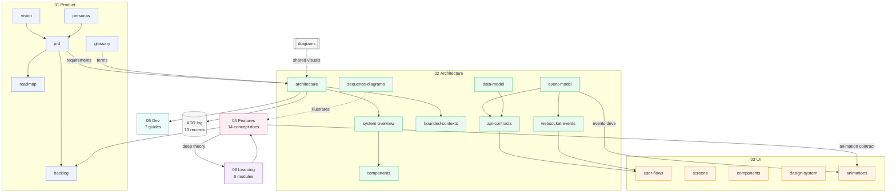

# Distributed Flow Lab — Documentation

**Distributed Flow Lab (DFL)** is an educational SaaS platform for learning distributed
systems through interactive visual simulations. Users visually compose architectures
(APIs, queues, brokers, databases, caches, and distributed services) on a canvas and run
simulations in which **every animation is driven by a real backend event** — the frontend
never invents state. The platform is built to *teach* distributed systems, not merely to
simulate them.

This directory is the **source of truth** for the product. Following the project's
Documentation-First approach (see [`../CLAUDE.md`](../CLAUDE.md)), every implementation
must be grounded in these documents, and every change must keep them synchronized.

---

## 1. How this documentation is organized

```
.docs/
├── README.md            ← you are here (documentation index)
├── 01-product/          Product vision, requirements, roadmap, backlog, glossary
├── 02-architecture/     System architecture, contracts, domain & event model
├── 03-ui/               UX flows, screens, components, design system, animations
├── 04-features/         One document per distributed-systems concept simulated
├── 05-dev/              Engineering guidelines, tooling, local dev, testing, delivery
├── 06-learning/         Educational material explaining the concepts taught
├── adr/                 Architecture Decision Records (the decision log)
└── diagrams/            Reusable Mermaid diagrams (context, containers, flows)
```

### Documentation conventions

- **Terminology is fixed.** Ubiquitous-language terms, node types, event names, entity
  fields, REST paths, and the SignalR contract are defined once and reused verbatim
  everywhere. The canonical references are the [Glossary](./01-product/glossary.md),
  the [Event Model](./02-architecture/event-model.md), the
  [Data Model](./02-architecture/data-model.md), the
  [API Contracts](./02-architecture/api-contracts.md), and the
  [WebSocket Events](./02-architecture/websocket-events.md).
- **Backend authority is invariant.** The backend simulation engine is the single source
  of truth; the frontend renders backend `SimulationEvent`s and never fabricates state.
  `AnimationStarted`/`AnimationFinished` are frontend-only presentation events. See
  [ADR-006](./adr/ADR-006-backend-source-of-truth.md).
- **Cross-referencing.** Every document ends with a *Related documents* section linking
  its closest peers using relative paths.
- **Diagrams.** Mermaid is used wherever it improves understanding (context, containers,
  sequences, state machines, ER diagrams).

---

## 2. How the documents relate



**Reading the map:** Product intent flows into Architecture; the Glossary fixes the
vocabulary; the Event Model is the hinge between backend and UI (events drive animations);
Feature docs bind a concept to its architecture, simulation, and animation, and defer deep
theory to the Learning modules; ADRs record why the architecture is the way it is.

---

## 3. Document catalog

### 01 · Product — *why we build this and for whom*

| Document | Purpose |
|----------|---------|
| [vision.md](./01-product/vision.md) | Product vision, mission, problem statement, goals/non-goals, success metrics, target audience, educational objectives. |
| [prd.md](./01-product/prd.md) | Product Requirements Document: business objectives, functional (FR) & non-functional (NFR) requirements, user stories, acceptance criteria, risks, constraints. |
| [personas.md](./01-product/personas.md) | The five target personas (beginner developer, backend engineer, software architect, instructor, engineering student) with goals, pain points, technical level, and how DFL helps. |
| [roadmap.md](./01-product/roadmap.md) | Delivery phases: MVP → Version 1 → Version 2 → Version 3 → Future, with objectives, scope, dependencies, and exit criteria. |
| [backlog.md](./01-product/backlog.md) | Epics → Features → Tasks with phase, priority, dependencies, and acceptance criteria. |
| [glossary.md](./01-product/glossary.md) | Canonical definitions for distributed-systems concepts and DFL domain terms. Start here for vocabulary. |

### 02 · Architecture — *how the system is structured*

| Document | Purpose |
|----------|---------|
| [architecture.md](./02-architecture/architecture.md) | High-level architecture, Clean Architecture layers, technology stack, deployment, scalability, security, extensibility, and the key-decisions ADR index. |
| [system-overview.md](./02-architecture/system-overview.md) | Each subsystem explained: frontend, backend, simulation engine, messaging adapters, infrastructure, observability. |
| [bounded-contexts.md](./02-architecture/bounded-contexts.md) | DDD bounded contexts and their relationships (context map). |
| [components.md](./02-architecture/components.md) | Every major backend/frontend component with responsibilities and interfaces. |
| [event-model.md](./02-architecture/event-model.md) | **Authoritative** event envelope and full event catalog; frontend-only presentation events. |
| [api-contracts.md](./02-architecture/api-contracts.md) | REST API (`/api/v1`) contracts — methods, paths, requests, responses, error model. |
| [websocket-events.md](./02-architecture/websocket-events.md) | The `SimulationHub` SignalR contract, payloads, batching, ordering, and replay. |
| [data-model.md](./02-architecture/data-model.md) | Entities, relationships, identifiers, enums; persisted vs streamed data. |
| [sequence-diagrams.md](./02-architecture/sequence-diagrams.md) | Mermaid sequence diagrams for REST, RabbitMQ, Kafka, Retry, DLQ, Saga, and CQRS. |

### 03 · UI — *how users experience it*

| Document | Purpose |
|----------|---------|
| [user-flows.md](./03-ui/user-flows.md) | End-to-end user flows from onboarding to simulation replay. |
| [wireframes.md](./03-ui/wireframes.md) | Screen layouts and regions (block sketches). |
| [screens.md](./03-ui/screens.md) | Route map and per-screen definitions. |
| [components.md](./03-ui/components.md) | React components with responsibilities, props, composition, and store usage. |
| [design-system.md](./03-ui/design-system.md) | Color/typography/spacing tokens, node & event colors, iconography, motion, accessibility. |
| [animations.md](./03-ui/animations.md) | Every animation, mapped to the backend events that trigger it. |

### 04 · Features — *the concepts we simulate*

Each document follows the same structure: Educational Objective, Architecture, Flow,
Visual Behavior, Simulation, Failure Scenarios, Metrics, Acceptance Criteria, Future
Improvements.

| Messaging & transport | Patterns & resilience |
|-----------------------|-----------------------|
| [rabbitmq.md](./04-features/rabbitmq.md) | [retry.md](./04-features/retry.md) |
| [kafka.md](./04-features/kafka.md) | [dlq.md](./04-features/dlq.md) |
| [redis.md](./04-features/redis.md) | [circuit-breaker.md](./04-features/circuit-breaker.md) |
| [pubsub.md](./04-features/pubsub.md) | [cqrs.md](./04-features/cqrs.md) |
| [rest.md](./04-features/rest.md) | [saga.md](./04-features/saga.md) |
| [grpc.md](./04-features/grpc.md) | [event-sourcing.md](./04-features/event-sourcing.md) |
| [cache.md](./04-features/cache.md) | [api-gateway.md](./04-features/api-gateway.md) |

### 05 · Development — *how we build and ship*

| Document | Purpose |
|----------|---------|
| [coding-standards.md](./05-dev/coding-standards.md) | C#/.NET 8 and React/TS standards, layering rules, SOLID, review checklist. |
| [commit-standards.md](./05-dev/commit-standards.md) | Conventional Commits, authorship rules (no AI co-authorship trailers), commit hygiene, history-rewriting policy. |
| [folder-structure.md](./05-dev/folder-structure.md) | Full repository layout and rationale. |
| [technologies.md](./05-dev/technologies.md) | The technology stack with justifications and ADR links. |
| [local-development.md](./05-dev/local-development.md) | Running DFL locally with Docker Compose. |
| [docker.md](./05-dev/docker.md) | Containerization and Compose topology. |
| [testing.md](./05-dev/testing.md) | Test pyramid, tooling, deterministic engine testing, coverage gates. |
| [deployment.md](./05-dev/deployment.md) | CI/CD, environments, migrations, rollout/rollback, observability hooks. |

### 06 · Learning — *the theory behind the platform*

| Document | Purpose |
|----------|---------|
| [distributed-systems.md](./06-learning/distributed-systems.md) | Foundations: fallacies, CAP/PACELC, consistency models, time & ordering, failure modes. |
| [messaging-patterns.md](./06-learning/messaging-patterns.md) | Messaging patterns and delivery semantics; RabbitMQ vs Kafka. |
| [architectural-patterns.md](./06-learning/architectural-patterns.md) | CQRS, Event Sourcing, Saga, Circuit Breaker, Retry, API Gateway, Cache-aside. |
| [observability.md](./06-learning/observability.md) | Logs/metrics/traces, correlation & trace IDs, RED/USE methods. |
| [common-mistakes.md](./06-learning/common-mistakes.md) | Common distributed-systems mistakes and how DFL demonstrates them. |
| [exercises.md](./06-learning/exercises.md) | Graded hands-on exercises performed inside DFL. |

### ADR · Architecture Decision Records

The complete decision log lives in [adr/README.md](./adr/README.md) (13 records). Highlights:
[React Flow](./adr/ADR-001-react-flow.md), [SignalR](./adr/ADR-002-signalr.md),
[RabbitMQ/broker adapters](./adr/ADR-003-rabbitmq.md),
[Clean Architecture](./adr/ADR-004-clean-architecture.md),
[Docker Compose](./adr/ADR-005-docker-compose.md),
[Backend source of truth](./adr/ADR-006-backend-source-of-truth.md),
[BackgroundService engine](./adr/ADR-007-background-service-engine.md),
[CQRS/MediatR](./adr/ADR-008-cqrs-mediatr.md),
[Event envelope & sequencing](./adr/ADR-009-event-envelope-sequencing.md),
[Frontend stack](./adr/ADR-010-frontend-stack.md),
[PostgreSQL/EF Core](./adr/ADR-011-postgres-efcore.md),
[Observability](./adr/ADR-012-observability-opentelemetry.md),
[Testing strategy](./adr/ADR-013-testing-strategy.md).

### Diagrams

Reusable Mermaid diagrams, indexed in [diagrams/README.md](./diagrams/README.md):
[System Context](./diagrams/system-context.md),
[Container](./diagrams/container-diagram.md),
[Deployment](./diagrams/deployment-diagram.md),
[Message Flow](./diagrams/message-flow.md),
[RabbitMQ Flow](./diagrams/rabbitmq-flow.md),
[Kafka Flow](./diagrams/kafka-flow.md),
[CQRS Flow](./diagrams/cqrs-flow.md),
[Saga Flow](./diagrams/saga-flow.md).

---

## 4. Suggested reading paths

- **New engineer joining the team:** [vision](./01-product/vision.md) →
  [glossary](./01-product/glossary.md) → [architecture](./02-architecture/architecture.md) →
  [system-overview](./02-architecture/system-overview.md) →
  [event-model](./02-architecture/event-model.md) →
  [folder-structure](./05-dev/folder-structure.md) →
  [local-development](./05-dev/local-development.md).
- **Frontend engineer:** [user-flows](./03-ui/user-flows.md) →
  [screens](./03-ui/screens.md) → [components](./03-ui/components.md) →
  [design-system](./03-ui/design-system.md) →
  [animations](./03-ui/animations.md) →
  [websocket-events](./02-architecture/websocket-events.md).
- **Backend engineer:** [architecture](./02-architecture/architecture.md) →
  [bounded-contexts](./02-architecture/bounded-contexts.md) →
  [components](./02-architecture/components.md) →
  [event-model](./02-architecture/event-model.md) →
  [data-model](./02-architecture/data-model.md) →
  [sequence-diagrams](./02-architecture/sequence-diagrams.md) → the ADR log.
- **Product / stakeholder:** [vision](./01-product/vision.md) →
  [prd](./01-product/prd.md) → [personas](./01-product/personas.md) →
  [roadmap](./01-product/roadmap.md) → [backlog](./01-product/backlog.md).
- **Instructor / student:** [06-learning](./06-learning/distributed-systems.md) modules →
  the relevant [04-features](./04-features/rabbitmq.md) docs →
  [exercises](./06-learning/exercises.md).

---

## 5. Keeping documentation in sync

Per [`../CLAUDE.md`](../CLAUDE.md), after implementing any feature you must update the
architecture docs, the [backlog](./01-product/backlog.md), the
[roadmap](./01-product/roadmap.md) when scope shifts, and create an
[ADR](./adr/README.md) whenever an architectural decision is made. Terminology changes
must be made in the canonical references first (glossary, event model, data model, API and
WebSocket contracts) and then propagated.
