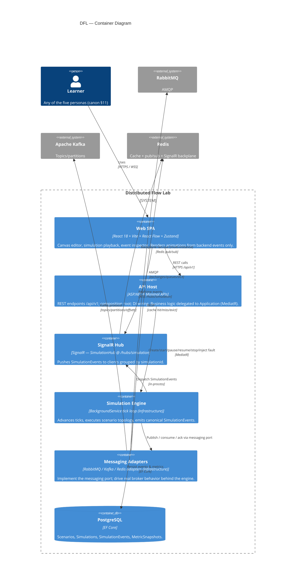

# Container Diagram (C4 Level 2)

This diagram opens the **Distributed Flow Lab** box from the
[System Context](./system-context.md) and shows the deployable/executable containers inside
it and how responsibility is divided among them. It follows the Clean Architecture layering
(canon §3, [ADR-004](../adr/ADR-004-clean-architecture.md)): the API host owns the transport
and hosts the Simulation Engine, which drives the real broker adapters and persists the
event timeline.

## Legend & explanation

- **Web SPA** (`web/`, canon §4) — React 18 + Vite. The [React Flow](../adr/ADR-001-react-flow.md)
  canvas, the Zustand stores, the SignalR client (`realtime/`), and the inspector live here.
  It **renders backend events and invents no state** (canon §1).
- **API Host** (`DistributedFlowLab.Api`, canon §3) — ASP.NET 8 Minimal API endpoints
  (canon §9) and the composition root. Endpoints translate HTTP into MediatR requests; no
  business logic sits in controllers ([ADR-004](../adr/ADR-004-clean-architecture.md)).
- **SignalR Hub** — `SimulationHub` at `/hubs/simulation` (canon §8). Server→client
  `ReceiveSimulationEvent` / `ReceiveSimulationEvents` / `SimulationStateChanged`;
  client→server `Subscribe` / `Unsubscribe`; one group per `simulationId`
  ([ADR-002](../adr/ADR-002-signalr.md)).
- **Simulation Engine** — the `BackgroundService` tick loop in Infrastructure. It is the
  single source of truth: it advances `tick`s, runs node behaviors, and emits canonical
  `SimulationEvent`s (canon §6, §7) with a monotonic `sequence`.
- **Messaging Adapters** — RabbitMQ/Kafka/Redis adapters implementing the Application
  messaging **port**. Real brokers give production fidelity ([ADR-003](../adr/ADR-003-rabbitmq.md)).
- **PostgreSQL** — persists scenarios, simulations, the event timeline, and metric
  snapshots (canon §10), enabling replay via `GET /api/v1/simulations/{id}/events`.

The engine→hub→web chain is the load-bearing path of the whole product: it is what makes
every animation a rendering of a real backend event. It is detailed step-by-step in
[Message Flow](./message-flow.md).

## Related documents

- [System Context](./system-context.md)
- [Deployment Diagram](./deployment-diagram.md)
- [Message Flow](./message-flow.md)
- [Architecture](../02-architecture/architecture.md)
- [ADR-004: Clean Architecture](../adr/ADR-004-clean-architecture.md)
- [Diagrams Index](./README.md)
