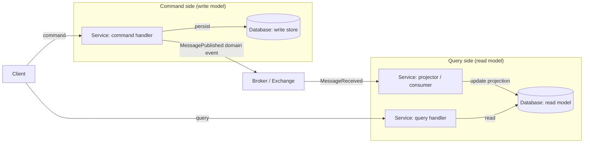
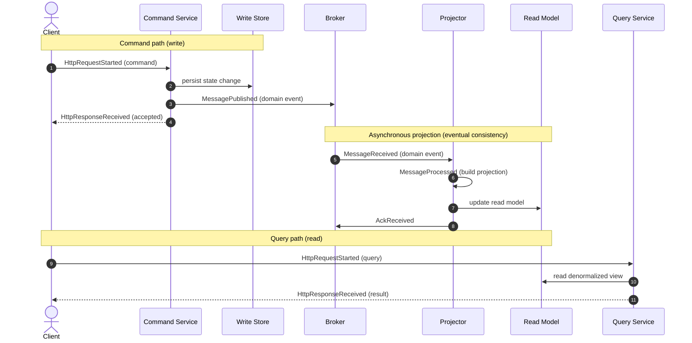

# CQRS Flow (Command Path vs Query Path with a Separate Read Model)

This diagram contrasts the two paths of **Command Query Responsibility Segregation (CQRS)**:
the **command path** mutates state and publishes domain events; the **query path** reads
from a separate, denormalized **read model** kept eventually consistent by a projection that
subscribes to those events. It teaches why reads and writes are separated and where
eventual consistency enters. CQRS is a V2 concept (canon §14) built from canonical node
types and events.

## Structure

## Sequence (command → projection → query)

## Legend & explanation

- **Command side.** A `Client` sends a command to a command `Service`, which validates,
  mutates the **write store** (`Database`), and publishes a domain event
  (`MessagePublished`) via a `Broker`/`Exchange`. In the backend this is the MediatR
  **command** path inside the Application layer ([ADR-004](../adr/ADR-004-clean-architecture.md)).
- **Projection.** A projector `Service` consumes the event (`MessageReceived` →
  `MessageProcessed` → `AckReceived`, canon §7) and updates the **read model** — a separate
  `Database` shaped for fast reads. The gap between the write commit and the read-model
  update is exactly the **eventual consistency** window the lesson makes visible.
- **Query side.** A `Client` query goes to a query `Service` that reads only from the read
  model, never touching the write store. In the backend this is the MediatR **query** path.
- **HTTP events.** `HttpRequestStarted` / `HttpResponseReceived` (canon §7) bracket the
  synchronous command and query calls, distinguishing them from the asynchronous messaging
  events on the projection path.
- **Why separate.** Reads and writes have different shapes, scaling needs, and consistency
  requirements; CQRS lets each be optimized independently, at the cost of the eventual-
  consistency delay the diagram highlights.

## Related documents

- [Message Flow](./message-flow.md)
- [Saga Flow](./saga-flow.md)
- [Architecture](../02-architecture/architecture.md)
- [ADR-004: Clean Architecture](../adr/ADR-004-clean-architecture.md)
- [Event Model](../02-architecture/event-model.md)
- [Diagrams Index](./README.md)
