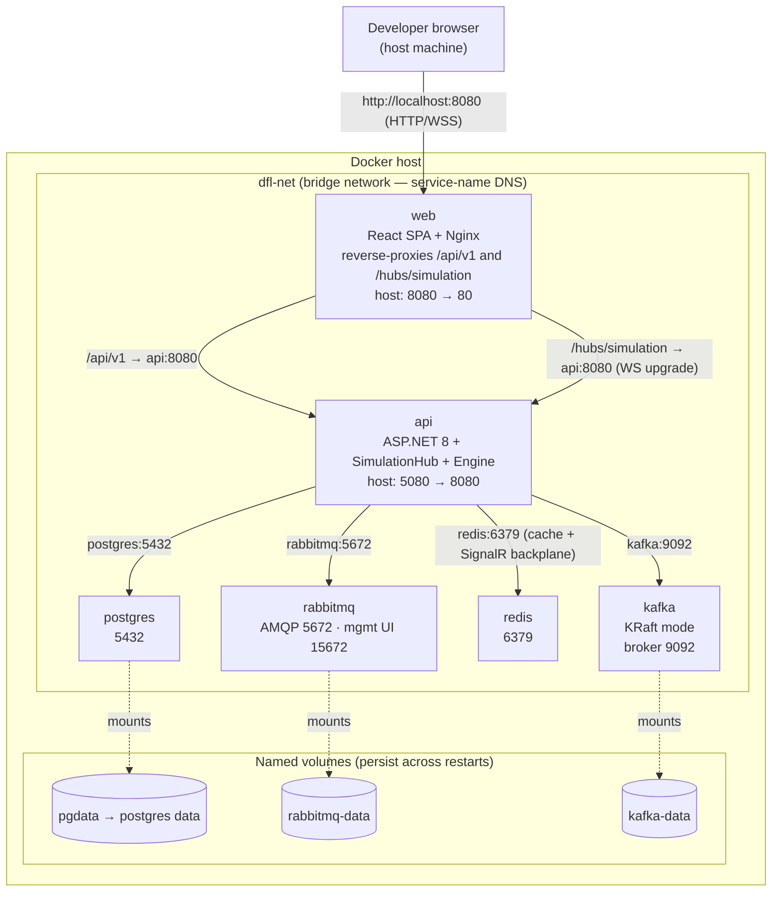

# Deployment Diagram (Docker Compose Topology)

This diagram shows how DFL is deployed for local development and demos under **Docker
Compose** ([ADR-005](../adr/ADR-005-docker-compose.md)). It is the physical view of the
logical [Container Diagram](./container-diagram.md): the canonical container set (canon §2)
on a shared network, with the ports they expose and the named volumes that persist state.

## Legend & explanation

- **Network.** All services share a single Compose bridge network (`dfl-net`) and address
  each other by **service name** (`api`, `postgres`, `rabbitmq`, `kafka`, `redis`) — the
  same names used in `api` configuration. Only `web` (and, for convenience, the broker
  management/DB ports) are published to the host.
- **`web`.** Serves the built React SPA behind Nginx and reverse-proxies `/api/v1` (REST)
  and `/hubs/simulation` (WebSocket upgrade) to `api`, so the browser sees a single origin.
  Published on host `8080`.
- **`api`.** The ASP.NET 8 host running the Minimal API endpoints, the `SimulationHub`, and
  the Simulation Engine `BackgroundService`. Depends (via `depends_on` + health checks) on
  the datastores below.
- **`postgres`.** Persists scenarios, simulations, the `SimulationEvent` timeline, and
  metric snapshots (canon §10). Backed by the `pgdata` named volume so data survives
  `docker compose restart`.
- **`rabbitmq` / `kafka` / `redis`.** Real brokers backing the messaging/cache node types
  ([ADR-003](../adr/ADR-003-rabbitmq.md)). Kafka runs in **KRaft** mode (no ZooKeeper) to
  reduce footprint (ADR-005). `redis` also serves as the SignalR backplane for multi-
  instance fan-out (canon §2, [ADR-002](../adr/ADR-002-signalr.md)).
- **Volumes.** Solid arrows are network calls; dashed arrows are volume mounts. Named
  volumes persist stateful services across restarts and are reset with
  `docker compose down -v`.

Ports shown as `host → container` are illustrative developer defaults; the authoritative
values live in `docker-compose.yml`. Production cloud deployment is out of scope here and is
a separate decision on the same container images (ADR-005).

## Related documents

- [Container Diagram](./container-diagram.md)
- [System Context](./system-context.md)
- [Architecture](../02-architecture/architecture.md)
- [ADR-005: Docker Compose](../adr/ADR-005-docker-compose.md)
- [Diagrams Index](./README.md)
