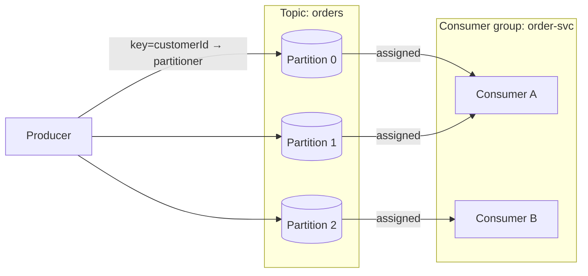

# Kafka Flow (Produce → Topic/Partitions → Consumer Group → Offset Commit)

This diagram traces a record through a Kafka topology and highlights how Kafka differs from
RabbitMQ: there is no routing exchange and no per-message ack. A `Producer` appends records
to a `Topic`; a partitioner maps each record's key to a `Partition`; a `Consumer` in a
consumer group is assigned partitions, reads sequentially by **offset**, and periodically
**commits** its offset. It is the concept-specific instance of the generic
[Message Flow](./message-flow.md), backed by a real broker
([ADR-003](../adr/ADR-003-rabbitmq.md)).

## Topology



## Sequence (produce to offset commit)

```mermaid
sequenceDiagram
    autonumber
    participant P as Producer
    participant T as Topic
    participant Pa as Partition
    participant C as Consumer (group member)
    P->>T: MessagePublished (key=customerId)
    T->>Pa: MessageRouted (partition = hash(key) % partitionCount)
    Pa->>Pa: MessageEnqueued (appended at offset N)
    C->>Pa: MessageDequeued (fetch from offset N)
    C->>C: MessageReceived
    C->>C: MessageProcessed
    C->>Pa: AckReceived (offset committed → N+1)
    Note over Pa,C: no per-message ack — offset commit marks progress; replayable by rewinding offset
```

## Legend & explanation

- **Nodes** use canonical `NodeType`s: `Producer`, `Topic`, `Partition`, `Consumer`
  (canon §5). A `Topic` contains ordered `Partition`s; a consumer **group** distributes
  partitions across its member `Consumer`s so each partition is owned by exactly one member
  at a time.
- **Partitioning is the lesson.** `MessageRouted` here selects a **partition by key hash**
  (records with the same key land on the same partition, preserving per-key order) — not a
  binding match as in [RabbitMQ](./rabbitmq-flow.md). This is why Kafka gives
  partition-scoped ordering rather than a global order.
- **Offsets, not acks.** Records are appended at an increasing **offset**. A `Consumer`
  reads sequentially and **commits** its offset to mark progress. DFL maps the offset commit
  onto the canonical `AckReceived` event (canon §7) for a consistent vocabulary across
  brokers, while the semantics — replayable log, no per-message removal — remain Kafka's.
  Rewinding the offset replays records, unlike RabbitMQ's destructive ack.
- **Consumer group scaling.** Adding members up to the partition count increases parallelism;
  beyond that, extra members are idle. Rebalancing reassigns partitions when membership
  changes (`NodeActivated` / `ConsumerRegistered`, canon §7).
- **Fidelity.** Events are the engine's translation of behavior observed on a **real Kafka
  broker** running in KRaft mode ([ADR-003](../adr/ADR-003-rabbitmq.md),
  [ADR-005](../adr/ADR-005-docker-compose.md)).

## Related documents

- [Message Flow](./message-flow.md)
- [RabbitMQ Flow](./rabbitmq-flow.md)
- [Event Model](../02-architecture/event-model.md)
- [ADR-003: Real broker adapters](../adr/ADR-003-rabbitmq.md)
- [Diagrams Index](./README.md)
