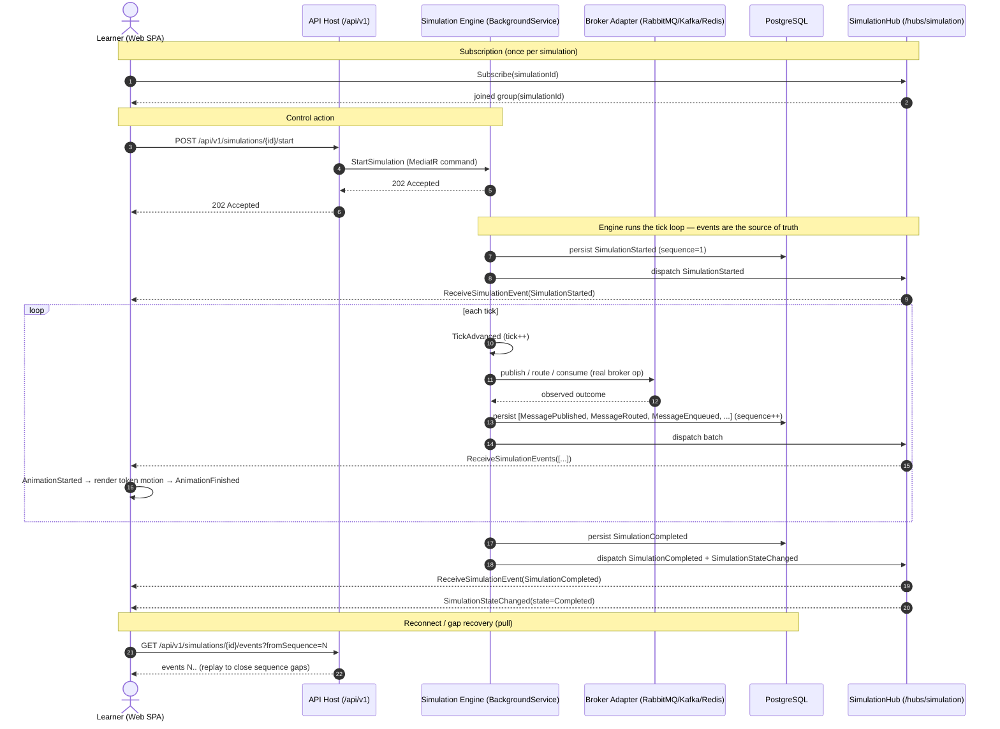

# Generic Message Flow (User Action → Animation)

This is the load-bearing end-to-end path of the whole product: a user action becomes a REST
call, the Simulation Engine produces canonical `SimulationEvent`s, those events stream to
the browser over SignalR, and the client renders them as animations — **inventing no state**
(canon §1). This generic flow underlies every concept-specific flow
([RabbitMQ](./rabbitmq-flow.md), [Kafka](./kafka-flow.md), [Saga](./saga-flow.md), …).

## Legend & explanation

- **Subscription.** The client joins the SignalR group for its `simulationId` via
  `Subscribe` before (or right after) starting, so it receives the full event stream
  (canon §8).
- **Control action.** User intent hits a Minimal API endpoint (canon §9), which translates
  it into a MediatR command; **no business logic runs in the controller**
  ([ADR-004](../adr/ADR-004-clean-architecture.md)). The endpoint returns immediately —
  the simulation runs asynchronously in the engine.
- **Engine as source of truth.** The `BackgroundService` advances `tick`s, drives the real
  broker adapter ([ADR-003](../adr/ADR-003-rabbitmq.md)), and emits canonical
  `SimulationEvent`s (canon §7) in the envelope of canon §6, assigning each a monotonic
  `sequence`.
- **Persist then dispatch.** Every event is persisted to PostgreSQL **and** pushed over
  SignalR. Persistence makes the `Timeline` replayable; the push makes playback live.
- **Batching.** High-throughput ticks use `ReceiveSimulationEvents([...])`; low volume uses
  `ReceiveSimulationEvent(...)` ([ADR-002](../adr/ADR-002-signalr.md)).
- **Presentation events.** `AnimationStarted` / `AnimationFinished` are **client-derived**
  and carry no new state (canon §7) — they describe the *rendering* of a backend event.
- **Gap recovery.** On reconnect or a detected `sequence` gap, the client pulls the missing
  range from `GET /api/v1/simulations/{id}/events?fromSequence=` — the same endpoint used
  for history/replay.

## Related documents

- [Container Diagram](./container-diagram.md)
- [RabbitMQ Flow](./rabbitmq-flow.md)
- [Kafka Flow](./kafka-flow.md)
- [Saga Flow](./saga-flow.md)
- [CQRS Flow](./cqrs-flow.md)
- [Event Model](../02-architecture/event-model.md)
- [ADR-002: SignalR](../adr/ADR-002-signalr.md)
- [Diagrams Index](./README.md)
