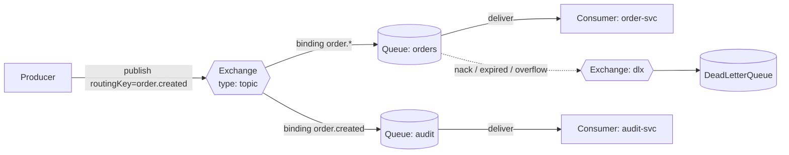
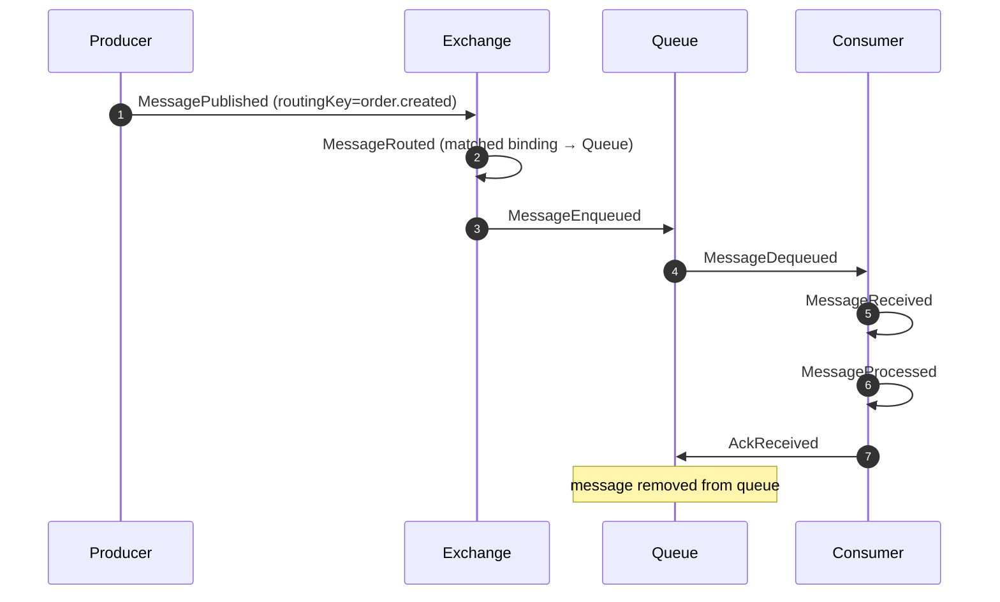
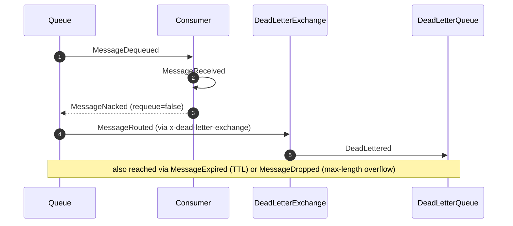

# RabbitMQ Flow (Publish → Route → Enqueue → Consume → Ack, with DLX)

This diagram traces a `Message` through a RabbitMQ topology: a `Producer` publishes to an
`Exchange`, bindings and the routing key decide which `Queue`s receive a copy, a `Consumer`
dequeues and acks, and rejected/expired/overflow messages take the Dead Letter Exchange
(DLX) path to a `DeadLetterQueue`. It is the concept-specific instance of the generic
[Message Flow](./message-flow.md), backed by a real broker
([ADR-003](../adr/ADR-003-rabbitmq.md)). See also the [RabbitMQ feature](../04-features/rabbitmq.md).

## Topology

## Happy path (publish to ack)

## Unhappy path (dead-lettering)

## Legend & explanation

- **Nodes** use canonical `NodeType`s: `Producer`, `Exchange`, `Queue`, `Consumer`,
  `DeadLetterQueue` (canon §5). Edges model AMQP relationships — a publish channel
  (`Producer→Exchange`), a **binding** (`Exchange→Queue`, `config.bindingKey`), a delivery
  channel (`Queue→Consumer`), and the DLX path.
- **Events** are the canonical messaging events (canon §7): `MessagePublished` →
  `MessageRouted` → `MessageEnqueued` → `MessageDequeued` → `MessageReceived` →
  `MessageProcessed` → `AckReceived`. The dead-letter branch emits `MessageNacked`,
  `MessageExpired`, or `MessageDropped`, then `DeadLettered`. All are correlated by
  `correlationId` (the `messageId`) and ordered by `sequence` (canon §6).
- **Routing is the lesson.** A `Producer` never publishes to a `Queue` directly; the
  `Exchange` + bindings decide fan-out. `MessageRouted` is where the matched binding(s) are
  selected — the exchange node pulses and the matched binding edges highlight on the canvas.
- **DLX path.** A nack with `requeue=false`, a TTL expiry (`x-message-ttl`), or a
  max-length overflow (`x-max-length`) routes the message through the configured
  `x-dead-letter-exchange` to the `DeadLetterQueue`, incrementing `dlqCount`.
- **Fidelity.** These events are the engine's translation of behavior **observed on a real
  RabbitMQ broker** ([ADR-003](../adr/ADR-003-rabbitmq.md)), not a hand-scripted animation.

## Related documents

- [Message Flow](./message-flow.md)
- [Kafka Flow](./kafka-flow.md)
- [RabbitMQ Feature](../04-features/rabbitmq.md)
- [Event Model](../02-architecture/event-model.md)
- [ADR-003: Real RabbitMQ adapter](../adr/ADR-003-rabbitmq.md)
- [Diagrams Index](./README.md)
