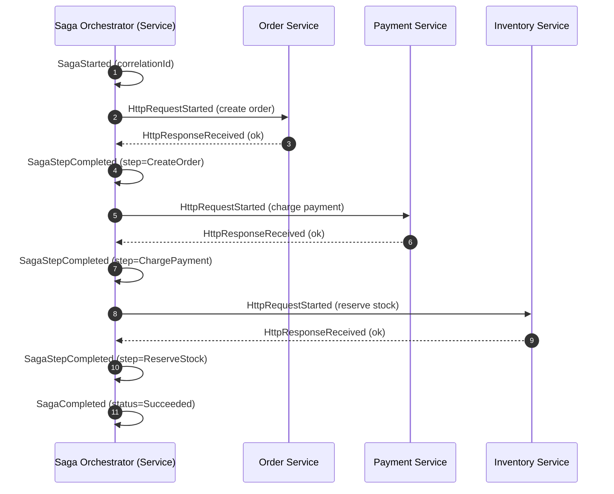
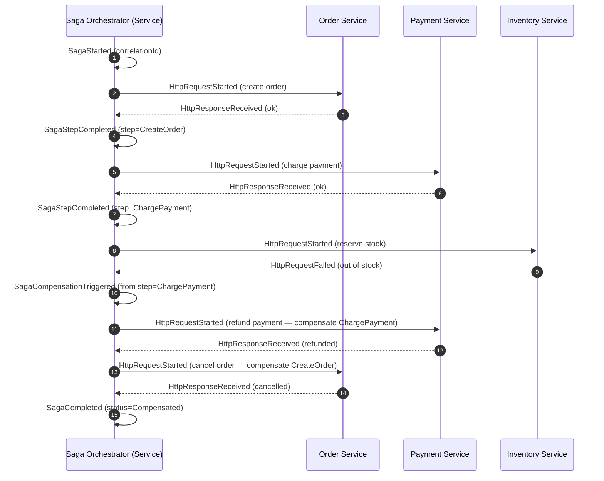

# Saga Flow (Orchestration with Steps and Compensation)

This diagram traces an **orchestrated Saga**: a coordinator drives a multi-step distributed
transaction across services, and when a step fails it runs **compensating actions** to undo
the previously completed steps, restoring consistency without a distributed lock or 2PC. It
teaches how to keep multiple services consistent under partial failure. Saga is a V2 concept
(canon §14) and emits the canonical saga events `SagaStarted`, `SagaStepCompleted`,
`SagaCompensationTriggered`, `SagaCompleted` (canon §7).

## Happy path (all steps succeed)

## Compensation path (a step fails)

## Legend & explanation

- **Orchestration style.** A dedicated orchestrator `Service` owns the workflow and issues
  each step, versus a choreography where services react to each other's events. DFL models
  the **orchestrated** variant because the control flow — and therefore the compensation
  order — is explicit and easy to visualize.
- **Steps.** Each successful step emits `SagaStepCompleted` (canon §7). Steps are invoked
  as service calls, bracketed by `HttpRequestStarted` / `HttpResponseReceived`; a failure is
  `HttpRequestFailed` (or `HttpRequestTimedOut`).
- **Compensation.** On failure the orchestrator emits `SagaCompensationTriggered` and then
  runs compensating actions **in reverse order** of the completed steps (refund before
  cancel), each undoing one prior step's effect. Compensation is the Saga's substitute for
  rollback in a system with no distributed transaction.
- **Terminal state.** The saga ends with `SagaCompleted`, whose status distinguishes a
  `Succeeded` run from a `Compensated` one — both are *successful* saga outcomes in the sense
  that the system is left consistent.
- **Correlation.** All events for one saga share a `correlationId` (canon §6) so the
  `Timeline` and inspector can group the whole distributed transaction, including its
  compensations.

## Related documents

- [Message Flow](./message-flow.md)
- [CQRS Flow](./cqrs-flow.md)
- [Event Model](../02-architecture/event-model.md)
- [Architecture](../02-architecture/architecture.md)
- [Diagrams Index](./README.md)
