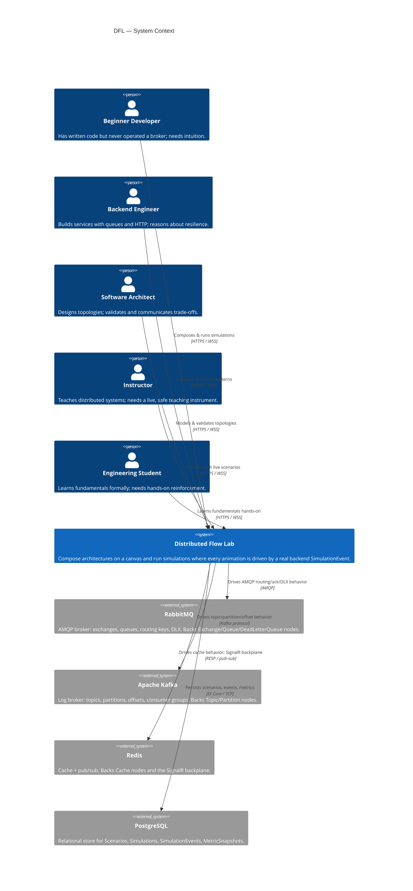

# System Context Diagram (C4 Level 1)

This diagram places **Distributed Flow Lab (DFL)** in its environment: the human personas
who use it and the external infrastructure it depends on. At the context level DFL is a
single black box — an educational SaaS platform for learning distributed systems through
interactive visual simulations (canon §0). The external systems are the real infrastructure
brokers and datastore that give simulations production-grade fidelity (canon §2).

## Legend & explanation

- **Personas (left).** The five canonical personas (canon §11). All interact with DFL the
  same way — over HTTPS for REST and WSS for the realtime SignalR stream — but with
  different goals; see [Personas](../01-product/personas.md).
- **Distributed Flow Lab (center).** The system under design, treated as one box at this
  level. Its internal containers (Web SPA, API, Simulation Engine, SignalR hub, adapters)
  are decomposed in the [Container Diagram](./container-diagram.md).
- **External infrastructure (right).** RabbitMQ, Kafka, and Redis are real brokers used as
  **adapters** so simulated behavior reflects genuine broker semantics rather than a
  caricature (see [ADR-003](../adr/ADR-003-rabbitmq.md)). PostgreSQL persists all metadata
  and the replayable `SimulationEvent` timeline (canon §10).
- **Relationships.** Solid arrows are runtime dependencies; labels name the interaction and
  the protocol. The user↔DFL edges carry both REST (`/api/v1`) and realtime
  (`/hubs/simulation`) traffic (canon §8, §9).

Why the brokers are external systems: they are operationally independent processes that DFL
integrates with, not code DFL owns. Modeling them as external systems makes the fidelity
boundary explicit — DFL orchestrates real infrastructure and translates its observed
behavior into canonical events.

## Related documents

- [Container Diagram](./container-diagram.md)
- [Deployment Diagram](./deployment-diagram.md)
- [Architecture](../02-architecture/architecture.md)
- [Product Vision](../01-product/vision.md)
- [ADR-003: Real RabbitMQ adapter](../adr/ADR-003-rabbitmq.md)
- [Diagrams Index](./README.md)
